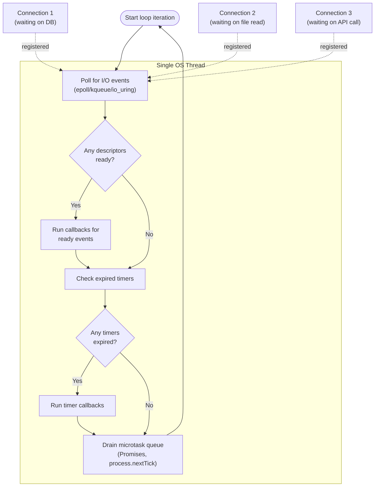

# [BEE-243] Async I/O and Event Loops

:::info
Non-blocking I/O and event loops let a single thread serve thousands of concurrent connections. Understanding the model — and what breaks it — is fundamental to building high-throughput backend services.
:::

## Context

The dominant I/O model for decades was **blocking**: a thread issues a syscall (`read()`, `accept()`, `connect()`), and the OS suspends that thread until the operation completes. This is simple to reason about. One thread handles one request at a time — call the database, wait, return the result.

The problem surfaces at scale. As internet traffic grew through the late 1990s, server engineers discovered that the thread-per-connection model collapsed long before the network interface or CPU became the bottleneck. In 1999, Dan Kegel formalized this as the **C10K problem**: how do you efficiently handle 10,000 simultaneous connections on a single server?

The answer required rethinking the relationship between threads and I/O entirely.

References:
- [The C10K problem — Dan Kegel (1999)](https://www.kegel.com/c10k.html)
- [The Node.js Event Loop — nodejs.org](https://nodejs.org/learn/asynchronous-work/event-loop-timers-and-nexttick)
- [asyncio — Asynchronous I/O — Python docs](https://docs.python.org/3/library/asyncio.html)

### Blocking vs. Non-Blocking I/O

In **blocking I/O**, the calling thread is descheduled by the kernel until data is available. The thread consumes a stack (1–8 MB), occupies a slot in the OS scheduler, and performs a context switch on every I/O completion. At 10,000 concurrent connections, this costs 10 GB of stack alone — before any application data.

In **non-blocking I/O**, the syscall returns immediately with `EAGAIN` if no data is ready. The application is responsible for checking back when the OS signals readiness. Checking thousands of file descriptors by polling them in a loop would be wasteful; the solution is **I/O multiplexing**.

### I/O Multiplexing: select, poll, epoll, kqueue, io_uring

**`select`** (POSIX, 1983): Pass a set of file descriptors; the kernel marks which are ready. Limitation: supports at most 1,024 file descriptors by default; scales as O(n) — the kernel scans all descriptors on every call.

**`poll`** (POSIX, 1997): Removes the 1,024 limit, but still O(n) in the number of watched descriptors.

**`epoll`** (Linux 2.5.46, 2002): Rather than scanning all descriptors, the kernel maintains an interest list and returns only the descriptors that are ready. Operations are O(1) for registration and O(k) for retrieval, where k is the number of ready events — not the total number watched. epoll is the mechanism behind Node.js, nginx, and most modern Linux servers.

**`kqueue`** (FreeBSD 4.1, 2000; macOS): Functionally equivalent to epoll on BSD systems. Supports a unified interface for file descriptors, signals, timers, and process events.

**`io_uring`** (Linux 5.1, 2019): A submission/completion queue interface that allows batching I/O operations and retrieving results with minimal syscall overhead. Unlike epoll (which notifies readiness and then requires a separate `read()`), io_uring can perform the actual data transfer in the kernel, further reducing syscall round-trips.

## The Event Loop

The event loop is the runtime pattern that ties non-blocking I/O to application code. A single thread runs continuously, asking the OS which I/O operations are ready, dispatching callbacks or resuming coroutines for those that are, then checking timers, and looping again.



The critical insight: while Connection 1 waits on its database query, the thread is not blocked — it loops back and can service the I/O completion for Connection 2. The single thread handles thousands of in-flight operations concurrently, not by running them simultaneously, but by interleaving them at I/O boundaries.

Node.js implements this via **libuv**, a cross-platform C library that selects the best polling mechanism for the current OS (epoll on Linux, kqueue on macOS/BSD, IOCP on Windows). libuv also maintains a thread pool (default: 4 threads) for I/O operations that lack native async OS support — filesystem reads, DNS resolution, and some crypto operations.

Python's `asyncio` uses the same conceptual model. The event loop drives `Task` objects, each backed by a coroutine. When a coroutine executes an `await`, it suspends and yields control to the event loop, which runs the next ready task.

## Reactor vs. Proactor Patterns

Two design patterns formalize the event loop model:

**Reactor pattern**: The event loop notifies the application when a file descriptor is *ready* for I/O. The application then performs the I/O itself (e.g., calls `read()`). epoll and kqueue are readiness-based; the application issues the actual syscall. nginx and Node.js use the reactor pattern.

**Proactor pattern**: The application submits an I/O *operation* to the OS. The OS completes the operation and notifies the application when data is *already in the buffer*. The application never calls `read()` directly. io_uring and Windows IOCP are completion-based. This avoids the extra syscall round-trip and is increasingly common in high-performance systems.

## Concurrency Timeline: Blocking vs. Async

Consider an HTTP server handling three concurrent requests. Each request requires one database query that takes 50 ms to complete.

**Blocking model — 3 threads, each waiting:**

```
Time (ms)  Thread 1           Thread 2           Thread 3
0          recv request 1     recv request 2     recv request 3
0–50       [blocked on DB]    [blocked on DB]    [blocked on DB]
50         send response 1    send response 2    send response 3

Total wall time: 50 ms
Thread-seconds consumed: 3 × 50 ms = 150 ms of thread time
At 10,000 concurrent requests: 10,000 blocked threads
```

**Async model — 1 thread, 3 non-blocking queries:**

```
Time (ms)  Event Loop Thread
0          recv request 1 → issue DB query 1 (non-blocking)
0          recv request 2 → issue DB query 2 (non-blocking)
0          recv request 3 → issue DB query 3 (non-blocking)
0–50       [poll loop: checking epoll, running other callbacks]
50         DB query 1 ready → send response 1
50         DB query 2 ready → send response 2
50         DB query 3 ready → send response 3

Total wall time: 50 ms
Thread-seconds consumed: 1 × 50 ms = 50 ms of thread time
At 10,000 concurrent requests: 1 thread + 10,000 in-flight OS operations
```

The async model issues all three database queries in the same millisecond and processes their completions as they arrive. The thread is never parked — it loops continuously, doing useful work whenever anything is ready.

## Node.js Event Loop as Canonical Example

Node.js is the most widely studied single-threaded event loop runtime. Its loop phases (from libuv):

1. **timers** — execute callbacks scheduled by `setTimeout()` and `setInterval()`
2. **pending callbacks** — execute I/O callbacks deferred from the previous iteration
3. **idle, prepare** — internal use
4. **poll** — retrieve new I/O events; execute I/O-related callbacks (the main blocking phase when the queue is empty and no timers are pending)
5. **check** — execute `setImmediate()` callbacks
6. **close callbacks** — cleanup callbacks (e.g., `socket.on('close', ...)`)

Between each phase, Node.js drains the **microtask queue**: `Promise` `.then()` callbacks and `process.nextTick()` callbacks run to completion before the next loop phase begins.

The practical consequence: a `process.nextTick()` callback that recursively schedules itself will starve the entire event loop — no I/O events, no timers, no incoming connections will be processed until the microtask queue empties.

## Go's Approach: Hiding Async Behind Sync API

Go takes a different philosophy. Goroutines use blocking-style syntax (`conn.Read()`, `http.Get()`), but the Go runtime translates these into non-blocking syscalls under the hood. When a goroutine blocks on I/O, the runtime parks it and schedules another goroutine on the same OS thread. The programmer writes sequential code; the runtime delivers async I/O throughput.

This M:N scheduling (see BEE-240) means Go avoids both the callback/promise complexity of Node.js and the memory cost of OS-thread-per-connection. The tradeoff is that CPU-bound goroutines can still starve I/O-bound ones on a single P (logical processor), though Go's preemptive scheduler (since Go 1.14) mitigates this.

## Principle

**Use non-blocking I/O and an event loop for I/O-bound workloads at high concurrency. Never block the event loop.**

1. For I/O-bound services (HTTP servers, proxies, database clients), a single-threaded event loop can handle tens of thousands of concurrent connections with a fraction of the memory a thread-per-connection model would require.

2. The event loop model's throughput advantage disappears — and becomes a liability — the moment any operation blocks the loop thread for more than a few milliseconds.

3. CPU-intensive work must leave the event loop: offload to a worker thread pool, a separate process, or a purpose-built CPU worker (see BEE-241).

4. The model is concurrent, not parallel: at any instant, a single-threaded event loop executes exactly one callback. Throughput comes from minimizing time spent waiting, not from simultaneous execution.

## Common Mistakes

**1. Blocking the event loop with CPU-heavy computation**

```javascript
// BAD: blocks the event loop for the duration
app.get('/report', (req, res) => {
  const result = generateHeavyReport(req.params); // pure CPU, 2 seconds
  res.json(result); // nothing else runs for 2 seconds
});

// GOOD: offload to a worker thread
app.get('/report', async (req, res) => {
  const result = await runInWorkerThread(generateHeavyReport, req.params);
  res.json(result);
});
```

Any synchronous CPU work (JSON serialization of large payloads, cryptographic hashing, image processing, regex on large strings) that runs for more than a few milliseconds will delay every other connection in the process.

**2. Mixing synchronous and async I/O**

One synchronous blocking call contaminates the entire event loop. A single `fs.readFileSync()` in a hot path blocks all concurrent requests for its duration. Audit dependencies for synchronous I/O in initialization code that may run on the hot path.

**3. Not using connection pooling with async clients**

Async I/O enables issuing many I/O operations concurrently. Without connection pooling, each concurrent request may open its own database connection. At 1,000 concurrent requests this creates 1,000 simultaneous database connections — exhausting the database's connection limit. Always use a connection pool that caps concurrency at the database tier. See BEE-301.

**4. Callback hell — pyramid of doom**

Deep nesting of callbacks is hard to reason about and impossible to handle errors in consistently:

```javascript
// BAD
getUser(id, (err, user) => {
  getOrders(user.id, (err, orders) => {
    getItems(orders[0].id, (err, items) => {
      // ... deeply nested, error handling inconsistent
    });
  });
});

// GOOD: async/await flattens the structure
async function getUserOrders(id) {
  const user = await getUser(id);
  const orders = await getOrders(user.id);
  const items = await getItems(orders[0].id);
  return items;
}
```

Promise chaining (`.then().then()`) is better than callbacks, but `async/await` is generally clearest.

**5. Assuming async = parallel**

Async I/O is concurrent I/O on a single thread, not parallel CPU execution. Two `async` functions in Node.js or Python `asyncio` cannot literally execute at the same microsecond on a single-threaded event loop. They interleave at `await` points. This matters because:

- CPU-bound code still blocks (there is no `await` to yield at)
- Shared mutable state between two `async` functions is still safe *between* await points but may have unexpected values *at* await points
- Achieving true parallelism requires multiple OS threads or processes, even in async runtimes

## Decision Guide

```
Is the workload I/O-bound (network, disk, external services)?
├── Yes, high concurrency needed (hundreds to thousands of connections)?
│   └── Use event loop / async I/O (Node.js, asyncio, Go net/http)
│       ├── Any CPU-intensive operations in the hot path?
│       │   └── Yes → offload to worker pool (see BEE-241)
│       └── Many concurrent DB queries?
│           └── Yes → use connection pooling (see BEE-301)
└── No, mostly CPU-bound?
    └── Use thread pool or process pool — event loop adds no value here
        (see BEE-241)
```

## Related BEPs

- **BEE-240** — Threads vs Processes vs Coroutines: the concurrency primitives underlying async runtimes
- **BEE-241** — Worker Pools: offloading CPU-bound work from the event loop
- **BEE-301** — Connection Pooling: preventing connection exhaustion in async services
