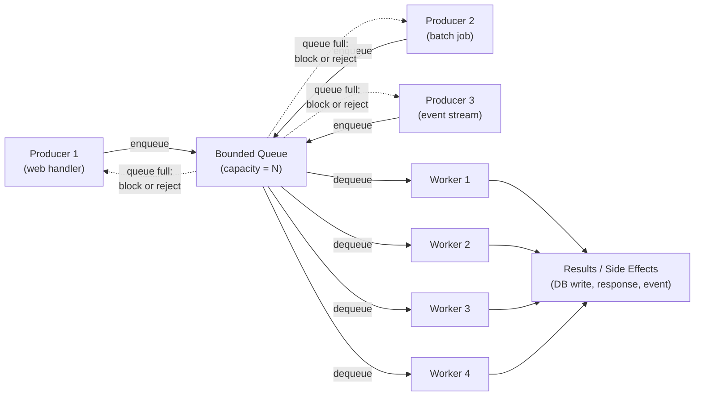

# [BEE-244] Producer-Consumer and Worker Pool Patterns

:::info
Decouple producers from consumers through a bounded shared queue, then serve that queue with a fixed pool of workers. This pair of patterns provides flow control, bounded resource use, and predictable throughput for any task-driven workload.
:::

## Context

Every backend service eventually faces a mismatch: the rate at which work arrives is not the same as the rate at which work can be processed. A web server that receives 500 image-upload requests per second cannot instantly resize them — each resize takes CPU time. Without a deliberate design, you face a binary choice: spin up an unbounded number of goroutines/threads (risking OOM) or drop requests (losing work).

The **producer-consumer pattern** solves this by placing a shared queue between the code that generates work and the code that performs it. The queue decouples production from consumption in time, rate, and resource allocation. It has been a foundational concurrency idiom since Dijkstra's semaphore paper (1965) and appears everywhere from OS process schedulers to Kafka consumer groups.

The **worker pool pattern** (also called thread pool) is the natural complement: instead of spawning a new thread for every task, a fixed number of worker goroutines/threads pull tasks from the queue. Workers are long-lived, reused across many tasks, and capped at a known upper bound.

Together they form the backbone of any system that processes discrete units of work at scale.

References:
- [Producer-Consumer Pattern — Low Level Design Mastery](https://www.lowleveldesignmastery.com/advanced-concurrency/core/04-producer-consumer/)
- [How to Implement Thread Pool Sizing — OneUptime Engineering](https://oneuptime.com/blog/post/2026-01-30-thread-pool-sizing/view)
- [How to Implement Worker Pools in Go — OneUptime Engineering](https://oneuptime.com/blog/post/2026-01-07-go-worker-pools/view)
- [How to Set an Ideal Thread Pool Size — Zalando Engineering](https://engineering.zalando.com/posts/2019/04/how-to-set-an-ideal-thread-pool-size.html)
- [Blocking Queues and Why We Need Them — Arpit Bhayani](https://arpitbhayani.me/blogs/blocking-queues/)

### The Core Problem: Rate Mismatch

Consider an image-processing service. A web server receives upload requests at peak rates that far exceed what a single worker can handle:

```
Production rate  →  100 tasks/second
Processing rate  →   25 tasks/second per worker
```

Without a queue, the producer must either wait (blocking the HTTP handler) or spawn a new goroutine per task (unbounded resource growth). Neither is acceptable in production.

With a bounded queue and a worker pool, the system absorbs bursts up to the queue capacity, processes tasks at the pool's sustained rate, and signals backpressure when the queue is full — pushing the flow-control decision back to the producer, where it belongs.

## Architecture



The bounded queue is the central control point. It acts as a buffer that absorbs production bursts, enforces backpressure when full, and provides natural load balancing — whichever worker finishes first picks up the next task.

## Principle

**Use a bounded queue and a fixed worker pool to decouple task production from task execution, enforce flow control, and cap resource consumption.**

1. The queue decouples producers from consumers in time: producers do not need to wait for a specific worker, and workers do not need to wait for specific producers.

2. The bounded capacity of the queue is the primary knob for backpressure. When the queue is full, producers block or receive a rejection signal. This propagates load shedding back upstream rather than letting unbounded memory consumption mask an overloaded system.

3. The worker pool bounds resource use. A pool of N workers means at most N tasks execute concurrently, consuming at most N × (per-task memory) regardless of how many tasks are queued.

4. Workers are reused. Thread and goroutine creation has non-trivial cost (stack allocation, OS scheduling). A pool amortizes that cost across the lifetime of the service.

### Bounded vs. Unbounded Queues

| Property | Bounded Queue | Unbounded Queue |
|---|---|---|
| Memory use | Capped at capacity × task size | Grows with backlog |
| Backpressure | Natural: producer blocks when full | None: queue silently absorbs all work |
| Failure mode | Controlled rejection at capacity | OOM crash at high load |
| Observability | Queue depth is a meaningful metric | Queue depth hides overload |

An unbounded queue is almost never correct in a production service. It converts a transient overload condition into gradual memory exhaustion and a sudden OOM crash — the worst possible failure mode.

### Pool Sizing

Choosing the right worker count requires understanding the workload's CPU vs. wait profile.

**CPU-bound tasks** (image resize, video transcode, cryptographic hash, heavy computation):

```
workers = number_of_CPU_cores
```

Adding workers beyond the core count does not add throughput. It only increases context-switch overhead and memory pressure. For CPU-bound work, more threads than cores is strictly worse.

**I/O-bound tasks** (database queries, HTTP calls, filesystem reads):

```
workers = cores × (1 + wait_time / compute_time)
```

If a worker spends 90 ms waiting on the database and 10 ms on CPU, the wait/compute ratio is 9. With 4 cores: `4 × (1 + 9) = 40 workers`. While workers block on I/O, other workers can use the CPU — so more workers are beneficial up to the point where context-switch cost exceeds the benefit.

**Mixed workloads** (tasks that do both CPU and I/O):

Use separate pools for CPU-bound and I/O-bound work. A single shared pool means a surge of CPU-heavy tasks blocks the threads that should be servicing low-latency I/O operations. See the common mistakes section.

These formulas are starting points. Always validate with load testing under realistic conditions and adjust.

### Task Distribution Strategies

When multiple workers pull from a shared queue, the default is **work stealing**: whichever worker is idle picks up the next available task. This is the natural behavior of a shared blocking queue and is optimal when task durations are roughly uniform.

**Round-robin assignment** is appropriate when tasks must be routed to a specific worker — for example, when tasks for the same entity must execute in order (ordered fan-out). Each producer assigns tasks to worker slots by hash of a routing key.

**Fan-out / fan-in**: a single task can be split into N subtasks dispatched across N workers (fan-out), with a coordinator collecting results and assembling the final output (fan-in). This is the basis of MapReduce-style pipelines.

## Concrete Example: Image Processing Pipeline

A web service accepts image upload requests. Each uploaded image needs to be resized to three output dimensions. The business requirement is to process images without blocking the HTTP server threads, without running out of memory under burst load, and without losing tasks on restart.

### Design

```
HTTP handler (producers)
    ↓ enqueue ResizeTask{imageID, targetSizes}
Bounded queue, capacity = 200
    ↓ dequeue
Worker pool, 4 workers (CPU-bound)
    ↓ resize + write to object storage
Done: update DB record with output URLs
```

### Normal operation

```
Time    Event
0ms     100 requests arrive, 100 ResizeTasks enqueued (queue depth: 100)
0ms     4 workers begin processing tasks 1–4
80ms    task 1 done → worker 1 picks task 5
        task 2 done → worker 2 picks task 6
        ...
4000ms  all 100 tasks complete (100 tasks ÷ 4 workers × 80ms/task)
```

### Burst: producers faster than consumers

When requests arrive at 50/second and each task takes 200 ms with 4 workers (throughput: 20/second):

```
Second 1:   50 tasks enqueued,  20 processed → queue depth: 30
Second 2:   50 tasks enqueued,  20 processed → queue depth: 60
Second 3:   50 tasks enqueued,  20 processed → queue depth: 90
...
Second 6:   50 tasks enqueued,  20 processed → queue depth: 180
Second 7:   50 tasks arrive, queue at 180 of 200 → 30 tasks rejected with 429
```

The rejection is the correct behavior. The HTTP handler receives a "queue full" signal and responds to the client with HTTP 429 Too Many Requests. The system remains stable; memory is bounded; the client can retry with backoff. Without a bounded queue, the service silently accepts all work until it OOMs.

### Graceful Shutdown

Shutdown order is critical. Losing in-flight tasks on a rolling restart is a correctness bug.

```
1. Stop accepting new tasks
   ↳ HTTP server begins rejecting new upload requests (503)

2. Wait for the queue to drain
   ↳ producers have stopped; workers continue dequeuing

3. Wait for in-flight tasks to complete
   ↳ each worker finishes its current task before exiting

4. Close the queue
   ↳ release resources, flush metrics

5. Exit
```

Implement a shutdown timeout. If workers do not finish within the timeout (e.g., 30 seconds), terminate them and log which task IDs were abandoned so they can be retried from a durable store.

```go
// Go example: graceful shutdown
func (p *Pool) Shutdown(ctx context.Context) error {
    close(p.queue)          // signal: no more tasks will be enqueued
    done := make(chan struct{})
    go func() {
        p.wg.Wait()         // wait for all workers to finish
        close(done)
    }()
    select {
    case <-done:
        return nil
    case <-ctx.Done():
        return fmt.Errorf("pool shutdown timed out: %w", ctx.Err())
    }
}
```

## Common Mistakes

**1. Unbounded queue (OOM)**

```go
// BAD: channel with no capacity limit
tasks := make(chan Task) // or make(chan Task, 1_000_000)

// GOOD: bounded channel matched to sustainable throughput
tasks := make(chan Task, 200) // reject when full, not crash
```

An unbounded queue converts overload into a memory leak. The queue grows silently until the process is OOM-killed with no warning and no opportunity for graceful degradation. Always set an explicit capacity.

**2. Pool too large for CPU-bound work**

```python
# BAD: 100 workers for a CPU-bound image resize on an 8-core machine
pool = ThreadPoolExecutor(max_workers=100)

# GOOD: match workers to core count
import os
pool = ThreadPoolExecutor(max_workers=os.cpu_count())
```

With 100 CPU-bound threads on 8 cores, the OS context-switches 100 threads across 8 CPUs. Each switch takes ~1–10 µs plus cache invalidation cost. Throughput goes down; latency goes up; CPU utilization shows high system time. More workers is not always better.

**3. No graceful shutdown (tasks lost on restart)**

```python
# BAD: process exits immediately, queue abandoned
signal.signal(signal.SIGTERM, lambda *_: sys.exit(0))

# GOOD: drain and finish
def handle_sigterm(*_):
    stop_accepting_new_tasks()
    pool.shutdown(wait=True)   # waits for in-flight tasks
    sys.exit(0)
```

A rolling deploy or container restart that kills the process without draining the queue silently drops tasks. Every production worker pool needs a SIGTERM handler that stops producers and waits for workers to finish.

**4. Ignoring task failures (silently dropped)**

```go
// BAD: errors lost
go func() {
    for task := range queue {
        process(task) // errors ignored
    }
}()

// GOOD: errors handled per-task
go func() {
    for task := range queue {
        if err := process(task); err != nil {
            metrics.Increment("task.failure")
            if isRetryable(err) {
                retryQueue <- task
            } else {
                deadLetterQueue <- task
                log.Error("task failed permanently", "id", task.ID, "err", err)
            }
        }
    }
}()
```

A task failure that is swallowed looks like success to the caller. Failed tasks must be either retried (with backoff and a retry limit) or written to a dead-letter queue for manual inspection.

**5. Single global pool for mixed workloads**

```java
// BAD: CPU-bound and I/O-bound tasks compete for the same pool
ExecutorService globalPool = Executors.newFixedThreadPool(8);
globalPool.submit(cpuHeavyTask);   // takes 500ms of CPU
globalPool.submit(dbQueryTask);    // needs a thread to unblock quickly

// GOOD: separate pools by workload type
ExecutorService cpuPool = Executors.newFixedThreadPool(Runtime.getRuntime().availableProcessors());
ExecutorService ioPool  = Executors.newFixedThreadPool(cpuCount * 10);
```

When CPU-bound tasks fill the pool, I/O-bound tasks queue up waiting for a thread even though the CPU is busy and the I/O tasks would otherwise complete immediately. Separate pools eliminate this interference.

## Decision Guide

```
Do you have discrete units of work produced at variable rates?
├── Yes
│   ├── Is consumption rate potentially slower than production rate?
│   │   ├── Yes → use a bounded queue (backpressure, flow control)
│   │   └── No  → a simple channel/queue still decouples concerns
│   │
│   ├── Is work CPU-bound (computation, encoding, hashing)?
│   │   └── Worker pool of size = CPU core count
│   │
│   ├── Is work I/O-bound (DB, network, storage)?
│   │   └── Worker pool of size = cores × (1 + wait/compute)
│   │       or use async I/O instead (see [BEE-24](24.md)3)
│   │
│   └── Mixed workloads in the same service?
│       └── Use separate pools, one per workload type
│
└── No discrete tasks (streaming, continuous computation)?
    └── Consider async I/O (BEE-243) or reactive streams (BEE-305)
```

## Related BEPs

- [BEE-225](225.md) — Backpressure: system-level strategies for propagating load signals upstream
- [BEE-240](240.md) — Threads vs Processes vs Coroutines: the primitives that worker pools are built on
- [BEE-243](243.md) — Async I/O and Event Loops: the alternative to thread pools for I/O-bound work
- [BEE-305](305.md) — Async Processing and Job Queues: durable, distributed queues (Kafka, SQS) for cross-service task distribution
