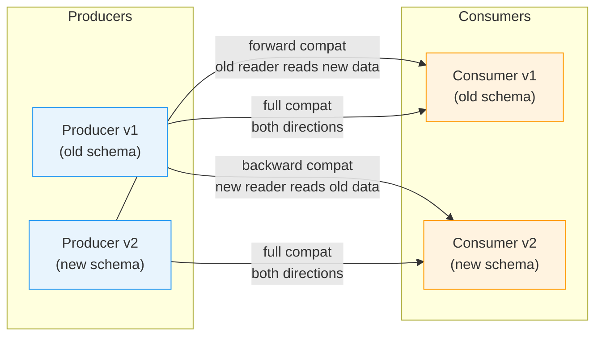

# [BEE-142] Schema Evolution and Backward Compatibility

:::info
Design schemas to evolve safely over time. Add optional fields; deprecate before removing; never change a field's type or number in place.
:::

## Context

Systems rarely stand still. Business requirements change, new features are added, and bugs are fixed. The data schemas that describe messages, API payloads, and database tables must change with them. The challenge is that in any distributed system, producers and consumers of data are updated independently — not at the same instant. A new service version may start writing records while dozens of older consumers are still running. If the schema change is not handled carefully, old consumers fail to read new data, or new consumers fail to read old data that has not been migrated.

Schema evolution is the discipline of making those changes in a controlled way so that the system continues to operate correctly across the transition window.

**References:**
- [Confluent: Schema Evolution and Compatibility](https://docs.confluent.io/platform/current/schema-registry/fundamentals/schema-evolution.html)
- [Earthly Blog: Protocol Buffers Best Practices for Backward and Forward Compatibility](https://earthly.dev/blog/backward-and-forward-compatibility/)
- [Creek Service: Evolving JSON Schemas — Part I](https://www.creekservice.org/articles/2024/01/08/json-schema-evolution-part-1.html)

## Principle

**Every schema change must preserve compatibility in at least one direction for the entire deployment window.**

In practice this means:

1. Prefer backward-compatible changes (new code reads old data).
2. When forward compatibility is also required, only make fully compatible changes.
3. Treat schema changes with the same review discipline as API contract changes — because they are API contract changes.

---

## Compatibility Definitions

### Backward Compatibility

New reader, old data. A consumer using schema version N can deserialize data written with schema version N-1.

This is the minimum bar for any rolling deployment. Consumers are updated before (or independently of) producers, but the data on the wire or in storage may still follow the old shape.

### Forward Compatibility

Old reader, new data. A consumer using schema version N-1 can deserialize data written with schema version N.

Required when producers are updated first, or when the same data stream is read by consumers that cannot be updated simultaneously (e.g., third-party integrations, mobile clients with slow update cycles).

### Full Compatibility

Both directions. A change is fully compatible when it satisfies both backward and forward compatibility simultaneously.

### Transitive Compatibility

A stricter variant: compatibility is checked against all previous versions, not just the immediately preceding one. Use transitive mode for long-lived event streams where consumers may be multiple versions behind.

### Compatibility Matrix



---

## Breaking vs. Non-Breaking Changes

### Non-Breaking (Safe) Changes

| Change | Notes |
|---|---|
| Add an optional field with a default | Backward and forward compatible |
| Add a new enum value (carefully) | Forward compat only; old readers may reject unknown values |
| Rename a field using an alias | Schema-format dependent; requires alias support (Avro) |
| Relax a constraint (required → optional) | Safe for consumers; tighten separately |
| Add a new message type or endpoint | No effect on existing data |

### Breaking Changes

| Change | Why It Breaks |
|---|---|
| Remove a field without a deprecation period | Old consumers expect the field; new data omits it |
| Change a field's type (e.g., `string` → `integer`) | Wire format or deserialization fails |
| Rename a field without an alias mechanism | Consumers keyed on the old name receive null or error |
| Make an optional field required | Old producers that omit the field now produce invalid data |
| Change the semantics of a field (same name, different meaning) | Silent data corruption; no format error, wrong business logic |
| Reuse a deleted field number (Protobuf) | Binary decodes into the wrong field |

---

## Rules for Safe Evolution

### Rule 1: Only add optional fields

When adding a field to a schema, always mark it optional and provide a default value. Consumers that receive old data will use the default; old consumers receiving new data will ignore the field entirely (forward compat).

```json
// v1 schema
{
  "type": "object",
  "properties": {
    "user_id": { "type": "string" },
    "email":   { "type": "string" }
  },
  "required": ["user_id", "email"]
}

// v2 schema — safe: new optional field with default
{
  "type": "object",
  "properties": {
    "user_id":      { "type": "string" },
    "email":        { "type": "string" },
    "display_name": { "type": "string", "default": "" }
  },
  "required": ["user_id", "email"]
}
```

### Rule 2: Deprecate before removing

Never remove a field in a single step. Follow this lifecycle:

```
Add field → Use field → Mark deprecated → Stop writing → Remove from schema
   v1           v1-v2         v3              v4 (grace)        v5
```

The grace period must be long enough for all consumers to be updated and redeployed. For internal services this is typically one or two release cycles. For public APIs or event streams with durable storage, it may be months.

### Rule 3: Never change a field's type

If the business requirement changes so that a field needs a different type, add a new field with a different name. Deprecate the old field following Rule 2.

```json
// Wrong: changing the type in place breaks all consumers
// "amount": { "type": "string" }  →  "amount": { "type": "number" }  ← NEVER

// Right: add a new field, deprecate the old one
{
  "amount_str":  { "type": "string",  "deprecated": true },
  "amount_cents": { "type": "integer" }
}
```

### Rule 4: Never rename a field directly

A rename is equivalent to a delete plus an add. If you must rename, use an alias mechanism (Avro aliases, Protobuf field number stability) or keep both names during the transition.

### Rule 5: Never make an optional field required

Tightening a constraint is a breaking change. If validation needs to become stricter, enforce it at the application layer for new writes only; do not update the schema constraint in a way that invalidates existing data.

### Rule 6: Reserve removed identifiers (Protobuf)

In Protocol Buffers, after removing a field, mark its number and name as `reserved` so they can never be accidentally reused.

```protobuf
message Order {
  reserved 3, 5;
  reserved "legacy_amount", "discount_code";

  string order_id = 1;
  int64  amount_cents = 2;
  string currency = 4;
}
```

---

## How Different Formats Handle Evolution

### Protocol Buffers

Protobuf identifies fields by their integer field number, not by name. This gives it strong natural support for evolution:

- Field numbers are permanent. Never renumber a field.
- Adding a new field with a new number is always safe.
- Removing a field: mark it `reserved` to prevent reuse.
- You can rename a field freely (same number = same field in binary).
- Changing wire type (e.g., `int32` to `string`) is a hard break.
- Unknown fields are preserved by default in proto3, enabling forward compatibility.

### Avro

Avro schemas are resolved at read time by matching field names between writer schema and reader schema. Key rules:

- Adding a field with a default value is backward compatible (reader supplies the default for old data that lacks it).
- Removing a field is forward compatible only if the field had a default (reader ignores the field for new data that includes it).
- Null-safety: make fields nullable with a union `["null", "string"]` and default `null` to enable both add and remove in a fully compatible way.
- Renaming requires an `aliases` entry in the schema so the resolver can match old names.

### JSON / REST APIs

JSON has no built-in schema enforcement on the wire. Additional discipline is required:

- Old JSON consumers typically ignore unknown fields (forward compat by convention, not by spec).
- Backward compat requires new consumers to handle absent fields gracefully — do not assume a field is always present unless it is in the original spec.
- Use JSON Schema or OpenAPI to formally describe and validate the contract.
- Maintain an `$schema` or version header so consumers can detect the schema version.

---

## API Contract Evolution

REST API responses follow the same compatibility rules as any schema. A JSON response is a schema contract with every client that calls the endpoint.

**Safe change — adding a field:**

```json
// v1 response
{ "id": "u123", "name": "Alice" }

// v2 response — safe: new field added
{ "id": "u123", "name": "Alice", "avatar_url": "https://cdn.example.com/u123.jpg" }
```

Old clients ignore `avatar_url`. This is backward compatible.

**Unsafe change — removing a field:**

```json
// v2 response — UNSAFE: field removed without deprecation
{ "id": "u123", "avatar_url": "https://cdn.example.com/u123.jpg" }
```

Old clients that read `name` now receive `null` or throw a deserialization error.

**Safe removal process:**

1. Announce deprecation in the API changelog and response (add a `deprecated_fields` metadata hint or HTTP `Deprecation` header).
2. Keep writing the field for at least one major version or a defined sunset date.
3. Monitor consumer usage to confirm all clients have migrated.
4. Remove the field only after the sunset date has passed.

See [BEE-71](71.md) (API Versioning) for the broader versioning strategy when a clean break is unavoidable.

---

## Database Schema Evolution

Database schemas carry an additional constraint: the data is durable and cannot be "re-sent" through a corrected schema.

Best practices:
- All schema changes must be applied via migrations (see [BEE-12](12.md)6).
- Make columns nullable with a database-level default before making them required.
- Never drop a column in the same migration that removes application code references to it — deploy the application change first, then drop the column after confirming no active queries reference it.
- Rename via a multi-step process: add the new column, backfill data, update application code, deprecate the old column, drop after a waiting period.

---

## Common Mistakes

**1. Removing a field without a deprecation period**

The most common breakage pattern. A field is deleted in the same PR that stops writing it. Consumers that depend on it break immediately at deployment.

**2. Changing a field's type**

`string` to `integer`, `integer` to `boolean`, `object` to `array` — all are breaking changes. Even if the semantic intent is the same, the binary encoding or JSON deserialization will fail or silently corrupt data.

**3. Making an optional field required**

Seems like a tightening of the contract, but existing data and existing producers may not supply the field. Validation failures appear at runtime, not at schema design time.

**4. Not versioning internal service schemas**

Teams often treat internal gRPC or Kafka schemas as informal. When an internal schema breaks, it is just as disruptive as a public API break — more so, because there is no version header to help consumers detect the mismatch.

**5. Assuming all consumers update simultaneously**

In reality, canary deployments, mobile app release cycles, and third-party integrations mean multiple schema versions coexist for days or months. Design every schema change to survive that overlap window.

---

## Checklist

Before merging a schema change:

- [ ] Is the change additive only (new optional fields, no removals or type changes)?
- [ ] Do new fields have explicit default values?
- [ ] If removing a field, has it been deprecated for at least one full release cycle?
- [ ] In Protobuf, are removed field numbers and names marked `reserved`?
- [ ] In Avro, do new fields have `default` set?
- [ ] Has the compatibility type been verified in the schema registry (if applicable)?
- [ ] Are all active consumers known and able to handle this change?
- [ ] Is there a rollback plan if an incompatible change is detected post-deploy?

---

## Related BEPs

- [BEE-71](71.md) — API Versioning: when schema evolution is insufficient and a version bump is required
- [BEE-126](126.md) — Database Migrations: applying schema changes to persistent storage safely
- [BEE-143](143.md) — Encoding Formats: choosing between Protobuf, Avro, JSON, and MessagePack
