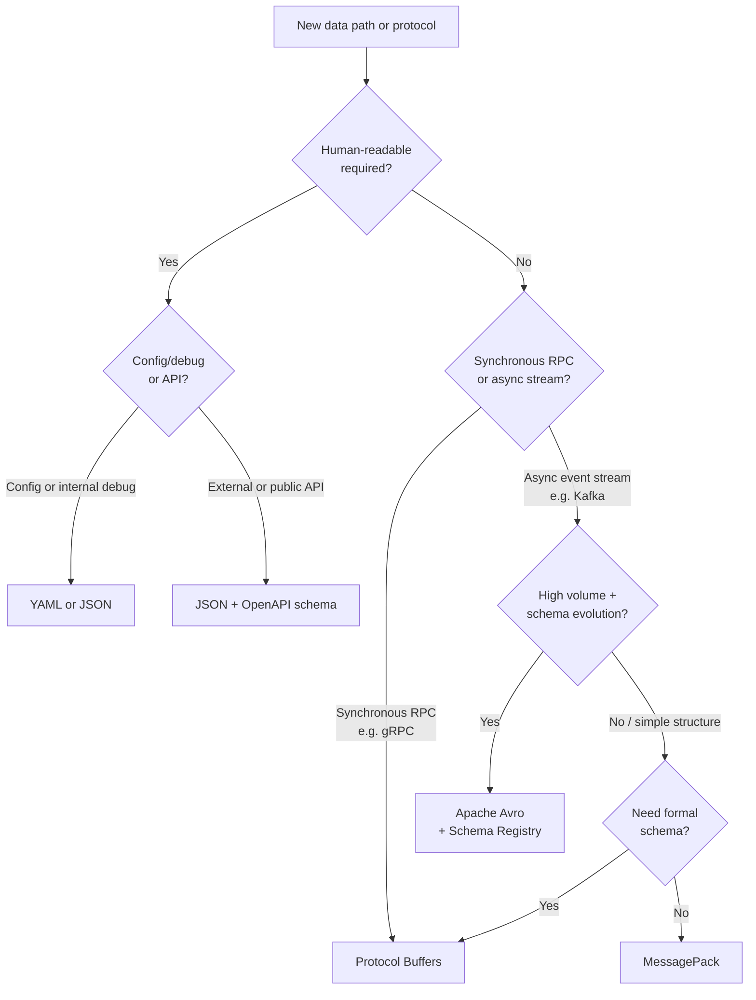

# [BEP-143] Encoding and Serialization Formats

:::info
Choose your encoding format based on who consumes the data and what your throughput and schema evolution requirements are. JSON for public APIs and human-readable configs; Protobuf for high-performance RPC; Avro for event streaming with schema evolution; MessagePack when you need binary JSON without a schema overhead.
:::

## Context

Every time a service writes data to disk, sends a message over the network, or publishes an event to a queue, it must decide how to encode that data. The encoding format determines wire size, serialization speed, schema enforcement, debuggability, and — critically — how safely the format can evolve over time as requirements change.

Most teams default to JSON everywhere because it is familiar and debuggable. That works well for public APIs and configuration, but it carries real costs at scale: JSON is verbose, requires parsing text, and provides no native schema enforcement. Conversely, teams that adopt binary formats everywhere sometimes end up with opaque payloads that are difficult to debug in production and alienate external consumers.

The decision is not one-size-fits-all. Understanding the trade-offs of each format — and having a principled framework for choosing between them — prevents both classes of mistake.

**References:**
- [Protocol Buffers Encoding Documentation](https://protobuf.dev/programming-guides/encoding/)
- [Apache Avro Specification](https://avro.apache.org/docs/1.11.1/specification/)
- [DDIA Chapter 4 — Encoding and Evolution (O'Reilly)](https://www.oreilly.com/library/view/designing-data-intensive-applications/9781491903063/ch04.html)
- [MessagePack Specification](https://msgpack.org/)

## Principle

**Match the encoding format to the communication boundary, throughput requirements, and schema evolution model of the specific data path.**

In practice this means:

1. Use JSON at external API boundaries where human-readability and tooling compatibility matter.
2. Use Protocol Buffers for internal synchronous RPC (gRPC) where throughput and strong schema contracts are important.
3. Use Avro for asynchronous event streaming where schema evolution and compactness at high volume are both required.
4. Use MessagePack only when you need binary compactness and already have a well-understood structure that does not require a formal schema.
5. Never mix formats at a single boundary without documenting the reason and providing conversion tooling.

---

## Format Taxonomy

### Text Formats

Text formats are human-readable and do not require tooling to inspect. They are the default choice for external APIs, configuration files, and debugging.

| Format | Schema | Typical Size | Notes |
|--------|--------|-------------|-------|
| JSON   | Optional (JSON Schema / OpenAPI) | Baseline | Ubiquitous; no native binary support |
| XML    | Optional (XSD) | ~2x JSON | Verbose; common in legacy enterprise integrations |
| YAML   | Optional | ~1x JSON | Popular for config; ambiguous parsing rules |

Key limitations of text formats:
- **Verbose**: field names are repeated in every message.
- **Parsing cost**: text must be tokenized and converted to native types on every read.
- **No native type safety**: a field declared `integer` in documentation can silently be sent as a string.
- **Schema enforcement is opt-in**: nothing prevents a producer from omitting a required field unless validation middleware is added explicitly.

### Binary Formats

Binary formats encode data as compact byte sequences. Field names or type information are either absent from the payload (Protobuf, Avro) or encoded compactly (MessagePack). The result is smaller messages and faster serialization/deserialization, at the cost of human-readability.

| Format | Schema Required | Self-Describing | Typical Size vs JSON | Notes |
|--------|----------------|-----------------|----------------------|-------|
| Protocol Buffers | Yes (`.proto`) | No | ~3-10x smaller | Field numbers in wire format; strong evolution rules |
| Apache Avro | Yes (`.avsc` JSON) | No (schema embedded in file/registry) | ~2.5-4x smaller | Schema resolved at read time; excellent evolution |
| Apache Thrift | Yes (`.thrift` IDL) | No | ~2-4x smaller | Similar to Protobuf; less common in new systems |
| MessagePack | No | Yes | ~1.5-2x smaller | Binary JSON; type-tagged values; no schema |

---

## Format Deep Dives

### JSON

JSON encodes each value as a key-value pair with the field name present in every message. This self-describing nature is its biggest strength: any consumer can read the data without a schema by inspecting the keys.

Strengths:
- Human-readable without tooling.
- Native browser and HTTP ecosystem support.
- Rich tooling: linters, validators, OpenAPI generators.
- Easy to add ad-hoc fields during development.

Weaknesses:
- Field names repeated in every payload inflate size significantly at scale.
- No native support for binary data (base64 encoding adds ~33% overhead).
- No built-in schema validation; discipline must be enforced externally.
- Parsing is CPU-intensive at high throughput compared to binary formats.

**When to use JSON:** External REST APIs, webhook payloads, configuration files, log lines, any context where a human or unfamiliar tool may need to read the data.

---

### Protocol Buffers (Protobuf)

Protobuf represents each field using a compact integer field number and a wire type. Field names do not appear in the encoded bytes — the schema (`.proto` file) is required to interpret the payload. Numbers are encoded using variable-length integers (varint), so small numbers are stored in fewer bytes.

```protobuf
// User schema in Proto3
syntax = "proto3";

message User {
  string name  = 1;
  int32  age   = 2;
  string email = 3;
}
```

The encoded binary is approximately 33 bytes for the sample payload below, compared to 55 bytes in compact JSON.

Strengths:
- Compact wire format; varints compress small integers efficiently.
- Schema-enforced; generated code in most languages.
- Strong schema evolution: fields identified by number, not name.
- First-class support in gRPC.

Weaknesses:
- Not human-readable; requires tooling (e.g., `protoc`, grpcurl) to inspect.
- Schema must be shared out-of-band (IDL files or schema registry).
- Limited support for dynamic or schemaless access patterns.

**When to use Protobuf:** Internal gRPC services, performance-critical internal APIs, any synchronous RPC path where both sides control the schema. See BEP-74.

---

### Apache Avro

Avro uses a JSON-defined schema but encodes data in a compact binary format that omits all field names. Because the binary contains only values in schema-defined order, the reader must have access to the writer's schema to decode correctly. Avro resolves schema differences at read time by comparing writer schema to reader schema field by field.

```json
{
  "type": "record",
  "name": "User",
  "fields": [
    { "name": "name",  "type": "string" },
    { "name": "age",   "type": "int" },
    { "name": "email", "type": "string" }
  ]
}
```

The same sample payload encodes to approximately 32 bytes — the most compact of the common formats.

Key design characteristic: schema evolution is first-class. Adding a field with a default value is backward compatible; the reader supplies the default when reading old data that lacks the field. Removing a field with a default is forward compatible; old readers skip the field when reading new data that includes it.

Strengths:
- Most compact binary encoding for typical structured data.
- Schema evolution by design; writer/reader schema resolution is built in.
- Schema can be stored alongside data (Avro container format) or in a schema registry.
- Excellent fit for Kafka and other event streaming platforms.

Weaknesses:
- Dynamic schema resolution has overhead at startup (schema comparison).
- Requires schema registry or embedded schema for cross-service decoding.
- Less common outside the JVM/data engineering ecosystem.

**When to use Avro:** Kafka topics, data pipeline events, batch data formats (Hadoop, Spark), any high-volume asynchronous stream where schema evolution and storage efficiency are both critical. See BEP-220.

---

### MessagePack

MessagePack is a binary encoding of the JSON data model. It preserves JSON's self-describing structure (type tags per value, key names in objects) but replaces text with compact binary representations. No schema is required.

Strengths:
- No schema required; drop-in replacement for JSON in many cases.
- ~1.5–2x smaller than equivalent JSON.
- Faster serialization/deserialization than JSON text parsing.
- Good cross-language support.

Weaknesses:
- Still carries field names in every message (unlike Protobuf/Avro).
- No schema means no compile-time type checking or formal evolution rules.
- Less compact than schema-based binary formats.
- Debugging requires MessagePack-aware tooling.

**When to use MessagePack:** Internal caches (Redis values), session stores, any scenario where you want binary compactness and already rely on convention rather than formal schema, and where Protobuf/Avro overhead is not justified.

---

## Worked Example: Same Data, Four Encodings

Consider a `User` object with: `name = "Alice"`, `age = 30`, `email = "alice@example.com"`.

### JSON (55 bytes, compact)

```json
{"name":"Alice","age":30,"email":"alice@example.com"}
```

The field names `name`, `age`, and `email` are present in the payload. Every consumer can read this without external schema.

### Protocol Buffers schema and wire size (~33 bytes)

```protobuf
syntax = "proto3";
message User {
  string name  = 1;   // tag 0x0A
  int32  age   = 2;   // tag 0x10
  string email = 3;   // tag 0x1A
}
```

The encoded payload contains only: tag+length+`Alice`, tag+varint(30), tag+length+`alice@example.com`. Field names are absent. The schema file is required to decode.

### Avro schema and wire size (~32 bytes)

```json
{
  "type": "record",
  "name": "User",
  "fields": [
    { "name": "name",  "type": "string" },
    { "name": "age",   "type": "int" },
    { "name": "email", "type": "string" }
  ]
}
```

Binary: length-prefixed `Alice`, zigzag-encoded 30, length-prefixed `alice@example.com`. No tags at all — values are laid out in schema-defined order. Both writer and reader must have matching (or compatible) schemas.

### MessagePack (~45 bytes)

No schema definition needed. The object is encoded as a fixmap with 3 entries; each key is a compact binary string (field names still present). Values are type-tagged integers and strings.

### Size comparison

| Format | Approximate wire size | Schema required to decode |
|--------|-----------------------|--------------------------|
| JSON   | 55 bytes              | No                       |
| MessagePack | ~45 bytes        | No                       |
| Protobuf | ~33 bytes          | Yes (`.proto`)           |
| Avro   | ~32 bytes             | Yes (`.avsc` + registry) |

These numbers scale with message count. At 10,000 messages/second, the difference between JSON and Avro is roughly 230 KB/s per topic for this payload alone.

---

## Schema Evolution Comparison

| Property | JSON | Protobuf | Avro | MessagePack |
|----------|------|----------|------|-------------|
| Add optional field | Safe (convention) | Safe (new field number) | Safe (with default) | Safe (convention) |
| Remove field | Safe (convention) | Safe (mark reserved) | Safe (with default) | Safe (convention) |
| Rename field | Safe (convention; breaks consumers) | Safe (same number; rename is free) | Requires `aliases` | Safe (convention; breaks consumers) |
| Change field type | Breaks consumers | Hard break (new field number required) | Hard break (unless widening) | Breaks consumers |
| Schema registry needed | Recommended | Recommended | Required for cross-service | No |
| Evolution formalized | No | Yes | Yes | No |

See BEP-142 for the full rules of safe schema evolution regardless of format.

---

## Decision Tree



---

## Common Mistakes

**1. Using JSON for high-throughput internal communication**

JSON is the wrong default for internal service-to-service calls at high volume. The combination of verbose field names, text parsing cost, and lack of schema enforcement creates unnecessary overhead. At 50,000 events/second, switching from JSON to Protobuf or Avro typically reduces CPU and bandwidth by 60–80%.

**2. Using binary formats for public APIs**

Binary formats require consumers to have the correct schema and tooling before they can read a single byte. External developers, mobile clients, and third-party integrations cannot easily debug payloads with curl or browser DevTools. Reserve binary formats for internal or semi-internal paths where you control both ends.

**3. Not defining a schema for JSON**

"We'll document the fields in the README" is not a schema. Without a formal JSON Schema or OpenAPI contract, producers drift from consumers silently, field types change without notice, and there is no automated way to validate payloads. Always define and validate JSON contracts formally at API boundaries.

**4. Ignoring schema evolution rules when choosing a format**

Teams often choose a format for its size or speed properties and discover only later that their evolution model is incompatible. Avro requires both writer and reader schemas to be known and compatible. Protobuf field numbers must never be reused. If these rules are not followed from day one, evolution breaks and migrations become expensive.

**5. Mixing formats without clear boundaries**

A system that uses JSON on some Kafka topics and Avro on others, with no documented policy, creates operational confusion. Consumers must inspect envelope headers to determine how to decode, monitoring tools need format-aware parsers, and onboarding new engineers takes longer. Establish a clear format policy per communication type and enforce it in code review.

---

## Related BEPs

- **BEP-74** — gRPC and Protocol Buffers: Protobuf in synchronous RPC contexts
- **BEP-142** — Schema Evolution and Backward Compatibility: safe change rules for all formats
- **BEP-220** — Messaging and Event Streaming: Avro as the standard for Kafka topics
