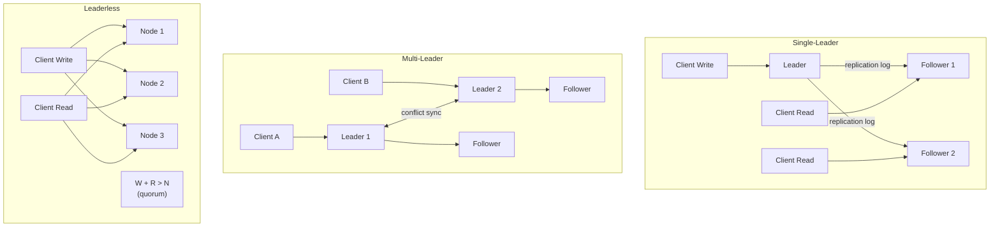

# [BEE-122] Replication Strategies

:::info
Single-leader, multi-leader, and leaderless replication — tradeoffs, conflict resolution, failover, and replication lag.
:::

## Context

Modern systems rarely run on a single database node. Data is replicated across multiple nodes to survive hardware failures, reduce read latency for geographically distributed users, and scale read throughput beyond what a single machine can handle. But replication introduces one of the central tensions in distributed systems: every write must eventually reach every replica, and something can go wrong in between.

This article covers the three main replication topologies, their operational characteristics, and the failure modes engineers most commonly overlook.

**References:**
- [Designing Data-Intensive Applications, Chapter 5: Replication](https://www.oreilly.com/library/view/designing-data-intensive-applications/9781491903063/ch05.html) — Martin Kleppmann
- [PostgreSQL Streaming Replication](https://wiki.postgresql.org/wiki/Streaming_Replication) — PostgreSQL Wiki
- [MySQL 8.4 Replication](https://dev.mysql.com/doc/en/replication.html) — MySQL Reference Manual

## Why Replicate?

Three distinct goals drive replication decisions:

**High availability.** If one node fails, another can take over. Without replication, a single node failure means downtime.

**Read scaling.** Read-heavy workloads can be distributed across replicas. Writes still go to one place, but reads fan out. This only helps if reads substantially outnumber writes.

**Geographic distribution.** Serving users from a replica in their region reduces latency. A user in Singapore should not wait for a round trip to Frankfurt for every read.

These goals are not always compatible. Synchronous replication maximizes durability but limits write throughput. Leaderless replication maximizes availability but complicates consistency.

## Replication Topologies



### Single-Leader Replication

One node is designated the leader (also called primary or master). All writes go to the leader. The leader applies the write locally, then forwards a replication log to followers (replicas, standbys). Clients can read from any follower, though reads may be stale.

PostgreSQL and MySQL both implement this model. PostgreSQL ships WAL (Write-Ahead Log) records to standbys via the streaming replication protocol. MySQL ships binlog events. In both cases, one source is authoritative for writes.

This is the simplest topology to reason about. Conflict resolution is trivially handled: there is only one writer, so conflicts cannot occur.

**Tradeoffs:**
- Writes are bottlenecked on the leader
- Leader failure requires failover (see below)
- Followers may serve stale reads

### Multi-Leader Replication

Multiple nodes accept writes. Each leader replicates to the others and to its own followers. This is common in multi-datacenter deployments where each datacenter has a local leader, and leaders sync across datacenters asynchronously.

Conflict resolution becomes a first-class concern. Two leaders can simultaneously accept conflicting writes to the same row. The system must decide which write wins or how to merge them.

**Tradeoffs:**
- Higher write availability and lower write latency per datacenter
- Conflicts are possible and must be explicitly handled
- Configuration is significantly more complex
- Circular replication bugs and split-brain scenarios are harder to avoid

MySQL Group Replication and CockroachDB support multi-leader or multi-primary writes. Most applications should avoid multi-leader unless they have a clear geographic distribution requirement with strong conflict resolution discipline.

### Leaderless Replication

No single node is the authority for writes. The client sends a write to multiple nodes simultaneously. A write is considered successful when W nodes acknowledge it. Reads are sent to multiple nodes and return the value from R nodes. When W + R > N (total nodes), at least one node in every read set must have seen the latest write — this is the quorum guarantee.

Dynamo (Amazon), Cassandra, and Riak use this model. It tolerates node failures without failover: if a node is unavailable, the client routes around it. Anti-entropy processes (read repair, background sync) reconcile diverged data.

**Tradeoffs:**
- No single point of failure, no failover needed
- W and R parameters let operators tune consistency vs. availability
- Even with quorum, edge cases exist where stale data is returned
- Conflict resolution (version vectors, last-write-wins) must be designed upfront

## Synchronous vs. Asynchronous Replication

This applies primarily to single-leader and multi-leader setups.

**Asynchronous replication** (MySQL default): The leader commits locally and returns success to the client before the follower acknowledges. This is faster but creates a window where acknowledged writes exist only on the leader. If the leader fails before replication completes, those writes are lost.

**Synchronous replication**: The leader waits for at least one follower to confirm receipt before returning success. Writes are durable across at least two nodes. The tradeoff: write latency includes the network round trip to the follower. A slow or unavailable synchronous follower blocks all writes.

**Semi-synchronous** (MySQL's practical middle ground): One follower is designated synchronous. Others are asynchronous. If the synchronous follower fails, one of the async followers is promoted to synchronous. PostgreSQL calls a similar configuration `synchronous_commit = remote_write`.

For most production systems, semi-synchronous with one synchronous follower is the recommended default: one acknowledgment of durability, without requiring all followers to be available.

## Replication Lag

Because asynchronous followers receive writes after the leader, they may serve stale data. This gap is replication lag. Under normal operation it is milliseconds. Under heavy write load or network issues it can grow to seconds or minutes.

Two specific problems caused by replication lag are worth understanding precisely:

**Read-after-write inconsistency.** A user writes data (a profile update, a comment), then immediately reads it back. If the read goes to a follower that has not yet received the write, the user sees their old data — or no data. From their perspective, the write was lost.

Mitigation: route reads that immediately follow a write to the leader. Track the user's last write timestamp and only route to followers that are caught up past that point.

**Monotonic reads violation.** A user makes two successive reads. The first goes to a follower with low lag. The second goes to a follower with higher lag. The user sees a newer state, then an older state — time appears to go backwards.

Mitigation: pin a user session to a specific replica, or route all reads through the leader.

## Failover

When the leader fails, a follower must be promoted. This is either manual (an operator makes the decision) or automatic (the system detects failure and elects a new leader).

### Single-Leader Failover Walkthrough

**Scenario: asynchronous replication, leader fails**

```
t=0   Leader receives write W1, applies locally
t=1   Leader sends W1 to Follower 1 (async, not yet acknowledged)
t=2   Leader fails (crash)
t=3   Follower 1 has NOT yet received W1
t=4   Failover: Follower 1 promoted to new leader
t=5   W1 is lost — it existed only on the failed leader
```

When the old leader recovers and rejoins as a follower, it may try to replay W1. If the new leader has already processed conflicting writes, this causes inconsistency. Automatic failover systems discard the old leader's unreplicated writes, which means acknowledged writes can be permanently lost.

**Scenario: synchronous replication, leader fails**

```
t=0   Leader receives write W1
t=1   Leader sends W1 to Follower 1 (sync)
t=2   Follower 1 acknowledges
t=3   Leader returns success to client
t=4   Leader fails
t=5   Failover: Follower 1 promoted — W1 is present, no data loss
```

The cost: if Follower 1 was unavailable at t=1, the write at t=0 would have blocked until Follower 1 recovered or was removed from the synchronous set.

### Split-Brain

Automatic failover carries a specific danger: the system promotes a new leader while the old leader is still running (network partition, not crash). Now two nodes believe they are the leader. Both accept writes. The writes diverge and conflict.

Defenses: STONITH (Shoot The Other Node In The Head) — forcibly power off the suspected old leader before promotion. Fencing tokens — include a monotonically increasing token with writes; nodes with stale tokens are rejected. Consensus protocols (Raft, Paxos) — elect a leader only with a majority quorum, making simultaneous dual leadership impossible.

## Conflict Resolution Strategies

In multi-leader and leaderless systems, the same key can receive conflicting concurrent writes. The system must resolve them.

**Last-write-wins (LWW).** Each write carries a timestamp. The write with the highest timestamp wins. Simple to implement. Loses data silently — the discarded write is gone. Vulnerable to clock skew: a write on a node with a fast clock always beats writes on nodes with slower clocks.

**Application-level conflict resolution.** The application receives both conflicting values and decides which to keep. Used by CouchDB (replication conflicts exposed as document revisions). Requires the application to define merge logic. Suitable when domain semantics matter (e.g., a shopping cart should merge items, not pick one).

**CRDT (Conflict-free Replicated Data Types).** Data structures designed to merge deterministically without application logic. Counters, sets, and maps have CRDT implementations. Riak supports CRDT types. The tradeoff: the set of operations that can be expressed as CRDTs is limited.

**Operational transformation.** Used by collaborative editing systems (Google Docs). Tracks the transformation history to apply edits in any order and arrive at the same result. Complex to implement correctly.

## Principle

Choose your replication topology based on your primary constraint:

- **Need simple writes with read scaling**: Single-leader, async replication, read from followers.
- **Need low write latency across datacenters**: Multi-leader, with explicit conflict resolution.
- **Need maximum availability and can tolerate eventual consistency**: Leaderless with quorum tuning.

Layer synchrony on top of your topology to match durability requirements. For most OLTP systems, semi-synchronous single-leader replication (one sync follower) is the right default.

Replication lag is not an edge case — it is the normal operating condition of any async replica. Design reads with lag in mind. Where read-after-write consistency matters, route explicitly to the leader or use session-tracking logic.

Do not rely on automatic failover without split-brain protection. Fast failover without fencing can produce data loss and corruption that is harder to recover from than the original outage.

## Common Mistakes

1. **Assuming replicas are always consistent.** Async replication means followers are behind by definition. Reading from a follower is reading potentially stale data. This is not a bug — it is the contract. Treat it as such in your application.

2. **Reading from a replica immediately after a write.** The write went to the leader; the read may land on a follower that has not received it yet. This is the read-after-write problem. The fix is deliberate routing, not luck.

3. **Enabling automatic failover without split-brain protection.** Automatic promotion without STONITH or fencing tokens creates dual-leader scenarios. Both leaders accept writes; the divergence is silent and potentially hard to detect. Always pair automatic failover with node fencing.

4. **Multi-leader replication without a conflict resolution strategy.** Deploying multi-leader and hoping conflicts do not occur is not a strategy. Conflicts will occur eventually. Design the resolution logic before deployment, not after you find corrupted data in production.

5. **Not monitoring replication lag.** A follower that is hours behind a leader is nearly useless for reads and dangerous for failover (large data loss window). Instrument `pg_stat_replication` (PostgreSQL) or `SHOW REPLICA STATUS` (MySQL) and alert when lag exceeds acceptable thresholds.

## Related BEPs

- [BEE-120: SQL vs NoSQL](./120.md) — choosing storage engines that constrain replication options
- [BEE-123: Sharding](./123.md) — partitioning data across nodes, often combined with per-shard replication
- [BEE-160: ACID Transactions](./160.md) — how replication interacts with transaction isolation
- [BEE-165: Eventual Consistency](./165.md) — the consistency model that leaderless and async replication naturally provides
