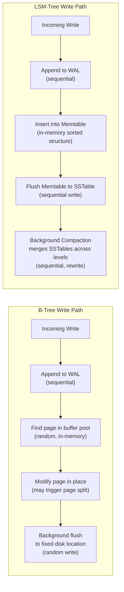

# [BEP-124] Storage Engines

:::info
How databases translate logical reads and writes into physical disk I/O — and why the choice between B-tree and LSM-tree engines matters at scale.
:::

## Context

When you call `INSERT`, `UPDATE`, or `SELECT`, you are talking to a storage engine. The engine is the component responsible for deciding how bytes land on disk, how they are retrieved, and how much I/O is required to do both. Two major families dominate:

- **B-tree engines** (PostgreSQL heap + B-tree indexes, InnoDB, WiredTiger in read-optimised mode) — page-oriented, in-place updates, strong read performance.
- **LSM-tree engines** (RocksDB, LevelDB, Cassandra, ScyllaDB, WiredTiger in write-optimised mode) — append-only writes, background compaction, high write throughput.

Understanding this layer is not optional knowledge. At even moderate scale, the wrong engine choice — or the right engine with wrong tuning — leads to unexplained write stalls, surprise disk usage, or read latency regressions that are invisible in development.

**Further reading:**
- [DDIA Chapter 3 — Storage and Retrieval (summary)](https://timilearning.com/posts/ddia/part-one/chapter-3/) — clear walkthrough of SSTables, LSM-trees, and B-trees
- [RocksDB Compaction Overview](https://github.com/facebook/rocksdb/wiki/Compaction) — official wiki on leveled vs tiered compaction
- [PostgreSQL WAL Internals](https://postgrespro.com/blog/pgsql/5967951) — buffer cache, WAL, and dirty-page lifecycle

## Principle

**Choose the storage engine based on your dominant access pattern, then tune for your amplification tolerance.**

No engine is universally better. The tradeoffs are real and measurable. An engineer who does not know which engine backs a database has no reliable model for why performance changes as data grows.

## Core Concepts

### What a Storage Engine Does

Every engine must answer three questions for every logical operation:

1. **Where on disk does this data live?** (addressing)
2. **How is it read back efficiently?** (read path)
3. **How is new data written without corrupting existing data?** (write path and durability)

The answers shape the engine's performance characteristics under load.

### Write-Ahead Log (WAL)

Both B-tree and LSM-tree engines use a WAL for durability. Before any data page or SSTable is modified, the change is appended to a sequential log file. Because the WAL is a sequential append, it is fast even on spinning disks.

If the process crashes, the engine replays the WAL on startup to recover to a consistent state. WAL writes are the backbone of crash safety in virtually every production storage engine.

### Page Cache and Buffer Pool

Before any data reaches disk, it passes through an in-memory buffer. In PostgreSQL this is `shared_buffers`; in InnoDB it is the buffer pool. The OS also maintains its own page cache below the buffer pool.

When a page is modified in memory it becomes **dirty**. Dirty pages are eventually flushed to disk by a background writer. The key invariant: the WAL record for a change MUST reach disk before the dirty data page does. This is the "write-ahead" guarantee.

### The Three Amplification Factors

Every storage engine trades these three against each other:

| Factor | Definition | High cost |
|---|---|---|
| **Write amplification** | Bytes written to storage / bytes written by the application | Faster disk wear, lower write throughput |
| **Read amplification** | I/O operations per logical read | Higher read latency |
| **Space amplification** | Bytes on disk / bytes of live data | Higher storage cost |

No engine minimises all three simultaneously. Understanding which factor your workload cares about most is the first step in engine selection.

## B-Tree Engines

### Structure

A B-tree engine organises all data in fixed-size **pages** (typically 8 KB or 16 KB). Each page holds a sorted list of key/value pairs or child pointers. The tree is kept balanced so that every leaf is at the same depth — guaranteeing O(log n) traversal for any key.

Leaf pages are linked in a doubly-linked list, making range scans efficient without re-traversing the tree.

### Write Path (In-Place Updates)

When a row is written:

1. The engine traverses the B-tree to find the target leaf page.
2. If the page is already in the buffer pool, it modifies it in memory.
3. The WAL record is appended (must reach disk before the dirty page does).
4. A background writer eventually flushes the dirty page to its fixed location on disk.

Writes are **in-place**: the page is overwritten at the same disk location it always occupied. This is what makes B-tree writes potentially expensive — a random write must seek to an arbitrary location on disk.

### Read Path

Point lookups traverse the B-tree in O(log n). Because pages are at fixed locations, a cached page stays valid indefinitely. The buffer pool hit rate is high for frequently-accessed data.

### Amplification Profile

- **Write amplification:** Moderate. A single logical write may touch the leaf page, one or more parent pages (if splits cascade), plus the WAL. Typical write amplification: 2–5x.
- **Read amplification:** Low. A point lookup touches O(log n) pages, often entirely from buffer pool.
- **Space amplification:** Moderate. Page splits leave partially-filled pages; fragmentation builds over time. `VACUUM` (PostgreSQL) or page defragmentation (InnoDB) reclaims space.

### When B-Tree Engines Excel

- Read-heavy OLTP workloads (e-commerce, user profile lookups, financial ledgers)
- Point lookups by primary key or unique index
- Mixed workloads where reads and writes are roughly balanced
- Workloads requiring low read latency predictability

## LSM-Tree Engines

### Structure

An LSM-tree (Log-Structured Merge-Tree) engine never overwrites data in place. Writes flow through three levels:

1. **Memtable** — an in-memory sorted data structure (often a red-black tree or skip list). All writes land here first.
2. **SSTables** (Sorted String Tables) — immutable, sorted files on disk. When the memtable fills, it is flushed as a new SSTable.
3. **Compaction** — a background process merges SSTables, discards obsolete versions, and reorganises data into levels.

The WAL still exists: memtable contents are not persisted, so the WAL is replayed on crash recovery to rebuild the memtable.

### Write Path (Append-Only)

1. Write is appended to the WAL (sequential, fast).
2. Write is inserted into the memtable (in-memory, fast).
3. When the memtable reaches its size limit, it is flushed to disk as an immutable SSTable (sequential write, fast).
4. Background compaction merges SSTables to keep read performance bounded.

All disk writes are sequential. There are no random write seeks. This is the core source of LSM-tree's write throughput advantage.

### Read Path

A point lookup must check:
1. The memtable (in memory).
2. Each level of SSTables (newest to oldest) — using Bloom filters to skip files that cannot contain the key.

Without Bloom filters, every SSTable at every level could require an I/O. With Bloom filters, most SSTables are skipped in O(1). Nonetheless, read amplification is higher than B-tree, especially when there are many compaction levels or when Bloom filter memory is constrained.

### Compaction

Compaction merges multiple SSTables into fewer, larger SSTables. Two dominant strategies:

| Strategy | Behaviour | Trade-off |
|---|---|---|
| **Leveled compaction** (RocksDB default) | Aggressively merges small runs into a larger level. Each level has exactly one sorted run. | Lower space amplification, higher write amplification |
| **Tiered/Universal compaction** | Waits for several same-size SSTables before merging. | Higher write throughput, higher space amplification |

Compaction is not free. It consumes disk I/O and CPU. If writes outpace compaction, SSTables pile up, read amplification spikes, and the engine may throttle writes — a **compaction stall**.

### Amplification Profile

- **Write amplification:** Low at ingestion time (sequential append). Compaction adds 10–30x write amplification for leveled compaction — data is rewritten multiple times as it moves down levels.
- **Read amplification:** Moderate to high. Point reads check multiple levels. Bloom filters reduce this significantly in practice.
- **Space amplification:** Higher than B-tree during compaction lag; lower after compaction due to better compression of sequential data.

### When LSM-Tree Engines Excel

- Write-heavy workloads (IoT telemetry, audit logs, event streams)
- Time-series data where old data is rarely updated
- Append-heavy workloads where overwrites are infrequent
- Workloads with high write throughput requirements and tolerance for slightly higher read latency

## Visual: Write Path Comparison

Key difference: B-tree random writes hit arbitrary disk locations. LSM-tree disk writes are always sequential appends until compaction — and even compaction is sequential.

## Example: 1 Million Inserts, Then Point Read

Consider inserting 1 million rows into a table with a primary key, then reading 10,000 rows by PK.

### B-Tree Engine

**Insert phase:**
- Each insert traverses the B-tree, modifies a leaf page, appends to WAL.
- Roughly 8 MB of WAL generated per 100K rows (small rows).
- Pages written to random locations; buffer pool absorbs many writes but flushing is random.
- Estimated I/O amplification during inserts: ~3–5x.

**Read phase:**
- Each PK lookup is O(log n) — with 1M rows and 8KB pages, the B-tree is 3–4 levels deep.
- Hot pages (root, upper internal nodes) stay in buffer pool.
- Each uncached point read: 1–2 actual I/Os.
- 10,000 reads: effectively very fast; warm buffer pool serves most from memory.

### LSM-Tree Engine

**Insert phase:**
- Each insert hits the WAL (sequential) and the memtable (memory).
- Memtable flushes produce SSTables — sequential writes.
- No random write I/O during the insert phase at all.
- Estimated I/O amplification at write time: ~1–2x (WAL + memtable flush).
- Background compaction amplification: 10–30x (but amortised over time, not blocking writes).

**Read phase:**
- Each PK lookup checks memtable, then multiple SSTable levels using Bloom filters.
- Without a warm OS page cache, a point read may need 3–5 I/Os (one per level).
- 10,000 point reads: noticeably more I/O than B-tree for cold data.
- Bloom filters reduce most misses to near-zero, but confirmed hits still require fetching the SSTable block.

**Summary:**

| Phase | B-Tree | LSM-Tree |
|---|---|---|
| 1M inserts — write I/O | Random, moderate amplification | Sequential, low amplification at write time |
| 10K point reads — read I/O | Low (2–4 levels, warm cache) | Moderate (multi-level check, Bloom filtered) |
| After bulk ingest | Ready immediately | May need compaction to settle for best read latency |

For a system that bulk-ingests and then serves high-throughput point reads, B-tree wins on read latency. For a system that writes continuously with only occasional lookups, LSM-tree wins on write throughput and disk wear.

## MVCC (Multi-Version Concurrency Control)

Most production databases layer MVCC on top of the storage engine to allow concurrent reads and writes without locking.

Under MVCC, an update does not overwrite the old row — it writes a new version with a higher transaction ID. Readers see the version that was committed before their transaction began. The old version is eventually reclaimed by a garbage-collection process (PostgreSQL: `VACUUM`; RocksDB: compaction tombstone removal).

MVCC interacts with the storage engine:
- In B-tree engines, old row versions accumulate in the heap as "dead tuples" until VACUUM cleans them up. Heavy update workloads cause heap bloat.
- In LSM-tree engines, old versions are simply older SSTable entries. Compaction discards them. MVCC is naturally aligned with the append-only design.

## Common Mistakes

1. **Not knowing your engine's write amplification.** A B-tree table with 12 secondary indexes has ~13x write amplification. An LSM-tree with leveled compaction has 10–30x amplification over the data's lifetime. Neither is inherently bad — but if you do not account for it, you will be surprised when disk I/O saturates under load.

2. **Using an LSM-tree engine for heavy random reads.** An event-stream database powered by RocksDB is an excellent choice. Using that same engine to serve a recommendation feed requiring millions of random PK lookups per second is not. LSM-tree read amplification under cold cache conditions is significantly worse than B-tree.

3. **Ignoring compaction overhead.** LSM-tree engines can stall writes when compaction falls behind. This is not a bug — it is the engine protecting data integrity. If your write rate consistently exceeds compaction throughput, you need more I/O bandwidth, larger memtables, or a different compaction strategy. Monitoring compaction lag is mandatory in production.

4. **Not tuning page or block size for the workload.** A B-tree page of 8 KB is optimal for OLTP point reads. An analytical workload scanning wide rows may benefit from 32 KB or 64 KB pages. An LSM-tree SSTable block size of 4 KB is default in RocksDB; workloads with large values may benefit from larger blocks to reduce per-read overhead.

5. **Assuming storage engine choice does not matter.** It does — at scale. A system serving 10K writes/second on PostgreSQL InnoDB may run smoothly at 50K writes/second on a RocksDB-backed store, or fall over completely if the engine is wrong for the pattern. The storage engine is not an implementation detail — it is an architectural decision.

## Related BEPs

- [BEP-120 — SQL vs NoSQL](./120.md): The database category often determines which storage engine is available.
- [BEP-121 — Indexing Deep Dive](./121.md): B-tree index internals, when indexes help and when they hurt.
- [BEP-122 — Replication Strategies](./122.md): WAL shipping and logical replication depend directly on the storage engine's WAL format.

## References

- Kleppmann, M. (2017). *Designing Data-Intensive Applications*, Chapter 3: Storage and Retrieval. O'Reilly. Summary: https://timilearning.com/posts/ddia/part-one/chapter-3/
- Facebook/RocksDB. *Compaction*. RocksDB Wiki. https://github.com/facebook/rocksdb/wiki/Compaction
- Postgres Professional. *WAL in PostgreSQL: 1. Buffer Cache*. https://postgrespro.com/blog/pgsql/5967951
