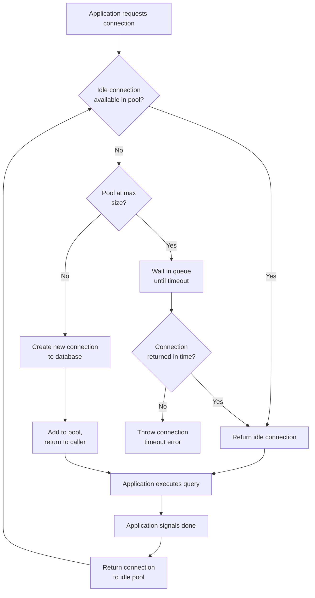

# [BEP-125] Connection Pooling and Query Optimization

:::info
Reduce database overhead through connection reuse and eliminate inefficient query patterns before they reach production.
:::

## Context

Every database connection has real cost. PostgreSQL spawns a new backend process per connection — typically 5–10 MB of memory each, plus authentication handshake time on every new TCP connection. At low traffic this is imperceptible; at scale it becomes a hard ceiling. A service receiving 500 requests per second that opens a fresh connection for each request will exhaust `max_connections` (default 100 in PostgreSQL) almost immediately, causing connection refused errors under load.

Query efficiency compounds the problem. An application that issues 101 queries to fetch what could be done in 1 is burning CPU, network round-trips, and connection hold time on every request. Both problems — connection overhead and query inefficiency — are preventable with known patterns.

**References:**
- [PgBouncer official documentation](https://www.pgbouncer.org/features.html)
- [Use The Index, Luke — SQL Performance Explained](https://use-the-index-luke.com/)
- [Understanding N+1 Database Queries — Scout APM](https://www.scoutapm.com/blog/understanding-n1-database-queries)

## Principle

> Reuse connections through a pool sized to your actual concurrency, and design queries that do exactly one job — no more, no less.

---

## Connection Pooling

### Why pooling matters

Establishing a database connection involves:

1. TCP three-way handshake
2. SSL/TLS negotiation (if enabled)
3. PostgreSQL authentication (md5, scram-sha-256, etc.)
4. Backend process fork on the server

This overhead is typically 5–20 ms. At 500 req/s, spending 10 ms per connection establishment burns 5 seconds of latency budget per second — before any query runs.

A connection pool maintains a set of already-established connections and hands them out to application threads on demand, returning them when the transaction (or session) completes.

### Pool sizing: Little's Law

The correct pool size is not "as large as possible." Oversizing a pool overwhelms the database with concurrent backend processes competing for CPU and shared buffer locks, degrading throughput.

**Little's Law** applied to connection pools:

```
pool_size = avg_concurrent_queries * avg_query_time_in_seconds
```

Example: if your service has 20 concurrent in-flight queries at any given time and each query takes 50 ms on average:

```
pool_size = 20 * 0.05 = 1 connection
```

In practice, add headroom for spikes. A reasonable starting formula:

```
pool_size = (num_cpu_cores * 2) + effective_spindle_count
```

This is the guideline used by HikariCP (Java) and recommended by the pgBouncer documentation. For most web services, a pool of 10–20 connections per application instance is sufficient.

### Connection pool modes

PgBouncer (the most widely deployed external PostgreSQL pooler) supports three modes:

| Mode | Server connection held for | Use case |
|---|---|---|
| **Session** | Duration of client session | Applications that use session-level features (temp tables, advisory locks, `SET` statements) |
| **Transaction** | Duration of one transaction | Most web applications — highest connection reuse |
| **Statement** | Duration of one statement | Enforces autocommit; breaks multi-statement transactions; rarely used |

**Transaction mode** is the sweet spot for HTTP services. The server connection is returned to the pool the moment `COMMIT` or `ROLLBACK` completes, so a pool of 20 server connections can serve hundreds of concurrent application connections.

**Caution:** Transaction mode breaks session-level PostgreSQL features. You cannot use `SET LOCAL` that persists across transactions, prepared statements (by name), advisory locks held across transactions, or `LISTEN`/`NOTIFY` in transaction mode.

### External poolers vs. application-level pools

| | Application-level pool (e.g., HikariCP, pgx pool) | External pooler (PgBouncer) |
|---|---|---|
| Scope | Per application process | Shared across all processes/pods |
| Overhead | Low (in-process) | Slight network hop |
| Connection count | `instances * pool_size` connections to DB | Fixed server-side connections regardless of instance count |
| Best for | Single-process services, microservices with low instance count | High-instance-count deployments, serverless, languages without good pool libraries |

In Kubernetes environments with many pod replicas, an external pooler is often essential. 50 pods each with a 10-connection pool = 500 database connections, which can exceed `max_connections` and destabilize the cluster.

### Connection pool lifecycle



---

## The N+1 Query Problem

### Definition

The N+1 problem occurs when code executes 1 query to fetch a list of N records, then executes N additional queries to fetch related data for each record — totaling N+1 round-trips to the database.

### Concrete example

**Scenario:** Display 100 orders with each customer's name.

**Naive ORM code (pseudo-code):**

```python
orders = db.query("SELECT id, customer_id, total FROM orders LIMIT 100")
# 1 query

for order in orders:
    customer = db.query("SELECT name FROM customers WHERE id = ?", order.customer_id)
    # 1 query * 100 orders = 100 queries
    print(f"{order.id}: {customer.name} — ${order.total}")
```

**Query count:** 1 + 100 = **101 queries**

**The fix — JOIN:**

```sql
SELECT o.id, o.total, c.name
FROM orders o
JOIN customers c ON c.id = o.customer_id
LIMIT 100;
```

**Query count:** **1 query**

**Alternative fix — IN clause batch load:**

```sql
-- Step 1: fetch orders (1 query)
SELECT id, customer_id, total FROM orders LIMIT 100;

-- Step 2: fetch all related customers in one query (1 query)
SELECT id, name FROM customers
WHERE id IN (42, 17, 88, ...);  -- all 100 customer IDs
```

**Query count:** **2 queries**

The IN-clause pattern (sometimes called the DataLoader pattern, popularized by Facebook's GraphQL DataLoader) is useful when a JOIN is not practical — for example when the two entities come from different services or databases.

### Detection

N+1 queries are often invisible during development (small datasets, fast local DB) but catastrophic in production. Detection methods:

- **ORM query logging:** Enable SQL logging and scan for repeated query patterns with incrementing IDs.
- **APM tools:** Scout APM, Datadog APM, New Relic flag N+1 patterns automatically.
- **Slow query log:** If individual queries are fast but count is high, check for repeated patterns.
- **Bullet gem (Rails):** Notifies in development when N+1 or unused eager loads are detected.

---

## Reading EXPLAIN Plans

Before optimizing a query, read its execution plan:

```sql
EXPLAIN ANALYZE
SELECT o.id, o.total, c.name
FROM orders o
JOIN customers c ON c.id = o.customer_id
WHERE o.created_at > NOW() - INTERVAL '30 days';
```

Key nodes to understand:

| Node type | Meaning |
|---|---|
| `Seq Scan` | Full table scan — acceptable on small tables, a warning sign on large ones |
| `Index Scan` | Uses an index to find rows; generally efficient |
| `Index Only Scan` | All needed columns are in the index; fastest possible read |
| `Hash Join` / `Nested Loop` | Join algorithms; Nested Loop with an index on the inner table is often optimal |
| `Sort` | Requires sorting; can be eliminated by an index on the ORDER BY column |

Look at **rows** (estimated vs. actual) and **cost** values. A large discrepancy between estimated and actual rows indicates stale statistics — run `ANALYZE` on the table.

:::tip Deep Dive
For database-level query optimization and execution plan analysis, see [DDP Query and Performance series](https://alivedise.github.io/database-design-principles/200).
:::

---

## Query Optimization Strategies

### 1. Avoid SELECT *

```sql
-- Bad: fetches all columns, prevents Index Only Scan, increases network transfer
SELECT * FROM users WHERE id = 42;

-- Good: fetch only what you need
SELECT id, email, display_name FROM users WHERE id = 42;
```

`SELECT *` prevents the optimizer from using covering indexes. It also transfers unnecessary data across the network and into application memory.

### 2. Push filtering to the database

```sql
-- Bad: fetch all, filter in application
orders = db.query("SELECT * FROM orders")
recent = [o for o in orders if o.created_at > thirty_days_ago]

-- Good: filter in SQL
SELECT id, total FROM orders
WHERE created_at > NOW() - INTERVAL '30 days';
```

The database can use indexes on the filter column. The application layer cannot.

### 3. Use indexes on filter and join columns

Columns that appear in `WHERE`, `JOIN ON`, and `ORDER BY` clauses are candidates for indexing. See **BEP-121** for indexing strategy.

### 4. Limit result sets

```sql
-- Always paginate large result sets
SELECT id, title FROM articles
ORDER BY published_at DESC
LIMIT 20 OFFSET 0;
```

Use keyset pagination (`WHERE id < last_seen_id`) over offset pagination for large datasets — `OFFSET 10000` still requires the database to scan 10,000 rows before discarding them.

### 5. Use query parameterization

```sql
-- Good: parameterized query (plan can be cached)
SELECT * FROM users WHERE email = $1;

-- Bad: string interpolation (new plan for every unique email)
SELECT * FROM users WHERE email = 'user@example.com';
```

Parameterized queries allow the database to cache execution plans, reducing planning overhead on repeated queries.

---

## Common Mistakes

| Mistake | Consequence | Fix |
|---|---|---|
| New connection per request (no pooling) | Connection overhead dominates response time; DB runs out of connections | Add application-level pool or external pooler |
| Pool too large | DB overwhelmed with concurrent backends; lock contention increases | Size pool with Little's Law; start with `(cores * 2) + spindles` |
| Not returning connections to pool | Connection leak; pool exhausted; application hangs | Use try/finally or connection context managers; enable pool timeout alerts |
| N+1 queries in ORM code | 100x–1000x more queries than necessary | Eager load with JOIN or batch with IN clause |
| `SELECT *` when only 2 columns needed | Prevents covering indexes; excess data transfer | Select explicit columns |

---

## Related BEPs

- **BEP-121** — Database Indexing Strategies: which columns to index and how
- **BEP-301** — Resource Management: connection lifecycle and cleanup patterns
- **BEP-303** — Profiling and Observability: detecting slow queries and N+1 in production
