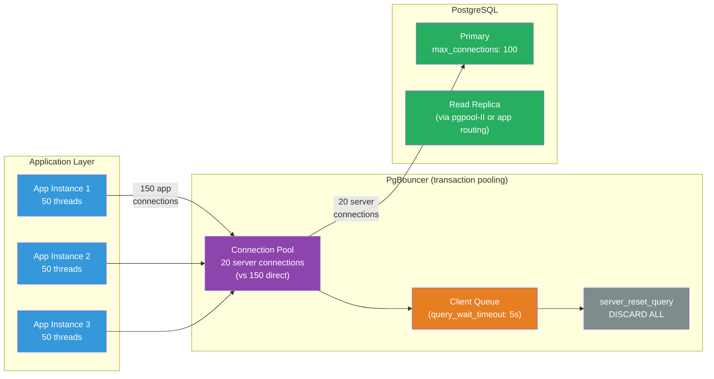

# [BEE-481] Database Connection Proxy and Pooler Architecture

:::info
A database connection proxy sits between application instances and the database, maintaining a small pool of long-lived server connections that many application threads share — converting the O(application_instances × threads) connection count that would overwhelm the database into the O(database_cores) count the database was designed for.
:::

## Context

Every TCP connection to PostgreSQL spawns a backend process (before PG 17's Walsender refactoring made it cheaper). Each process consumes memory, a file descriptor, and CPU time for context switching — even when idle. PostgreSQL's default `max_connections = 100` is not a soft suggestion; it is the hard limit at which new connections are refused. A system with 10 application pods each running 50 threads, each holding a connection, needs 500 connections — five times the default, and already showing degraded throughput from lock contention in the process scheduler.

Connection poolers solve this by decoupling application-side connection count from database-side connection count. The application talks to the pooler; the pooler maintains a small number of long-lived server connections and assigns them to application requests as needed. The database sees only the pooler's connections. This pattern was known at scale by 2010 and became essential infrastructure alongside the rise of stateless microservices, where every service replica opens its own connection pool.

A connection **proxy** generalizes pooling with additional features: query routing (directing reads to replicas and writes to the primary), protocol-aware logic (rewriting queries, enforcing timeouts), and managed connectivity (AWS RDS Proxy integrates IAM secrets management). The boundary between pooler and proxy is blurry — PgBouncer is a pure pooler; ProxySQL and pgpool-II are proxies.

## Design Thinking

### Pooling Mode vs Feature Trade-offs

The pooling mode determines what session state can be used:

| Mode | Connection returned to pool | Session state preserved | Practical limit |
|---|---|---|---|
| **Session** | On client disconnect | Full session state | Barely better than direct connections for long-lived apps |
| **Transaction** | On COMMIT / ROLLBACK | None (resets between transactions) | Cannot use `SET` (non-LOCAL), advisory locks, `LISTEN`, or `PREPARE` (pre-1.21) |
| **Statement** | After each statement | None | Cannot use multi-statement transactions; autocommit effectively enforced |

**Transaction pooling** is the sweet spot for most web applications: each web request typically runs one transaction, so the connection is returned to the pool on every request boundary. This provides the highest multiplexing ratio. The constraint — no persistent session state — matches stateless web service design.

**Statement pooling** is used for analytics queries where each statement is self-contained and maximum connection reuse is worth the transaction restriction.

### Pooler vs Feature-Rich Proxy

| | PgBouncer | pgpool-II | ProxySQL | RDS Proxy |
|---|---|---|---|---|
| Database | PostgreSQL | PostgreSQL | MySQL/MariaDB | AWS RDS/Aurora |
| Protocol parsing | None | Full SQL | Full SQL | Partial |
| Read/write split | No | Yes | Yes | No |
| Connection pooling | Yes | Yes | Yes | Yes |
| Overhead | Minimal | Higher | Medium | Managed |
| Prepared statements | Since 1.21 | Limited | Yes | Yes |

Choose **PgBouncer** when you only need pooling — it is the lowest-latency option. Choose **pgpool-II** when you also need load balancing across replicas. Choose **RDS Proxy** for serverless workloads (Lambda) or when IAM-based credential management is a requirement. Choose **ProxySQL** for MySQL when query routing rules and read/write splitting are needed.

### Sizing the Pool

The counterintuitive result from HikariCP's research (and the PostgreSQL community): a smaller pool with a queue often outperforms a larger pool. The reason is CPU context switching — when there are more active threads than CPU cores, context switching overhead exceeds the parallelism benefit.

**Starting formula** (from HikariCP's "About Pool Sizing"):
```
pool_size = (2 × number_of_database_cores) + effective_spindle_count
```
For a 4-core database server: `(2 × 4) + 1 = 9 connections`. Not 100. Not 500.

For the application side: divide `max_connections` minus a safety margin (10 for admin tools) evenly across pooler instances. With `max_connections = 200` and 4 pooler instances: 47 server connections each.

## Best Practices

**MUST use transaction pooling mode (not session pooling) for stateless web services.** Session pooling provides minimal multiplexing benefit for services that close connections between requests. Transaction pooling returns the server connection at every transaction boundary, enabling a single server connection to serve hundreds of application threads.

**MUST use `SET LOCAL` instead of `SET` when setting session variables in transaction pooling mode.** `SET LOCAL` resets at transaction end. `SET SESSION` (or bare `SET`) persists on the server connection and leaks to the next client that gets that connection. This is a silent correctness bug: tenant ID, search path, or application name leaks to an unrelated request.

**MUST configure `server_reset_query = DISCARD ALL` in session pooling mode.** When a server connection is reassigned between clients in session pooling, residual state (prepared statements, temporary tables, advisory locks) can leak. `DISCARD ALL` clears all session state. In transaction pooling mode, this is unnecessary because connections reset at transaction boundaries.

**MUST account for the pooler in `max_connections` planning.** The pooler connects to the database as a client. Reserve capacity: `max_connections = (pooler_connections × pooler_instances) + admin_reserve`. Do not set `max_connections` to the total application thread count — that defeats the purpose.

**SHOULD use named prepared statements via protocol-level prepared statements (not SQL `PREPARE`) in PgBouncer 1.21+** when transaction pooling is required. Configure `max_prepared_statements` in PgBouncer to enable statement tracking. Avoid SQL-level `PREPARE` statements in transaction pooling mode — PgBouncer cannot intercept them, and they will fail across connection reassignments.

**SHOULD set `query_wait_timeout` in PgBouncer to a value aligned with your application's request timeout.** When the pool is exhausted, clients queue. A request that waits longer than the HTTP timeout is wasting queue space — it will be abandoned client-side even if eventually served. Setting `query_wait_timeout` shorter than the client timeout causes PgBouncer to fail the request fast rather than serve a stale response.

**SHOULD monitor pool saturation with `SHOW POOLS` in PgBouncer.** The `sv_idle` (idle server connections), `sv_used` (in use), `cl_waiting` (clients waiting for a connection), and `maxwait` (longest wait time) columns indicate pool health. Sustained `cl_waiting > 0` means the pool is undersized or the database is slow.

**MAY use RDS Proxy for AWS Lambda workloads.** Lambda instances open a new connection on each cold start. Without a proxy, a burst of Lambda invocations creates a burst of new database connections — the exact pattern databases handle worst. RDS Proxy maintains a warm connection pool that Lambda instances share, absorbing the burst.

## Visual



## Example

**PgBouncer configuration for transaction pooling:**

```ini
[databases]
; Route "myapp" database name to the actual PostgreSQL server
myapp = host=postgres-primary port=5432 dbname=myapp

[pgbouncer]
listen_addr = 0.0.0.0
listen_port = 5432

; Transaction pooling: connection returned to pool after COMMIT/ROLLBACK
pool_mode = transaction

; Maximum server connections per database/user pair
; Formula: (2 × db_cores) + 1, distributed across pooler instances
default_pool_size = 20

; Reserve pool for burst traffic — adds connections after reserve_pool_timeout
reserve_pool_size = 5
reserve_pool_timeout = 3.0

; Fail clients that wait longer than this (align with HTTP request timeout)
query_wait_timeout = 5

; In transaction pooling, server_reset_query is not needed
; (connections reset at transaction boundaries automatically)
; Use DISCARD ALL only in session pooling:
; server_reset_query = DISCARD ALL

; Prevent non-LOCAL SET commands from leaking between clients
; (advisory: application code must use SET LOCAL)
; track_extra_parameters = IntervalStyle, TimeZone  ; PgBouncer 1.20+

; Enable prepared statement tracking (PgBouncer 1.21+)
max_prepared_statements = 100

; Safety net for session pooling — clears prepared statements
; server_reset_query = DISCARD ALL

; Admin interface for monitoring
admin_users = pgbouncer
stats_users = monitoring

[users]
; Per-user pool size overrides
; analytics_user = pool_mode=statement pool_size=5
```

**Monitoring pool health — key metrics from `SHOW POOLS`:**

```sql
-- Connect to the PgBouncer admin interface
-- psql -h localhost -p 5432 -U pgbouncer pgbouncer

SHOW POOLS;
-- Key columns:
-- database   : database name
-- user       : user name
-- cl_active  : clients currently paired with a server connection
-- cl_waiting : clients waiting for a server connection (ALERT if > 0 sustained)
-- sv_active  : server connections in use
-- sv_idle    : server connections available in pool
-- maxwait    : longest wait time in seconds (ALERT if > 1s)

SHOW STATS;
-- total_query_count : queries processed since start
-- avg_query_time    : average query duration (microseconds)
-- avg_wait_time     : average wait time for a connection (microseconds)
```

**Application code — correct SET LOCAL usage in transaction pooling:**

```python
# db.py — safe session variable usage with transaction pooling
import psycopg
from contextlib import contextmanager

@contextmanager
def app_transaction(pool, app_name: str, tenant_id: int):
    """
    Sets session variables with SET LOCAL so they reset at transaction end.
    Critical for PgBouncer transaction pooling: SET (without LOCAL) would
    persist on the server connection and leak to the next client.
    """
    with pool.connection() as conn:
        with conn.transaction():
            # SET LOCAL: resets automatically when transaction ends
            # Safe: the server connection can be reused by the next client
            conn.execute("SET LOCAL application_name = %s", (app_name,))
            conn.execute("SET LOCAL app.current_tenant_id = %s", (str(tenant_id),))
            yield conn

# Usage
with app_transaction(pool, "orders-service", tenant_id=42) as conn:
    rows = conn.execute("SELECT * FROM orders").fetchall()
# Transaction committed; SET LOCAL values reset; connection returned to PgBouncer pool
```

**ProxySQL read/write split configuration (MySQL):**

```sql
-- ProxySQL admin interface
-- mysql -h 127.0.0.1 -P 6032 -u admin -padmin

-- Define hostgroups: 10 = primary (writes), 20 = replicas (reads)
INSERT INTO mysql_servers (hostgroup_id, hostname, port) VALUES
    (10, 'mysql-primary', 3306),
    (20, 'mysql-replica-1', 3306),
    (20, 'mysql-replica-2', 3306);

-- Query rules: SELECTs go to replicas (hostgroup 20), everything else to primary (10)
INSERT INTO mysql_query_rules (rule_id, active, match_pattern, destination_hostgroup, apply)
VALUES
    (1, 1, '^SELECT.*FOR UPDATE', 10, 1),  -- SELECT FOR UPDATE → primary
    (2, 1, '^SELECT', 20, 1);              -- all other SELECTs → replicas
    -- (no rule for writes → default hostgroup = 10, primary)

LOAD MYSQL SERVERS TO RUNTIME;
LOAD MYSQL QUERY RULES TO RUNTIME;
SAVE MYSQL SERVERS TO DISK;
SAVE MYSQL QUERY RULES TO DISK;
```

## Implementation Notes

**PgBouncer and prepared statements**: Before PgBouncer 1.21 (released 2024), named prepared statements were incompatible with transaction pooling. ORMs like Prisma, SQLAlchemy, and Django ORM use prepared statements internally. The workaround was to disable prepared statements in the ORM (e.g., `?prepared_statement_cache_queries=0` in Prisma's connection string). Since 1.21, set `max_prepared_statements = 100` to enable transparent protocol-level tracking. SQL-level `PREPARE` statements remain unsupported in transaction mode.

**Connection string target**: Applications connect to PgBouncer's host/port, not PostgreSQL directly. In Kubernetes, deploy PgBouncer as a sidecar or as a shared service (DaemonSet or Deployment). Sidecar minimizes network hops; shared service reduces total server-connection count.

**PgBouncer and TLS**: PgBouncer can terminate TLS from the application and maintain unencrypted connections to PostgreSQL on a private network, or pass TLS through. For compliance environments, configure `client_tls_sslmode = require` and `server_tls_sslmode = require`.

**pgBouncer auth**: In transaction pooling, each client authenticates to PgBouncer. PgBouncer can forward authentication to PostgreSQL (`auth_type = hba`) or use its own user database (`auth_file`). For large numbers of users, `auth_query` lets PgBouncer query PostgreSQL's `pg_shadow` table on demand.

**RDS Proxy pinning**: RDS Proxy supports transaction-level multiplexing for MySQL and PostgreSQL, but some operations "pin" the connection to a client for the session duration: SQL-level prepared statements, `SET` commands, temp tables, advisory locks. Monitor the `DatabaseConnectionsCurrentlySessionPinned` CloudWatch metric — high pinning indicates the application needs adjustment.

## Related BEEs

- [BEE-125](../Databases/125.md) -- Connection Pooling and Query Optimization: covers connection pooling from the application perspective and query-level optimization
- [BEE-302](../Performance/302.md) -- Connection Pooling and Resource Management: covers pool sizing theory and resource management at the application layer
- [BEE-476](../Multi-Tenancy/476.md) -- Database Row-Level Security: `SET LOCAL app.current_tenant_id` must be used (not bare `SET`) when RLS relies on session variables in a PgBouncer transaction pooling environment
- [BEE-453](../Distributed Systems/453.md) -- Graceful Shutdown and Connection Draining: the pooler layer must drain connections gracefully during deployment to avoid in-flight transaction loss

## References

- [PgBouncer Configuration — pgbouncer.org](https://www.pgbouncer.org/config.html)
- [PgBouncer FAQ — pgbouncer.org](https://www.pgbouncer.org/faq.html)
- [About Pool Sizing — HikariCP](https://github.com/brettwooldridge/HikariCP/wiki/About-Pool-Sizing)
- [ProxySQL Read/Write Split — proxysql.com](https://www.proxysql.com/documentation/proxysql-read-write-split-howto/)
- [Amazon RDS Proxy — AWS Documentation](https://docs.aws.amazon.com/AmazonRDS/latest/UserGuide/rds-proxy.howitworks.html)
- [max_connections — PostgreSQL Documentation](https://www.postgresql.org/docs/current/runtime-config-connection.html)
