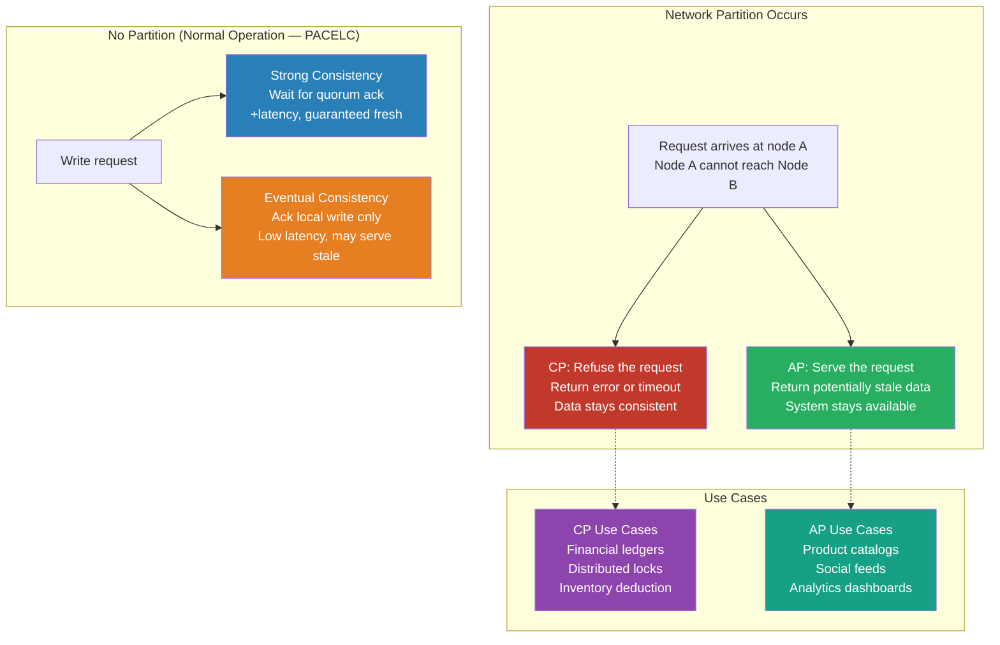

# [BEE-420] CAP Theorem and the Consistency-Availability Tradeoff

:::info
The CAP theorem proves that a distributed system facing a network partition must choose between returning a consistent answer and returning any answer at all — and understanding what that choice actually entails is prerequisite to reasoning correctly about databases, caches, queues, and every other distributed component.
:::

## Context

In July 2000, Eric Brewer — then a UC Berkeley professor and co-founder of Inktomi — presented a conjecture at the ACM Symposium on Principles of Distributed Computing: that distributed systems cannot simultaneously guarantee **Consistency**, **Availability**, and **Partition tolerance**. Two years later, Seth Gilbert and Nancy Lynch of MIT formally proved the conjecture, publishing their proof in *ACM SIGACT News* (2002) under the title "Brewer's Conjecture and the Feasibility of Consistent, Available, Partition-Tolerant Web Services." The theorem entered the engineering mainstream and became the most frequently cited framework for reasoning about distributed database trade-offs.

The three properties as Gilbert and Lynch defined them:

- **Consistency** (in CAP's sense, meaning *linearizability*): every read returns the most recently written value. From any client's perspective, the system behaves as if it were a single machine executing operations one at a time in a total order.
- **Availability**: every request sent to a non-failing node receives a response — the system never returns an error and never hangs indefinitely.
- **Partition tolerance**: the system continues operating correctly even when an arbitrary number of messages between nodes are dropped or delayed.

The "pick two" framing that followed — CA, CP, or AP — proved enormously influential and equally misleading. Brewer's own retrospective in *IEEE Computer* (2012), "CAP Twelve Years Later: How the 'Rules' Have Changed," walked back the framing. The problem: **partition tolerance is not optional**. Any system spread across more than one machine can experience a network partition — a real-world event caused by failed switches, misconfigured firewalls, or datacenter splits. A CA system that simply assumes partitions never happen is not a distributed system; it is a single node. The real question is not which two of three properties to pick, but rather: **when a partition occurs, do you sacrifice consistency or availability?** During normal operation — when no partition is active — a well-designed system can provide both.

Martin Kleppmann's 2015 paper "A Critique of the CAP Theorem" (arXiv:1509.05393) identified further limitations: the theorem's definitions are ambiguous enough that it is hard to apply rigorously, it says nothing about the trade-offs during normal operation, and it has been widely misused to justify architectural decisions it cannot actually support.

Daniel Abadi's **PACELC model** (IEEE Computer, 2012) addresses the gap. PACELC extends CAP by adding a second decision axis: when there is no partition (the normal case, labeled "E" for Else), the system must still choose between **Latency** (L) and **Consistency** (C). Strong consistency requires replicas to coordinate before confirming a write, which adds latency. Weaker consistency models skip that coordination, reducing latency at the cost of the possibility of stale reads. The consistency-latency trade-off exists at all times; the consistency-availability trade-off only surfaces during partitions. For most production systems, the everyday latency trade-off has more design impact than the rare-partition trade-off.

One persistent confusion conflates **CAP consistency** with **ACID consistency**. They are unrelated. ACID consistency is an application-level property: a transaction leaves the database in a valid state as defined by application constraints and business rules. CAP consistency is a systems-level property about replica synchronization: after a write completes, all subsequent reads from any node return that value. A system can have linearizable replication (CAP-C) and still violate business invariants if the application logic is wrong, and vice versa. Kleppmann's *Designing Data-Intensive Applications* (O'Reilly, 2017) is explicit on this point.

## Design Thinking

**Start with the partition question, not the database label.** The CP/AP taxonomy applied to database products (Cassandra = AP, etcd = CP) obscures more than it reveals. Most production databases offer tunable consistency: Cassandra's consistency level `QUORUM` shifts it toward CP behavior; DynamoDB's strongly consistent reads do the same. The design question is: for *this specific operation*, what happens when a replica is unreachable?

**Partition tolerance is the floor, not a choice.** The decision tree is: assume partitions will occur (they will), then decide what the system should do during one. If the operation must return a correct answer or no answer (financial ledger, inventory deduction, distributed lock), the system should be CP for that operation. If the system must remain responsive and can tolerate eventually reconciling divergent state (user profile cache, product catalog, session affinity), AP is appropriate.

**Normal-operation latency often dominates.** The PACELC framing is more practically useful than CAP for many design decisions. A strongly consistent write that requires acknowledgment from a quorum of replicas across availability zones adds tens of milliseconds of latency on every write. For high-throughput systems, that cost may matter more than what happens during a partition that occurs once a month.

**Consistency is a spectrum.** The choices between linearizability, sequential consistency, causal consistency, and eventual consistency each represent a different trade-off between correctness guarantees and coordination cost. CAP conflates all weaker models into "not consistent." In practice, causal consistency — which ensures that causally related operations are observed in order without requiring global coordination — is often sufficient and significantly cheaper than linearizability.

## Best Practices

Engineers MUST distinguish between CAP consistency (linearizability) and ACID consistency (transaction correctness) when evaluating storage systems. Applying an AP database to a workload that requires transactional integrity will not simply produce stale reads — it may produce permanently inconsistent data that violates business invariants.

Engineers MUST NOT treat CP/AP as database-level properties that apply uniformly to all operations. Evaluate consistency requirements operation by operation. An AP database accessed with quorum reads behaves differently from the same database accessed with eventual consistency reads.

Engineers SHOULD use the PACELC lens — not just CAP — when evaluating latency-sensitive systems. During normal operation, the consistency-latency trade-off is always present. Strongly consistent reads from cross-region replicas can add 50–150 ms of latency that affects every request, not just requests during a partition event.

Engineers SHOULD design for partial availability when choosing AP behavior. Accepting inconsistency during a partition is only safe when the system also implements conflict detection and resolution — last-write-wins, vector clocks, application-level merge functions, or CRDTs (conflict-free replicated data types). Accepting inconsistency without a resolution strategy produces permanently divergent state.

Engineers MUST NOT assume that "eventually consistent" means "eventually correct." Eventual consistency guarantees convergence only if writes eventually stop — in active systems, convergence requires explicit conflict resolution. The choice of conflict resolution strategy (last-write-wins, application-level merge, CRDT) is a correctness decision, not an implementation detail.

Engineers SHOULD prefer CP behavior for operations that modify shared state in ways that are difficult or impossible to reverse: financial transactions, inventory deductions, user provisioning, distributed lock acquisition. The unavailability cost of CP during a partition — which is rare and bounded — is preferable to data corruption that may be permanent.

Engineers MAY choose AP behavior for read-heavy workloads where the cost of stale data is bounded and understood: social media feeds, product catalog reads, recommendation results, analytics dashboards. Document the staleness bound explicitly so that dependent services can make informed decisions.

## Visual



## Example

**Diagnosing a real trade-off — distributed inventory deduction:**

```
Scenario: Two warehouse nodes share inventory. Item has qty=1.
Two orders arrive simultaneously at different nodes.

AP behavior (last-write-wins, no coordination):
  Node A: reads qty=1, deducts → qty=0, writes to Node A
  Node B: reads qty=1, deducts → qty=0, writes to Node B
  Partition heals: both wrote qty=0 → reconcile with LWW
  Result: one order may be unfulfilled, or qty goes negative
  Problem: overselling — real economic harm

CP behavior (linearizable write, quorum required):
  Node A: reads qty=1, attempts deduct
  Node A requests quorum from Node B → partition → Node B unreachable
  Node A: returns error "could not confirm write"
  Order fails, customer sees error, can retry later
  Result: no oversell, bounded availability failure

Conclusion: inventory deduction MUST be CP.
  Accept the availability cost — unavailability is recoverable,
  overselling may not be.

Counter-example — product catalog read:
  Node A returns product details from 30 seconds ago (stale)
  Price shown may differ from actual price by a few cents
  Acceptable: user proceeds, checkout recalculates from authoritative source
  Result: catalog reads are safely AP; checkout must be CP
```

**Tuning consistency level per operation (pseudo-code):**

```python
# Catalog reads: AP, low latency acceptable
product = db.read("product:42",
                  consistency=EVENTUAL)   # serve from nearest replica

# Order creation: CP, correctness required
with db.transaction(consistency=STRONG):  # quorum write required
    inventory = db.read("inventory:42", consistency=STRONG)
    if inventory.qty < order.qty:
        raise InsufficientInventoryError
    inventory.qty -= order.qty
    db.write("inventory:42", inventory)
    db.write("order:new", order)
```

## Related BEEs

- [BEE-160](160.md) -- ACID Properties: ACID consistency is application-level correctness; CAP consistency is replication synchronization — distinct concepts
- [BEE-161](161.md) -- Isolation Levels: isolation levels govern what concurrent transactions see; CAP governs what distributed replicas return
- [BEE-162](162.md) -- Distributed Transactions and Two-Phase Commit: 2PC is a CP protocol — it halts rather than permit inconsistency during coordinator failure
- [BEE-165](165.md) -- Eventual Consistency Patterns: implementation strategies for AP systems, including conflict resolution and CRDT approaches
- [BEE-203](203.md) -- Distributed Caching: caches are inherently AP — understanding CAP explains why cache invalidation is hard
- [BEE-122](122.md) -- Replication Strategies: synchronous vs asynchronous replication is the physical mechanism underlying the CP/AP choice

## References

- [Brewer's Conjecture and the Feasibility of Consistent, Available, Partition-Tolerant Web Services -- Gilbert & Lynch, ACM SIGACT News 2002](https://dl.acm.org/doi/10.1145/564585.564601)
- [CAP Twelve Years Later: How the "Rules" Have Changed -- Eric Brewer, IEEE Computer 2012](https://ieeexplore.ieee.org/document/6133253)
- [A Critique of the CAP Theorem -- Martin Kleppmann, arXiv:1509.05393](https://arxiv.org/abs/1509.05393)
- [Consistency Tradeoffs in Modern Distributed Database System Design: CAP is Only Part of the Story -- Daniel Abadi, IEEE Computer 2012](https://dl.acm.org/doi/10.1109/MC.2012.33)
- [The CAP FAQ -- Henry Robinson, The Paper Trail](https://www.the-paper-trail.org/page/cap-faq/)
- [Designing Data-Intensive Applications -- Martin Kleppmann (2017), O'Reilly](https://www.oreilly.com/library/view/designing-data-intensive-applications/9781491903063/)
