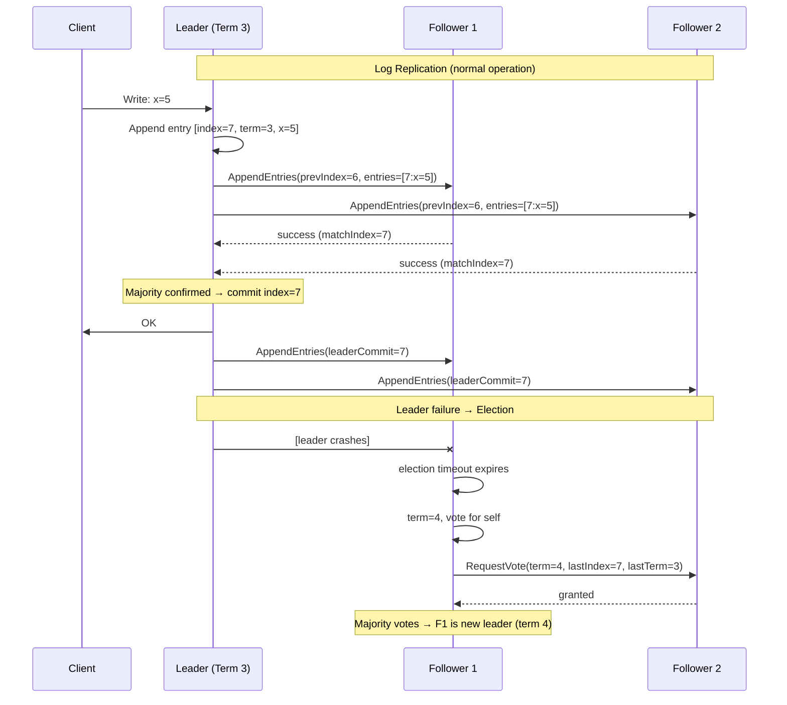

# [BEE-421] Consensus Algorithms: Paxos and Raft

:::info
Consensus algorithms allow a cluster of nodes to agree on a sequence of values despite node failures and network partitions — they are the mechanism that makes distributed systems act like a single reliable machine, and underpin every coordination service engineers depend on: etcd, ZooKeeper, and distributed databases.
:::

## Context

The consensus problem is deceptively simple to state: given N nodes that can communicate and fail independently, how do they agree on a single value? The naive answer — have one node decide and tell the others — fails if that node crashes before telling everyone. The problem resists simple solutions because nodes cannot distinguish "the other node crashed" from "the network dropped my message."

Leslie Lamport submitted the first rigorous solution in 1989, framed as a parable about a Greek parliament in a paper titled "The Part-Time Parliament." The paper was rejected at TOCS for being too whimsical; when finally published in *ACM Transactions on Computer Systems* in 1998, it remained difficult to parse. Lamport's own follow-up, "Paxos Made Simple" (2001), opened with the admission that the algorithm "is not at all obvious." The core idea: a proposer needs promises from a **majority** of acceptors before it can commit a value — and majority overlap guarantees that any two committed decisions share at least one acceptor, preventing contradictions.

Paxos defines three roles. A **Proposer** drives agreement by issuing proposals with monotonically increasing numbers. An **Acceptor** votes on proposals and persists its last promise to stable storage. A **Learner** receives the agreed-upon value once a quorum commits. In Phase 1 (Prepare/Promise), a Proposer broadcasts a prepare request with proposal number N; Acceptors promise to ignore anything below N and return any previously accepted value. In Phase 2 (Accept/Accepted), the Proposer sends the chosen value to Acceptors; once a majority accepts, the value is committed. **Multi-Paxos** extends this to replicate a log by electing a stable leader that can skip Phase 1 for subsequent entries.

The problem Paxos left unsolved was practical comprehensibility. Implementing Paxos correctly requires reasoning through subtle edge cases around leader changes, log gaps, and acceptor recovery — details the original paper left to the implementer. Diego Ongaro and John Ousterhout set out to design a replacement that was "understandable" as an explicit goal. Their paper "In Search of an Understandable Consensus Algorithm," presented at USENIX ATC 2014 (winning Best Paper), introduced **Raft**.

Raft decomposes consensus into three separable problems: **leader election**, **log replication**, and **safety**. Time is divided into **terms** — monotonically increasing integers that serve as logical clocks. Each term begins with an election. Every server is a follower by default, with a randomized **election timeout** (typically 150–300 ms). When a follower's timeout expires without hearing from a leader, it becomes a candidate, increments its term, votes for itself, and requests votes from peers. The first candidate to receive votes from a majority of servers becomes leader for that term. Randomized timeouts make split votes rare; when they occur, servers time out again with fresh random delays and quickly converge.

The leader handles all client writes. It appends each command to its local log and broadcasts an **AppendEntries** RPC to all followers. A log entry is **committed** once the leader has confirmed replication on a majority of nodes — at which point it is safe to apply to the state machine. The leader tracks `matchIndex[i]` (highest log entry confirmed replicated on server i) and `nextIndex[i]` (next entry to send to server i). Followers that fall behind receive backfill from the leader. The safety guarantee: if any server has applied a log entry at index I, no other server will ever apply a different command at that index. This is enforced by the election restriction — a candidate can only win if its log is at least as up-to-date as any node in the majority that votes for it.

## Design Thinking

**Consensus is a quorum game.** For a cluster of N nodes, commit requires ⌊N/2⌋ + 1 nodes (a majority). This means:
- 3 nodes: tolerates 1 failure (needs 2 to commit)
- 5 nodes: tolerates 2 failures (needs 3 to commit)
- 7 nodes: tolerates 3 failures (needs 4 to commit)

Adding nodes increases fault tolerance but also increases commit latency, since the leader must wait for more acknowledgments. Most production deployments use 3 or 5 nodes — 7 is rare except for very high availability requirements.

**Minority partitions are read-only at best.** When a network partition isolates a minority of nodes, those nodes cannot elect a leader (they lack a quorum). They cannot commit writes. If they were previously followers, they eventually expire their election timeouts and repeatedly fail to form a quorum — they make no progress. The majority partition elects a new leader and continues serving. When the partition heals, minority nodes catch up from the new leader's log, discarding any uncommitted entries they held. This is CP behavior (BEE-420): the system sacrifices availability in the minority partition to maintain consistency.

**Leader elections mean brief unavailability.** When a leader crashes or a network partition removes it from the majority, followers detect the absence (no AppendEntries heartbeats within the election timeout) and start an election. This introduces a window of unavailability — typically one to two election timeout periods (300–600 ms at default settings). During this window, client writes are rejected or queued. Tuning election timeouts is a latency vs. detection speed tradeoff: shorter timeouts trigger elections faster after real failures but also trigger spurious elections under transient network jitter.

**Terms are the authoritative signal for leadership transitions.** Each message in Raft carries its sender's current term. When a node receives a message with a higher term than its own, it immediately steps down to follower and updates its term. This means log entries from a previous term — even committed ones — must be verified: a newly elected leader re-replicates the commit marker rather than assuming prior commits are visible to all followers.

## Best Practices

Engineers MUST NOT build production consensus from scratch. Correct implementations of Paxos and Raft have subtle correctness requirements (durable storage before promises, correct handling of term boundaries, log truncation on leadership change) that are difficult to verify and test. Use a battle-tested implementation: etcd for coordination, ZooKeeper for ordering guarantees, or a database with built-in replication.

Engineers MUST size consensus groups for the failure tolerance they need and no larger. A 3-node group tolerates 1 failure and commits with 2 acknowledgments. A 5-node group tolerates 2 failures and commits with 3. Adding a 4th node to a 3-node group does not increase fault tolerance (you still need 3 to commit) but does increase commit latency. Prefer odd-sized groups: even-sized groups provide no more fault tolerance than the odd number below them.

Engineers SHOULD understand that any strongly consistent read in a Raft cluster must go through the leader, or use a lease mechanism. A follower may not have seen the most recent committed entries. A linearizable read that contacts a follower can return stale data even in a healthy cluster. Most Raft-based systems route reads to the leader by default; check the configuration of whatever system you use.

Engineers SHOULD account for leader election latency in availability SLOs. If an etcd or ZooKeeper cluster is behind a service and the consensus leader crashes, clients will see failures for 150–600 ms (default election timeout range) while a new leader is elected. Design retry logic with appropriate backoff to survive this window.

Engineers MUST configure consensus cluster membership changes through the consensus protocol itself, not by stopping and restarting nodes with different membership lists. Adding or removing nodes changes the quorum calculation; if done inconsistently, two separate majorities can form (split-brain). Raft's joint consensus mechanism and etcd's cluster management API handle this safely.

Engineers SHOULD monitor term numbers and leader election frequency as health signals. A rapidly increasing term number indicates repeated failed elections — network instability, resource exhaustion, or clock skew. A stable cluster in steady state rarely changes leaders; frequent leadership changes are a symptom, not normal behavior.

## Visual



## Example

**What quorum math looks like in practice:**

```
Cluster: 5 nodes (A, B, C, D, E)
Fault tolerance: 2 failures (needs 3 to commit)

Scenario: A is leader, writes x=5
  A → B: replicate x=5     B confirms ✓
  A → C: replicate x=5     C confirms ✓  ← majority reached (A+B+C = 3)
  A → D: replicate x=5     D [slow, not yet acked]
  A → E: replicate x=5     E [slow, not yet acked]
  → A commits x=5. Client gets OK.

Scenario: Network partition {A, B} | {C, D, E}
  Partition 1 (minority): A (old leader), B
    → A cannot get 3 acknowledgments → writes block
    → A's leadership expires as C, D, E elect new leader
  Partition 2 (majority): C, D, E
    → C wins election (term 4)
    → C, D, E can commit writes (3 = majority of 5)
    → Partition 1's clients must retry on Partition 2

  On heal:
    → A receives AppendEntries from C with term=4 > term=3
    → A immediately becomes follower, syncs C's log
    → Any uncommitted entries A held are discarded
```

## Related BEEs

- [BEE-420](420.md) -- CAP Theorem: consensus algorithms are the mechanism behind CP systems — they prefer halting to inconsistency
- [BEE-162](162.md) -- Distributed Transactions and Two-Phase Commit: 2PC is a coordinator-based protocol; consensus is quorum-based — both solve agreement but with different failure characteristics
- [BEE-203](203.md) -- Distributed Caching: distributed caches use consensus for shard leadership; understanding quorum explains cache availability behavior
- [BEE-265](265.md) -- Chaos Engineering: leader election fault tolerance is a natural chaos experiment — inject leader failures and verify client retry behavior

## References

- [The Part-Time Parliament -- Leslie Lamport, ACM Transactions on Computer Systems 1998](https://dl.acm.org/doi/10.1145/279227.279229)
- [Paxos Made Simple -- Leslie Lamport (2001)](https://lamport.azurewebsites.net/pubs/paxos-simple.pdf)
- [In Search of an Understandable Consensus Algorithm -- Ongaro & Ousterhout, USENIX ATC 2014](https://www.usenix.org/conference/atc14/technical-sessions/presentation/ongaro)
- [Raft Extended Paper -- Diego Ongaro](https://raft.github.io/raft.pdf)
- [Raft Official Site -- raft.github.io](https://raft.github.io/)
- [Managing Critical State: Distributed Consensus for Reliability -- Google SRE Book](https://sre.google/sre-book/managing-critical-state/)
