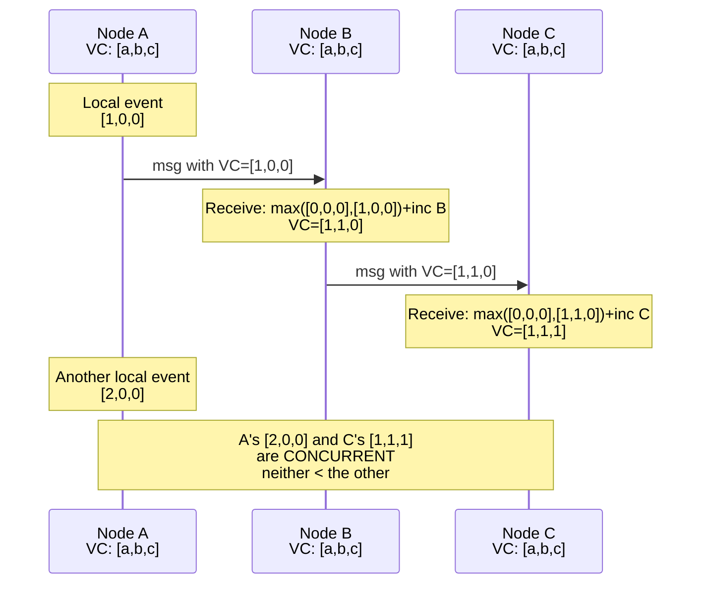

# [BEE-422] Vector Clocks and Logical Timestamps

:::info
Logical timestamps give distributed systems a way to track causality — which event happened before which — without relying on synchronized physical clocks, solving the fundamental problem that wall-clock time cannot establish event ordering across independent nodes.
:::

## Context

Physical clocks cannot be trusted to order events in a distributed system. Even with NTP synchronization, clocks across machines drift by tens to hundreds of milliseconds under typical internet conditions. A message sent at physical time T=100ms on node A may arrive at node B, which records T=99ms because its clock runs slightly behind. The received event would appear, by wall-clock ordering, to have preceded the message that caused it. This is not a configuration problem to tune away; it is a fundamental property of asynchronous networks without atomic clock hardware.

In 1978, Leslie Lamport published "Time, Clocks, and the Ordering of Events in a Distributed System" in *Communications of the ACM* (DOI: 10.1145/359545.359563) — a paper that won the PODC Influential Paper Award in 2000 and the ACM SIGOPS Hall of Fame in 2007. Lamport's contribution was not a faster clock but a different abstraction: **logical time**. He defined the **happens-before** relation (written →): event a happens-before event b if (1) a and b are in the same process and a precedes b, (2) a is the sending of a message and b is its receipt, or (3) a → c and c → b for some event c. Two events are **concurrent** if neither happens-before the other — no causal relationship connects them.

Lamport's **logical clock** (now called a Lamport timestamp) assigns an integer to each event such that if a→b then LC(a) < LC(b). The algorithm: every process maintains a counter, initializing it to 0. Before recording a local event, increment the counter. When sending a message, attach the current counter. On receiving a message with timestamp T, set the local counter to max(local, T) + 1. This guarantees that causally related events are ordered correctly. The limitation: the converse does not hold. If LC(a) < LC(b), you cannot conclude a→b. Two concurrent events on different nodes can have any relative Lamport timestamp ordering — the timestamps do not detect concurrency.

**Vector clocks** close this gap. Colin Fidge (1988) and Friedemann Mattern (1989) independently developed the same idea: instead of a single counter, each node maintains a vector of counters, one per node in the system. Node i's vector clock VC has VC[i] as its own slot. The algorithm: on a local event, increment VC[i]. When sending, include the full vector. On receiving a vector VC', take the pairwise maximum of all components, then increment own slot. Now the full causality relation is recoverable: VC(a) < VC(b) — meaning all components of a are ≤ the corresponding components of b, with at least one strictly less — if and only if a→b. If neither VC(a) < VC(b) nor VC(b) < VC(a), the events are concurrent. The timestamp encodes all the causal information in the system's history.

Amazon's Dynamo paper (DeCandia et al., SOSP 2007) brought vector clocks into mainstream distributed systems engineering. Dynamo uses them to detect conflicting writes: when two writes to the same key are concurrent — neither causally follows the other — Dynamo returns both versions to the client for application-level reconciliation rather than silently discarding one. This was a deliberate design choice: prefer exposing conflicts over losing data through last-write-wins, which silently discards the causally earlier write whenever clock skew inverts the physical timestamp order.

**Hybrid Logical Clocks (HLC)**, introduced by Kulkarni et al. in 2014, combine logical and physical time. An HLC timestamp is a pair (l, c) where l is derived from the physical clock and c is a logical counter. HLC values stay close to wall-clock time while preserving the causal ordering property: HLC(a) < HLC(b) implies a→b. CockroachDB uses HLC with a configurable `max_offset` (default 500 ms, recommended 250 ms with good NTP); if clock skew exceeds 80% of `max_offset`, the node shuts itself down to prevent consistency violations.

## Design Thinking

**Causality is the property; time is just one mechanism.** The goal is to answer "could event a have influenced event b?" Physical timestamps answer this question unreliably in distributed systems. Lamport timestamps answer it one-way. Vector clocks answer it precisely. The cost of vector clocks is size: the vector grows linearly with the number of nodes, which becomes impractical at very large scale. Systems with thousands of nodes use approximations: version vectors (which track causal dependencies per replica, not per node), dotted version vectors (which Riak adopted in v2.0 to avoid sibling explosion), or HLC (which amortizes the cost by keeping timestamps close to physical time and treating skew as bounded).

**Concurrency is a fact, not an error.** When a distributed system detects that two events are concurrent — neither causally precedes the other — the correct response depends on the semantics of the operation. For counters, concurrent increments can be merged by summing. For last-writer-wins registers, concurrent writes are inherently ambiguous and one will be discarded. For shopping carts, concurrent additions from different devices should both be retained. The system design choice is: detect concurrency (requires vector clocks or equivalent), then decide what to do about it (application-specific). Systems that skip detection lose data silently; systems that detect but always last-write-win also lose data, just more explicitly.

**LWW is not safe without synchronized clocks.** Last-write-wins conflict resolution, where the write with the higher physical timestamp wins, is safe only if physical clocks are synchronized precisely enough that the winning timestamp is always the causally later write. In practice, with NTP skew of 10–100 ms, two concurrent writes separated by less than the skew will be ordered arbitrarily by LWW, with the causally earlier write potentially winning. This is a correctness failure, not a performance tradeoff.

## Visual



## Example

**Lamport clock vs. vector clock — detecting concurrent writes:**

```
Setup: 3 nodes A, B, C. Key K. Initial value K=0.

Node A writes K=10 at Lamport time 5.
Node B writes K=20 at Lamport time 3.

Lamport ordering: B's write (LC=3) appears to precede A's (LC=5).
But if the writes are concurrent, this order is an artifact of the counter,
not evidence of causality. LWW based on Lamport timestamps would keep K=10
and discard K=20 — but this is arbitrary, not correct.

With vector clocks:
  A's write:  VC_A = [5, 0, 0]  (A has had 5 events; B and C had 0 at send time)
  B's write:  VC_B = [0, 3, 0]  (B has had 3 events; A and C had 0 at send time)

  Is VC_A < VC_B?  [5,0,0] vs [0,3,0]
    Component 0: 5 > 0  → NOT VC_A < VC_B
  Is VC_B < VC_A?  [0,3,0] vs [5,0,0]
    Component 1: 3 > 0  → NOT VC_B < VC_A

  Conclusion: CONCURRENT. The system returns both values to the client.
  The client (or the data type's merge function) resolves the conflict.
  No data is silently discarded.
```

**Hybrid Logical Clock timestamp comparison:**

```
HLC timestamp = (physical_time_ms, logical_counter)

Node A: HLC = (1713000000100, 0)  — wall clock 100ms past epoch
Node B: HLC = (1713000000098, 1)  — wall clock 98ms (2ms behind A), counter=1

Comparison: (100, 0) > (98, 1) because 100 > 98.
→ A's event is assigned a later HLC, consistent with it happening after B's
  even though B's counter is higher.
→ HLC stays within max_offset of wall-clock time, so timestamps
  remain interpretable as approximate physical time.
```

## Related BEEs

- [BEE-420](420.md) -- CAP Theorem: vector clocks surface concurrency; what to do with concurrent writes is a CAP-level design decision (accept conflict and merge vs. refuse one write to stay consistent)
- [BEE-421](421.md) -- Consensus Algorithms: Raft uses term numbers as a form of logical clock — higher term always overrides lower, establishing a total order of leadership epochs
- [BEE-164](164.md) -- Idempotency and Exactly-Once Semantics: idempotency keys are a form of causal token — the sender controls the "this is the same event" assertion rather than relying on timestamp comparison
- [BEE-165](165.md) -- Eventual Consistency Patterns: CRDTs (conflict-free replicated data types) use vector-clock-like structures to merge concurrent updates without coordination

## References

- [Time, Clocks, and the Ordering of Events in a Distributed System -- Leslie Lamport, CACM 1978](https://dl.acm.org/doi/10.1145/359545.359563)
- [Dynamo: Amazon's Highly Available Key-Value Store -- DeCandia et al., SOSP 2007](https://www.allthingsdistributed.com/files/amazon-dynamo-sosp2007.pdf)
- [Virtual Time and Global States of Distributed Systems -- Friedemann Mattern, 1989](https://www.researchgate.net/publication/2949837_Virtual_Time_and_Global_States_of_Distributed_Systems)
- [Logical Physical Clocks and Consistent Snapshots in Globally Distributed Databases -- Kulkarni et al., 2014](https://cse.buffalo.edu/tech-reports/2014-04.pdf)
- [Living Without Atomic Clocks -- CockroachDB Engineering Blog](https://www.cockroachlabs.com/blog/living-without-atomic-clocks/)
- [Distributed Systems: Time -- Mikito Takada, mixu's distributed systems book](https://book.mixu.net/distsys/time.html)
