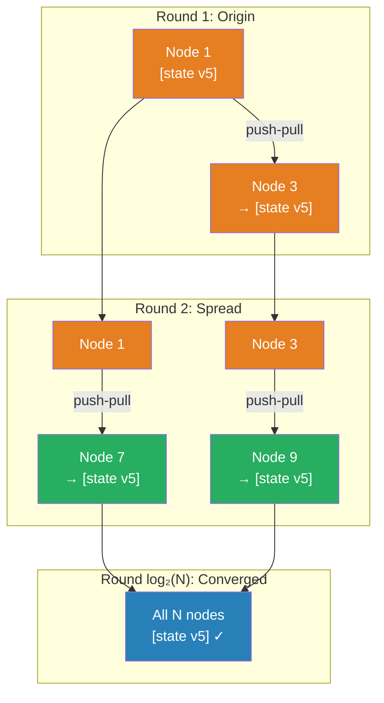

# [BEE-423] Gossip Protocols

:::info
Gossip protocols propagate state across a cluster by having each node periodically exchange information with a randomly chosen peer — achieving O(log N) convergence to all N nodes with no central coordinator, making them the primary mechanism for cluster membership, failure detection, and configuration propagation in large distributed systems.
:::

## Context

When a distributed cluster needs every node to know about every other node — who is alive, what data they own, what version they are running — the naive approach is to broadcast: every update goes to every node simultaneously. Broadcast requires O(N) messages per sender, and a single unreachable receiver breaks the guarantee. Worse, all-to-all heartbeating (every node monitors every other) requires O(N²) messages, which caps practical cluster size at roughly 100 nodes.

Alan Demers and colleagues at Xerox PARC proposed the solution in 1987, in a paper titled "Epidemic Algorithms for Replicated Database Maintenance" (ACM PODC 1987). The key insight was borrowed from epidemiology: information can spread through a population exponentially without any individual knowing the full population. Each infected node (one that has new state) contacts a random peer and transmits the update; the peer, now infected, does the same. After O(log N) rounds, all N nodes have received the update with probability approaching 1. The paper's authors called these "epidemic algorithms" — the same label that later became known as gossip protocols.

The gossip round itself is simple. Each node maintains a local view of cluster state — a map of node identifiers to versioned state records. Periodically (typically every 1 second in production systems), the node selects a random peer, executes an exchange, and updates its local map with anything fresher from the peer. Three exchange variants exist: **push** (sender transmits its state), **pull** (sender requests the peer's state), and **push-pull** (both directions in a single round). Push-pull converges fastest and is the variant used by Cassandra, Consul, and Redis Cluster.

The mathematical properties are favorable. Push-pull gossip reaches all N nodes in approximately O(log N) rounds. A cluster of 1,000 nodes converges in roughly 10 rounds; a cluster of 1,000,000 nodes in roughly 20. The total message count is O(N log N) per dissemination cycle — linear in cluster size rather than quadratic. These properties hold regardless of which node originates the update and require no topology knowledge beyond the ability to contact a random peer.

The SWIM protocol (Scalable Weakly-consistent Infection-style Membership), published by Das, Gupta, and Motivala at IEEE DSN 2002, extended basic gossip specifically for failure detection. Standard heartbeating requires O(N²) messages and produces false positives whenever network latency spikes. SWIM separates two concerns: detecting which nodes are down (using direct and indirect probing), and disseminating that information (using gossip). On each round, a node directly probes a random peer; if no response arrives within a timeout, it asks k other random nodes to probe the same peer. Only if both the direct and indirect probes fail does it mark the node as suspected — and only after a further suspicion timeout does it declare failure. HashiCorp's Lifeguard enhancement (2018, arXiv:1707.00788) added self-awareness (a degraded node reports its own health before peers detect it), reducing false positives by roughly 20× compared to vanilla SWIM.

Cassandra uses gossip for cluster membership and token ring information, integrated with the Phi Accrual Failure Detector (Hayashibara et al., 2004). Rather than a binary alive/dead judgment, the Phi detector maintains a sliding window of heartbeat inter-arrival times and computes a continuous suspicion score φ. When φ exceeds a configurable threshold (default 8, corresponding to roughly 99.5% confidence the node is down), the node is marked failed. The continuous score adapts automatically to slow networks — high-variance heartbeat timing raises the detection threshold rather than triggering false positives.

## Design Thinking

**Gossip is the right tool for eventual propagation, not for strong consistency.** It delivers state to all nodes *eventually* — convergence is probabilistic and takes O(log N) rounds. During those rounds, nodes hold different views of cluster state. This is acceptable for membership information (knowing a node is joining or leaving can lag by a second), failure detection (a brief window of uncertainty before marking a node failed), and configuration propagation (a rolling update of configuration values). It is not acceptable for coordination decisions that require all nodes to agree on a value at the same instant — use consensus (BEE-421) for that.

**Fanout and round interval are the primary tuning levers.** Fanout — the number of random peers contacted per round — directly controls how quickly information spreads but also controls network load. A fanout of 1 gives O(log N) convergence; higher fanout accelerates convergence at the cost of more messages per round. Round interval controls the latency-to-detection tradeoff: shorter intervals detect failures faster but produce more background traffic. Cassandra's defaults (fanout 1–3, round interval 1 second) balance these for clusters up to hundreds of nodes.

**Failure detection requires distinguishing transient unresponsiveness from actual failure.** A node that does not respond to a gossip probe may be: temporarily overloaded, experiencing a transient network event, paused for garbage collection, or actually crashed. Declaring failure immediately on a single missed response produces false positives that cascade into unnecessary rebalancing. The SWIM approach (suspect before declare) and the Phi approach (continuous score with threshold) both introduce a buffer between "not heard from recently" and "declared failed." The buffer size trades detection latency against false positive rate.

## Visual



## Example

**Gossip state exchange (push-pull, three-message pattern):**

```
# Cassandra-style gossip round between Node A (initiator) and Node B

Step 1 — Gossip Digest Syn (A → B, push):
  A sends its view of all known nodes with version numbers:
  {
    "node_a": { generation: 1700000000, version: 47 },
    "node_b": { generation: 1700000000, version: 31 },
    "node_c": { generation: 1700000000, version: 12 },
  }

Step 2 — Gossip Digest Ack (B → A, pull response):
  B compares A's versions with its own:
  - node_b: B has version 35 (newer) → B sends node_b's full state to A
  - node_c: B has version 12 (same) → nothing to send
  - node_d: B knows node_d; A doesn't → B sends node_d's full state to A
  B also replies with its own digest so A can fill gaps:
  {
    "node_b": { full state, version: 35 },
    "node_d": { full state, version: 8 },
    "digest": { "node_a": 47, "node_b": 35, "node_c": 12, "node_d": 8 }
  }

Step 3 — Gossip Digest Ack2 (A → B, push confirmation):
  A has node_a version 47; B's digest shows it has node_a version 47 → no update needed
  A does not know node_d → A updates its local state with node_d's full state from step 2

Result: A and B now have identical views of cluster state.
Next round, each contacts a different random peer and spreads the merged state further.

Convergence for 1000-node cluster: ~10 rounds × 1 second interval = ~10 seconds.
```

**Phi Accrual failure detection:**

```
# Node B tracks inter-arrival times of heartbeats from Node C
# Recent samples (seconds): [1.02, 0.98, 1.05, 0.99, 1.01]
# Mean ≈ 1.01s, std ≈ 0.025s

# Node C last heard from 2.5 seconds ago:
# φ = -log₁₀(P(arrival ≥ 2.5 | mean=1.01, std=0.025))
# P is very small → φ is large (≈ 12)

# φ > threshold (8.0) → Node C marked FAILED
# If Node C had been heard from 1.1 seconds ago:
# φ ≈ 0.2 → well below threshold → Node C is ALIVE

# If network is slow: recent samples = [2.1, 1.9, 2.3, 2.0, 2.2]
# Mean ≈ 2.1s → detector automatically adjusts expectation
# Node C not heard from for 3.0s: φ ≈ 1.5 → NOT marked failed
# (Same gap that would fail in fast network is acceptable in slow network)
```

## Related BEEs

- [BEE-421](421.md) -- Consensus Algorithms: Raft uses a leader-centric log replication model that requires quorum; gossip is decentralized and requires no quorum — complementary tools for different problems
- [BEE-420](420.md) -- CAP Theorem: gossip-based systems are AP — they remain available during partitions but nodes in separate partitions diverge until the partition heals
- [BEE-122](122.md) -- Replication Strategies: gossip propagates cluster metadata (who owns which partition); the replication strategy itself is a separate layer on top
- [BEE-265](265.md) -- Chaos Engineering: injecting random node failures into a gossip cluster and measuring detection latency is a direct test of the failure detection tuning

## References

- [Epidemic Algorithms for Replicated Database Maintenance -- Demers et al., ACM PODC 1987](https://dl.acm.org/doi/10.1145/43921.43922)
- [SWIM: Scalable Weakly-consistent Infection-style Process Group Membership -- Das, Gupta & Motivala, IEEE DSN 2002](https://www.cs.cornell.edu/projects/Quicksilver/public_pdfs/SWIM.pdf)
- [Lifeguard: Local Health Awareness for More Accurate Failure Detection -- arXiv:1707.00788](https://arxiv.org/pdf/1707.00788)
- [Making Gossip More Robust with Lifeguard -- HashiCorp Engineering Blog](https://www.hashicorp.com/en/blog/making-gossip-more-robust-with-lifeguard)
- [Internode Communications (Gossip) -- Apache Cassandra Documentation](https://docs.datastax.com/en/cassandra-oss/3.x/cassandra/architecture/archGossipAbout.html)
- [Redis Cluster Specification -- Redis Documentation](https://redis.io/docs/latest/operate/oss_and_stack/reference/cluster-spec/)
