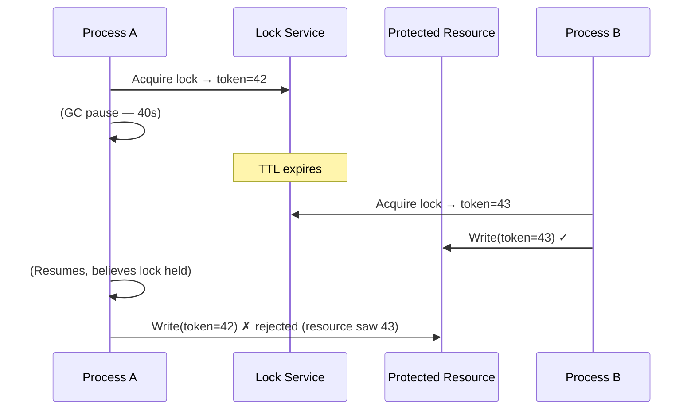

# [BEE-424] Distributed Locking

:::info
Distributed locking provides mutual exclusion across processes on separate machines — preventing concurrent writes to shared resources — but the core challenge is not acquiring the lock: it is ensuring that a process whose lock has silently expired cannot corrupt data it believes it still protects.
:::

## Context

On a single machine, OS mutexes are safe because the kernel controls the clock, process scheduling, and memory atomically. In a distributed system, none of those guarantees hold. A process can acquire a lock with a 30-second TTL, enter a garbage-collection pause for 40 seconds, resume believing it still holds the lock — and find that another process has already acquired it and begun writing. Both now believe they have exclusive access. This is not a theoretical edge case: GC pauses of this length are documented in production JVM workloads, and the same failure can be triggered by a VM live-migration, a kernel swap storm, or a NTP clock jump.

The GC-pause scenario illustrates the fundamental problem: **a lock is a time-bounded lease, and the leaseholder cannot observe its own lease expiry from the inside**. Any locking scheme that does not account for this produces a TOCTOU (time-of-check to time-of-use) gap.

Martin Kleppmann's 2016 post "How to do distributed locking" (see References) gives the canonical treatment of this problem. His proposed solution is the **fencing token**: each lock acquisition returns a monotonically increasing integer. The protected resource — a database row, a file, an external API — rejects any write whose token is lower than the highest token it has previously accepted. If process A holds token 33 and wakes after its lock expired, but process B already acquired the lock (token 34) and wrote with token 34, the resource will reject A's write with token 33. The resource, not the leaseholder, is the authority on who holds the lock.

The practical tiering of implementations runs from lightest to strongest consistency guarantee:

**Database advisory locks** are the simplest option when your application already uses a relational database. PostgreSQL provides `pg_advisory_lock(bigint)` (session-scoped, blocks until acquired) and `pg_advisory_xact_lock(bigint)` (transaction-scoped, released on commit/rollback). They require no external infrastructure, participate in connection pooling naturally, and are safe because the database server mediates all acquisition. The limitation is scope: only processes sharing the same database instance can participate. They do not implement fencing tokens.

**Redis single-instance locking** with `SET resource_name unique_random_value NX EX 30` atomically sets a key only if it does not exist, with a 30-second TTL. The value must be a unique random token (not a fixed string), and release must be done atomically via Lua:

```lua
if redis.call("get", KEYS[1]) == ARGV[1] then
    return redis.call("del", KEYS[1])
else
    return 0
end
```

The Lua script prevents the race where process A reads its value, decides it matches, but is preempted before deleting — and process B's lock is deleted instead. Single-instance Redis is appropriate when the Redis node is well-operated and you accept that a Redis failure means the lock service is unavailable. It does not provide fencing tokens.

**Redlock** is Redis's multi-node locking algorithm: acquire a majority (⌊N/2⌋ + 1 of N) of independent Redis nodes within a timing window. Kleppmann's 2016 critique demonstrates that Redlock's safety relies on timing assumptions — bounded network delays, bounded GC pauses, bounded NTP skew — that fail in practice. A network partition or clock jump can cause two clients to both believe they hold the lock. Antirez (Redis's creator) disputes this analysis, arguing that in practice the timing windows are safe. The debate is unresolved; the practical guidance is: if you need strong safety guarantees and the workload can tolerate it, use a consensus-based system instead.

**etcd leases** and **ZooKeeper ephemeral nodes** provide consensus-backed locking. etcd stores a lease with a TTL, refreshed by a `keepalive` goroutine; if the client dies the lease expires and the lock is released. ZooKeeper implements locking via ephemeral sequential nodes under a path: the client that creates the node with the lowest sequence number holds the lock; each waiter watches only its predecessor (the node with the next-lower sequence number), avoiding the herd effect where all waiters wake when the lock is released. Both implement the lock on top of a Raft or ZAB consensus log, meaning lock state survives individual node failures. They do not natively issue fencing tokens, but the ZooKeeper node's `czxid` (creation transaction ID) is monotonically increasing and can serve as one.

## Design Thinking

**The lock is not the safety boundary — the resource is.** The only way to make distributed locking safe under arbitrary process pauses is to make the protected resource reject stale writes. Fencing tokens require the resource to participate in the protocol. If you cannot modify the resource (a third-party API, a legacy service), a lock provides probabilistic but not absolute exclusion — budget for that risk explicitly.

**Match lock TTL to the expected critical section duration, not to network timeouts.** A lock TTL shorter than the critical section causes self-expiry under load. A lock TTL much longer than the critical section means failures take longer to recover. Measure the p99 duration of the critical section under load and set TTL to 5–10× that value, with explicit lease renewal (keepalive) if the section can exceed it.

**Prefer idempotent operations over distributed locks where possible.** If the protected operation is idempotent — writing a record with a known ID, updating a counter with a conditional check — you can often eliminate the lock entirely with database-level `INSERT ON CONFLICT DO NOTHING` or optimistic concurrency control (BEE-245). Locks are a correctness mechanism of last resort when the operation itself cannot be made idempotent.

## Visual



## Example

**Redis single-instance lock acquire and release:**

```
# Acquire: SET NX EX — atomic, only sets if key absent
SET inventory_lock:{item_id} "unique-client-id-abc123" NX EX 30

# Returns OK → lock acquired
# Returns nil  → lock already held, retry or fail fast

# Critical section:
# ... update inventory ...

# Release: Lua script — atomic check-and-delete
EVAL "
  if redis.call('get', KEYS[1]) == ARGV[1] then
    return redis.call('del', KEYS[1])
  else
    return 0
  end
" 1 inventory_lock:{item_id} unique-client-id-abc123

# Returns 1 → released own lock
# Returns 0 → lock expired, someone else holds it (do NOT delete)
```

**ZooKeeper lock with fencing token:**

```
# Acquire: create ephemeral sequential node
CREATE /locks/inventory/lock- (ephemeral, sequential)
→ /locks/inventory/lock-0000000042

# List children, sort numerically
GETCHILDREN /locks/inventory → [lock-0000000041, lock-0000000042]

# My node is NOT the lowest → watch predecessor
WATCH /locks/inventory/lock-0000000041

# Predecessor deleted → I now hold the lock
# Fencing token = 42 (the sequence number)

# Write to resource including token:
resource.write(data, fencing_token=42)  # resource rejects if it has seen > 42
```

## Related BEEs

- [BEE-245](245.md) -- Optimistic vs Pessimistic Concurrency Control: optimistic control (compare-and-swap, MVCC) eliminates distributed locks for many workloads by making conflicts detectable rather than preventing them
- [BEE-421](421.md) -- Consensus Algorithms: etcd and ZooKeeper implement distributed locks on top of Raft/ZAB consensus — understanding the underlying protocol explains why they are safe where Redis is not
- [BEE-164](164.md) -- Idempotency and Exactly-Once Semantics: idempotent operations often eliminate the need for distributed locks by making duplicate execution harmless rather than unsafe
- [BEE-262](262.md) -- Timeouts and Deadlines: lock TTL is a deadline applied to a lease; the same analysis of timeout sizing applies

## References

- [How to do distributed locking -- Martin Kleppmann, 2016](https://martin.kleppmann.com/2016/02/08/how-to-do-distributed-locking.html)
- [Is Redlock safe? -- Salvatore Sanfilippo (antirez), 2016](http://antirez.com/news/101)
- [Distributed locks with Redis -- Redis Documentation](https://redis.io/docs/latest/develop/use/patterns/distributed-locks/)
- [Recipes and Guarantees: Locks -- Apache ZooKeeper Documentation](https://zookeeper.apache.org/doc/current/recipes.html#sc_recipes_Locks)
- [Lease-based Locks -- etcd Documentation](https://etcd.io/docs/latest/dev-guide/interacting_v3/)
- [Advisory Locks -- PostgreSQL Documentation](https://www.postgresql.org/docs/current/explicit-locking.html#ADVISORY-LOCKS)
- [Designing Data-Intensive Applications, Ch. 8 -- Martin Kleppmann, O'Reilly 2017](https://www.oreilly.com/library/view/designing-data-intensive-applications/9781491903063/)
