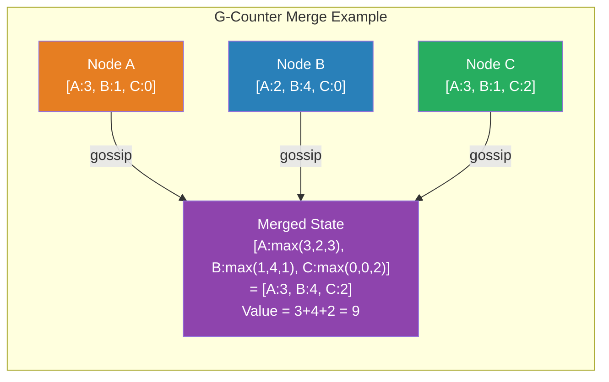

# [BEE-429] CRDTs: Conflict-free Replicated Data Types

:::info
CRDTs are data structures that can be replicated across multiple nodes, updated concurrently without coordination, and merged automatically into a consistent state — making them the principled mechanism for building highly available systems that converge without conflicts, without relying on consensus or distributed locking.
:::

## Context

Eventual consistency (BEE-165) is a promise: replicas will converge if updates stop. The promise says nothing about *how* convergence happens when two replicas have diverged. The naive answer — "last write wins" using timestamps — silently discards updates. The cautious answer — "require consensus before every write" — destroys the availability you sought by going eventually consistent in the first place.

Marc Shapiro, Nuno Preguiça, Carlos Baquero, and Marek Zawirski formalized the solution in "A Comprehensive Study of Convergent and Commutative Replicated Data Types" (INRIA Technical Report RR-7506, 2011) and the conference paper "Conflict-free Replicated Data Types" (SSS 2011). The insight: if you design data types whose merge functions are **commutative, associative, and idempotent**, then any order of merging any set of updates will always produce the same result. You don't need to coordinate at write time because the merge is guaranteed to converge.

The term "CRDT" covers a family of data structures, not a single algorithm. The shopping cart in Amazon's 2007 Dynamo paper used add-wins semantics — the paper describes the problem that motivated CRDTs, even though the formal CRDT framework was published four years later. Riak (Basho) shipped production CRDT data types (counters, sets, maps) in 2013. Redis Enterprise uses CRDTs for Active-Active geo-replication across datacenters. Figma, collaborative text editors, and distributed presence systems all rely on CRDT-like mechanisms.

## Design Thinking

**CRDTs trade coordination cost for semantic constraint.** A CRDT is not a general-purpose conflict resolver — it is a data structure designed so that conflicts cannot occur by construction. The data structure defines its own merge semantics, and those semantics must be chosen to match what your application actually means. A grow-only counter can never "conflict" because merging two counters is just taking the max per node. An OR-Set cannot conflict because adds and removes are tagged with unique IDs. But if your application requires "the last edit wins on a text field," you are making a semantic choice that the CRDT must encode explicitly (LWW-Register), not hiding a problem.

**The two families solve different network reliability problems.** State-based CRDTs (CvRDTs) send full state and merge it — safe over unreliable networks since retransmitting the same full state is idempotent. Operation-based CRDTs (CmRDTs) send operations — more bandwidth-efficient, but require exactly-once causal delivery. Choosing between them depends on whether your messaging layer guarantees ordered causal delivery. Delta-CRDTs (Almeida et al., 2016) combine the best of both: state-based correctness with operation-sized bandwidth by sending only the delta of the state change.

**CRDTs are not appropriate for all data.** A CRDT for a bank balance using add-wins semantics would allow withdrawals to be lost when concurrent with deposits. An LWW-Register silently discards any update that loses the timestamp comparison. The correct CRDT type for your data must encode your application's intended merge semantics — there is no "generic CRDT" that works for everything.

## Common CRDT Types

**G-Counter (Grow-only Counter):** Each node in a cluster of N nodes owns one slot in a vector of N integers. Increment only touches the local node's slot. Merge takes the element-wise maximum. Final value is the sum of all slots. Converges even if replicas exchange state in any order. Cannot decrement.

**PN-Counter:** Two G-Counters (P for increments, N for decrements). Value = sum(P) - sum(N). Supports both increment and decrement. Slots in P and N independently grow; the difference converges.

**G-Set (Grow-only Set):** Set union is the merge. Elements are never removed. Merge is commutative, associative, and idempotent by the properties of set union. Simplest CRDT.

**OR-Set (Observed-Remove Set):** Solves the add-wins vs. remove-wins problem. Each `add(element)` generates a unique tag; the set stores `(element, tag)` pairs. `remove(element)` removes all tags observed for that element at the time of the remove. If the same element is concurrently added (new tag) and removed (old tags), the add wins because the new tag survives. Allows re-adding an element after removal.

**LWW-Register (Last-Write-Wins Register):** Stores a single value with a timestamp. Merge takes the value with the higher timestamp. Simple, but silently discards the losing write — safe only for values where losing concurrent updates is acceptable (configuration, cached metadata).

**RGA (Replicated Growable Array):** Each character in a sequence is assigned a globally unique ID (typically a Lamport timestamp). Insertions are ordered by ID; concurrent inserts at the same position are ordered deterministically by node ID. Enables collaborative text editing without operational transformation (OT). Used in text editors and structured document collaboration.

## Visual



## Example

**G-Counter: distributed page view counter**

```
# 3-node cluster; each node increments its own slot independently.
# No coordination needed — reads can be served from any node.

# Node A increments locally (user visits page):
state_A = [A:3, B:1, C:0]
state_A[A] += 1 → state_A = [A:4, B:1, C:0]

# Meanwhile, Node B also receives visits:
state_B = [A:2, B:4, C:0]   # (B's view, lagging A's updates)

# Merge (gossip between A and B):
merged = [max(4,2), max(1,4), max(0,0)] = [A:4, B:4, C:0]
value  = 4 + 4 + 0 = 8                  # correct total

# Merge is idempotent: merging the same state twice gives the same result.
# Merge is commutative: A.merge(B) == B.merge(A).
# Merge is associative: (A.merge(B)).merge(C) == A.merge(B.merge(C)).
# → any gossip order converges to the same final value.
```

**OR-Set: shopping cart with concurrent add and remove**

```
# User session on replica 1: adds "book" → tag t1
cart_R1 = {("book", t1)}

# User session on replica 2 (concurrent, no sync yet):
# Replica 2 sees "book" was in cart, removes it
cart_R2 = {}     # removes ("book", t1) — seen at time of remove

# Concurrently on replica 1: adds "book" again → tag t2
cart_R1 = {("book", t1), ("book", t2)}

# Sync (merge R1 and R2):
# R2's remove only removes t1; it never saw t2.
# After merge: {("book", t2)}  ← book stays in cart (add-wins for the new add)

# Compare with 2P-Set behavior:
# 2P-Set: once removed, "book" can never be re-added → wrong for shopping carts
# OR-Set: re-adding after remove is allowed → correct semantics

# Amazon Dynamo (2007): described exactly this problem and solved it with
# add-wins semantics — the OR-Set pattern formalized by Shapiro et al. in 2011.
```

**Delta-CRDT: bandwidth-efficient state sync**

```
# Naive state-based CRDT: send full state on every gossip round
# Problem: G-Counter with 1000 nodes = send 1000 integers on every update

# Delta-CRDT: send only what changed
before_increment = [A:3, B:1, C:0]
after_increment  = [A:4, B:1, C:0]
delta            = [A:4]             # only the changed slot

# Receiver merges the delta exactly like a full state:
# max(receiver_A, delta_A) for each slot in delta; leave other slots unchanged
# Result: same convergence guarantee, operation-sized messages.

# Delta-CRDTs (Almeida, Shoker, Baquero, arXiv:1603.01529):
# Enables anti-entropy without full state transfer — reduces bandwidth
# proportionally to update frequency, not cluster size.
```

## Related BEEs

- [BEE-165](../Transactions/165.md) -- Eventual Consistency Patterns: CRDTs are the principled implementation mechanism for eventually consistent systems — they specify exactly how diverged replicas converge
- [BEE-420](420.md) -- CAP Theorem: CRDTs are an AP strategy — they sacrifice strong consistency (no consensus, no linearizable reads) for availability and partition tolerance; convergence is their consistency substitute
- [BEE-423](423.md) -- Gossip Protocols: CRDT state propagation typically uses gossip — nodes periodically exchange state (or deltas), and the CRDT merge handles convergence regardless of gossip order
- [BEE-222](../Messaging/222.md) -- Delivery Guarantees: operation-based CRDTs (CmRDTs) require exactly-once causal delivery of operations; state-based CRDTs (CvRDTs) only require eventual delivery of full state

## References

- [Conflict-free Replicated Data Types -- Shapiro et al., SSS 2011](https://link.springer.com/chapter/10.1007/978-3-642-24550-3_29)
- [A Comprehensive Study of Convergent and Commutative Replicated Data Types -- Shapiro et al., INRIA RR-7506, 2011](https://inria.hal.science/inria-00555588/en/)
- [Delta State Replicated Data Types -- Almeida, Shoker & Baquero, arXiv:1603.01529, 2016](https://arxiv.org/abs/1603.01529)
- [Dynamo: Amazon's Highly Available Key-value Store -- DeCandia et al., SOSP 2007](https://www.allthingsdistributed.com/files/amazon-dynamo-sosp2007.pdf)
- [CRDTs in Riak -- Riak Documentation](https://docs.riak.com/riak/kv/2.2.3/learn/concepts/crdts/index.html)
- [Active-Active Geo-Distribution with CRDTs -- Redis Documentation](https://redis.io/docs/latest/operate/rs/databases/active-active/)
- [CRDT Papers and Resources -- crdt.tech](https://crdt.tech/papers.html)
