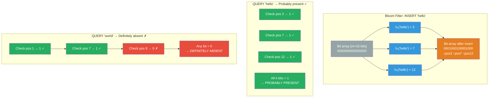

# [BEE-431] Bloom Filters and Probabilistic Data Structures

:::info
Probabilistic data structures trade a bounded probability of incorrect answers for dramatic reductions in memory and time — Bloom filters eliminate false negatives entirely while bounding false positives, making them ideal for the "definitely not present" fast-path that LSM-tree databases and CDN caches rely on.
:::

## Context

A standard hash set answers "is X in the set?" in O(1) time but requires memory proportional to the size of each stored element. At the scale of a billion URLs or ten billion keys, this becomes impractical. Burton H. Bloom described the alternative in "Space/Time Trade-offs in Hash Coding with Allowable Errors" (Communications of the ACM, July 1970): represent a set as a bit array, use multiple hash functions to set and check bits, and accept a tunable probability of false positives — answers of "probably yes" when the truth is "no" — in exchange for space that is independent of element size.

The crucial asymmetry that makes Bloom filters useful: **there are no false negatives**. If the filter says "definitely not present," it is correct 100% of the time. If it says "probably present," it is correct with probability (1 - false positive rate). This asymmetry is exactly what database point-lookup optimization needs: before reading a disk-resident SSTable file to answer a key lookup, check the Bloom filter. If the filter says the key is absent, skip the file — saved an expensive I/O. If the filter says the key is probably present, read the file. Occasionally the filter is wrong and the file doesn't contain the key (false positive), wasting one read. The net I/O savings over millions of lookups is enormous.

Apache Cassandra stores one Bloom filter per SSTable, entirely in off-heap memory. Before reading any SSTable to serve a partition key lookup, Cassandra checks the filter. RocksDB (Facebook, 2012) similarly places one Bloom filter per SSTable level, at ~10 bits per key by default, reducing point-lookup I/O by orders of magnitude. Google's BigTable, LevelDB, and most LSM-tree derivatives use the same pattern. Akamai's CDN uses a Bloom filter to solve the "one-hit wonder" problem: 75% of their cache was occupied by content fetched only once. A filter detects whether a URL has been requested before — if not, don't cache it yet; if probably yes, cache it — freeing the cache for genuinely repeated content (Maggs and Sitaraman, "Algorithmic Nuggets in Content Delivery").

## Design Thinking

**Use a Bloom filter when "definitely not present" is the fast path.** The value of a Bloom filter is eliminating the most expensive operation (a disk read, a network round-trip, a database query) in the case where the answer is provably "no." If your workload is mostly lookups that will find the key, the Bloom filter adds overhead without proportional benefit — every lookup pays the filter check cost, but the "skip the expensive operation" branch is rarely taken.

**False positive rate is a tuning knob, not a bug.** The false positive probability is p = (1 - e^(-kn/m))^k, where n is the number of inserted elements, m is the bit array size, and k is the number of hash functions. Optimal k = (m/n) × ln(2) ≈ 0.693(m/n). At 10 bits per element (m/n = 10), the optimal k ≈ 7 and false positive rate ≈ 0.8%. Doubling to 20 bits per element drops the false positive rate to ~0.004% — at the cost of twice the memory. Cassandra exposes this as `bloom_filter_fp_chance`: lower values mean fewer false I/O reads but more memory per SSTable.

**Probabilistic data structures form a toolkit, not a single tool.** Bloom filters answer membership; HyperLogLog estimates cardinality; Count-Min Sketch estimates frequency. Each is appropriate for a different query type, and each trades a different kind of accuracy for space savings. Choosing the right one requires knowing what question you are actually asking.

## The Probabilistic Data Structure Toolkit

### Bloom Filter — Membership

**Query:** "Is X in the set?" → "Definitely no" or "Probably yes"

**Properties:** No false negatives. False positive rate is tunable. No deletion support in the standard form (Counting Bloom Filters add this by replacing bits with counters, at 4–16× memory cost). Cuckoo Filters (Fan et al., CoNEXT 2014) support deletion with better cache locality and slightly better space efficiency than Counting Bloom Filters.

**Optimal parameters for common false positive rates:**

| False Positive Rate | Bits per element (m/n) | Hash functions (k) |
|---|---|---|
| 10% | 4.8 | 3 |
| 1% | 9.6 | 7 |
| 0.1% | 14.4 | 10 |
| 0.01% | 19.2 | 13 |

### HyperLogLog — Cardinality Estimation

**Query:** "How many distinct elements have I seen?" → estimate with bounded relative error

Flajolet, Fusy, Gandouet, and Meunier described HyperLogLog in 2007 ("HyperLogLog: the analysis of a near-optimal cardinality estimation algorithm"). The insight: the maximum number of leading zeros in the binary representation of hashed values gives a probabilistic estimate of how many distinct values have been hashed. HyperLogLog achieves ~1.04/√m standard error using m small registers (typically 4–6 bits each). With 2,048 registers (12 KB), error is ~2.3%. With 16,384 registers (12 KB with 6-bit registers), error drops to ~0.8%.

**Production use:** Redis `PFCOUNT` and `PFADD` commands implement HyperLogLog; a 12 KB sketch estimates the distinct count for billions of elements. PostgreSQL's `pg_stats` uses HyperLogLog for column cardinality estimates used by the query planner. Druid uses it for approximate distinct counts in real-time analytics.

### Count-Min Sketch — Frequency Estimation

**Query:** "How many times have I seen X?" → estimate that may overcount, never undercount

Cormode and Muthukrishnan described Count-Min Sketch in 2005. The structure is a 2D array of w×d counters with d independent hash functions. To count element X: increment counters at positions h₁(X), h₂(X), ..., hd(X) in each respective row. To query X: return the minimum across all d rows. The minimum is always ≥ the true frequency (it can only overcount due to hash collisions, never undercount). With width w = e/ε and depth d = ln(1/δ), the estimate is within εN of the true count with probability 1-δ, where N is the total count of all elements.

**Production use:** Network traffic monitoring (identifying heavy-hitter IP addresses), Apache Flink's windowed frequency queries, Redis's approximate sorted set operations. Useful when exact frequency tables would require more memory than is available.

## Visual



## Example

**Bloom filter in an LSM-tree point lookup:**

```
# RocksDB / Cassandra SSTable lookup with Bloom filter
# Setup: 10 SSTable files, each with a Bloom filter (10 bits/key, ~0.8% FP rate)
# Query: GET key="user:42:profile"

for sstable in sstables_covering_key_range:
    # Check Bloom filter first — pure in-memory bit array operation
    if not sstable.bloom_filter.probably_contains("user:42:profile"):
        continue   # DEFINITELY ABSENT — skip disk read entirely

    # Filter says "probably present" — read from disk
    result = sstable.read_block("user:42:profile")
    if result is not None:
        return result  # found

# Typical outcome with 1 actual SSTable containing the key:
# - 9 SSTables: Bloom filter says "absent" → 0 disk reads
# - 1 SSTable: Bloom filter says "present" → 1 disk read (the right one)
# - Occasionally: 1 false positive SSTable also read → 1 extra disk read
# Net: ~1-2 disk reads instead of 10 → 5-10× I/O reduction
```

**HyperLogLog cardinality estimation:**

```
# Track distinct user IDs seen in a stream (e.g., DAU counting)
# Redis implementation:

PFADD daily_users:2026-04-14 user:1 user:2 user:3  # ... millions of adds
PFCOUNT daily_users:2026-04-14                       # returns ~estimate with ±2% error

# Memory: always ~12 KB regardless of cardinality (1 million or 1 billion distinct users)
# Alternative: storing all distinct user IDs → 8 bytes × 1 billion = 8 GB
# Trade-off: exact count requires 8 GB; HyperLogLog gives ±2% error for 12 KB

# Multi-set union (users seen on any of N days):
PFMERGE weekly_users daily_users:2026-04-08 daily_users:2026-04-09 ...
PFCOUNT weekly_users   # distinct users across the entire week
```

**Count-Min Sketch for top-K items:**

```
# Find top-K most frequent search queries in a stream
# (tracking exact frequencies would require a hash table of all distinct queries)

# Parameters: ε = 0.001 (1‰ error), δ = 0.01 (1% failure probability)
# w = ceil(e / ε) = 2718 columns
# d = ceil(ln(1/δ)) = 5 rows
# Total counters: 2718 × 5 = 13,590 (trivial memory)

def sketch_add(query):
    for row in range(d):
        col = hash_row[row](query) % w
        sketch[row][col] += 1

def sketch_count(query):
    return min(sketch[row][hash_row[row](query) % w] for row in range(d))

# True count for "python tutorial": 50,000
# sketch_count("python tutorial"): 50,000–50,050 (slightly over, never under)
# Combine with a heap to maintain exact counts for the top-K items seen
```

## Related BEEs

- [BEE-124](../Data%20Storage/124.md) -- Storage Engines: LSM-tree engines (RocksDB, LevelDB, Cassandra) use Bloom filters as a core optimization for SSTable point lookups — the filter is embedded in the SSTable format itself
- [BEE-430](430.md) -- Write-Ahead Logging: RocksDB's LSM architecture uses both WAL (for MemTable durability) and Bloom filters (for SSTable lookup skipping) together; they solve different problems in the same storage engine
- [BEE-200](../Caching/200.md) -- Caching Fundamentals: Akamai uses Bloom filters at the CDN edge to prevent caching one-hit wonders, illustrating that probabilistic structures are as useful in caching layers as in storage engines
- [BEE-303](../Performance/303.md) -- Profiling and Bottleneck Identification: false positive rates in production Bloom filters appear as unexpected I/O reads during profiling; understanding the filter's tuning parameters is needed to interpret whether the rate is within spec or indicates a misconfiguration

## References

- [Space/Time Trade-offs in Hash Coding with Allowable Errors -- Burton H. Bloom, Communications of the ACM, July 1970](https://dl.acm.org/doi/10.1145/362686.362692)
- [RocksDB Bloom Filter -- RocksDB Wiki](https://github.com/facebook/rocksdb/wiki/RocksDB-Bloom-Filter)
- [Bloom Filters -- Apache Cassandra Documentation](https://cassandra.apache.org/doc/latest/cassandra/managing/operating/bloom_filters.html)
- [HyperLogLog: the analysis of a near-optimal cardinality estimation algorithm -- Flajolet, Fusy, Gandouet & Meunier, AofA 2007](https://algo.inria.fr/flajolet/Publications/FlFuGaMe07.pdf)
- [An Improved Data Stream Summary: The Count-Min Sketch and its Applications -- Cormode & Muthukrishnan, Journal of Algorithms, 2005](https://dimacs.rutgers.edu/~graham/pubs/papers/cm-full.pdf)
- [Cuckoo Filter: Practically Better Than Bloom -- Fan, Andersen, Kaminsky & Mitzenmacher, CoNEXT 2014](https://www.cs.cmu.edu/~dga/papers/cuckoo-conext2014.pdf)
- [Algorithmic Nuggets in Content Delivery -- Maggs & Sitaraman](https://people.cs.umass.edu/~ramesh/Site/PUBLICATIONS_files/CCRpaper_1.pdf)
