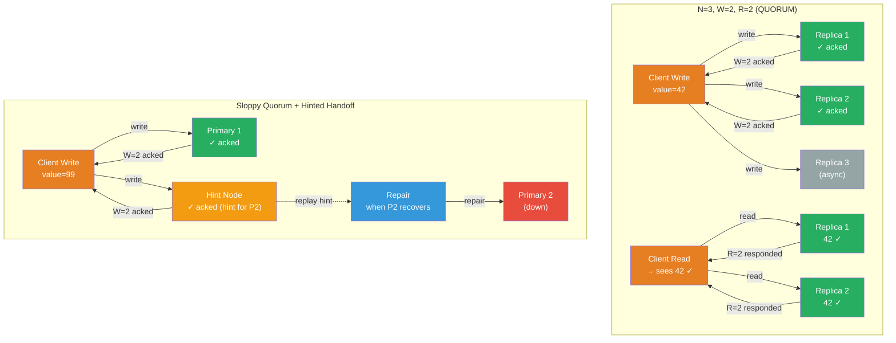

# [BEE-433] Quorum Systems and NWR Consistency

:::info
The NWR model — N total replicas, W acknowledgments required for a write, R responses required for a read — gives system designers a single dial to slide between maximum availability and strong consistency by enforcing that the write and read quorums overlap: W + R > N guarantees at least one replica in any read set has seen the latest write.
:::

## Context

The foundational idea comes from two 1979 papers. Robert Thomas described majority voting for replicated databases in "A Majority Consensus Approach to Concurrency Control for Multiple Copy Databases" (ACM TODS, vol. 4, no. 2, 1979). David Gifford generalized this with fractional weights in "Weighted Voting for Replicated Data" (ACM SOSP 1979), introducing the (v_r, v_w) notation where reads require r votes and writes require w votes from a pool of v total, with the constraint r + w > v. This is the direct ancestor of the NWR model.

The key insight is geometric: if every write touches at least W replicas and every read touches at least R replicas, and W + R > N, then the write set and read set must intersect — the read is guaranteed to contact at least one replica that has the current write. When W + R ≤ N, the sets can be disjoint and the read may return stale data.

Amazon's Dynamo paper (DeCandia et al., SOSP 2007) brought NWR into mainstream distributed systems practice. Dynamo defaults to N=3, W=2, R=2 (satisfying W+R > N as 4 > 3). Critically, Dynamo introduced **sloppy quorums**: when a designated replica is unavailable due to failure or network partition, Dynamo routes the write to any other available node in the ring, which temporarily holds the data with a **hint** describing the intended target. When the target recovers, the hint-holder replays the write and discards its copy. This is called **hinted handoff**. Sloppy quorums dramatically improve write availability at the cost of a brief window where reads may not see the latest write — the system trades strict quorum intersection for AP behavior during partitions.

Apache Cassandra adopts the same model and exposes it through named consistency levels rather than raw N/W/R numbers. `QUORUM` means ⌊RF/2⌋ + 1 nodes must respond, where RF is the replication factor. `LOCAL_QUORUM` restricts the quorum to one datacenter, avoiding cross-datacenter latency while still providing majority consensus within the datacenter. `ALL` requires every replica to respond — maximum consistency, minimum availability. `ONE` requires a single replica — maximum availability, no freshness guarantee. Setting both read and write to `QUORUM` with RF=3 (QUORUM=2) satisfies 2+2>3 and provides strong consistency.

## Design Thinking

**W + R > N is necessary but not sufficient for linearizability.** Quorum intersection guarantees that at least one replica in every read set has seen the most recent write. But it does not guarantee that the replica returns that value, or that concurrent operations appear to have executed in a single total order. If two clients concurrently write different values, both writes may each hit a quorum, and subsequent reads may return either value depending on which replica responds first. Achieving linearizability on top of quorums requires either a consensus protocol (Raft, Paxos) to totally order writes, or versioned reads where clients compare replica responses and return the highest-versioned one. Cassandra's `QUORUM` reads with `read_repair` approach this but do not guarantee linearizability; etcd and ZooKeeper do achieve linearizability because they use Raft/Zab for total ordering, not tunable quorums.

**Tune W and R for your read/write ratio.** The choices sit on a spectrum:
- **W=N, R=1** (write-all, read-one): Writes are slow and unavailability-sensitive; reads are fast and always fresh. Good for read-heavy workloads where write throughput is not a constraint.
- **W=1, R=N** (write-one, read-all): Writes are maximally available; reads are slow and degraded by unavailability. Rarely used in practice.
- **W=⌊N/2⌋+1, R=⌊N/2⌋+1** (QUORUM both): Balanced availability and consistency. With N=3 this means W=R=2. Any single replica failure still allows both reads and writes to succeed.
- **W=1, R=1** (any-any): Maximum availability and throughput, no consistency guarantee. Appropriate only for append-only, idempotent, or truly eventually-consistent data.

**Sloppy quorums are an availability optimization, not a correctness guarantee.** When hinted handoff is used, the quorum intersection argument breaks down: the hints are stored on nodes outside the designated N, so a read of the designated N replicas may miss the hints. Sloppy quorums are appropriate when missing a recent write briefly is acceptable and the conflict resolution mechanism (LWW, vector clocks, application merge) handles divergence correctly. They are inappropriate for data that MUST NOT be lost or that requires strong read-your-writes consistency.

**Last-write-wins (LWW) requires clock discipline.** When writes conflict and the resolution strategy is to keep the write with the highest timestamp, clock skew across replicas determines which write survives. A write with a lower wall-clock timestamp may be silently discarded even if it was causally later. Systems using LWW MUST use synchronized clocks (NTP with bounded skew, or bounded-error timestamps like TrueTime) and MUST accept that some writes will be silently lost during high-concurrency windows. Cassandra uses LWW by default; Dynamo originally used vector clocks to detect conflicts and push resolution to the application.

## Visual



## Example

**Cassandra consistency level selection:**

```
# Replication Factor (RF) = 3, cluster has 1 node temporarily down

# QUORUM read + QUORUM write → strong consistency
# QUORUM = floor(3/2) + 1 = 2 replicas must respond
# Write: 2/3 up nodes ack → success
# Read: 2/3 up nodes respond → returns latest value (quorums intersect: 2+2>3)
CONSISTENCY QUORUM;
SELECT * FROM orders WHERE order_id = 'abc-123';

# ONE read → eventual consistency (may return stale data)
# Faster but no freshness guarantee
CONSISTENCY ONE;
SELECT * FROM product_catalog WHERE product_id = 'sku-456';

# LOCAL_QUORUM → strong consistency within one datacenter only
# Cross-datacenter writes are asynchronous
# Use when: multi-region deployment, can tolerate cross-region staleness
CONSISTENCY LOCAL_QUORUM;
UPDATE user_preferences SET theme = 'dark' WHERE user_id = 'u-789';

# ALL → maximum consistency, rejects if any replica down
# Use only when: compliance requires every replica to confirm (audit logs, etc.)
CONSISTENCY ALL;
INSERT INTO audit_log (event_id, action) VALUES (uuid(), 'account_deletion');
```

**Sloppy quorum and hinted handoff (Dynamo-style pseudocode):**

```python
# N=3 ring: nodes A, B, C own key K
# C is temporarily unreachable

def write(key, value, W=2):
    preference_list = ring.get_preference_list(key, N=3)  # [A, B, C]
    acks = 0
    hints = []

    for node in ring.get_available_nodes():
        if node in preference_list:
            node.write(key, value)
            acks += 1
        elif acks < W and node not in preference_list:
            # Sloppy quorum: use non-owner node to satisfy W
            node.write_with_hint(key, value, hint_target=C)
            hints.append((node, C))
            acks += 1
        if acks >= W:
            break  # write succeeded

    return "OK" if acks >= W else "TIMEOUT"

# When C recovers:
def hinted_handoff_replay(hint_node, target_node):
    for (key, value) in hint_node.get_hints_for(target_node):
        target_node.write(key, value)
        hint_node.delete_hint(key, target_node)
    # C is now consistent; hint node no longer holds the sloppy quorum slot
```

**NWR parameter selection guide:**

```
Use case                    | N | W | R | Tradeoff
----------------------------|---|---|---|------------------------------------------
Shopping cart (AP priority) | 3 | 1 | 1 | Max availability; occasional stale reads
Session data (balanced)     | 3 | 2 | 2 | Strong read freshness; tolerates 1 failure
Financial ledger entries    | 3 | 3 | 2 | No write loss; read fails if 2 nodes down
Config data (read-heavy)    | 5 | 3 | 1 | Fast reads; writes need majority
Audit log (durability)      | 3 | 3 | 1 | Every node confirms write; reads fast
```

## Related BEEs

- [BEE-420](420.md) -- CAP Theorem: quorums with W+R>N are CP (reject requests if quorum unavailable); sloppy quorums are AP (route to any available nodes); NWR is one mechanism for navigating the consistency-availability tradeoff CAP describes
- [BEE-421](421.md) -- Consensus Algorithms: Raft and Paxos use strict majority quorums (N/2+1) for all operations and guarantee linearizability through total ordering — this is stronger than NWR quorums alone, which only guarantee quorum intersection, not a single serialization order
- [BEE-422](422.md) -- Vector Clocks and Logical Timestamps: Dynamo uses vector clocks to detect concurrent writes that quorum intersection cannot resolve; when two writes reach overlapping quorums concurrently, vector clocks identify the conflict so the application (or LWW) can resolve it
- [BEE-432](432.md) -- Merkle Trees: Dynamo and Cassandra use Merkle trees for anti-entropy repair — after sloppy quorum writes, background repair uses Merkle tree comparison to find replicas that missed writes during the partition and sync them

## References

- [Weighted Voting for Replicated Data -- David Gifford, ACM SOSP 1979](https://dl.acm.org/doi/10.1145/800215.806583)
- [A Majority Consensus Approach to Concurrency Control for Multiple Copy Databases -- Robert Thomas, ACM TODS 1979](https://dl.acm.org/doi/abs/10.1145/320071.320075)
- [Dynamo: Amazon's Highly Available Key-value Store -- DeCandia et al., SOSP 2007](https://www.allthingsdistributed.com/files/amazon-dynamo-sosp2007.pdf)
- [Cassandra Architecture: Guarantees -- Apache Cassandra Documentation](https://cassandra.apache.org/doc/latest/cassandra/architecture/guarantees.html)
- [Cassandra Architecture: Dynamo -- Apache Cassandra Documentation](https://cassandra.apache.org/doc/latest/cassandra/architecture/dynamo.html)
- [Replication Properties -- Riak KV Documentation](https://docs.riak.com/riak/kv/latest/developing/app-guide/replication-properties/index.html)
- [Read Consistency -- Amazon DynamoDB Developer Guide](https://docs.aws.amazon.com/amazondynamodb/latest/developerguide/HowItWorks.ReadConsistency.html)
- [The Origin of Quorum Systems -- Marko Vukolić, IBM Research](https://vukolic.com/QuorumsOrigin.pdf)
