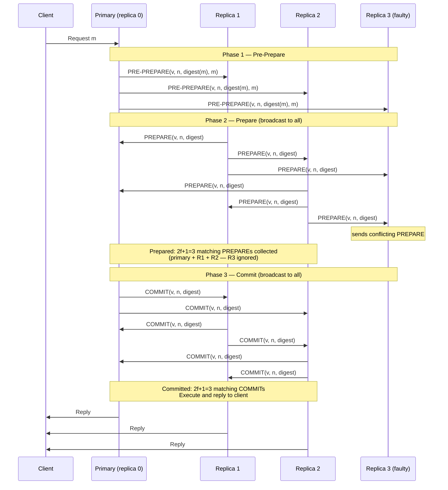

# [BEE-439] Byzantine Fault Tolerance

:::info
Byzantine Fault Tolerance (BFT) extends crash fault tolerance to the case where nodes may behave arbitrarily — sending contradictory messages, colluding, or lying — rather than merely stopping; tolerating f Byzantine faults requires at least 3f+1 nodes compared to 2f+1 for crash faults, making BFT the necessary foundation for consensus in adversarial or multi-party environments.
:::

## Context

The Byzantine Generals Problem was formalized by Leslie Lamport, Robert Shostak, and Marshall Pease in "The Byzantine Generals Problem" (ACM Transactions on Programming Languages and Systems, 1982). The allegory: a group of Byzantine army generals, each commanding a division, must agree on a common plan by exchanging messages through messengers. Some generals may be traitors who send conflicting messages to different peers. The core result — which they proved both necessary and sufficient — is that consensus is impossible with only **oral messages** (unauthenticated) if more than one-third of the generals are traitors: with n generals and f traitors, the system requires **n ≥ 3f+1**. With **signed messages** (authenticated, non-forgeable), the threshold drops to n ≥ 2f+1 — matching the crash fault tolerance requirement — but practical systems still use n ≥ 3f+1 because message authentication alone does not prevent equivocation by colluding nodes.

The key distinction is what fault model is assumed. **Crash fault tolerance (CFT)** — the model of Paxos (Lamport, 1989) and Raft (Ongaro & Ousterhout, 2014) — assumes nodes either operate correctly or stop responding entirely. The simpler fault model enables simpler protocols: Raft achieves consensus with O(n) messages per proposal and n = 2f+1 nodes. **Byzantine fault tolerance** assumes nodes may behave arbitrarily: sending different messages to different peers (equivocation), delaying messages selectively, or coordinating with other faulty nodes. No unauthenticated message can be trusted; every protocol step must account for the possibility that the sender is lying.

Miguel Castro and Barbara Liskov's **Practical Byzantine Fault Tolerance** (PBFT, OSDI 1999) was the first BFT protocol efficient enough to consider for real systems. Before PBFT, BFT protocols were primarily theoretical; PBFT demonstrated BFT with performance within a factor of two of non-replicated systems for small f. PBFT operates in three phases within a view (term): the **pre-prepare** phase, where the primary (leader) proposes a request and assigns it a sequence number; the **prepare** phase, where replicas broadcast acceptance of the proposal and collect 2f+1 matching prepare messages; and the **commit** phase, where replicas broadcast and collect 2f+1 matching commit messages before executing. The three phases serve a specific purpose: prepare ensures 2f+1 replicas agree on the ordering within the current view; commit ensures 2f+1 replicas agree the ordering is durable across view changes. Message complexity is O(n²) per request — every replica broadcasts to every other.

BFT gained industrial relevance through blockchain systems. Bitcoin (Nakamoto, 2008) solves a different version of the problem — open membership with anonymous validators — using proof of work as a Sybil resistance mechanism rather than authenticated identity, producing probabilistic finality rather than the immediate finality of PBFT. Tendermint (Buchman, Kwon, Milosevic, 2018) brought PBFT-style deterministic finality to proof-of-stake blockchains, operating with a known validator set. HotStuff (Yin et al., 2019) reduced PBFT's O(n²) message complexity to O(n) by introducing a linear voting protocol through the leader, enabling BFT at larger validator counts; it became the foundation of Meta's LibraBFT (later DiemBFT) and several other chains.

## Design Thinking

**Choose BFT when trust boundaries cross administrative domains; use CFT inside a single trust domain.** A Raft cluster in a private data center — where operators can audit every node — needs to tolerate only crashes. A multi-organization consortium database, a blockchain network with external validators, or any system where a single node operator could profit from lying requires BFT. The fault model assumption is the primary driver; performance is secondary. If a CFT system is deployed in an environment with Byzantine participants, its safety guarantees are void.

**BFT carries a permanent replication tax of 50%.** CFT tolerates f failures with 2f+1 replicas (majority quorum). BFT tolerates f Byzantine failures with 3f+1 replicas (two-thirds quorum). Tolerating 1 fault: CFT needs 3 nodes, BFT needs 4. Tolerating 2 faults: CFT needs 5, BFT needs 7. This is not a protocol efficiency question — it is information-theoretic: with fewer than 3f+1 nodes, no protocol can distinguish a Byzantine minority from an honest majority in the general case. Budget for this overhead before selecting BFT.

**PBFT's O(n²) message complexity limits practical scale.** With n=4 (f=1), PBFT generates 12 messages per proposal — manageable. With n=100 (f=33), PBFT generates approximately 10,000 messages per proposal. Production BFT systems either fix small validator sets (Tendermint: 100–150 validators; Hyperledger Fabric: similarly small), use threshold signatures to aggregate 2f+1 votes into a single message (reducing to O(n) per round), or adopt HotStuff-style linear protocols. The scalability ceiling is a design constraint, not a tuning parameter.

**View change is the hardest part of BFT.** Like Raft, PBFT must handle leader failure through a view change protocol. In PBFT, view changes require O(n²) messages and carry forward proof of all in-progress proposals — complex to implement correctly, and a common source of bugs. A faulty primary can stall liveness (but not safety) until the view change timeout fires. Set view change timeouts conservatively relative to observed network latency; too aggressive causes unnecessary view changes, too conservative causes long stalls under Byzantine primaries.

## Visual



## Example

**Fault threshold calculation for BFT deployments:**

```
# Crash Fault Tolerance (Raft/Paxos): n = 2f + 1
#   f=1 fault  → 3 nodes  (quorum: 2)
#   f=2 faults → 5 nodes  (quorum: 3)
#   f=3 faults → 7 nodes  (quorum: 4)

# Byzantine Fault Tolerance (PBFT): n = 3f + 1
#   f=1 fault  → 4 nodes  (quorum: 3 — two-thirds threshold)
#   f=2 faults → 7 nodes  (quorum: 5)
#   f=3 faults → 10 nodes (quorum: 7)

# Why 3f+1? Safety requires two quorums to overlap on at least one honest node.
# Quorum size = 2f+1. Two quorums of size 2f+1 among 3f+1 nodes overlap in at
# least (2f+1)+(2f+1)-(3f+1) = f+1 nodes. With f faulty nodes, at least 1 is honest.
```

**Simplified PBFT state machine (pseudocode):**

```python
# Each replica maintains:
#   view: current view number (leader = view % n)
#   log: sequence number → (request, state)
#   prepare_cert[n]: set of matching PREPARE messages for seq n
#   commit_cert[n]: set of matching COMMIT messages for seq n

class PBFTReplica:
    def on_pre_prepare(self, view, seq, digest, request):
        if view != self.view:
            return  # wrong view, discard
        if seq in self.log:
            return  # already have a proposal for this seq
        if digest != hash(request):
            return  # digest mismatch — faulty primary
        self.log[seq] = request
        self.broadcast(PREPARE(view, seq, digest, self.id, self.sign(...)))

    def on_prepare(self, view, seq, digest, sender_id, sig):
        if not verify(sig, sender_id):
            return
        self.prepare_cert[seq].add((sender_id, digest))
        if len([d for _, d in self.prepare_cert[seq] if d == digest]) >= 2*f+1:
            # Prepared — safe to commit this ordering in this view
            self.broadcast(COMMIT(view, seq, digest, self.id, self.sign(...)))

    def on_commit(self, view, seq, digest, sender_id, sig):
        if not verify(sig, sender_id):
            return
        self.commit_cert[seq].add(sender_id)
        if len(self.commit_cert[seq]) >= 2*f+1:
            # Committed — safe to execute regardless of view changes
            self.execute(self.log[seq])
            self.reply_to_client(self.log[seq])
```

**BFT in practice — Tendermint validator set (CometBFT config):**

```toml
# config.toml — Tendermint/CometBFT node configuration
[consensus]
# Timeout before proposer is considered faulty and view change triggers
timeout_propose = "3s"
timeout_propose_delta = "500ms"

# Timeout waiting for 2/3+ prevotes (prepare equivalent)
timeout_prevote = "1s"
timeout_prevote_delta = "500ms"

# Timeout waiting for 2/3+ precommits (commit equivalent)
timeout_precommit = "1s"
timeout_precommit_delta = "500ms"

# Validators are a fixed set; 1/3 Byzantine tolerance
# n validators: safe while fewer than n/3 are Byzantine
```

```
# Tendermint validator set (genesis.json excerpt):
# 10 validators → tolerates 3 Byzantine validators (n=10, f=3: 3f+1=10 ✓)
# 4 validators  → tolerates 1 Byzantine validator  (n=4,  f=1: 3f+1=4  ✓)

"validators": [
  {"address": "...", "pub_key": {...}, "power": "10"},  # voting weight
  {"address": "...", "pub_key": {...}, "power": "10"},
  ...
]
# Commit requires >2/3 of total voting power in precommits
# Byzantine validators cannot exceed 1/3 of total power
```

## Related BEEs

- [BEE-421](421.md) -- Consensus Algorithms: Paxos and Raft: Paxos and Raft assume crash fault tolerance (CFT) — nodes fail by stopping; BFT extends consensus to the stronger adversarial model where nodes may behave arbitrarily; the replication cost doubles from 2f+1 to 3f+1 nodes
- [BEE-420](420.md) -- CAP Theorem: BFT protocols provide consistency (safety) at the cost of availability under partition, but with a stricter fault model than CAP's binary available/unavailable — a Byzantine minority can force a liveness stall without violating safety
- [BEE-434](434.md) -- Failure Detection: BFT view change is triggered by a timeout (suspecting the primary is Byzantine or crashed); unlike CFT failure detectors, BFT systems cannot trust a Byzantine node's own liveness reports, so detection is purely timeout-based
- [BEE-433](433.md) -- Quorum Systems and NWR Consistency: BFT uses a two-thirds quorum (2f+1 out of 3f+1) where CFT uses a majority quorum (f+1 out of 2f+1); the larger quorum ensures that any two quorums overlap in at least one honest node

## References

- [The Byzantine Generals Problem -- Lamport, Shostak, Pease, ACM TOPLAS 1982](https://dl.acm.org/doi/10.1145/357172.357176)
- [The Byzantine Generals Problem PDF -- Lamport Archive](https://lamport.azurewebsites.net/pubs/byz.pdf)
- [Practical Byzantine Fault Tolerance -- Castro and Liskov, OSDI 1999](https://www.usenix.org/conference/osdi-99/practical-byzantine-fault-tolerance)
- [Practical Byzantine Fault Tolerance PDF -- MIT CSAIL](http://pmg.csail.mit.edu/papers/osdi99.pdf)
- [Bitcoin: A Peer-to-Peer Electronic Cash System -- Nakamoto, 2008](https://bitcoin.org/bitcoin.pdf)
- [The Latest Gossip on BFT Consensus (Tendermint) -- Buchman, Kwon, Milosevic, arXiv 2018](https://arxiv.org/abs/1807.04938)
- [HotStuff: BFT Consensus with Linearity and Responsiveness -- Yin et al., arXiv 2018](https://arxiv.org/abs/1803.05069)
