# [BEE-441] Anti-Entropy and Replica Repair

:::info
Anti-entropy is the set of mechanisms distributed databases use to detect and reconcile diverged replicas — hinted handoff repairs writes that missed a temporarily unavailable node, read repair heals stale data discovered during reads, and background anti-entropy compares replica state using Merkle trees to find and fix inconsistencies in data that is never read — together these three layers implement eventual consistency in practice.
:::

## Context

The term "anti-entropy" in distributed systems traces to Alan Demers, Dan Greene, Carl Hauser, and colleagues at Xerox PARC in "Epidemic Algorithms for Replicated Database Maintenance" (ACM PODC, 1987). They modeled replication as an information epidemic: each node periodically selects a random partner, exchanges database state, and applies any updates received — a process they called **anti-entropy** because it systematically reduces the disorder (entropy) introduced by network failures and concurrent updates. Their epidemic model showed that logarithmic rounds of gossip suffice to propagate updates to all replicas with high probability.

Amazon's Dynamo paper (DeCandia et al., SOSP 2007) operationalized these ideas into three complementary repair mechanisms for a production key-value store. Dynamo's architecture — leaderless, AP-side of CAP, sloppy quorums — means replicas diverge regularly during network disruptions or node failures. The paper described three layers of repair, each targeting a different failure scenario: **hinted handoff** for temporary node unavailability (seconds to hours), **read repair** for inconsistencies discovered during reads (passive, demand-driven), and **Merkle-tree anti-entropy** for comprehensive background reconciliation of all data including data that is never read. Werner Vogels formalized the distinction in "Eventually Consistent" (CACM, 2009): a system with only read repair achieves eventual consistency only for frequently accessed data; full eventual consistency — including for cold data — requires background anti-entropy.

Cassandra (Lakshman and Malik, ACM SIGOPS 2010) adopted all three mechanisms from Dynamo and exposed them as operational primitives. Hinted handoff is automatic and on-by-default. Read repair is triggered probabilistically on coordinator reads (configurable per table with `read_repair` option). Background anti-entropy is performed through the `nodetool repair` command, which must be scheduled externally — Cassandra provides no built-in scheduler. Riak introduced **Active Anti-Entropy (AAE)** in version 1.3 (2013), running Merkle tree comparison as a continuous, autonomous background daemon rather than a triggered command, eliminating the operational burden of manual repair scheduling.

The key insight common to all these implementations is that eventual consistency is not a property the system provides automatically at zero cost — it is a property the system provides given that the repair mechanisms run. A Cassandra cluster with repair disabled is not eventually consistent; it is a cluster that will accumulate drift until nodes diverge permanently.

## Design Thinking

**The three repair mechanisms address different points in the failure timeline.** Hinted handoff fires within seconds of a write, stores the write locally, and replays it as soon as the target node returns — it handles the common case of brief unavailability (network blip, rolling restart) without requiring a full repair cycle. Read repair fires within milliseconds of a read, comparing versions across replicas and updating stale ones in-band with the request — it handles recently-diverged data that is actively being accessed. Background anti-entropy runs on a schedule (hours to days), systematically comparing replica ranges using Merkle trees — it handles cold data, aged-out hints, and any divergence the other mechanisms missed. A production system needs all three; each one's blind spot is the next one's primary case.

**Repair completeness must be bounded by the tombstone garbage collection window.** Cassandra (and similar systems) mark deletes as tombstones — a write that says "this key was deleted." Tombstones cannot be garbage-collected until all replicas have acknowledged the delete and a safety window (`gc_grace_seconds`, default 10 days) has elapsed. If a node is down for longer than `gc_grace_seconds` and a repair does not run before the tombstone is collected, the node will resurrect the deleted row when it comes back online — a silent data corruption. Anti-entropy repair MUST run on every replica within the `gc_grace_seconds` window. This is the most operationally critical constraint in Cassandra repair scheduling.

**Repair resource cost scales with the amount of divergence, not the dataset size.** Merkle trees enable this efficiency: two replicas compare root hashes first (O(1) network round-trip), then traverse down only branches that differ, until they identify the leaf segments (token ranges) that need data transfer. A cluster with 10 TB of data but only 1 MB of divergence exchanges approximately 1 MB of data per repair cycle. This makes frequent incremental repairs cheaper than infrequent full repairs — less divergence accumulates between runs, so each run transfers less data. The I/O cost of building the Merkle tree itself is fixed, however, and proportional to the dataset size: generating the tree requires reading all sstable data.

## Visual

```mermaid
flowchart TD
    subgraph "Write Path"
        W["Write Request\n(coordinator)"]:::write
        N1["Replica 1\n(available)"]:::ok
        N2["Replica 2\n(available)"]:::ok
        N3["Replica 3\n(down)"]:::down
        HH["Hint stored\non coordinator"]:::hint

        W -->|"write OK"| N1
        W -->|"write OK"| N2
        W -->|"unavailable"| N3
        W -->|"hinted handoff"| HH
        HH -->|"replay on recovery"| N3
    end

    subgraph "Read Path"
        R["Read Request\n(coordinator)"]:::write
        RR["Read Repair\n(coordinator compares\nversions, writes stale replicas)"]:::hint
        N1r["Replica 1\nfresh v3"]:::ok
        N2r["Replica 2\nstale v1"]:::down

        R -->|"fetch"| N1r
        R -->|"fetch"| N2r
        N1r & N2r --> RR
        RR -->|"write v3"| N2r
    end

    subgraph "Background Anti-Entropy"
        MT1["Merkle Tree\nReplica A"]:::tree
        MT2["Merkle Tree\nReplica B"]:::tree
        CMP["Compare root hashes\ntraverse diff branches\nidentify diverged ranges"]:::hint
        SYNC["Stream diverged\npartitions"]:::write

        MT1 & MT2 --> CMP
        CMP --> SYNC
    end

    style W fill:#3498db,color:#fff
    style N1 fill:#27ae60,color:#fff
    style N2 fill:#27ae60,color:#fff
    style N3 fill:#e74c3c,color:#fff
    style HH fill:#f39c12,color:#fff
    style R fill:#3498db,color:#fff
    style RR fill:#f39c12,color:#fff
    style N1r fill:#27ae60,color:#fff
    style N2r fill:#e74c3c,color:#fff
    style MT1 fill:#9b59b6,color:#fff
    style MT2 fill:#9b59b6,color:#fff
    style CMP fill:#f39c12,color:#fff
    style SYNC fill:#27ae60,color:#fff
```



## Best Practices

**Schedule anti-entropy repair on every node within `gc_grace_seconds`.** The default in Cassandra is 10 days. If a node goes through a repair cycle every 7 days, there is a 3-day safety buffer before tombstones could be garbage-collected on other nodes while a replica is still stale. Tighter tables (high delete volume, short TTLs) SHOULD use a shorter `gc_grace_seconds` paired with proportionally more frequent repairs.

**Use incremental repair for routine maintenance; reserve full repair for post-recovery.** Incremental repair marks repaired SSTables and skips them in subsequent runs, building Merkle trees only over unrepaired data. This dramatically reduces I/O per repair cycle on large datasets. Full repair (the default before Cassandra 4.0) rebuilds trees over all data and should be used after node replacement or when incremental repair state is lost.

**Run repairs during low-traffic windows and throttle I/O.** Merkle tree construction is disk-read-intensive. Schedule `nodetool repair` during off-peak hours. Use `nodetool setcompactionthroughput` and repair concurrency settings to cap the I/O impact. On Cassandra 4.0+, the `nodetool repair --rate-limit` option caps streaming bandwidth in MB/s.

**Do not rely on read repair alone for data correctness.** Read repair only heals replicas that serve a read during the repair window. Data that is written and never read again — audit logs, archived events, rarely-accessed user records — will drift permanently without background anti-entropy. If your workload has any cold data, background repair is not optional.

**Monitor repair lag as an operational metric.** Track the timestamp of the last successful repair per node and per token range. Alert when any range exceeds `gc_grace_seconds - safety_buffer`. Cassandra exposes repair history through `system_distributed.repair_history`. Riak's AAE exposes tree age and exchange statistics through `riak-admin aae-status`.

**Verify hinted handoff delivery after node recovery.** Hints are stored locally on the coordinator that attempted the write. If the coordinator restarts before delivering hints, those hints are lost. After a node recovers from an extended outage (longer than a few minutes), run a repair rather than trusting that all hints were delivered.

## Example

**Cassandra: repair scheduling and monitoring:**

```bash
# Incremental repair on a single node (routine maintenance — only unrepaired SSTables)
# -pr: only repair the primary token ranges owned by this node (avoids repairing same data twice)
nodetool repair -pr --incremental keyspace_name

# Full repair after node replacement (rebuilds Merkle trees over all data)
nodetool repair keyspace_name

# Repair a specific table only
nodetool repair keyspace_name table_name

# Check repair history per token range
cqlsh> SELECT * FROM system_distributed.repair_history
       WHERE keyspace_name = 'keyspace_name'
       ORDER BY started_at DESC LIMIT 10;

# Monitor ongoing repair progress
nodetool compactionstats   -- shows repair-related streaming tasks
nodetool tpstats           -- check AntiEntropyStage for backpressure
```

**Cassandra: table-level read repair configuration:**

```sql
-- Enable probabilistic read repair (default BLOCKING in Cassandra 4+)
-- BLOCKING: waits for repair before returning to client (stronger consistency, higher latency)
-- NONE: disables read repair (highest throughput, weaker consistency)
CREATE TABLE orders (
    order_id uuid PRIMARY KEY,
    status text,
    total decimal
) WITH read_repair = 'BLOCKING';

-- For high-write, low-consistency tables (analytics ingestion):
CREATE TABLE events (
    event_id timeuuid PRIMARY KEY,
    payload text
) WITH read_repair = 'NONE';
```

**Read repair flow (pseudocode matching Dynamo coordinator behavior):**

```python
def coordinated_read(key, replicas, consistency_level):
    # Contact all replicas (even beyond what consistency_level requires)
    responses = [replica.get(key) for replica in replicas]

    # Find the most recent version
    latest = max(responses, key=lambda r: r.timestamp)
    stale_replicas = [r for r in responses if r.timestamp < latest.timestamp]

    # Asynchronously write the latest value back to stale replicas
    # (async so client response is not delayed by repair)
    for stale in stale_replicas:
        async_write(stale.replica, key, latest.value, latest.timestamp)

    # Return once consistency_level replicas agreed on the latest value
    quorum = [r for r in responses if r.timestamp == latest.timestamp]
    if len(quorum) >= consistency_level:
        return latest.value
    else:
        raise ConsistencyException("Insufficient quorum")
```

**Merkle tree anti-entropy (pseudocode of tree comparison protocol):**

```python
def anti_entropy_repair(node_a, node_b, token_range):
    # Both nodes build Merkle trees over their data in the token range
    # Leaf nodes = hash(all column values for rows in that hash bucket)
    tree_a = node_a.build_merkle_tree(token_range)
    tree_b = node_b.build_merkle_tree(token_range)

    # Compare from the root — O(1) to detect any divergence
    if tree_a.root_hash == tree_b.root_hash:
        return  # Replicas are identical — no repair needed

    # Traverse down to find diverged leaf segments
    diverged_ranges = find_diverged_leaves(tree_a, tree_b)
    # diverged_ranges: the token sub-ranges whose hashes differ

    # Stream only the diverged segments (proportional to differences, not dataset size)
    for token_sub_range in diverged_ranges:
        rows_a = node_a.read_range(token_sub_range)
        rows_b = node_b.read_range(token_sub_range)
        # Apply last-write-wins (or application-defined merge) to each key
        merged = merge_by_timestamp(rows_a, rows_b)
        node_a.write_range(token_sub_range, merged)
        node_b.write_range(token_sub_range, merged)

def find_diverged_leaves(tree_a, tree_b):
    # BFS through tree — only traverse branches with hash mismatches
    queue = [(tree_a.root, tree_b.root)]
    diverged = []
    while queue:
        node_a, node_b = queue.pop(0)
        if node_a.hash == node_b.hash:
            continue  # This subtree is identical — skip
        if node_a.is_leaf:
            diverged.append(node_a.token_range)
        else:
            queue.extend(zip(node_a.children, node_b.children))
    return diverged
```

**Riak: checking Active Anti-Entropy status:**

```bash
# Check AAE tree status — shows when trees were last built and last exchanged
riak-admin aae-status

# Example output:
# ======================== Exchanges ===========================
# Index   Last (ago)   All    Errors
# -----------------------------------------------------------
# 0       1.2 min      all       0
# 91      2.1 min      all       0
# ...
# ========================== Trees ============================
# Index   Built (ago)
# ----------------------------------------------------------
# 0       2.3 days
# 91      2.1 days

# Force an immediate AAE tree rebuild on all vnodes
riak-admin aae-status  # check before
riak-admin repair-2i  # for secondary index repairs
```

## Related BEEs

- [BEE-432](432.md) -- Merkle Trees: anti-entropy uses Merkle trees as the core data structure for efficiently comparing replica state — tree root hashes identify any divergence in O(1), and traversal narrows to the specific token ranges that differ without exchanging full dataset contents
- [BEE-433](433.md) -- Quorum Systems and NWR Consistency: sloppy quorums (W+R ≤ N) allow writes to succeed even when they reach only a subset of replicas; anti-entropy and hinted handoff are the mechanisms that eventually deliver those writes to the missed replicas
- [BEE-420](420.md) -- CAP Theorem: AP systems (Cassandra, DynamoDB, Riak) choose availability during partitions at the cost of immediate consistency; anti-entropy is what converts "available but inconsistent" into "eventually consistent" — without repair, AP is just available and wrong
- [BEE-434](434.md) -- Failure Detection: anti-entropy repair decisions are driven by failure detection — a node that is detected as down triggers hinted handoff; a node that recovers triggers hint replay and signals that a repair may be needed to catch up on missed writes

## References

- [Epidemic Algorithms for Replicated Database Maintenance -- Demers, Greene, Hauser et al., ACM PODC 1987](https://dl.acm.org/doi/10.1145/41840.41841)
- [Dynamo: Amazon's Highly Available Key-Value Store -- DeCandia et al., ACM SOSP 2007](https://dl.acm.org/doi/10.1145/1294261.1294281)
- [Cassandra: A Decentralized Structured Storage System -- Lakshman and Malik, ACM SIGOPS 2010](https://dl.acm.org/doi/10.1145/1773912.1773922)
- [Eventually Consistent -- Werner Vogels, CACM January 2009](https://dl.acm.org/doi/10.1145/1435417.1435432)
- [Repair -- Apache Cassandra Documentation](https://cassandra.apache.org/doc/4.0/cassandra/operating/repair.html)
- [Active Anti-Entropy -- Riak Documentation](https://docs.riak.com/riak/kv/latest/learn/concepts/active-anti-entropy/index.html)
- [Anti-Entropy Repair -- DataStax Enterprise Architecture](https://docs.datastax.com/en/dse/6.9/architecture/database-architecture/anti-entropy-repair.html)
