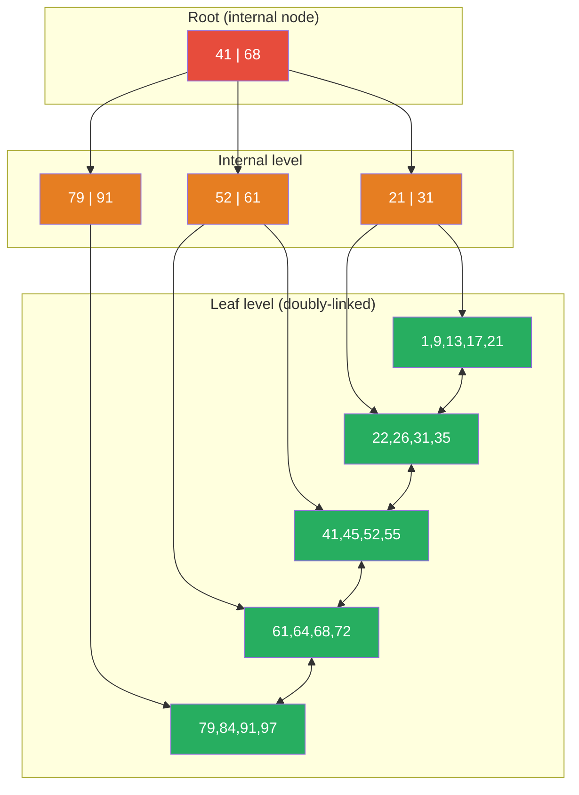

# [BEE-446] B-Tree Internals

:::info
A B-tree is a self-balancing, multi-way search tree that keeps data sorted and allows searches, insertions, and deletions in O(log n) time; by using wide nodes sized to match disk or memory pages, it minimizes the number of I/O operations needed to traverse a large sorted dataset — making it the dominant index structure for relational databases for over fifty years.
:::

## Context

Rudolf Bayer and Edward M. McCreight invented the B-tree at Boeing Research Labs in 1970 (first published in Acta Informatica, 1972, "Organization and Maintenance of Large Ordered Indexes") in response to a specific engineering constraint: disk seeks were orders of magnitude slower than RAM accesses, and binary search trees required O(log₂ n) node visits — each potentially a separate disk seek. B-trees achieve the same O(log n) asymptotic complexity but with a branching factor (degree) of hundreds rather than two, reducing the number of node accesses to two or three for billion-row tables.

Douglas Comer's landmark survey "The Ubiquitous B-Tree" (ACM Computing Surveys, 1979) documented that by the end of the 1970s, B-trees had effectively replaced all other large-file access methods. Comer also popularized the B+ tree variant — the form used by virtually every database engine today — in which all data records reside in the leaf level and internal nodes store only keys as navigation separators. This separation enables two critical properties: (1) internal nodes fit more separators per page because they carry no record payload, increasing fanout; (2) leaf nodes are linked in a doubly-linked list, enabling efficient range scans without ascending the tree.

The practical consequence of B+ tree fanout is dramatic. InnoDB's default page size is 16 KB. An internal node storing 8-byte integer keys with 6-byte page pointers fits roughly 1,170 separator entries per page. A three-level B+ tree can therefore index approximately 1,170² × 468 ≈ 642 million rows — effectively the entire dataset of most production OLTP systems — and any random lookup requires exactly three I/O operations, predictably.

## Design Thinking

**B-trees are read-optimized; LSM-trees are write-optimized.** A B-tree update modifies the existing page in-place (a random write), which requires acquiring an exclusive latch on the page and potentially triggering a page split. An LSM-tree write appends a record to a sequential log and never modifies existing storage — maximizing write throughput but requiring compaction to bound read amplification. The crossover is roughly at 70% writes: below that threshold, B-trees win on read latency and predictability; above it, LSM-trees win on write throughput. This is why PostgreSQL and MySQL use B-trees for indexes while RocksDB (TiKV, Kafka) uses LSM-trees for write-heavy storage.

**The key type determines insert fragmentation.** Sequential keys (auto-increment integers, time-ordered UUIDs v7) always insert at the rightmost leaf — no existing pages are split, and pages reach near-100% fill before a new leaf is allocated. Random keys (UUIDv4, hash-derived values) insert uniformly across the tree, splitting pages approximately when they are 50% full — resulting in a tree with roughly 69% average fill and 45% more pages than optimal. For InnoDB specifically, the primary key is the clustered index (the entire row is stored in B+ tree leaf nodes), so a random primary key also causes random I/O for row lookups and doubles write amplification from page splits.

**Fill factor is a write-ahead reserve, not space waste.** Leaving pages intentionally under-full (PostgreSQL `fillfactor=70`, InnoDB `innodb_fill_factor=80`) means that in-place updates can expand a row without immediately triggering a page split. For tables with a high ratio of UPDATE vs INSERT, a lower fill factor reduces split frequency at the cost of using more pages. For append-only or read-heavy tables, `fillfactor=100` is optimal.

## Visual



*Internal nodes (orange) store separator keys only; leaf nodes (green) store the actual data and are doubly-linked for range scans. A search for key 55 traverses root → I2 → L3 in exactly 3 comparisons.*

## Best Practices

**Use a monotonically increasing primary key for InnoDB clustered indexes.** Because the clustered index IS the table in InnoDB, a random primary key (e.g., UUIDv4) causes every insert to split a random leaf page, filling only ~50% of pages and generating random I/O on reads. MUST use an auto-increment integer or a time-ordered identifier (UUIDv7, ULID, Snowflake ID) as the primary key when the table will be written at high throughput.

**Size pages to match the storage access granularity.** The standard 16 KB InnoDB page size assumes block-oriented disk or SSD access; for NVMe storage, 8 KB or even 4 KB pages can reduce write amplification. PostgreSQL uses 8 KB pages. Changing page size requires a `initdb` rebuild — decide at cluster creation time based on hardware characteristics.

**Choose fill factor based on the update pattern.** A table that receives only INSERTs SHOULD use `fillfactor=100` (no reserved space, maximum density). A table receiving frequent in-place UPDATEs that enlarge rows SHOULD use `fillfactor=70–80`. In PostgreSQL, per-table fill factor applies only to heap pages; index fill factor is set per index: `CREATE INDEX ... WITH (fillfactor=80)`.

**Use covering indexes to eliminate heap lookups.** A secondary index in InnoDB stores only the indexed columns plus the primary key reference — retrieving non-indexed columns requires a second random I/O to the clustered index (a "double dip" or bookmark lookup). Adding frequently-queried columns to the index (via `INCLUDE` in PostgreSQL, or by including them in InnoDB's secondary key columns) converts index scans from index-only reads to avoiding the clustered index entirely.

**Rebuild fragmented indexes periodically for random-key workloads.** After extensive random-key insertions and deletions, B-tree pages may average 50–60% fill and contain many dead slots. `REINDEX CONCURRENTLY` (PostgreSQL) or `OPTIMIZE TABLE` (MySQL InnoDB) rebuilds the index with optimal page packing. Schedule this during off-peak hours for large tables; monitor `pg_stat_user_indexes.idx_blks_read` and `pg_relation_size` to detect bloat.

**Never create an index on a low-cardinality column in isolation.** A B-tree index on a boolean or enum column with three values provides nearly zero selectivity — the database will perform a full index scan returning a third of all rows, which is slower than a sequential heap scan because of the random I/O pattern for heap fetches. SHOULD use partial indexes (`WHERE active = true`), multi-column indexes, or Bloom filter indexes instead.

## Deep Dive

**Page split algorithm.** When a leaf page overflows (a new record cannot fit), the B+ tree splits the page: approximately half the records move to a newly allocated page (the "right sibling"), the median key is promoted as a separator entry in the parent internal node, and the doubly-linked sibling list is updated. If the parent also overflows after receiving the new separator, it splits recursively — in the worst case, a split propagates all the way to the root, at which point the root splits and a new root is created, increasing tree height by one. In practice on a populated tree, splits reach the root approximately once every N/2 inserts where N is the branching factor.

For monotonic (right-side) inserts, PostgreSQL applies an optimization: instead of splitting at the midpoint, it splits at the rightmost record (the "right-split optimization"), creating a near-empty right page and keeping the left page full. This ensures monotonic workloads achieve near-100% fill.

**Page merge algorithm.** When records are deleted, a page may fall below a merge threshold (50% fill in InnoDB; triggered by VACUUM in PostgreSQL). The merge algorithm copies surviving records from the under-full page to an adjacent sibling, removes the now-empty page, and removes the corresponding separator from the parent. Merges can cascade upward but are less common than splits because deletions are typically more evenly distributed.

**InnoDB clustered vs secondary index structure.** In InnoDB, the primary key index is the *clustered index* — leaf nodes store the complete row data. Secondary indexes store the secondary key columns plus the primary key value. A query using a secondary index that needs non-covered columns must perform a second lookup into the clustered index using the primary key retrieved from the secondary index leaf — this "double-lookup" or "secondary index range scan with clustered index lookup" is a common performance footgun when primary keys are large (UUID strings vs bigints) because larger PKs increase both secondary index size and the memory pressure of the buffer pool.

**PostgreSQL nbtree optimizations.** PostgreSQL's `nbtree` implementation includes several production optimizations beyond textbook B+ trees: (1) *Deduplication* (PG 13+): when multiple index entries point to different row versions of the same logical key (due to MVCC), they are merged into a single "posting list" tuple containing a sorted array of TIDs, significantly reducing index bloat on high-write tables. (2) *Bottom-up deletion* (PG 14+): when a leaf page split is anticipated due to version churn (MVCC dead tuples), nbtree proactively scans for and removes dead index entries before the split, reducing page count. (3) *Index-only scans with visibility map*: nbtree cooperates with the heap visibility map to return query results directly from the index (without heap access) when all visible versions of a row are guaranteed to be in the index.

## Example

**Diagnosing index bloat in PostgreSQL:**

```sql
-- Check index size vs table size (high ratio = possible bloat)
SELECT
    schemaname,
    tablename,
    indexname,
    pg_size_pretty(pg_relation_size(indexrelid)) AS index_size,
    pg_size_pretty(pg_relation_size(indrelid))   AS table_size,
    round(pg_relation_size(indexrelid)::numeric /
          NULLIF(pg_relation_size(indrelid), 0) * 100, 1) AS index_pct_of_table
FROM pg_stat_user_indexes
JOIN pg_index USING (indexrelid)
ORDER BY pg_relation_size(indexrelid) DESC
LIMIT 10;

-- Estimate index bloat using pgstattuple (expensive on large tables)
CREATE EXTENSION IF NOT EXISTS pgstattuple;
SELECT
    index_size,
    round(avg_leaf_density, 1) AS avg_leaf_fill_pct,
    round((100 - avg_leaf_density) * index_size / 100)::bigint AS estimated_waste_bytes
FROM pgstatindex('users_email_idx');
-- avg_leaf_fill_pct < 70% on a non-update-heavy table suggests fragmentation

-- Rebuild a fragmented index without locking (PG 12+)
REINDEX INDEX CONCURRENTLY users_email_idx;

-- Set fill factor for an index expecting frequent in-place updates
CREATE INDEX users_email_idx ON users(email) WITH (fillfactor = 70);
ALTER INDEX users_email_idx SET (fillfactor = 70);
```

**InnoDB page split monitoring:**

```sql
-- Monitor InnoDB leaf page splits (high rate signals random-key workload)
SHOW GLOBAL STATUS LIKE 'Innodb_page_splits';
-- Innodb_page_splits: 14237  ← cumulative since server start

-- Monitor index fragmentation (data_free = unreclaimed page space)
SELECT
    table_name,
    index_name,
    stat_value AS pages,
    stat_value * 16 / 1024 AS size_kb
FROM mysql.innodb_index_stats
WHERE stat_name = 'size'
  AND table_name = 'orders';

-- Rebuild InnoDB table (rebuilds clustered B+ tree, reclaims space)
OPTIMIZE TABLE orders;

-- Configure fill factor for bulk loads (reduce leaf page reservations)
SET innodb_fill_factor = 95;  -- 95% full during bulk insert
LOAD DATA INFILE 'orders.csv' INTO TABLE orders;
SET innodb_fill_factor = 80;  -- restore production setting
```

**Sequential vs random primary key impact (InnoDB):**

```sql
-- BAD: UUID primary key causes random page splits and 50% fill
CREATE TABLE events_bad (
    id CHAR(36) PRIMARY KEY DEFAULT (UUID()),  -- UUIDv4: random
    payload JSON,
    created_at TIMESTAMP DEFAULT CURRENT_TIMESTAMP
);

-- GOOD: Auto-increment keeps insertions at the right edge; ~100% fill
CREATE TABLE events_good (
    id BIGINT UNSIGNED AUTO_INCREMENT PRIMARY KEY,
    payload JSON,
    created_at TIMESTAMP DEFAULT CURRENT_TIMESTAMP
);

-- BETTER for distributed systems: UUIDv7 / ULID preserves time-ordering
-- while remaining globally unique — insert at right edge like auto-increment
-- Use a library that generates time-prefixed UUIDs: e.g., uuid-ossp + extension
```

## Related BEEs

- [BEE-121](../Databases/121.md) -- Indexing Deep Dive: index selection strategy (when to use composite indexes, partial indexes, covering indexes) is the application-level view of B-tree internals; understanding page splits and fill factor explains why index choices have the performance characteristics they do
- [BEE-124](../Databases/124.md) -- Storage Engines: B-trees are the dominant structure in disk-based storage engines (InnoDB, PostgreSQL heap+nbtree); storage engine architecture determines how B-tree pages are cached, written, and recovered
- [BEE-443](443.md) -- Log-Structured Merge Trees: LSM-trees are the primary alternative to B-trees for write-heavy workloads; the write-amplification vs read-amplification tradeoff between them determines which structure is appropriate for a given workload
- [BEE-445](445.md) -- MVCC: Multi-Version Concurrency Control: MVCC version churn creates dead index entries that accumulate in B-tree leaf pages; PostgreSQL's bottom-up deletion and deduplication optimizations were introduced specifically to manage this interaction

## References

- [Organization and Maintenance of Large Ordered Indexes -- Bayer and McCreight, Acta Informatica, 1972](https://link.springer.com/article/10.1007/BF00288683)
- [The Ubiquitous B-Tree -- Douglas Comer, ACM Computing Surveys, 1979](https://dl.acm.org/doi/10.1145/356770.356776)
- [B+Tree Index Structures in InnoDB -- Jeremy Cole, 2013](https://blog.jcole.us/2013/01/10/btree-index-structures-in-innodb/)
- [PostgreSQL B-Tree Index Documentation](https://www.postgresql.org/docs/current/btree.html)
- [InnoDB Page Merging and Page Splitting -- Percona Blog](https://www.percona.com/blog/innodb-page-merging-and-page-splitting/)
- [B-trees and Database Indexes -- PlanetScale Blog](https://planetscale.com/blog/btrees-and-database-indexes)
