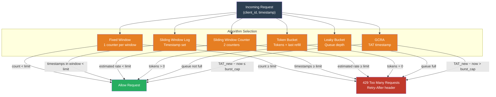

# [BEE-449] Distributed Rate Limiting Algorithms

:::info
Rate limiting protects services by bounding how many requests a client can make in a time window. The five canonical algorithms — fixed window, sliding window log, sliding window counter, token bucket, and leaky bucket — differ in burst tolerance, memory cost, and susceptibility to boundary attacks. Choosing the right algorithm requires understanding these trade-offs; choosing the right implementation requires understanding why naïve Redis scripts have race conditions.
:::

## Context

Rate limiting as a networking concept predates the web. The **leaky bucket** algorithm was formalized by Turner (1986) and later by Tanenbaum in networking textbooks as a traffic shaping primitive — conceptually a bucket that drains at a constant rate, smoothing bursty input into a steady output stream. The token bucket variant (also from the ATM/networking era) inverts the metaphor: tokens accumulate over time up to a burst cap, and each request consumes one token.

Web-scale application rate limiting became a distinct engineering problem as REST APIs proliferated in the 2000s. Twitter's API throttling, Stripe's retry-safe charge endpoint, and AWS service quotas all required algorithms that could be evaluated in milliseconds against distributed state. Redis, released in 2009, became the dominant backing store because its single-threaded command execution and Lua scripting (added in 2.6, 2012) provide the atomic multi-step operations rate limiting requires. Salvatore Sanfilippo's original Redis sorted-set sliding window and Lua-based token bucket recipes circulated widely and form the basis of most production implementations.

The **GCRA** (Generic Cell Rate Algorithm), derived from the ATM Forum's Traffic Management Specification (1996), resurfaced as a practical web rate limiter when Stripe published Evan Miller's analysis showing it is mathematically equivalent to a continuous token bucket but requires only one stored value per client — the **Theoretical Arrival Time** (TAT) — making it the most memory-efficient option.

## Design Thinking

All rate limiting algorithms answer the same question: "Given the request history for this client, should this request be allowed?" They differ in what state they maintain and what shape of traffic they permit.

### Algorithm Comparison

| Algorithm | State per client | Burst behavior | Boundary vulnerability | Best for |
|---|---|---|---|---|
| Fixed window | 1 counter + reset time | Allows 2x burst at boundary | Yes | Simple quotas, internal services |
| Sliding window log | All timestamps in window | No burst spikes | No | Precise enforcement, low traffic |
| Sliding window counter | 2 counters | Approximate smoothing | Partial | Good balance of accuracy and cost |
| Token bucket | token count + last refill | Burst up to bucket size | No | Public APIs, variable workloads |
| Leaky bucket | queue depth | No burst (constant drain) | No | Traffic shaping, streaming |
| GCRA | 1 TAT timestamp | Burst up to burst cap | No | APIs requiring token bucket semantics with minimal state |

**The fixed window boundary attack.** A client allowed 100 requests per minute can make 100 requests at 00:59 and 100 more at 01:01 — 200 requests in a two-second span — without violating the per-window limit. Fixed windows are appropriate when the quota is a coarse usage cap (billing, daily quotas) rather than a traffic regulator.

**Sliding window counter approximation.** Rather than storing every timestamp (O(n) memory per client), a sliding window counter stores two fixed-window counters — the current window count `C_current` and the previous window count `C_prev` — and estimates the current rate as:

```
rate = C_prev × (1 − elapsed_fraction) + C_current
```

This approximation overestimates the effective rate by at most one request per window period, which is acceptable for most production use cases.

**Token bucket vs. leaky bucket.** A token bucket allows bursts up to the bucket capacity: a client that has been idle accumulates tokens and can spend them in a burst. A leaky bucket does not: requests queue and drain at the constant service rate regardless of how long the client has been idle. Token bucket is the right default for public REST APIs where occasional bursts are legitimate. Leaky bucket is appropriate for traffic shaping into a downstream system with a fixed processing rate.

**GCRA: token bucket with one value.** The GCRA tracks a single TAT (Theoretical Arrival Time) per client. On each request:

```
TAT_new = max(TAT_stored, now) + (1 / rate)
if TAT_new − now > burst_cap: reject
else: store TAT_new, allow
```

The TAT represents "when the next token would arrive if the client kept consuming at exactly the rate limit." If the TAT is far in the future, the client is consuming faster than allowed. GCRA subsumes fixed-window, sliding, and token bucket semantics through the choice of burst cap, and requires only one value in Redis regardless of traffic volume.

## Visual



## Best Practices

**MUST implement Redis rate limiting operations atomically.** The naïve two-command sequence `INCR key; EXPIRE key 60` has a race condition: if the process crashes between the two commands, the key never expires and the client is permanently blocked. Use a Lua script or a Redis pipeline with `SET key 0 EX 60 NX` to initialize the counter atomically on first use. For sliding window log implementations, use `ZADD`, `ZREMRANGEBYSCORE`, and `ZCARD` in a single Lua script.

**MUST include a `Retry-After` header in 429 responses.** Clients that receive a rate limit error without a `Retry-After` value will retry immediately, creating a thundering herd. For token bucket and GCRA, the retry time is deterministic: `retry_after = (tokens_needed − tokens_available) / refill_rate`. For fixed and sliding window, it is the time until the window resets.

**SHOULD use GCRA or token bucket for public API rate limiting.** Fixed windows are vulnerable to boundary attacks and should be restricted to coarse quotas (e.g., monthly API call caps). Sliding window log requires O(requests) memory per client, which is unsuitable for high-traffic endpoints.

**SHOULD scope rate limits by multiple keys simultaneously.** A single endpoint may require both a per-user limit (100 req/min) and a global limit (10,000 req/min). Check both limits on every request and return 429 if either is exceeded. The `Retry-After` header SHOULD reflect the longer of the two reset times.

**MUST NOT rely on clock synchronization for correctness in distributed rate limiters.** Sliding window log implementations that compare request timestamps against `now − window_duration` assume server clocks are synchronized. In a distributed deployment with multiple Redis replicas or multiple rate-limiting nodes, use a monotonic counter tied to a single authoritative source (a single Redis primary, or a centralized timestamp service) rather than local wall clock comparisons.

## Example

**Token bucket in Lua (atomic, single Redis call):**

```lua
-- KEYS[1] = rate limit key (e.g., "rl:user:42")
-- ARGV[1] = current timestamp (seconds, float)
-- ARGV[2] = max tokens (burst capacity)
-- ARGV[3] = refill rate (tokens per second)
-- Returns: {allowed (0/1), remaining_tokens}

local key = KEYS[1]
local now = tonumber(ARGV[1])
local max_tokens = tonumber(ARGV[2])
local refill_rate = tonumber(ARGV[3])

local data = redis.call("HMGET", key, "tokens", "last_refill")
local tokens = tonumber(data[1]) or max_tokens
local last_refill = tonumber(data[2]) or now

-- Add tokens for time elapsed since last refill
local elapsed = now - last_refill
tokens = math.min(max_tokens, tokens + elapsed * refill_rate)

local allowed = 0
if tokens >= 1 then
    tokens = tokens - 1
    allowed = 1
end

-- Store updated state; expire after 2x the time to fill from empty
local ttl = math.ceil(max_tokens / refill_rate) * 2
redis.call("HMSET", key, "tokens", tokens, "last_refill", now)
redis.call("EXPIRE", key, ttl)

return {allowed, math.floor(tokens)}
```

**GCRA implementation (one value per client):**

```python
import time
import redis

def gcra_check(r: redis.Redis, key: str, rate: float, burst: int) -> tuple[bool, float]:
    """
    Returns (allowed, retry_after_seconds).
    rate: requests per second
    burst: maximum burst size above the steady-state rate
    """
    period = 1.0 / rate          # seconds per token
    burst_offset = period * burst  # how far into the future TAT can be

    now = time.time()

    script = """
    local key = KEYS[1]
    local now = tonumber(ARGV[1])
    local period = tonumber(ARGV[2])
    local burst_offset = tonumber(ARGV[3])

    local tat = tonumber(redis.call("GET", key)) or now

    -- TAT moves forward by one period per request
    local new_tat = math.max(tat, now) + period

    -- Reject if the TAT is further into the future than the burst offset allows
    if new_tat - now > burst_offset then
        local retry_after = tat - burst_offset - now
        return {0, retry_after}
    end

    -- Allow: store new TAT with a TTL proportional to burst capacity
    redis.call("SET", key, new_tat, "EX", math.ceil(burst_offset + period))
    return {1, 0}
    """

    result = r.eval(script, 1, key, now, period, burst_offset)
    allowed = result[0] == 1
    retry_after = float(result[1])
    return allowed, retry_after
```

**Sliding window counter (fixed-window pair):**

```python
import math
import time
import redis

def sliding_window_counter(r: redis.Redis, key: str, limit: int, window: int) -> bool:
    """
    Returns True if the request is allowed.
    window: window size in seconds
    """
    now = time.time()
    window_start = math.floor(now / window) * window
    elapsed_fraction = (now - window_start) / window

    current_key = f"{key}:{int(window_start)}"
    prev_key = f"{key}:{int(window_start - window)}"

    pipe = r.pipeline()
    pipe.get(current_key)
    pipe.get(prev_key)
    current_count, prev_count = pipe.execute()

    current_count = int(current_count or 0)
    prev_count = int(prev_count or 0)

    # Weighted estimate of requests in the current sliding window
    estimated = prev_count * (1 - elapsed_fraction) + current_count

    if estimated >= limit:
        return False

    # Increment current window counter, expire after 2 full windows
    pipe = r.pipeline()
    pipe.incr(current_key)
    pipe.expire(current_key, window * 2)
    pipe.execute()
    return True
```

## Related BEEs

- [BEE-266](../Resilience and Reliability/266.md) -- Rate Limiting and Throttling: covers the operational decisions (what to rate-limit, where to enforce, how to communicate limits to clients); this article focuses on the internal algorithm mechanics and implementation correctness
- [BEE-204](../Caching/204.md) -- Cache Stampede and Thundering Herd: a misconfigured rate limiter that omits `Retry-After` causes clients to hammer the service in lock-step, producing the same thundering herd effect as a cache stampede
- [BEE-164](../Transactions and Consistency/164.md) -- Idempotency and Exactly-Once Semantics: rate limiting and idempotency keys both use Redis atomic operations to prevent double-counting; the Lua atomicity requirement applies equally to both
- [BEE-203](../Caching/203.md) -- Distributed Caching: Redis as the rate limiting backing store inherits all the consistency trade-offs of distributed caching; Redis Cluster sharding means a given client's key must always route to the same shard

## References

- [An Analysis of Rate Limiting Algorithms -- Figma Engineering (2021)](https://www.figma.com/blog/an-analysis-of-rate-limiting-algorithms/)
- [Better Rate Limiting With Redis Sorted Sets -- Devops.com (Srisaila)](https://devops.com/better-rate-limiting-redis-sorted-sets/)
- [GCRA and the Theoretical Arrival Time -- Stripe Engineering (Evan Miller)](https://brandur.org/rate-limiting)
- [Redis Rate Limiting -- Redis Documentation](https://redis.io/glossary/rate-limiting/)
- [How Cloudflare Uses Token Bucket for Rate Limiting -- Cloudflare Blog (2021)](https://blog.cloudflare.com/counting-things-a-lot-of-different-things/)
- [ATM Traffic Management Specification -- ATM Forum, af-tm-0056.000 (1996)](https://www.broadband-forum.org/technical/download/af-tm-0056.000.pdf)
