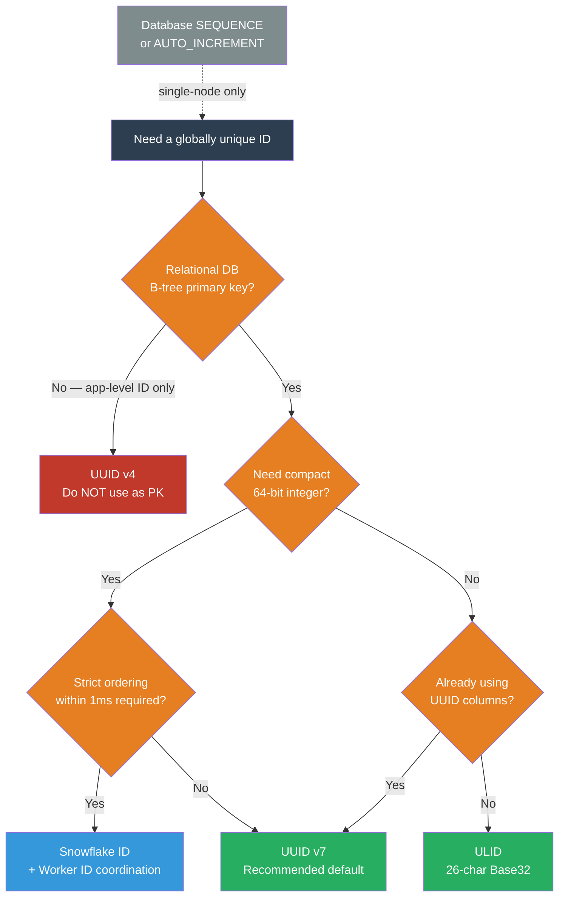

# [BEE-450] Distributed Unique ID Generation

:::info
Every distributed system needs globally unique identifiers. The challenge is generating them without a central coordinator — and doing so in a way that does not destroy database write performance, leak sensitive information, or break natural sort order.
:::

## Context

The earliest approach was a database auto-increment column. It works perfectly in a single-node setup: the database guarantees uniqueness and the sequential integers are ideal for B-tree indexes. The problem surfaces when writes are distributed across multiple primary nodes, or when IDs must be generated at the application layer before a database insert — neither case admits a single atomic counter without coordination.

**UUID v4**, introduced in RFC 4122 (2005), solved the coordination problem by generating 122 bits of cryptographic randomness. It became the default distributed ID in most web applications. However, its randomness made it a silent performance disaster for relational databases: random UUIDs inserted as primary keys scatter writes across the entire B-tree, causing up to 500× more page splits compared to sequential inserts. Each page split requires the database to acquire locks, rebalance nodes, and write additional pages — a write amplification effect that compounds under load.

In 2010, Twitter published the **Snowflake** format to replace their database sequence generator as they scaled beyond a single database node. A 64-bit Snowflake ID encodes a millisecond-precision timestamp in the high bits, a worker ID in the middle, and a per-worker sequence counter in the low bits. The high-bit timestamp makes Snowflake IDs roughly time-ordered and compact enough to fit in a `BIGINT` column. The trade-off is coordination: each worker node must be assigned a unique worker ID, which requires an operational process (typically via ZooKeeper or a configuration service).

**ULID** (Universally Unique Lexicographically Sortable Identifier), specified at github.com/ulid/spec, approached the problem differently: use the same 48-bit millisecond timestamp but fill the remaining 80 bits with cryptographic randomness rather than a worker sequence. No coordination required, but the randomness means two ULIDs generated in the same millisecond from two different nodes are not strictly ordered relative to each other.

**UUID v7**, standardized in RFC 9562 (May 2024), brought time-ordering into the official UUID standard. UUID v7 uses a 48-bit Unix epoch timestamp in milliseconds followed by 74 bits of randomness, encoded in the standard UUID hyphenated format. It has the same coordination-free property as ULID but fits natively into any system that already handles UUIDs, including PostgreSQL's `uuid` column type and most ORM libraries.

## Design Thinking

The fundamental tension is between **coordination** (required for strict ordering and compactness) and **independence** (required for fault tolerance and simplicity).

### Structure Comparison

| Format | Bits | Timestamp precision | Ordering | Coordination | Storage |
|---|---|---|---|---|---|
| UUID v4 | 128 | None | None | None | 16 bytes / 36 chars |
| UUID v7 | 128 | 1 ms | Millisecond | None | 16 bytes / 36 chars |
| ULID | 128 | 1 ms | Millisecond | None | 16 bytes / 26 chars |
| Snowflake | 64 | 1 ms | Strict per-worker | Worker ID assignment | 8 bytes / ~19 chars |
| UUID v1 | 128 | 100 ns | UUID-order* | None (but leaks MAC) | 16 bytes / 36 chars |

*UUID v1 byte order places the time fields in an order that is not lexicographically sorted; UUID v6 reorders the same bits to fix this.

### The B-tree Argument

When a UUID v4 is used as a primary key, each insert lands at a pseudorandom position in the B-tree leaf layer. The leaf page at that position is likely already full (since it was written during a prior random insert). The database must split the page, write two new pages, update the parent node, and — if the parent is also full — cascade the split upward. Under write-heavy workloads, this cascading behavior causes:

- Write amplification: 5–10 physical writes per logical insert
- Cache thrashing: the working set of hot leaf pages spans the entire index, not just the recent end
- Index bloat: split pages are never fully utilized again on random-insert workloads

Time-ordered IDs (UUID v7, ULID, Snowflake) always append to the rightmost leaf node of the B-tree. The hot page stays in the buffer pool, splits are rare and one-directional, and the fill factor remains high.

### Coordination-Free Is Good Enough for Most Systems

Strict per-ID ordering (Snowflake's guarantee) is rarely required. What most applications need is "IDs generated later should generally sort after IDs generated earlier." UUID v7 and ULID satisfy this at millisecond granularity, which is sufficient for pagination, cursor-based feeds, and audit logs. Strict ordering requires a central sequence or a per-node sequence with known worker boundaries — both of which add operational complexity. SHOULD choose a coordination-free format unless strict ordering within a millisecond is a documented requirement.

## Best Practices

**MUST NOT use UUID v4 as a primary key in relational databases with B-tree indexes.** The write amplification from random insertions degrades performance significantly under sustained write load. Use UUID v7, ULID, or Snowflake instead.

**SHOULD use UUID v7 as the default for new systems that already use UUIDs.** UUID v7 is the RFC 9562 standard, natively supported by PostgreSQL 17+ (`gen_random_uuid()` still generates v4; use `uuidv7()` or application-layer generation), and drops in anywhere a UUID column is expected. Its 74 bits of randomness provide sufficient collision resistance for all practical distributed systems.

**SHOULD use Snowflake IDs when storage compactness or strict ordering within a millisecond is required.** A 64-bit `BIGINT` takes half the storage of a 128-bit UUID, which matters for wide tables and large indexes. Snowflake also provides strict per-worker ordering within a millisecond via the sequence counter. The operational cost is worker ID management — use a lightweight coordination service (etcd, ZooKeeper, or a database table) to lease worker IDs and implement fencing on node restart.

**MUST NOT use UUID v1 in new systems.** UUID v1 embeds the generating host's MAC address in the low bits, which leaks network topology information and creates predictability. UUID v6 reorders UUID v1's bits for lexicographic sortability but retains the MAC address concern. RFC 9562 recommends against both for new applications.

**MUST include a timestamp component in IDs used for pagination or feed ordering.** Pure random IDs (UUID v4) cannot be used as cursors in time-ordered feeds — the application must maintain a separate `created_at` column and use a composite cursor. Time-ordered IDs encode the creation time in the ID itself, enabling single-column cursor pagination.

**SHOULD include a monotonicity mode in ULID generation within a single process.** The ULID spec defines a monotonic mode: if two ULIDs are generated within the same millisecond, the random component of the second is incremented by one rather than regenerated. This ensures ULIDs from the same generator are strictly ordered even within a millisecond, preventing inversion in single-node audit logs.

## Visual



## Example

**UUID v7 generation (application layer):**

```python
import os
import time
import struct

def generate_uuid_v7() -> str:
    """
    Generate a UUID v7 (RFC 9562): 48-bit ms timestamp + version + 74 random bits.
    Lexicographically sortable, coordination-free.
    """
    ms = int(time.time() * 1000)  # 48-bit millisecond timestamp

    # 16 bytes: timestamp (6) + version nibble (1) + random (9)
    rand = os.urandom(10)

    # Pack: 48-bit timestamp in first 6 bytes
    ts_bytes = struct.pack(">Q", ms)[2:]  # drop top 2 bytes (ms fits in 6)

    # Byte 6: version=7 (0111) in high nibble, 4 random bits in low nibble
    ver_byte = (0x70) | (rand[0] & 0x0F)

    # Byte 8: variant bits 10xxxxxx
    var_byte = (0x80) | (rand[1] & 0x3F)

    raw = ts_bytes + bytes([ver_byte, rand[2]]) + bytes([var_byte]) + rand[3:10]

    # Format as standard UUID string
    hex_str = raw.hex()
    return f"{hex_str[:8]}-{hex_str[8:12]}-{hex_str[12:16]}-{hex_str[16:20]}-{hex_str[20:]}"

# IDs generated later always sort after IDs generated earlier (at ms granularity)
id1 = generate_uuid_v7()
time.sleep(0.001)
id2 = generate_uuid_v7()
assert id1 < id2  # lexicographic sort == time order
```

**Snowflake ID generator (with worker ID):**

```python
import time
import threading

class SnowflakeGenerator:
    """
    Twitter Snowflake: 41-bit timestamp | 10-bit worker | 12-bit sequence
    Epoch: 2010-11-04T01:42:54.657Z (Twitter's original epoch)
    Max: ~69 years, 1023 workers, 4096 IDs/ms per worker
    """
    EPOCH_MS = 1288834974657  # Twitter epoch
    WORKER_BITS = 10
    SEQUENCE_BITS = 12
    MAX_SEQUENCE = (1 << SEQUENCE_BITS) - 1   # 4095
    MAX_WORKER = (1 << WORKER_BITS) - 1       # 1023

    def __init__(self, worker_id: int):
        if not 0 <= worker_id <= self.MAX_WORKER:
            raise ValueError(f"worker_id must be 0-{self.MAX_WORKER}")
        self.worker_id = worker_id
        self.sequence = 0
        self.last_ms = -1
        self._lock = threading.Lock()

    def next_id(self) -> int:
        with self._lock:
            ms = int(time.time() * 1000) - self.EPOCH_MS
            if ms == self.last_ms:
                self.sequence = (self.sequence + 1) & self.MAX_SEQUENCE
                if self.sequence == 0:
                    # Sequence exhausted: wait for next millisecond
                    while ms <= self.last_ms:
                        ms = int(time.time() * 1000) - self.EPOCH_MS
            else:
                self.sequence = 0
            self.last_ms = ms
            return (ms << 22) | (self.worker_id << 12) | self.sequence

# Usage: worker_id assigned via coordination service at startup
gen = SnowflakeGenerator(worker_id=1)
id1 = gen.next_id()
id2 = gen.next_id()
assert id1 < id2  # guaranteed strict ordering within a worker
```

**ULID monotonic generation:**

```python
import os
import time

class ULIDGenerator:
    """
    ULID: 48-bit ms timestamp (Crockford Base32) + 80-bit random
    Monotonic mode: increment random bits within the same millisecond.
    """
    ENCODING = "0123456789ABCDEFGHJKMNPQRSTVWXYZ"

    def __init__(self):
        self._last_ms = -1
        self._last_random = 0

    def _encode(self, n: int, length: int) -> str:
        chars = []
        for _ in range(length):
            chars.append(self.ENCODING[n & 0x1F])
            n >>= 5
        return "".join(reversed(chars))

    def generate(self) -> str:
        ms = int(time.time() * 1000)
        if ms == self._last_ms:
            # Monotonic increment: prevents inversion within same millisecond
            self._last_random += 1
        else:
            self._last_ms = ms
            self._last_random = int.from_bytes(os.urandom(10), "big")

        ts_part = self._encode(ms, 10)         # 48 bits → 10 Base32 chars
        rand_part = self._encode(self._last_random & ((1 << 80) - 1), 16)  # 80 bits → 16 chars
        return ts_part + rand_part
```

## Related BEEs

- [BEE-424](424.md) -- Distributed Locking: Snowflake worker ID assignment requires a distributed lock or lease at startup to prevent two nodes from claiming the same worker ID
- [BEE-436](436.md) -- Lease-Based Coordination: the recommended mechanism for assigning and renewing Snowflake worker IDs without a permanent coordinator
- [BEE-446](446.md) -- B-Tree Internals: explains why random primary keys cause page splits and write amplification; provides the mechanical justification for preferring time-ordered IDs
- [BEE-427](427.md) -- Clock Synchronization and Physical Time: UUID v7, ULID, and Snowflake all depend on wall-clock time; NTP drift and clock skew can cause ID inversion across nodes
- [BEE-447](447.md) -- Fencing Tokens: monotonically increasing IDs (Snowflake) can serve as fencing tokens when the ordering guarantee is needed for resource protection

## References

- [Announcing Snowflake -- Twitter Engineering Blog (2010)](https://blog.twitter.com/engineering/en_us/a/2010/announcing-snowflake)
- [RFC 9562: Universally Unique IDentifiers (UUIDs) -- IETF (May 2024)](https://www.rfc-editor.org/rfc/rfc9562.html)
- [ULID Specification -- github.com/ulid/spec](https://github.com/ulid/spec)
- [Time-Sortable Identifiers: UUIDv7, ULID, and Snowflake Compared -- Authgear](https://www.authgear.com/post/time-sortable-identifiers-uuidv7-ulid-snowflake)
- [Avoid UUID Version 4 Primary Keys -- Andy Atkinson](https://andyatkinson.com/avoid-uuid-version-4-primary-keys)
- [Stateless Snowflake: A Cloud-Agnostic Distributed ID Generator -- arXiv (2024)](https://arxiv.org/pdf/2512.11643)
