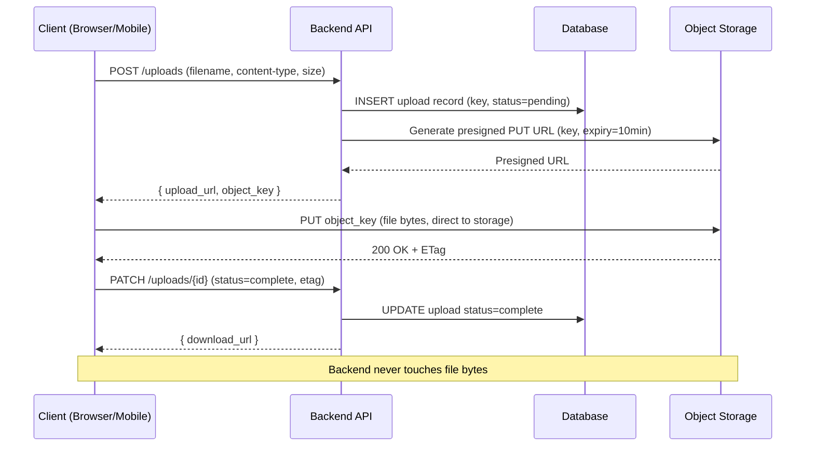

# [BEE-459] Presigned URLs and Object Storage Patterns

:::info
Presigned URLs grant temporary, scoped access to private objects in object storage — allowing clients to upload or download files directly to/from storage without routing bytes through the backend server and without exposing long-term credentials.
:::

## Context

Object storage systems (Amazon S3, Google Cloud Storage, Cloudflare R2, and S3-compatible alternatives) store files as objects in flat namespaces called buckets. The naive integration pattern proxies every file transfer through the application server: the client sends the file to the backend, the backend writes it to storage, and on download the backend reads from storage and streams it to the client. This works but does not scale well: the backend server's bandwidth and CPU become the bottleneck for transfers that could go directly between the client and storage.

**Presigned URLs** solve this by delegating a single, time-limited, scope-limited operation to the client. The backend generates a URL that encodes the bucket, object key, permitted HTTP method (GET or PUT), expiry time, and a cryptographic signature computed from the service's access key. The client presents this URL directly to the storage service, which validates the signature and performs the operation — without the backend server being in the data path. The client never sees the underlying access key.

The presigned URL approach became the standard for web file upload and media delivery architectures in the early 2010s, when S3's REST API matured enough to support upload via `PUT` without requiring a POST-based multipart form. The model is now implemented identically across all major object storage services using AWS Signature Version 4.

A related but distinct technology is the **CDN-signed URL**. Where a presigned S3 URL goes directly to the origin storage, a CDN-signed URL (CloudFront signed URL, Akamai EdgeAuth token, Cloudflare Workers signed URL) routes through the CDN edge. CDN-signed URLs are preferred for media streaming and downloads that benefit from edge caching and geographic distribution; storage presigned URLs are preferred for uploads and one-time downloads of unique objects.

## Design Thinking

### The Two-Request Upload Flow

The standard direct-upload pattern has two requests:

1. **Client → Backend**: "I want to upload `document.pdf` (200 KB, `application/pdf`). Give me an upload URL."
2. **Backend → Client**: Returns a presigned `PUT` URL (with an expiry of 5–60 minutes) and the final object key.
3. **Client → Storage**: `PUT document.pdf` directly to the presigned URL. The backend is not in this data path.
4. **Client → Backend**: "Upload complete. Here is the object key." The backend records the object key in its database.

This eliminates backend bandwidth cost for transfers, reduces latency (one fewer hop), and scales upload throughput independently of backend capacity.

### Object Key Design

The object key (the "path" within a bucket) is an architectural decision with security and operational implications:

**Avoid user-controlled keys.** If a client can specify `../../admin/config.json` as the key, or if the key is a predictable value like `user-123/avatar.jpg`, other users may be able to guess and download private objects by constructing the URL. Use a random UUID or a content hash as the key prefix:

```
uploads/{uuid}/{original-filename}           # good: unguessable prefix
users/{user_id}/avatar.jpg                   # bad: predictable, enumerable
```

**Content-addressed storage** uses the SHA-256 hash of the file content as the key: `objects/sha256/{hash}`. This provides automatic deduplication (two identical files map to the same key), immutability (the content at a key never changes), and integrity verification. The backend can check whether the object already exists before issuing a presigned PUT URL and skip the upload entirely.

### Expiry Windows

Presigned URLs are bearer tokens: anyone who possesses the URL can perform the permitted operation until the URL expires. Expiry must be set based on the use case:

| Use case | Recommended expiry |
|---|---|
| Upload URL (browser/mobile) | 5–30 minutes |
| Download URL (user-facing link) | 1–24 hours |
| Internal service-to-service | 1–5 minutes |
| Shared download link (emailed to user) | 1–7 days |
| CDN-signed URL for streaming media | Duration of the session + buffer |

Do not use maximum allowed expiry (7 days on S3) as a default. Shorter expiry limits the blast radius if a URL leaks.

## Best Practices

**MUST generate presigned PUT URLs with object key restrictions set server-side.** The client should never determine the final storage key. The backend generates the key (UUID prefix + sanitized filename), records it in the database before issuing the URL, and returns only the presigned URL to the client. If the client provides a filename, it MUST be sanitized and appended as a suffix, not used as the full key.

**MUST set `Content-Type` and `Content-Length` conditions on presigned PUT URLs when possible.** A presigned PUT URL without content-type restrictions allows a client to upload any MIME type to a key that the backend expects to contain a PDF. Use pre-signed URL policy conditions to restrict the allowed content-type and maximum content-length:

```python
# boto3: generate a presigned PUT URL restricted to PDF under 10MB
s3 = boto3.client("s3")
url = s3.generate_presigned_url(
    "put_object",
    Params={
        "Bucket": "my-bucket",
        "Key": f"uploads/{uuid4()}/{filename}",
        "ContentType": "application/pdf",
        "ContentLength": max_size_bytes,   # enforced by S3 if Content-Length header sent
    },
    ExpiresIn=600,   # 10 minutes
)
```

**MUST configure CORS on the bucket for browser uploads.** Browsers enforce the Same-Origin Policy on `PUT` requests. Without a CORS configuration allowing `PUT` from the application's origin, the browser will reject the upload. The CORS configuration MUST specify the allowed origins explicitly — `AllowedOrigins: ["https://app.example.com"]` — not the wildcard `*`, which would allow any origin to upload.

**MUST NOT use presigned GET URLs for objects that require access control tied to the authenticated user's current state.** Presigned GET URLs are bearer tokens. If a user's access is revoked after the URL is issued, the URL remains valid until it expires. For objects requiring dynamic access control (subscription-gated content, healthcare records), prefer short expiry (1–5 minutes) or a signed-URL-via-proxy approach where the backend validates the session on every request.

**SHOULD use multipart upload for files larger than 100 MB.** Multipart upload allows parallel part uploads, automatic retry of individual parts, and recovery from network interruption. The flow: (1) backend initiates multipart upload and receives an `uploadId`; (2) backend issues a presigned URL for each part (minimum 5 MB per part, up to 10,000 parts); (3) client uploads parts in parallel, collecting ETags; (4) client sends ETags to backend; (5) backend calls `CompleteMultipartUpload`. Files above 5 GB require multipart upload on S3 (single PUT limit).

**SHOULD use content-addressed storage (hash-based keys) for user-uploaded content when deduplication matters.** Compute the SHA-256 of the file before upload. Check whether the object exists at `objects/sha256/{hash}`. If it does, skip the upload and return the existing object reference. If not, issue a presigned PUT URL using the hash as the key. This eliminates duplicate storage for identical files and is inherently immutable — the content at a hash key never changes.

**MUST protect CDN-signed URLs with appropriate policies when serving private media.** CDN-signed URLs (CloudFront signed URLs, Cloudflare signed tokens) SHOULD include: the specific resource path or wildcard prefix (not `*`), an expiry time tied to the authenticated session, and optionally an IP restriction for high-security content. CDN-signed cookies are preferred over per-URL signing when a user accesses multiple resources in a session (e.g., a video player loading manifest, segments, and subtitles).

**SHOULD track object references in the database before issuing upload URLs.** Record the expected object key and metadata (user, content-type, expected size) in a database row with status `pending` before generating the presigned URL. After the client confirms upload completion, mark the record `complete`. A background cleanup job can delete `pending` records older than 1 hour (failed uploads that were never completed) and invoke `DeleteObject` on the corresponding storage key.

## Visual



## Example

**Backend: generate presigned upload URL and presigned download URL (Python/boto3):**

```python
import boto3
import hashlib
import uuid
from pathlib import Path

s3 = boto3.client("s3", region_name="us-east-1")
BUCKET = "my-app-uploads"
MAX_UPLOAD_SIZE = 50 * 1024 * 1024  # 50 MB

def create_upload_url(user_id: str, filename: str, content_type: str) -> dict:
    """
    Generate a presigned PUT URL for direct browser-to-S3 upload.
    The client uploads directly; the backend never sees the file bytes.
    """
    # Sanitize filename: keep only the extension, generate random prefix
    ext = Path(filename).suffix.lower()[:10]  # limit extension length
    object_key = f"uploads/{user_id}/{uuid.uuid4()}{ext}"

    upload_url = s3.generate_presigned_url(
        "put_object",
        Params={
            "Bucket": BUCKET,
            "Key": object_key,
            "ContentType": content_type,
        },
        ExpiresIn=600,   # 10 minutes to start the upload
        HttpMethod="PUT",
    )

    return {"upload_url": upload_url, "object_key": object_key}


def create_download_url(object_key: str, expiry_seconds: int = 3600) -> str:
    """
    Generate a presigned GET URL for temporary private object access.
    The URL is a bearer token valid for expiry_seconds.
    """
    return s3.generate_presigned_url(
        "get_object",
        Params={"Bucket": BUCKET, "Key": object_key},
        ExpiresIn=expiry_seconds,
    )


def create_upload_url_content_addressed(file_sha256: str, content_type: str) -> dict:
    """
    Content-addressed upload: check if object already exists before issuing URL.
    Two identical files produce the same key and require only one storage copy.
    """
    object_key = f"objects/sha256/{file_sha256}"

    # Check if the object already exists — skip upload if so
    try:
        s3.head_object(Bucket=BUCKET, Key=object_key)
        return {"object_key": object_key, "already_exists": True}
    except s3.exceptions.ClientError:
        pass  # Object does not exist; issue upload URL

    upload_url = s3.generate_presigned_url(
        "put_object",
        Params={"Bucket": BUCKET, "Key": object_key, "ContentType": content_type},
        ExpiresIn=600,
    )
    return {"upload_url": upload_url, "object_key": object_key, "already_exists": False}
```

**Multipart upload: presigned URLs per part (Python/boto3):**

```python
def initiate_multipart_upload(object_key: str, content_type: str, part_count: int) -> dict:
    """
    For files > 100MB: initiate multipart upload, return presigned URL per part.
    Client uploads parts in parallel, then calls complete_multipart_upload.
    """
    response = s3.create_multipart_upload(
        Bucket=BUCKET, Key=object_key, ContentType=content_type
    )
    upload_id = response["UploadId"]

    # Issue a presigned URL for each part (minimum 5MB per part except the last)
    part_urls = []
    for part_number in range(1, part_count + 1):
        url = s3.generate_presigned_url(
            "upload_part",
            Params={
                "Bucket": BUCKET,
                "Key": object_key,
                "UploadId": upload_id,
                "PartNumber": part_number,
            },
            ExpiresIn=3600,  # 1 hour per part
        )
        part_urls.append({"part_number": part_number, "upload_url": url})

    return {"upload_id": upload_id, "parts": part_urls}


def complete_multipart_upload(object_key: str, upload_id: str, parts: list[dict]):
    """
    parts: [{"part_number": 1, "etag": "abc123"}, ...]
    ETags are returned by S3 in the response header of each part PUT.
    """
    s3.complete_multipart_upload(
        Bucket=BUCKET,
        Key=object_key,
        UploadId=upload_id,
        MultipartUpload={
            "Parts": [
                {"PartNumber": p["part_number"], "ETag": p["etag"]} for p in parts
            ]
        },
    )
```

**Bucket CORS configuration (for browser uploads):**

```json
[
  {
    "AllowedHeaders": ["Content-Type", "Content-Length", "Content-MD5"],
    "AllowedMethods": ["PUT", "GET"],
    "AllowedOrigins": ["https://app.example.com"],
    "ExposeHeaders": ["ETag"],
    "MaxAgeSeconds": 3000
  }
]
```

## Related BEEs

- [BEE-34](../Security Fundamentals/34.md) -- Cryptographic Basics for Engineers: presigned URLs are HMAC-SHA256 signatures over a canonical request string; the bearer-token security model means URL confidentiality is equivalent to key confidentiality
- [BEE-304](../Performance and Scalability/304.md) -- Content Delivery and Edge Computing: CDN-signed URLs extend presigned URL patterns to the edge; media streaming uses CDN-signed URLs rather than origin presigned URLs to benefit from geographic caching
- [BEE-72](../API Design and Communication Protocols/72.md) -- Idempotency in APIs: the upload initiation endpoint SHOULD be idempotent; using a client-supplied idempotency key prevents duplicate pending upload records if the client retries the request

## References

- [Using Presigned URLs -- Amazon S3 User Guide](https://docs.aws.amazon.com/AmazonS3/latest/userguide/using-presigned-url.html)
- [Signed URLs -- Google Cloud Storage Documentation](https://cloud.google.com/storage/docs/access-control/signed-urls)
- [Presigned URLs -- Cloudflare R2 Documentation](https://developers.cloudflare.com/r2/api/s3/presigned-urls/)
- [Uploading Large Objects Using Multipart Upload -- AWS Compute Blog](https://aws.amazon.com/blogs/compute/uploading-large-objects-to-amazon-s3-using-multipart-upload-and-transfer-acceleration/)
- [Using Signed URLs -- Amazon CloudFront Developer Guide](https://docs.aws.amazon.com/AmazonCloudFront/latest/DeveloperGuide/private-content-signed-urls.html)
- [TUS Resumable Upload Protocol -- tus.io](https://tus.io/protocols/resumable-upload)
- [How to Securely Transfer Files with Presigned URLs -- AWS Security Blog](https://aws.amazon.com/blogs/security/how-to-securely-transfer-files-with-presigned-urls/)
