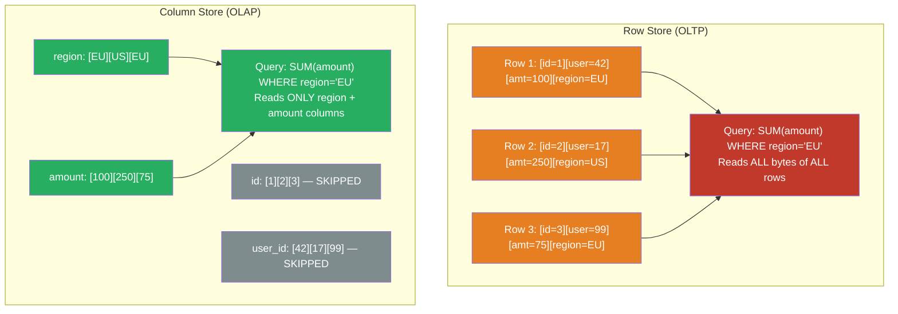

# [BEE-464] Column-Oriented Storage

:::info
Column-oriented (columnar) storage physically lays data out by column rather than by row, so a query scanning one column of a million-row table reads a contiguous block of that column's values rather than skipping through row-interleaved bytes — yielding order-of-magnitude improvements for aggregation-heavy OLAP workloads.
:::

## Context

Traditional relational databases store each row contiguously on disk: all columns of row 1, then all columns of row 2, and so on. This layout is optimal for OLTP queries that retrieve or update a complete row (`SELECT * FROM orders WHERE id = 42`), because a single disk read fetches all columns needed. But for analytical queries that aggregate one or two columns across millions of rows (`SELECT SUM(amount) FROM orders WHERE region = 'EU'`), the row layout forces the storage engine to read every column of every row even when 90% of those bytes are irrelevant.

Stonebraker and Abadi proposed column stores as a solution to this read amplification in the mid-2000s. Vertica (2005), the academic C-Store system (Stonebraker et al., 2005), and MonetDB (developed at CWI Amsterdam over two decades) demonstrated that columnar storage could outperform row stores on analytical workloads by 10–100× without requiring special hardware. Abadi, Madden, and Hachem's SIGMOD 2008 paper "Column-Stores vs. Row-Stores: How Different Are They Really?" showed that naive column store implementations underperform optimized row stores; the gains come from a combination of late materialization, compression, and vectorized execution working together.

Google's Dremel system (Melnik et al., 2010) extended the model to nested data (records with repeated fields), introducing the Dremel encoding that became the foundation of Apache Parquet — the de facto standard columnar file format used by Spark, Hive, BigQuery, Snowflake, and DuckDB.

The rise of cloud data warehouses (Snowflake, BigQuery, Redshift) and in-process analytics engines (DuckDB) has made columnar storage a practitioner concern, not just a database internals topic. Backend engineers increasingly write ETL pipelines that produce Parquet files, run analytics against columnar stores, and make schema decisions that affect compression efficiency.

## Design Thinking

### Physical Layout

In a row store, the table `orders(id, user_id, amount, region, created_at)` is serialized as:

```
[1][user:42][100.00][EU][2024-01-01] [2][user:17][250.00][US][2024-01-01] ...
```

In a column store, the same table is serialized as five separate column files:

```
id:      [1][2][3]...
user_id: [42][17][99]...
amount:  [100.00][250.00][75.00]...
region:  [EU][US][US]...
```

A query `SELECT SUM(amount) FROM orders WHERE region = 'EU'` reads only the `region` column (to build a predicate mask) and the `amount` column. The `id`, `user_id`, and `created_at` columns are never touched.

### Compression Efficiency

Columnar layout enables dramatically better compression because values within a column are homogeneous and often have low cardinality or sorted order:

**Run-Length Encoding (RLE)**: If `region` has values `[EU, EU, EU, EU, US, US, US]`, store it as `[(EU, 4), (US, 3)]`. Works well for low-cardinality columns or sorted data.

**Dictionary Encoding**: Replace string values with integer codes and store a dictionary separately. `[EU, US, EU, AU]` becomes `[0, 1, 0, 2]` with dictionary `{0:EU, 1:US, 2:AU}`. Strings of 20 bytes become 1–2 byte integers, often reducing storage by 10× for categorical columns.

**Bit-packing / Frame-of-Reference**: Integers with a small range are stored in fewer bits. A column of values between 0 and 255 needs only 8 bits per value, not 32 or 64.

**Delta encoding**: For monotonically increasing values (timestamps, auto-increment IDs), store the first value and the delta between consecutive values. Large integers become small deltas.

These techniques interact: Parquet stores column data in pages and applies dictionary encoding first, then uses RLE or bit-packing on the encoded values. A real-world `region` column with 5 distinct values across 10 million rows might compress to under 3 MB, compared to 100+ MB in a row store.

### Vectorized Execution

Modern columnar engines exploit CPU SIMD (Single Instruction, Multiple Data) instructions. Rather than processing one value per iteration:

```
for row in rows:
    sum += row.amount  # scalar
```

A vectorized engine operates on a vector (batch) of 1024 values at once, letting the CPU execute 8–32 additions in a single SIMD instruction:

```
# process 1024 amounts in one batch, using AVX-512 instructions
sum = simd_sum(amount_batch)
```

MonetDB pioneered this model; DuckDB's execution engine is built around vectorized processing of columnar data. The combination of column-pruning (reading fewer bytes), better cache locality (homogeneous values fit in L1/L2 cache), and SIMD parallelism explains the 10–100× speedup over row stores on aggregation workloads.

### Parquet File Format

Apache Parquet implements the Dremel nested data model. A Parquet file is organized as:

- **Row groups**: horizontal partitions of the table (default 128 MB). Each row group contains all columns for a subset of rows.
- **Column chunks**: within a row group, data for one column stored contiguously.
- **Pages**: the smallest unit of encoding and compression within a column chunk (default 1 MB).
- **Footer**: column statistics (min, max, null count) per row group, enabling predicate pushdown — a reader can skip entire row groups without reading their data.

Statistics-based row group skipping is the key optimization for selective queries. If the query filters `WHERE amount > 1000` and a row group's `amount` column has max = 500, the entire row group is skipped.

## Best Practices

**MUST use columnar formats (Parquet, ORC) for analytical workloads and ETL pipelines, not row-oriented formats (CSV, JSON, Avro rows).** A 10 GB CSV file with 50 columns, when converted to Parquet with snappy compression, typically becomes 1–3 GB and is read 5–20× faster for column-selective queries. This applies equally to files stored in object storage (S3, GCS) that are processed by Spark or Athena.

**MUST sort data within Parquet files by high-cardinality filter columns to maximize row group skipping.** If queries frequently filter by `user_id`, sort the Parquet file by `user_id` before writing. Row groups will then have small min/max ranges for `user_id`, and most row groups will be skipped entirely for point lookups. Unsorted files require reading every row group.

**SHOULD choose column encoding based on cardinality and data distribution:**

| Column type | Recommended encoding |
|---|---|
| Low-cardinality strings (country, status) | Dictionary + RLE |
| High-cardinality strings (name, email) | Dictionary + bit-packing |
| Monotonic integers (timestamps, IDs) | Delta + bit-packing |
| Float aggregations (amount, price) | Plain or byte-stream split |
| Boolean flags | RLE bit-packed |

Most engines (Parquet, DuckDB, Snowflake) choose encodings automatically; understand the defaults to know when manual hints are warranted.

**MUST NOT use column stores for write-heavy OLTP workloads.** Inserting a single row into a column store requires appending to every column file — the opposite of a row store's single sequential write. Column stores handle inserts via write-optimized delta buffers (e.g., Snowflake's micro-partition staging, DuckDB's row-group buffer), which are periodically merged into the main columnar storage. For transactional workloads with frequent single-row inserts, updates, and point lookups, a row store remains the correct choice.

**SHOULD partition large Parquet datasets by the most common filter dimension.** Writing Parquet files to a path like `s3://bucket/orders/region=EU/year=2024/` enables partition pruning: a query `WHERE region = 'EU' AND year = 2024` scans only the matching partition directory. Combine with row group statistics for two levels of skipping. Common partition keys: date/timestamp (for time-series), tenant_id (for multi-tenant analytics), region, or status.

**SHOULD use Apache Arrow as the in-memory columnar format for inter-process data exchange.** Arrow defines a language-independent columnar memory layout with zero-copy serialization. Parquet is the on-disk format; Arrow is the in-memory format. Modern analytical pipelines use Parquet for storage and Arrow for in-flight data between systems (Python pandas/polars ↔ Spark ↔ DuckDB ↔ query engines), avoiding the serialization overhead of JSON or Avro.

**MUST include column statistics in Parquet footer — do not disable statistics.** Statistics are written by default but can be disabled by some writers. Without statistics, query engines cannot skip row groups and must read the entire file. Keep statistics enabled for all columns that appear in WHERE clauses.

## Visual



## Example

**Writing and reading Parquet with PyArrow:**

```python
import pyarrow as pa
import pyarrow.parquet as pq
import pyarrow.compute as pc

# Define schema with explicit types for optimal encoding
schema = pa.schema([
    pa.field("order_id",   pa.int64()),
    pa.field("user_id",    pa.int32()),
    pa.field("amount",     pa.float64()),
    pa.field("region",     pa.dictionary(pa.int8(), pa.string())),  # dict-encode low-cardinality
    pa.field("created_at", pa.timestamp("ms", tz="UTC")),
])

table = pa.table({
    "order_id":   pa.array([1, 2, 3, 4, 5], type=pa.int64()),
    "user_id":    pa.array([42, 17, 99, 42, 17], type=pa.int32()),
    "amount":     pa.array([100.0, 250.0, 75.0, 300.0, 50.0]),
    "region":     pa.array(["EU", "US", "EU", "US", "EU"]).cast(
                      pa.dictionary(pa.int8(), pa.string())),
    "created_at": pa.array([...], type=pa.timestamp("ms", tz="UTC")),
}, schema=schema)

# Write partitioned by region — enables partition pruning at query time
pq.write_to_dataset(
    table,
    root_path="s3://my-bucket/orders/",
    partition_cols=["region"],
    compression="snappy",           # fast compression; use zstd for archival
    row_group_size=128 * 1024 * 1024,  # 128 MB row groups
    write_statistics=True,          # MUST be True for predicate pushdown
)

# Read with predicate pushdown — only EU rows are read from disk
dataset = pq.read_table(
    "s3://my-bucket/orders/region=EU/",
    columns=["order_id", "amount"],              # column pruning
    filters=[("amount", ">", 100.0)],            # row group statistics skipping
)
total = pc.sum(dataset.column("amount")).as_py()
```

**DuckDB querying Parquet files directly:**

```sql
-- DuckDB can query Parquet in S3 natively; partition pruning is automatic
-- when path contains hive-style partitions (region=EU/)

INSTALL httpfs;
LOAD httpfs;
SET s3_region = 'us-east-1';

-- Column pruning + partition pruning + row group statistics all applied
SELECT region, SUM(amount) AS total
FROM read_parquet('s3://my-bucket/orders/**/*.parquet', hive_partitioning=true)
WHERE region = 'EU'
  AND created_at >= '2024-01-01'
GROUP BY region;

-- Inspect row group statistics to verify pushdown is working
SELECT *
FROM parquet_metadata('s3://my-bucket/orders/region=EU/data.parquet')
LIMIT 5;
```

**Schema design for columnar compression efficiency:**

```sql
-- Poor: high-cardinality free-text column mixed with analytics columns
-- dictionary encoding does nothing for uuid strings
CREATE TABLE events (
    event_id  TEXT,         -- UUID: 36 chars, near-unique, no compression benefit
    user_id   INTEGER,      -- low cardinality relative to events: compresses well
    action    TEXT,         -- 10-20 distinct values: excellent RLE + dict compression
    metadata  JSONB,        -- opaque blob: cannot be compressed or pruned at column level
    ts        TIMESTAMPTZ   -- monotonic: delta encoding, ~4 bytes per value
);

-- Better: decompose JSONB into typed columns for analytics path;
-- keep JSONB only in the row store for flexible access
CREATE TABLE events_parquet (
    event_id  BIGINT,       -- auto-increment; delta encoding: ~2 bytes per value
    user_id   INTEGER,
    action    TEXT,         -- dict-encoded: 1 byte per value if <= 256 distinct values
    page      TEXT,         -- partition key candidate
    duration_ms INTEGER,
    ts        TIMESTAMP
);
-- Separate OLTP row store retains the full JSONB metadata for point lookups
```

## Implementation Notes

**DuckDB**: In-process OLAP engine with a vectorized columnar execution engine. Reads Parquet, CSV, Arrow, and JSON natively. PRAGMA statements expose execution details (`EXPLAIN ANALYZE`). Ideal for analytics on the local machine or in a Lambda function without spinning up a cluster.

**Apache Spark / Databricks**: Writes Parquet by default (`df.write.parquet(path)`). Use `spark.sql.parquet.filterPushdown = true` (default) to enable predicate pushdown. Sort within each partition using `sortWithinPartitions("user_id")` before writing to improve row group statistics.

**Amazon Athena / Google BigQuery**: Both read Parquet from object storage with partition pruning and predicate pushdown. BigQuery uses its own internal columnar format (Capacitor) but exports/imports Parquet. Athena costs are proportional to bytes scanned — columnar format with statistics is the primary cost optimization lever.

**Snowflake**: Uses micro-partitions (50–500 MB columnar files) with automatic clustering. Explicit `CLUSTER BY` keys enable micro-partition pruning equivalent to row group skipping. Natural clustering by load order is often sufficient; explicit clustering is warranted only for frequently filtered high-cardinality columns.

**PostgreSQL**: Row-oriented by default. The `pg_columnar` extension (Citus/Azure Cosmos) and `timescaledb`'s columnar compression add columnar storage for append-only data. Use for hot/cold tiering: recent data in row format for inserts; old data compressed in columnar format for range scans.

## Related BEEs

- [BEE-124](../Data Storage and Database Fundamentals/124.md) -- Storage Engines: covers LSM Trees and B-Trees, both of which are row-oriented storage engines; column-oriented storage is a third model optimized for analytical read patterns
- [BEE-143](../Data Modeling and Schema Design/143.md) -- Encoding and Serialization Formats: covers Avro, Protocol Buffers, and Thrift; Parquet and Arrow are the columnar equivalents for analytical workloads
- [BEE-121](../Data Storage and Database Fundamentals/121.md) -- Indexing Deep Dive: column stores use statistics-based skipping (min/max per row group) rather than traditional B-tree indexes; understanding both helps choose the right tool
- [BEE-303](../Performance and Scalability/303.md) -- Profiling and Bottleneck Identification: I/O read amplification is the primary bottleneck that columnar storage eliminates; use profiling to confirm before migrating

## References

- [Designing Data-Intensive Applications, Chapter 3 — Martin Kleppmann (2017)](https://dataintensive.net/)
- [Dremel: Interactive Analysis of Web-Scale Datasets — Melnik et al., PVLDB 2010](https://dl.acm.org/doi/10.14778/1920841.1920886)
- [Column-Stores vs. Row-Stores: How Different Are They Really? — Abadi, Madden, Hachem, SIGMOD 2008](https://dl.acm.org/doi/10.1145/1376616.1376712)
- [Apache Parquet — Official Documentation](https://parquet.apache.org/)
- [Apache Arrow — Universal Columnar Format and Multi-Language Toolbox](https://arrow.apache.org/)
- [DuckDB — In-Process SQL OLAP Database](https://duckdb.org/)
- [MonetDB: Two Decades of Research in Column-Oriented Database Architectures — Idreos et al., IEEE Data Engineering Bulletin 2012](http://sites.computer.org/debull/a12mar/monetdb.pdf)
