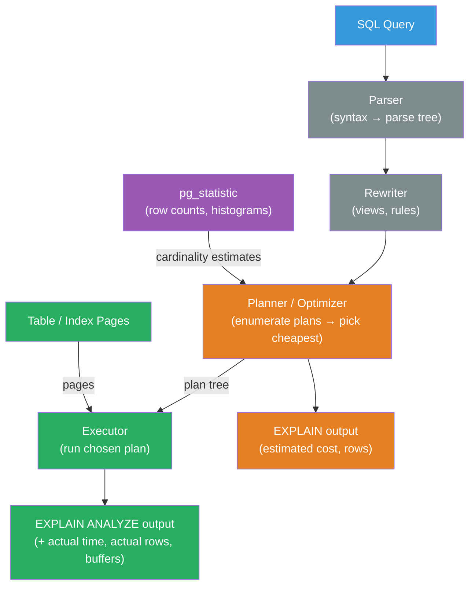

# [BEE-466] Database Query Planning and EXPLAIN

:::info
A query planner chooses how to execute a SQL statement by estimating the cost of alternative access paths and join methods; `EXPLAIN` makes those choices visible, and `EXPLAIN ANALYZE` adds measured runtimes — together they are the primary tool for diagnosing slow queries without guessing.
:::

## Context

Every SQL statement passes through a query planner before execution. The planner is a cost-based optimizer: it enumerates candidate execution plans — should it scan the entire table or use an index? should it use a hash join or a nested loop? — estimates the I/O and CPU cost of each, and picks the cheapest. The estimate depends on table statistics: row counts, column value distributions, correlation between physical row order and index order. When statistics are accurate, the planner chooses well. When they are stale, missing, or misleading — after a bulk load, on a column with skewed distribution, or after significant data drift — the planner's cost estimates become wrong, leading to plans that are orders of magnitude slower than optimal.

The PostgreSQL `EXPLAIN` command was introduced in the early 1990s and formalized in PostgreSQL 7.0. MySQL added `EXPLAIN` support in version 4.0. Both follow the same principle: print the tree of plan nodes the executor will use, annotated with estimated row counts and costs. `EXPLAIN ANALYZE` executes the query and adds the measured actual row counts and timings alongside the estimates — the mismatch between estimated and actual rows is the most reliable indicator of a planning problem.

`EXPLAIN` output is the industry-standard starting point for query performance investigations. The pattern is always the same: run `EXPLAIN ANALYZE` on the slow query, find the node where actual rows diverge most from estimated rows, update statistics or add an index at that point, and measure again. Markus Winand's *Use The Index, Luke* (2011, use-the-index-luke.com) systematized this methodology and remains the most cited practitioner reference for SQL performance analysis.

## Design Thinking

### The Cost Model

The planner assigns a cost to each plan node in two parts:

- **Startup cost**: work done before the first row can be returned (e.g., building a hash table for a hash join).
- **Total cost**: work to return all rows.

Costs are dimensionless units calibrated against two parameters: `seq_page_cost` (cost of reading one sequential page, default 1.0) and `random_page_cost` (cost of a random page read, default 4.0). An index scan that reads 100 random pages costs 400 units; a sequential scan of the same 100 pages costs 100. The planner chooses the index scan only when the index-filtered result set is small enough to make the extra random I/O worthwhile. This threshold is why an index on a low-selectivity column (e.g., `status = 'active'` where 80% of rows match) is ignored: a full table scan is cheaper.

Setting `random_page_cost = 1.1` on SSDs (or `random_page_cost = 1.0` for NVMe) makes the planner correctly value index scans for larger result sets. Leaving it at the spinning-disk default on flash storage is a common misconfiguration.

### Row Count Estimates

The planner's biggest source of error is cardinality estimation — predicting how many rows a node will return. The estimate for a single-column predicate comes from `pg_statistic`: the planner stores an N-most-common-values list and a histogram of the remaining values. For multi-column predicates, it assumes independence and multiplies selectivities — an assumption that breaks down for correlated columns (`city = 'Paris' AND country = 'France'`).

The default statistics target is 100 histogram buckets per column. For columns with many distinct values or skewed distributions, raising the target improves estimates:

```sql
ALTER TABLE orders ALTER COLUMN status SET STATISTICS 500;
ANALYZE orders;
```

PostgreSQL 14 introduced **extended statistics** (`CREATE STATISTICS`) for multi-column correlation, n-distinct estimates across column groups, and functional dependencies — addressing the independence assumption for correlated predicates.

## Best Practices

**MUST run `EXPLAIN (ANALYZE, BUFFERS)` rather than bare `EXPLAIN` for any real investigation.** Bare `EXPLAIN` shows estimated costs only; `ANALYZE` adds actual rows and time; `BUFFERS` adds cache hit/miss counts. The combination reveals whether slowness comes from I/O (high `shared hit` vs `shared read` ratio) or CPU (high actual time with low I/O). Without `BUFFERS`, an I/O-bound query looks identical to a CPU-bound one.

**MUST look for large mismatches between `rows=` (estimated) and `actual rows=`.** A node estimating 10 rows but returning 100,000 means the planner chose a plan optimized for 10 rows — often an index nested loop that becomes catastrophically expensive at scale. The mismatch locates where statistics are wrong; fix the statistics before adding indexes.

**SHOULD run `ANALYZE` on tables after bulk data loads.** PostgreSQL's autovacuum runs `ANALYZE` periodically, but it may not run fast enough after a large `COPY` or `INSERT ... SELECT`. After loading millions of rows, run `ANALYZE table_name` manually before the next query. Stale statistics after a bulk load are the most common cause of bad plans in ETL pipelines.

**MUST NOT disable `enable_seqscan` or `enable_nestloop` globally to work around bad plans.** These planner hints suppress entire plan node types and cause the planner to choose its second-best option for every query, not just the one you're investigating. The correct fix is to improve statistics, adjust costs, or add an index. Use `SET enable_seqscan = off` at the session level to diagnose whether the planner would use an available index if forced, then find out why it isn't choosing it normally.

**SHOULD reduce `random_page_cost` to reflect actual storage hardware.** For SSDs, `random_page_cost = 1.1`–`2.0`; for NVMe, `random_page_cost = 1.0`–`1.1`. The default (4.0) models spinning disks and systematically undervalues index scans on modern hardware. This is a one-line change in `postgresql.conf` that can eliminate many sequential scans on indexed columns.

**SHOULD use `CREATE STATISTICS` for correlated multi-column predicates.** If queries frequently filter on `(country, city)` or `(user_id, status)` and the planner's estimates are consistently wrong on both together, create a statistics object:

```sql
CREATE STATISTICS country_city_stats ON country, city FROM addresses;
ANALYZE addresses;
```

**SHOULD capture slow query plans in production using `pg_stat_statements` and `auto_explain`.** `pg_stat_statements` records query fingerprints, call counts, total time, and mean time — sufficient to identify which queries are slow. `auto_explain` (a PostgreSQL extension) logs the `EXPLAIN ANALYZE` output of any query slower than a configured threshold, capturing the actual plan used in production without requiring manual reproduction.

## Reading EXPLAIN Output

### Plan Node Types (PostgreSQL)

| Node | Meaning | When used |
|---|---|---|
| `Seq Scan` | Read all rows from the table | Low selectivity, small table, no usable index |
| `Index Scan` | Follow index, fetch heap rows | High selectivity, `random_page_cost` allows it |
| `Index Only Scan` | Read index, skip heap entirely | All needed columns are in the index (covering index) |
| `Bitmap Heap Scan` | Build bitmap from index, fetch heap in page order | Medium selectivity — reduces random I/O vs index scan |
| `Nested Loop` | For each outer row, scan inner | Small outer result set, indexed inner |
| `Hash Join` | Build hash table from inner, probe with outer | Large both sides, equality join, no index |
| `Merge Join` | Both sides pre-sorted on join key | Both sides already sorted or sorted index available |

### Identifying the Bottleneck

EXPLAIN output is a tree; the actual execution proceeds from leaves to root. Find the node with the highest `actual time` (exclusive time = node time minus child times). That is the bottleneck. Then check:

1. Is `actual rows` >> `rows=` (estimated)? → Statistics problem.
2. Is `actual time` high with low row count? → Each row is expensive; look for index misses or function calls.
3. Is `shared read` (cache miss) high? → I/O bound; consider adding an index or a covering index.
4. Is a `Hash Join` with large `Memory Usage`? → `work_mem` may be too low, causing on-disk spill.

## Visual



## Example

**Reading PostgreSQL `EXPLAIN (ANALYZE, BUFFERS)` output:**

```sql
EXPLAIN (ANALYZE, BUFFERS, FORMAT TEXT)
SELECT o.id, o.amount, c.name
FROM orders o
JOIN customers c ON o.customer_id = c.id
WHERE o.status = 'pending'
  AND o.created_at > NOW() - INTERVAL '7 days';
```

Example output with annotations:

```
Hash Join  (cost=1520.00..4830.00 rows=1200 width=48)  -- planner expects 1,200 rows
           (actual time=45.3..312.7 rows=89,412 loops=1) -- actually returned 89,412!
  Buffers: shared hit=3240 read=1820                    -- 1,820 cache misses = I/O bound
  ->  Seq Scan on orders o  (cost=0..3200.00 rows=1200 width=32)
      (actual time=0.04..198.3 rows=89,412 loops=1)
      Filter: ((status = 'pending') AND (created_at > ...))
      Rows Removed by Filter: 310,588
      Buffers: shared hit=1440 read=1820
  ->  Hash  (cost=900.00..900.00 rows=50000 width=24)
      (actual time=12.1..12.1 rows=50000 loops=1)
      ->  Seq Scan on customers c  (...)
```

Diagnosis:
- The planner estimated 1,200 rows from `orders` but got 89,412 — a 74× mismatch.
- This caused a Hash Join (optimized for large inputs) to be chosen — fine here, but only coincidentally.
- The `Seq Scan on orders` with 1,820 cache misses indicates I/O pressure.
- Fix: run `ANALYZE orders`, check statistics on `status` and `created_at`, and add a partial index:

```sql
-- Partial index: only pending orders, covering the date filter
CREATE INDEX idx_orders_pending_created
    ON orders (created_at DESC)
    WHERE status = 'pending';

ANALYZE orders;
```

After the index:
```
Index Scan using idx_orders_pending_created on orders
  (cost=0.56..4820.00 rows=89000 width=32)
  (actual time=0.08..98.3 rows=89,412 loops=1)
  Buffers: shared hit=4920 read=0   -- zero cache misses: index pages are cached
```

**Diagnosing join methods:**

```sql
-- Force the planner to show what it would do with a hash join disabled
SET enable_hashjoin = off;
EXPLAIN (ANALYZE, BUFFERS) SELECT ...;
-- If nested loop is chosen and runs faster: hash join was wrong choice
-- If nested loop runs slower: hash join was correct; investigate why estimates were off
RESET enable_hashjoin;
```

**Raising statistics target for a skewed column:**

```sql
-- Check current statistics
SELECT attname, n_distinct, correlation
FROM pg_stats
WHERE tablename = 'orders' AND attname = 'status';

-- n_distinct = 3 (only 'pending', 'complete', 'cancelled')
-- correlation = 0.02 (randomly distributed; index scan requires many random reads)

-- Raise statistics target for a high-cardinality column with skewed distribution
ALTER TABLE events ALTER COLUMN event_type SET STATISTICS 500;
ANALYZE events;
```

## Implementation Notes

**PostgreSQL**: The primary tools are `EXPLAIN (ANALYZE, BUFFERS)`, `pg_stat_statements` (call counts, total time), `auto_explain` (log slow query plans), and `pg_stats` (column statistics). `pgBadger` and `pganalyze` parse query logs and produce plan analysis reports. `VACUUM ANALYZE` both reclaims dead rows and updates statistics.

**MySQL**: `EXPLAIN FORMAT=JSON` provides richer detail than the default tabular format, including `cost_info`, `used_columns`, and `attached_condition`. `EXPLAIN ANALYZE` (MySQL 8.0.18+) adds measured times. `optimizer_trace` dumps the full optimizer decision log for a single query. The `FORCE INDEX` hint is available but should be a last resort — it disables alternative access paths permanently in the query text.

**SQLite**: `EXPLAIN QUERY PLAN` shows the strategy; `EXPLAIN` shows the bytecode. SQLite's optimizer is simpler than PostgreSQL's; most tuning involves index selection and covering indexes. `PRAGMA optimize` updates statistics for all tables.

**Query visualization tools**: `explain.depesz.com` (PostgreSQL), `explain.tensor.ru`, and MySQL's Visual Explain in MySQL Workbench render the plan tree visually with color-coded timing — useful for sharing plans in team debugging sessions.

## Related BEEs

- [BEE-121](../Data Storage and Database Fundamentals/121.md) -- Indexing Deep Dive: indexes are the primary mechanism for improving plan quality; understanding when the planner chooses an index scan vs a sequential scan is the prerequisite for effective index design
- [BEE-125](../Data Storage and Database Fundamentals/125.md) -- Connection Pooling and Query Optimization: covers high-level query optimization practices; this article provides the diagnostic tool (EXPLAIN) for applying them
- [BEE-161](../Transactions and Consistency/161.md) -- Isolation Levels and Their Anomalies: long-running transactions block autovacuum, causing statistics staleness and plan degradation; isolation level selection affects vacuum frequency
- [BEE-303](../Performance and Scalability/303.md) -- Profiling and Bottleneck Identification: EXPLAIN ANALYZE is the database-specific profiling tool; the broader methodology (measure, identify bottleneck, fix, measure again) applies at every level of the stack

## References

- [Using EXPLAIN — PostgreSQL Documentation](https://www.postgresql.org/docs/current/using-explain.html)
- [Use The Index, Luke: SQL Performance Explained — Markus Winand (2011)](https://use-the-index-luke.com/)
- [EXPLAIN Statement — MySQL 8.0 Documentation](https://dev.mysql.com/doc/refman/8.0/en/using-explain.html)
- [Extended Statistics — PostgreSQL Documentation](https://www.postgresql.org/docs/current/planner-stats.html#PLANNER-STATS-EXTENDED)
- [auto_explain — PostgreSQL Documentation](https://www.postgresql.org/docs/current/auto-explain.html)
- [pg_stat_statements — PostgreSQL Documentation](https://www.postgresql.org/docs/current/pgstatstatements.html)
