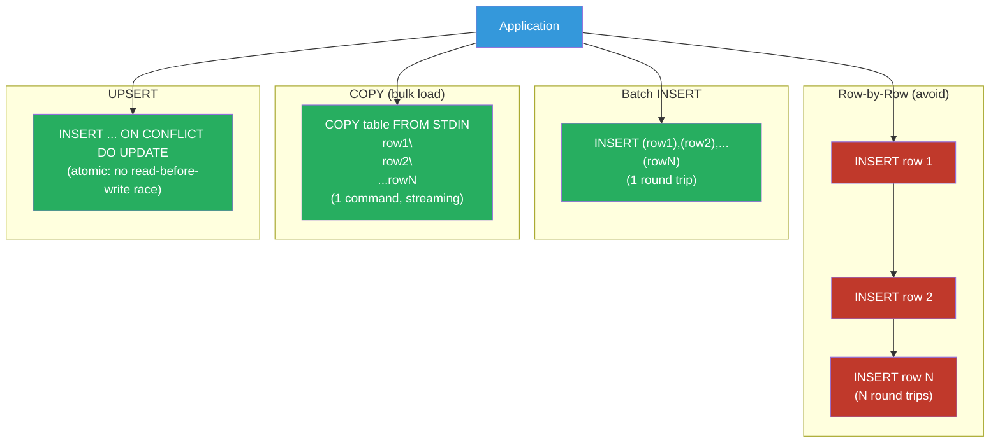

# [BEE-469] Database Bulk Operations and UPSERT Patterns

:::info
Bulk operations — inserting or updating many rows in a single database round trip — reduce client-to-database latency from O(N) to O(1) and can increase write throughput by 10–100×; UPSERT patterns extend this to idempotent writes that safely handle duplicate keys without application-level read-before-write.
:::

## Context

The most common write performance problem in backend systems is the same pattern as the N+1 read problem, but on the write side: inserting or updating N rows with N separate `INSERT` or `UPDATE` statements in a loop. Each statement is a round trip to the database — parse, plan, execute, return. At 1 ms per round trip and 10,000 rows, that is 10 seconds of pure network and protocol overhead before any data is written.

PostgreSQL's `COPY` command has offered bulk loading since the early 1990s: it streams rows from a client to the server in a single command, bypassing the row-by-row parse-plan-execute cycle entirely. Internal tests regularly show `COPY` ingesting data 5–100× faster than equivalent multi-statement `INSERT`s. MySQL's `LOAD DATA INFILE` provides the same capability. For application-level ingestion (rather than file-based), multi-row `INSERT ... VALUES (...),...` achieves a large fraction of `COPY`'s throughput by amortizing the per-statement overhead across many rows in one batch.

The UPSERT concept — insert a row if it doesn't exist, update it if it does — predates SQL standardization but was not part of ANSI SQL until the 2003 `MERGE` statement. Before that, each database vendor implemented the pattern differently: Oracle's `MERGE` (1999), MySQL's `INSERT ... ON DUPLICATE KEY UPDATE` (MySQL 4.1, 2003), PostgreSQL's `INSERT ... ON CONFLICT` (PostgreSQL 9.5, 2016). The differences between them are not merely syntactic: MySQL's `REPLACE INTO` deletes the conflicting row and inserts a new one (losing auto-generated columns and triggering delete-related side effects), while PostgreSQL's `ON CONFLICT DO UPDATE` is a true atomic update that preserves the existing row.

At high concurrency, UPSERT semantics interact with locking in non-obvious ways. PostgreSQL's `ON CONFLICT DO UPDATE` uses a combination of index scans and row-level locks; under concurrent inserts for the same key, the second inserter waits for the first to commit, then sees the row as existing and performs the update. This is correct but can serialize throughput on hot keys, making UPSERT of a single frequently-updated key a contention point. Understanding these semantics prevents the class of bugs where "concurrent upserts" silently overwrite each other's incremental updates.

## Design Thinking

### Choosing the Right Bulk Strategy

| Scenario | Best approach |
|---|---|
| Initial data load (file) | `COPY` / `LOAD DATA INFILE` |
| Application ingestion, insert-only | Batched multi-row `INSERT` (500–5000 rows/batch) |
| Insert-or-ignore duplicates | `INSERT ... ON CONFLICT DO NOTHING` |
| Insert-or-overwrite latest value | `INSERT ... ON CONFLICT DO UPDATE SET col = EXCLUDED.col` |
| Conditional update (only if newer) | `ON CONFLICT DO UPDATE ... WHERE existing.ts < EXCLUDED.ts` |
| Merge with complex logic | `MERGE` statement (SQL:2003, PostgreSQL 15+, MySQL 8.0.31+) |
| Bulk update existing rows | `UPDATE ... FROM (VALUES ...)` or temp table + JOIN |

### UPSERT Semantics Across Databases

The key behavioral differences between vendor implementations:

**PostgreSQL `INSERT ... ON CONFLICT`**: atomic read-modify-write at the row level. The conflict target is an index (unique constraint or partial index). `EXCLUDED` refers to the row that would have been inserted. Does not fire delete triggers. Does not reset serial columns. Supports `WHERE` clause on the `DO UPDATE` for conditional updates.

**MySQL `INSERT ... ON DUPLICATE KEY UPDATE`**: fires on any unique key conflict (not just primary key), which can cause unexpected behavior with multiple unique indexes. `VALUES(col)` refers to the value that would have been inserted (deprecated in 8.0; use aliases instead). Does not delete the row.

**MySQL `REPLACE INTO`**: deletes the conflicting row and inserts a new one. Auto-increment ID changes. Foreign key cascades trigger on delete. Delete triggers fire. Avoid for tables with generated columns, foreign key children, or triggers.

**SQL Standard `MERGE`** (PostgreSQL 15+, MySQL 8.0.31+, SQL Server, Oracle): most expressive — separate `WHEN MATCHED THEN UPDATE`, `WHEN NOT MATCHED THEN INSERT`, `WHEN NOT MATCHED BY SOURCE THEN DELETE` clauses. More complex syntax but allows multiple match conditions and mixed insert/update/delete in one statement.

### Batch Size Selection

Multi-row `INSERT` throughput increases with batch size up to a point, then plateaus or degrades:
- Below ~100 rows: per-statement overhead dominates; throughput scales nearly linearly with batch size.
- 500–5,000 rows: sweet spot for most workloads — statement preparation cost is amortized; transaction log writes are efficient.
- Above ~10,000 rows: single transaction holds locks longer; on failure, the entire batch must retry; memory pressure grows.

The optimal batch size depends on row width, index count, and transaction log configuration. Start at 1,000 rows and profile. For `COPY`, there is no sweet spot — send the entire dataset in one command; the server handles buffering.

## Best Practices

**MUST batch writes — never insert or update one row per application loop iteration.** Collect rows in memory (a list or buffer), then flush in a single multi-row `INSERT` or `COPY`. The batch size ceiling is typically 1,000–5,000 rows; flush when the batch is full or a time threshold (e.g., 100 ms) is reached. Even a batch size of 10 is an order of magnitude better than 1.

**MUST use `COPY` (PostgreSQL) or `LOAD DATA INFILE` (MySQL) for bulk loads of millions of rows.** `COPY` bypasses the parse-plan-execute cycle and writes directly to the storage layer. It is the correct tool for ETL pipelines, data migrations, and initial population of large tables. For application-generated data, use the `COPY` protocol via the database driver (psycopg3's `copy_records_to_table`, asyncpg's `copy_records_to_table`) rather than writing to a file.

**MUST use `INSERT ... ON CONFLICT DO NOTHING` rather than application-level read-before-write for idempotent inserts.** The pattern `SELECT → INSERT if not found` has a race condition: two concurrent requests can both read "not found" and both attempt to insert, causing one to fail with a unique constraint violation. `ON CONFLICT DO NOTHING` is atomic and correct under concurrency without locking.

**MUST specify the conflict target explicitly in `ON CONFLICT`** rather than using bare `ON CONFLICT DO NOTHING` without a target. Specifying the target (`ON CONFLICT (id)` or `ON CONFLICT ON CONSTRAINT orders_pkey`) makes the intent clear and catches schema changes that add or remove unique constraints.

**MUST NOT use `REPLACE INTO` for tables with foreign key children, auto-increment primary keys, or delete triggers.** The delete-then-insert semantics change the row's primary key (new auto-increment value), break foreign key references from child tables, and fire delete triggers on what is semantically an update. Use `INSERT ... ON DUPLICATE KEY UPDATE` instead.

**SHOULD use a conditional `WHERE` clause in `ON CONFLICT DO UPDATE` to implement last-write-wins without overwriting newer data.** Without the condition, a late-arriving duplicate always overwrites the current row regardless of which is newer:

```sql
INSERT INTO metrics (device_id, ts, value)
VALUES ($1, $2, $3)
ON CONFLICT (device_id) DO UPDATE
  SET ts = EXCLUDED.ts, value = EXCLUDED.value
  WHERE metrics.ts < EXCLUDED.ts;  -- only update if incoming data is newer
```

**SHOULD wrap bulk operations in explicit transactions and checkpoint periodically for very large batches.** Inserting 10 million rows in a single transaction produces a large transaction log segment and holds locks until commit. For large loads, commit every 10,000–100,000 rows (`COMMIT; BEGIN;`) to release locks, flush WAL, and allow autovacuum to reclaim dead tuples incrementally. This also limits the retry scope on failure.

**SHOULD disable unnecessary indexes before a bulk load, then rebuild them after.** Each INSERT maintains every index; for a table with 5 indexes, inserting 1 million rows updates 5 million index entries. For initial loads, drop non-essential indexes, load data, then recreate them with `CREATE INDEX CONCURRENTLY`. The index build on existing data is significantly faster than incremental per-row updates.

## Visual



## Example

**Batched INSERT in Python (psycopg3):**

```python
import psycopg

BATCH_SIZE = 1000

def bulk_insert_orders(conn: psycopg.Connection, orders: list[dict]) -> None:
    """Insert orders in batches of BATCH_SIZE, one round trip per batch."""
    with conn.cursor() as cur:
        # executemany with a prepared statement: one parse, N batched executes
        cur.executemany(
            """INSERT INTO orders (id, customer_id, amount, status)
               VALUES (%(id)s, %(customer_id)s, %(amount)s, %(status)s)
               ON CONFLICT (id) DO NOTHING""",
            orders,
            returning=False,
        )
    conn.commit()

# For large datasets: use COPY for maximum throughput
def bulk_copy_orders(conn: psycopg.Connection, orders: list[tuple]) -> None:
    with conn.cursor() as cur:
        with cur.copy("COPY orders (id, customer_id, amount, status) FROM STDIN") as copy:
            for batch_start in range(0, len(orders), BATCH_SIZE):
                batch = orders[batch_start : batch_start + BATCH_SIZE]
                for row in batch:
                    copy.write_row(row)
    conn.commit()
```

**UPSERT with conditional update (PostgreSQL):**

```sql
-- Ingest device telemetry: update only if incoming timestamp is newer than stored
-- This prevents late-arriving messages from overwriting fresher data
INSERT INTO device_readings (device_id, metric, ts, value)
VALUES
  ('dev-001', 'temperature', '2024-03-15T10:00:00Z', 22.5),
  ('dev-001', 'temperature', '2024-03-15T10:01:00Z', 22.7),
  ('dev-002', 'humidity',    '2024-03-15T10:00:00Z', 65.0)
ON CONFLICT (device_id, metric) DO UPDATE
  SET ts    = EXCLUDED.ts,
      value = EXCLUDED.value
  WHERE device_readings.ts < EXCLUDED.ts;

-- EXCLUDED refers to the row that was rejected due to the conflict
-- The WHERE clause makes this idempotent: re-inserting the same row is a no-op
```

**Bulk UPDATE via VALUES constructor (PostgreSQL):**

```sql
-- Update N rows without N individual UPDATE statements
-- values_to_update is a set of (id, new_status) pairs from application code
UPDATE orders AS o
SET status = v.new_status
FROM (VALUES
  (1001, 'shipped'),
  (1002, 'delivered'),
  (1003, 'cancelled')
) AS v(order_id, new_status)
WHERE o.id = v.order_id;
```

**Temporary table approach for complex bulk updates:**

```sql
-- For very large batches: load into a temp table, then join
-- Avoids a massive VALUES clause that stresses the planner
CREATE TEMPORARY TABLE staging_updates (
    order_id    BIGINT,
    new_status  TEXT,
    updated_at  TIMESTAMPTZ
) ON COMMIT DROP;

-- Load staging data via COPY (fastest path)
COPY staging_updates FROM STDIN;

-- Apply in one UPDATE JOIN
UPDATE orders o
SET status     = s.new_status,
    updated_at = s.updated_at
FROM staging_updates s
WHERE o.id = s.order_id;
```

**Index management for bulk loads:**

```sql
-- Before loading millions of rows:
-- Drop non-essential indexes to skip incremental index maintenance
DROP INDEX IF EXISTS idx_orders_customer;
DROP INDEX IF EXISTS idx_orders_created_at;

-- Load data (COPY or batched INSERT)
COPY orders FROM '/path/to/orders.csv' CSV HEADER;

-- Rebuild indexes after load: much faster than row-by-row maintenance
-- CONCURRENTLY allows reads during index build (no table lock)
CREATE INDEX CONCURRENTLY idx_orders_customer ON orders (customer_id);
CREATE INDEX CONCURRENTLY idx_orders_created_at ON orders (created_at DESC);

-- Update table statistics after bulk load
ANALYZE orders;
```

## Implementation Notes

**PostgreSQL**: `COPY` is the fastest ingestion path; use `psycopg3`'s `cursor.copy()` for application-generated data. `INSERT ... ON CONFLICT` requires PostgreSQL 9.5+. The `MERGE` statement (SQL standard) is available from PostgreSQL 15. For very large concurrent upserts on a hot key, consider serializing writes through a queue to avoid lock contention.

**MySQL**: `INSERT ... ON DUPLICATE KEY UPDATE` is the UPSERT syntax. Use `VALUES(col)` for the proposed value — deprecated in 8.0 in favor of the row alias syntax (`AS new`). `LOAD DATA INFILE` is the bulk load equivalent of `COPY`; requires `FILE` privilege or `LOAD DATA LOCAL INFILE`. `INSERT IGNORE` is the MySQL equivalent of `ON CONFLICT DO NOTHING`.

**SQLite**: `INSERT OR REPLACE`, `INSERT OR IGNORE`, and `INSERT OR ABORT` cover the conflict handling cases. `INSERT ... ON CONFLICT (column) DO UPDATE` (SQLite 3.24+) matches PostgreSQL syntax. No COPY equivalent; for bulk loads, wrap many inserts in a single transaction (`BEGIN; INSERT...; INSERT...; COMMIT`).

**Application frameworks**: Django's `bulk_create(objs, update_conflicts=True)` (Django 4.1+) generates `INSERT ... ON CONFLICT` for PostgreSQL. SQLAlchemy's `insert().on_conflict_do_update()` constructs the dialect-specific syntax. Hibernate's `@NaturalId` with `merge()` handles upsert semantics but generates a SELECT + INSERT/UPDATE, not a single atomic statement — verify the generated SQL.

## Related BEEs

- [BEE-461](461.md) -- The N+1 Query Problem and Batch Loading: the read-side equivalent — batching database reads to avoid N round trips; this article covers the write side
- [BEE-164](../Transactions and Consistency/164.md) -- Idempotency and Exactly-Once Semantics: UPSERT is the primary database-level tool for idempotent writes; this article shows how to implement it correctly
- [BEE-160](../Transactions and Consistency/160.md) -- ACID Properties: bulk operations inside a transaction either all succeed or all fail atomically; understanding commit scope is critical for choosing batch checkpoint intervals
- [BEE-126](../Data Storage and Database Fundamentals/126.md) -- Database Migrations: bulk loads are the primary tool for populating tables in data migrations; index management during load is the critical performance lever

## References

- [INSERT — PostgreSQL Documentation](https://www.postgresql.org/docs/current/sql-insert.html)
- [COPY — PostgreSQL Documentation](https://www.postgresql.org/docs/current/sql-copy.html)
- [Populating a Database — PostgreSQL Documentation](https://www.postgresql.org/docs/current/populate.html)
- [INSERT ... ON DUPLICATE KEY UPDATE — MySQL 8.0 Documentation](https://dev.mysql.com/doc/refman/8.0/en/insert-on-duplicate.html)
- [MERGE — PostgreSQL 15 Documentation](https://www.postgresql.org/docs/15/sql-merge.html)
