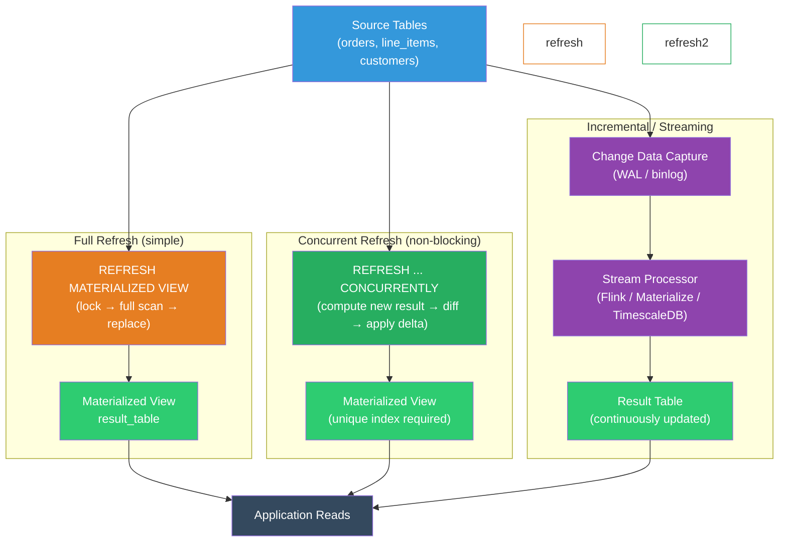

# [BEE-470] Materialized Views and Incremental Computation

:::info
A materialized view stores the result of a query on disk and serves it as a table — trading staleness for speed; incremental computation extends this by recomputing only the changed portion of the result instead of rebuilding the entire view from scratch.
:::

## Context

Some queries are too expensive to run on demand. A dashboard that aggregates 500 million order rows with a multi-table join, date bucketing, and a HAVING clause might take 30–60 seconds on even well-indexed tables. Running it for every page load is impractical. The naive solution — caching the result in application memory or Redis — works but pushes the invalidation problem to the application layer and loses the ability to query the cached data with SQL.

Materialized views solve the problem at the database layer. A materialized view is the result of a query stored as a physical table. Reads hit the stored result; the expensive computation runs only when the view is refreshed. PostgreSQL introduced `CREATE MATERIALIZED VIEW` in version 9.3 (2013); Oracle has had the feature since the late 1990s; SQL Server uses the term "indexed views."

The limitation is freshness. A materialized view reflects the state of the source tables at the time of the last refresh. If the source tables change frequently and the business requires near-current data, a full refresh on every change is prohibitively expensive — defeating the purpose of materialization.

Incremental computation addresses this. Instead of rebuilding the view from scratch, an incremental strategy identifies which source rows changed and recomputes only the affected output rows. PostgreSQL does not support incremental refresh natively (as of version 16); every `REFRESH MATERIALIZED VIEW` rebuilds the entire view. Incremental refresh is available through extensions (TimescaleDB continuous aggregates for time-series), application-level frameworks (dbt incremental models), and stream-processing systems (Flink, Materialize, RisingWave) that maintain a continuously updated result as source data arrives.

The choice between full refresh and incremental computation is a staleness-vs-complexity tradeoff. Full refresh is simple and correct; incremental is faster but requires reasoning about which deltas to apply and how to handle late-arriving data.

## Design Thinking

### Refresh Strategies

| Strategy | Mechanism | Freshness | Cost per refresh |
|---|---|---|---|
| Full refresh (exclusive lock) | `REFRESH MATERIALIZED VIEW` | Point-in-time of refresh | Full query cost |
| Full refresh (concurrent) | `REFRESH MATERIALIZED VIEW CONCURRENTLY` | Point-in-time of refresh | Full query cost + diff |
| Scheduled refresh | cron / pg_cron | As stale as refresh interval | Full query cost |
| Trigger-based refresh | `AFTER INSERT/UPDATE/DELETE` trigger | Near-real-time | Full query cost per write |
| Incremental / streaming | CDC → stream processor → result table | Seconds to minutes of lag | Proportional to delta size |
| Continuous aggregates (TimescaleDB) | Extension-managed | Near-real-time for time-series | Recomputes changed time buckets only |

### CONCURRENTLY vs Non-Concurrent Refresh

`REFRESH MATERIALIZED VIEW` acquires an `AccessExclusive` lock for the duration of the refresh — blocking all reads. For views that take seconds to refresh, this is acceptable. For views that take minutes, it is not.

`REFRESH MATERIALIZED VIEW CONCURRENTLY` requires a unique index on the view, computes the new result in a temporary table, diffs it against the current view data, and applies the delta — allowing reads throughout. The tradeoff: concurrent refresh takes longer than non-concurrent because of the diff step, and the unique index requirement limits which views support it.

### Staleness and the Refresh Interval

The refresh interval is the primary operational knob. Setting it requires knowing:

- **How stale can the data be?** An analytics dashboard might tolerate 15 minutes; a live pricing feed cannot.
- **How expensive is a refresh?** The refresh must complete faster than the interval, or refreshes pile up.
- **How frequently do source tables change?** Refreshing every minute for a table that changes hourly wastes resources.

A common pattern: refresh on a schedule during low-traffic hours for heavy aggregations, and use a short TTL cache in front of the view for repeated identical queries between refreshes.

### Incremental Computation Model

Incremental computation requires the view to be **maintainable**: given a set of inserts/updates/deletes to the source, the system must be able to derive the corresponding changes to the output without re-reading all source data.

Aggregations like `COUNT`, `SUM`, and `AVG` are maintainable. `DISTINCT`, `MEDIAN`, and windowed `RANK()` are not without additional state. Systems like Flink and Materialize implement a relational operator that tracks per-group counts and sums and updates them incrementally; queries involving non-maintainable operators fall back to full recomputation.

## Best Practices

**MUST create a unique index before using `REFRESH MATERIALIZED VIEW CONCURRENTLY`.** Without a unique index, concurrent refresh fails at runtime. The index must cover a column (or set of columns) that uniquely identifies each row in the view — often a group-by key.

**MUST NOT refresh materialized views in a tight loop from application code.** Each refresh is a full query execution. Call it from a scheduled job (`pg_cron`, external cron, orchestrator) at a cadence matched to the acceptable staleness window.

**SHOULD use `CONCURRENTLY` for any view that needs to remain readable during refresh.** Non-concurrent refresh is appropriate only when the view is small enough that the lock window is negligible (sub-second), or when the view is refreshed during a maintenance window.

**SHOULD add the materialized view to your database migration workflow and document the refresh schedule.** A materialized view is a schema object that must be created, tracked, and dropped with the rest of the schema. Its refresh job is operational infrastructure that must be monitored.

**SHOULD consider staleness as a first-class requirement.** Define the acceptable staleness SLO for each view explicitly (e.g., "no older than 10 minutes during business hours"). This drives refresh interval choice, alerting thresholds, and whether incremental computation is necessary.

**SHOULD monitor refresh duration and alert on overruns.** If a refresh takes longer than its scheduled interval, the next refresh overlaps. Track `pg_stat_user_tables.last_analyze` (as a proxy) or instrument the refresh job itself. Alert if refresh duration exceeds 80% of the interval.

**MUST NOT use a materialized view as the authoritative record for writes.** A materialized view is read-only derived data. All writes go to the source tables. The view is a cache, not a source of truth.

**SHOULD use dbt incremental models or TimescaleDB continuous aggregates instead of ad-hoc incremental logic in application code.** Hand-rolled incremental computation in application code is error-prone — it must handle concurrent writers, late-arriving rows, and partial failures. Frameworks encode these failure modes.

## Visual



## Example

**Creating and refreshing a materialized view (PostgreSQL):**

```sql
-- Expensive aggregation: daily revenue by product category
CREATE MATERIALIZED VIEW daily_revenue_by_category AS
SELECT
    DATE_TRUNC('day', o.created_at)  AS day,
    p.category,
    SUM(li.quantity * li.unit_price) AS revenue,
    COUNT(DISTINCT o.id)             AS order_count
FROM orders o
JOIN line_items li ON li.order_id = o.id
JOIN products p   ON p.id = li.product_id
WHERE o.status = 'completed'
GROUP BY 1, 2
WITH DATA;  -- populate immediately; use WITH NO DATA to defer

-- Required for CONCURRENTLY: unique index on the group-by key
CREATE UNIQUE INDEX ON daily_revenue_by_category (day, category);

-- Non-blocking refresh (locks view for entire duration — fine if fast)
REFRESH MATERIALIZED VIEW daily_revenue_by_category;

-- Non-blocking refresh (reads allowed throughout; requires unique index)
REFRESH MATERIALIZED VIEW CONCURRENTLY daily_revenue_by_category;

-- Query the view like a table
SELECT category, SUM(revenue) AS total_revenue
FROM daily_revenue_by_category
WHERE day >= CURRENT_DATE - INTERVAL '30 days'
GROUP BY category
ORDER BY total_revenue DESC;
```

**Scheduling refresh with pg_cron:**

```sql
-- Refresh every 15 minutes during business hours (UTC)
SELECT cron.schedule(
    'refresh-daily-revenue',
    '*/15 7-19 * * 1-5',  -- every 15 min, Mon-Fri, 07:00-19:00 UTC
    $$REFRESH MATERIALIZED VIEW CONCURRENTLY daily_revenue_by_category$$
);

-- Monitor cron job status
SELECT jobid, jobname, schedule, active, command
FROM cron.job
WHERE jobname = 'refresh-daily-revenue';

-- Check last refresh timestamp via system catalog
SELECT schemaname, matviewname, ispopulated, definition
FROM pg_matviews
WHERE matviewname = 'daily_revenue_by_category';
```

**dbt incremental model (application-layer incremental computation):**

```sql
-- models/daily_revenue_by_category.sql
{{
    config(
        materialized='incremental',
        unique_key=['day', 'category'],
        incremental_strategy='merge'
    )
}}

SELECT
    DATE_TRUNC('day', o.created_at) AS day,
    p.category,
    SUM(li.quantity * li.unit_price) AS revenue,
    COUNT(DISTINCT o.id)             AS order_count
FROM {{ ref('orders') }} o
JOIN {{ ref('line_items') }} li ON li.order_id = o.id
JOIN {{ ref('products') }} p   ON p.id = li.product_id
WHERE o.status = 'completed'


-- On incremental runs, only process rows updated in the last 2 days
-- (1-day buffer for late-arriving data)
AND o.created_at >= (SELECT MAX(day) - INTERVAL '2 days' FROM {{ this }})


GROUP BY 1, 2
```

**TimescaleDB continuous aggregate (time-series incremental refresh):**

```sql
-- Source: a TimescaleDB hypertable
CREATE TABLE device_metrics (
    ts        TIMESTAMPTZ NOT NULL,
    device_id INT         NOT NULL,
    value     DOUBLE PRECISION
);
SELECT create_hypertable('device_metrics', 'ts');

-- Continuous aggregate: materialized per-hour aggregation
CREATE MATERIALIZED VIEW device_metrics_hourly
WITH (timescaledb.continuous) AS
SELECT
    time_bucket('1 hour', ts) AS bucket,
    device_id,
    AVG(value)  AS avg_value,
    MAX(value)  AS max_value,
    MIN(value)  AS min_value,
    COUNT(*)    AS sample_count
FROM device_metrics
GROUP BY 1, 2;

-- TimescaleDB automatically refreshes only the buckets that changed
-- Manual policy: keep 1 month of real-time data, refresh every 10 minutes
SELECT add_continuous_aggregate_policy('device_metrics_hourly',
    start_offset => INTERVAL '1 month',
    end_offset   => INTERVAL '1 hour',  -- don't refresh the current bucket (incomplete)
    schedule_interval => INTERVAL '10 minutes'
);
```

## Implementation Notes

**PostgreSQL**: `REFRESH MATERIALIZED VIEW` rebuilds the entire view on every call — no native incremental refresh. Use `pg_cron` (available as an extension) or an external scheduler to automate refreshes. Monitor `pg_matviews` for view existence and population status. For near-real-time use cases without TimescaleDB, consider a summary table updated via triggers, with the attendant complexity.

**TimescaleDB**: Continuous aggregates use the WAL to track which time buckets have new data and recompute only those buckets. They support real-time aggregation (reading the non-materialized portion of the hypertable for the current bucket) and are the recommended solution for time-series materialization on PostgreSQL.

**dbt**: Incremental models work on any SQL warehouse (BigQuery, Snowflake, Redshift, DuckDB, PostgreSQL). The `is_incremental()` macro enables conditional logic that filters to recent rows on non-full-refresh runs. The `unique_key` config drives the merge/upsert strategy. Always include a late-arrival buffer (processing rows from 1–2 days before the max already-materialized date) to handle out-of-order events.

**Materialize / RisingWave**: Purpose-built streaming databases that maintain views incrementally in real time using a dataflow engine. SQL queries are written once as views; the engine maintains them as source data arrives. Suited for sub-second freshness requirements that exceed what a scheduled-refresh approach can provide.

**Oracle**: `QUERY REWRITE` enables the optimizer to automatically substitute a materialized view for a base table query when the materialized view covers the query — transparent to the application. PostgreSQL does not have automatic query rewrite for materialized views.

## Related BEEs

- [BEE-121](../Data Storage and Database Fundamentals/121.md) -- Indexing Deep Dive: a unique index is required for `REFRESH CONCURRENTLY`; index selection for the materialized view's access patterns follows the same principles as for base tables
- [BEE-200](../Caching/200.md) -- Caching Fundamentals and Cache Hierarchy: materialized views are a database-layer cache; understanding the hierarchy clarifies when to use a materialized view vs an application-level cache
- [BEE-102](../System Architecture/102.md) -- CQRS: materialized views are a common implementation of the read model in CQRS — the write model updates source tables, the read model is a materialized view refreshed from those tables
- [BEE-437](437.md) -- Change Data Capture: CDC is the mechanism that feeds incremental computation systems; WAL-based CDC enables streaming processors to consume only the changed rows from source tables

## References

- [Materialized Views — PostgreSQL Documentation](https://www.postgresql.org/docs/current/rules-materializedviews.html)
- [REFRESH MATERIALIZED VIEW — PostgreSQL Documentation](https://www.postgresql.org/docs/current/sql-refreshmaterializedview.html)
- [Continuous Aggregates — TimescaleDB Documentation](https://docs.timescale.com/use-timescale/latest/continuous-aggregates/)
- [Incremental Models — dbt Documentation](https://docs.getdbt.com/docs/build/incremental-models)
- [pg_cron — PostgreSQL Cron Job Scheduler](https://github.com/citusdata/pg_cron)
