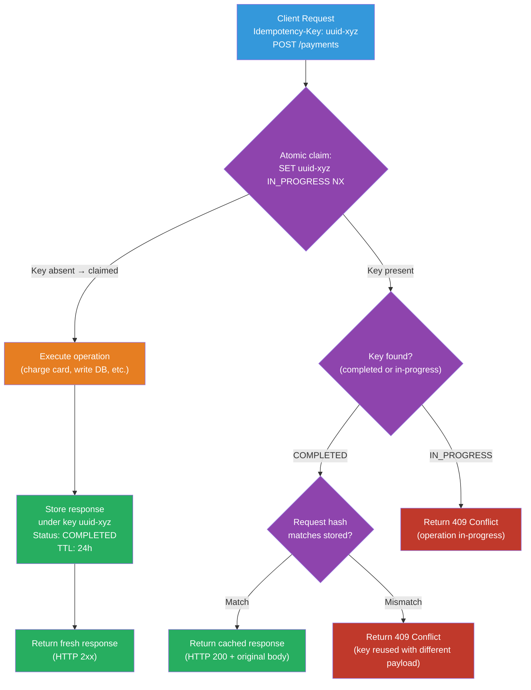

# [BEE-473] Idempotency Key Implementation Patterns

:::info
An idempotency key is a client-supplied token that allows a server to recognize a repeated request and return the cached response instead of processing it again — turning inherently non-idempotent operations like payment charges into safe-to-retry operations.
:::

## Context

HTTP defines which methods are idempotent at the protocol level: RFC 9110 (HTTP Semantics, Section 9.2.2) specifies that `GET`, `HEAD`, `PUT`, `DELETE`, `OPTIONS`, and `TRACE` are idempotent — a client can safely retry them on timeout without risk of duplicate effects. `POST` is explicitly not idempotent. Yet `POST` is the method most commonly used for operations with significant side effects: charging a payment card, sending an email, creating an order.

The consequence: when a client `POST`s a payment request and the network times out before a response arrives, the client does not know whether the charge succeeded. Retrying risks a double charge. Not retrying risks an abandoned transaction. At payment scale, both outcomes are unacceptable.

The idempotency key pattern, popularized by payment processors including Stripe, resolves this by giving the server enough information to deduplicate. The client generates a unique key per *logical operation* (not per HTTP request) and includes it in the `Idempotency-Key` request header. The server stores the key alongside the response on first execution. If the same key arrives again — from a retry — the server returns the stored response without re-executing the operation. From the server's perspective, duplicate requests are collapsed into a single logical operation.

An IETF working group (httpapi) is actively standardizing the `Idempotency-Key` header format as of 2025 (draft-ietf-httpapi-idempotency-key-header), indicating broad industry recognition of the pattern. Stripe, PayPal, Braintree, and many financial APIs already implement it, typically with a 24-hour key TTL.

## Design Thinking

### Key Scoping

An idempotency key is meaningful only within a specific context. A key of `"abc123"` for a payment request is a different logical operation from `"abc123"` for a refund request. The server must scope keys to avoid collisions:

- **Minimum scope**: `(idempotency_key, endpoint)` — same key on a different API path is treated as a different operation
- **Recommended scope**: `(idempotency_key, endpoint, user_id)` — prevents key collisions across customers; a key supplied by one customer cannot collide with another customer's key

### Storage Options

| | Redis (with TTL) | Relational Database |
|---|---|---|
| Atomicity | `SET NX EX` — atomic set-if-not-exists | Unique constraint on `(key, endpoint, user_id)` |
| TTL management | Native; keys auto-expire | Requires periodic cleanup job |
| Response storage | Value field (JSON, up to memory limit) | JSONB/TEXT column (unbounded) |
| Throughput | Very high | Moderate |
| Durability | Persistence optional | Durable by default |
| Best for | High-volume APIs (payments, orders) | Lower-volume APIs needing durable audit trail |

For payment APIs, Redis is the standard choice: atomic set-if-not-exists with TTL maps directly to the idempotency key lifecycle, and throughput requirements typically exceed what a relational database can sustain for this pattern.

### Request Fingerprinting

A client should use the same idempotency key only for identical requests. A client bug or adversarial input might reuse a key with a different request body — which would silently return the wrong response.

Request fingerprinting detects this: the server hashes the request body (and optionally the method and path) and stores the hash alongside the idempotency record. On subsequent requests with the same key, it compares the hash. A mismatch returns `409 Conflict` — the key exists but the request parameters differ.

### Key Lifecycle States

An idempotency key passes through three states:

1. **In-progress**: The key has been claimed; the operation is executing. Concurrent requests with the same key receive `409 Conflict` or should be held pending (with a retry-after).
2. **Completed**: The operation finished (success or business-logic failure). The response is cached; future requests with the same key return the cached response immediately.
3. **Expired**: The TTL elapsed. The key is gone; a new request with the same key is treated as a fresh operation.

The in-progress state is critical for preventing the race condition where two concurrent requests with the same key both see "no record" and both execute the operation.

## Best Practices

**MUST scope idempotency keys to at minimum `(key, endpoint)` and ideally `(key, endpoint, user_id)`.** A bare key without endpoint scoping allows collisions when a client reuses a key value across different API paths — a reasonable accident during development.

**MUST use an atomic "set if not exists" operation to claim a key before executing the operation.** The naive sequence — query for existing key, execute operation, store result — has a race condition: two concurrent requests can both find no existing record and both execute. In Redis, `SET key placeholder NX EX ttl` is atomic. In a relational database, use an `INSERT ... ON CONFLICT DO NOTHING` and check the number of affected rows.

**MUST return a `409 Conflict` when a request arrives with an idempotency key that is currently in-progress.** The in-progress state indicates the original request is still executing. Returning `409` tells the client to retry after a delay. Do not execute the operation twice.

**MUST store and return the original response when a completed idempotency key is replayed.** The stored response must be byte-for-byte identical — same status code, same body. Do not re-execute the operation and return a "fresh" response; the fresh response may differ (e.g., different timestamp, different generated ID) even if the underlying state has not changed.

**SHOULD fingerprint the request body and return `409 Conflict` when a key is reused with a different payload.** Without fingerprinting, a client that accidentally reuses a key for a different operation receives the wrong cached response with no error signal. Include the hash in the idempotency record at claim time.

**SHOULD set a TTL of 24–48 hours.** The TTL defines how long a client can safely retry after a network failure. Shorter TTLs risk expiring before the client's retry window closes; longer TTLs consume storage unnecessarily. Stripe uses 24 hours; this is the industry standard.

**SHOULD generate idempotency keys as UUIDs on the client side.** UUID v4 (128 random bits) provides collision probability low enough to ignore in practice. Do not use sequential IDs (predictable) or short random strings (collision-prone at volume). The client generates the key before the request, not after.

**MAY use a database-backed idempotency store when a durable audit trail is required.** For financial reconciliation, storing idempotency records in the database (with the associated transaction IDs) provides proof that a specific logical operation was deduplicated on a specific date. Redis does not provide this by default.

## Visual



## Example

**Redis-based idempotency key store (Python):**

```python
import hashlib
import json
import uuid
from redis import Redis
from enum import Enum

TTL_SECONDS = 86_400  # 24 hours

class IdempotencyStatus(str, Enum):
    IN_PROGRESS = "in_progress"
    COMPLETED   = "completed"

def make_storage_key(idempotency_key: str, endpoint: str, user_id: str) -> str:
    """Scope the key to prevent cross-endpoint and cross-user collisions."""
    return f"idempotency:{user_id}:{endpoint}:{idempotency_key}"

def fingerprint(request_body: bytes) -> str:
    return hashlib.sha256(request_body).hexdigest()

def handle_payment(
    redis: Redis,
    idempotency_key: str,
    user_id: str,
    request_body: bytes,
    charge_fn,
) -> tuple[int, dict]:
    storage_key = make_storage_key(idempotency_key, "/payments", user_id)
    request_fp  = fingerprint(request_body)

    # Step 1: Atomic claim — SET NX acquires the key only if absent
    placeholder = json.dumps({
        "status": IdempotencyStatus.IN_PROGRESS,
        "fingerprint": request_fp,
    })
    claimed = redis.set(storage_key, placeholder, nx=True, ex=TTL_SECONDS)

    if not claimed:
        # Step 2: Key already exists — fetch it
        existing = json.loads(redis.get(storage_key) or "{}")

        if existing.get("status") == IdempotencyStatus.IN_PROGRESS:
            return 409, {"error": "request_in_progress", "retry_after": 2}

        if existing.get("fingerprint") != request_fp:
            return 409, {"error": "idempotency_key_reused_with_different_params"}

        # Return the cached response
        return existing["status_code"], existing["response_body"]

    # Step 3: We hold the key — execute the operation
    try:
        status_code, response_body = charge_fn(json.loads(request_body))
    except Exception as e:
        # On failure, release the key so the client can retry with a new key
        redis.delete(storage_key)
        raise

    # Step 4: Store the completed response and refresh TTL
    record = json.dumps({
        "status": IdempotencyStatus.COMPLETED,
        "fingerprint": request_fp,
        "status_code": status_code,
        "response_body": response_body,
    })
    redis.set(storage_key, record, ex=TTL_SECONDS)  # reset TTL on completion
    return status_code, response_body
```

**Database-backed idempotency table (PostgreSQL):**

```sql
CREATE TABLE idempotency_keys (
    id              UUID        PRIMARY KEY DEFAULT gen_random_uuid(),
    idempotency_key VARCHAR(255) NOT NULL,
    endpoint        VARCHAR(255) NOT NULL,
    user_id         BIGINT       NOT NULL,
    request_hash    CHAR(64)     NOT NULL,    -- SHA-256 of request body
    status          VARCHAR(20)  NOT NULL DEFAULT 'in_progress',
    status_code     SMALLINT,
    response_body   JSONB,
    created_at      TIMESTAMPTZ  NOT NULL DEFAULT now(),
    expires_at      TIMESTAMPTZ  NOT NULL DEFAULT now() + INTERVAL '24 hours',

    CONSTRAINT uq_idempotency UNIQUE (idempotency_key, endpoint, user_id)
);

-- Claim step: INSERT and rely on unique constraint to detect duplicates
-- Returns the number of rows inserted (1 = claimed, 0 = already exists)
INSERT INTO idempotency_keys (idempotency_key, endpoint, user_id, request_hash)
VALUES ($1, $2, $3, $4)
ON CONFLICT (idempotency_key, endpoint, user_id) DO NOTHING;

-- Update to completed after operation finishes
UPDATE idempotency_keys
   SET status = 'completed',
       status_code = $1,
       response_body = $2
 WHERE idempotency_key = $3
   AND endpoint = $4
   AND user_id = $5;

-- Periodic cleanup: remove expired keys (run nightly via pg_cron)
DELETE FROM idempotency_keys WHERE expires_at < NOW();
```

**Client-side key generation and retry loop:**

```python
import uuid
import httpx
import time

def charge_with_retry(amount: int, currency: str, max_retries: int = 3) -> dict:
    # Generate once before the first attempt — reuse on all retries
    idempotency_key = str(uuid.uuid4())

    for attempt in range(max_retries):
        try:
            response = httpx.post(
                "https://api.example.com/payments",
                json={"amount": amount, "currency": currency},
                headers={"Idempotency-Key": idempotency_key},
                timeout=10.0,
            )
            # 409 means in-progress: retry after short wait
            if response.status_code == 409 and attempt < max_retries - 1:
                time.sleep(2 ** attempt)
                continue
            response.raise_for_status()
            return response.json()
        except httpx.TimeoutException:
            if attempt == max_retries - 1:
                raise
            time.sleep(2 ** attempt)  # exponential backoff

    raise RuntimeError("max retries exceeded")
```

## Implementation Notes

**Stripe's approach**: The canonical reference implementation. Stripe scopes keys to the authenticated user and the API path. The same `Idempotency-Key` value used on `/v1/charges` is independent from its use on `/v1/refunds`. Keys last 24 hours. Stripe returns the original HTTP status code and body exactly, including error responses — an idempotent replay of a failed charge returns the same error, not a new attempt.

**Redis vs database**: Redis `SET NX EX` is the practical choice for high-volume APIs because it performs the atomic claim and TTL management in a single command. The main risk is Redis data loss on restart if persistence is not configured (`appendonly yes`). For payment APIs where the idempotency record is a compliance artifact, store it in the database; accept the higher write latency.

**Handling operation failures**: If the underlying operation fails (e.g., the card is declined), the idempotency record should still be stored in `COMPLETED` state with the error response. A client retrying a declined-card request should receive the same `402 Payment Required` — not a fresh charge attempt. Only delete the in-progress record on unhandled exceptions (process crash, infrastructure failure) where the operation's result is unknown.

**Key expiration and client behavior**: Clients should not reuse idempotency keys across sessions or days. A key generated for a payment attempt on Monday should not be recycled for a payment on Tuesday. Treat the idempotency key as single-use for the duration of one logical client operation; generate a new UUID for each new operation.

## Related BEEs

- [BEE-72](../API Design and Communication Protocols/72.md) -- Idempotency in APIs: covers which HTTP methods are idempotent by protocol and why designing APIs to be idempotent matters; this article covers the server-side implementation mechanism
- [BEE-164](../Transactions and Consistency/164.md) -- Idempotency and Exactly-Once Semantics: covers idempotency at the message-processing layer; the idempotency key pattern is the API-layer equivalent
- [BEE-261](../Resilience and Reliability/261.md) -- Retry Strategies and Exponential Backoff: idempotency keys enable safe client retries; retry strategy governs when and how often to retry

## References

- [Idempotent Requests — Stripe API Documentation](https://docs.stripe.com/api/idempotent_requests)
- [The Idempotency-Key HTTP Header Field — IETF Draft (draft-ietf-httpapi-idempotency-key-header)](https://datatracker.ietf.org/doc/draft-ietf-httpapi-idempotency-key-header/)
- [RFC 9110: HTTP Semantics, Section 9.2.2 — IETF](https://www.rfc-editor.org/rfc/rfc9110.html)
- [Idempotency — PayPal Developer Documentation](https://developer.paypal.com/api/rest/requests/#http-request-headers)
