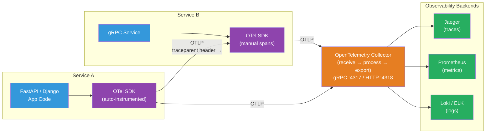

# [BEE-475] OpenTelemetry Instrumentation

:::info
OpenTelemetry is the CNCF-graduated standard for generating, collecting, and exporting telemetry (traces, metrics, logs) from applications — providing a single, vendor-neutral SDK that replaces vendor-specific agents and enables backend-agnostic observability.
:::

## Context

Before OpenTelemetry, every observability vendor supplied its own proprietary agent: Datadog had its tracer, New Relic had its SDK, Jaeger had its client libraries. An engineering team choosing an observability backend was locked into that vendor's instrumentation. Switching backends meant re-instrumenting every service.

Two competing open-source standards emerged: OpenTracing (2016, CNCF, API-only, trace-focused) and OpenCensus (2018, Google, SDK with trace and metrics). Both had community adoption but neither was complete. In 2019, the projects merged into OpenTelemetry under the CNCF umbrella, combining OpenTracing's API abstraction with OpenCensus's SDK and adding a logs signal. OpenTelemetry achieved CNCF graduated status on January 31, 2024 — the second most active CNCF project after Kubernetes.

The result is a single SDK available for every major language (Go, Java, Python, Node.js, .NET, Rust, PHP, Ruby, Swift, Erlang) that emits traces, metrics, and logs to any backend via OTLP (OpenTelemetry Protocol). The W3C TraceContext specification (a W3C Recommendation since 2021) defines the `traceparent` and `tracestate` HTTP headers that propagate trace context across service boundaries — a standard that OTel implements and all major APM vendors now support.

The practical impact: instrument once, export anywhere. An application using the OTel SDK can send to Jaeger today, Honeycomb tomorrow, and Prometheus/Grafana for metrics — by changing Collector configuration, not application code.

## Design Thinking

### The Three Signals

OpenTelemetry defines three telemetry signals, all GA as of late 2023:

| Signal | What it measures | Primary use |
|---|---|---|
| **Traces** | A request's journey across services as a tree of spans | Latency debugging, service dependency mapping |
| **Metrics** | Aggregated numerical measurements over time | Alerting, dashboards, SLOs |
| **Logs** | Timestamped text/structured records | Detailed debugging, audit trails |

All three are correlated via a shared `trace_id`: a structured log emitted during a traced request can be linked to the trace, letting you jump from a slow trace to the log lines that explain why.

### SDK vs Auto-Instrumentation vs Collector

Three layers work together:

**SDK**: The in-process library that creates spans, records metrics, and emits logs. You call the SDK API directly for manual instrumentation, or auto-instrumentation does it automatically.

**Auto-instrumentation**: Library packages that patch popular frameworks (FastAPI, Django, SQLAlchemy, gRPC, Express, Spring Boot, JDBC) to emit spans automatically without code changes. A Django view gets a root span; every SQLAlchemy query becomes a child span. Run `opentelemetry-instrument python app.py` for zero-code instrumentation.

**Collector**: A standalone proxy service (written in Go) that receives OTLP telemetry from applications, processes it (batch, sample, enrich, filter), and exports to backends. The Collector decouples applications from backends: applications always export to `localhost:4317` (gRPC) or `localhost:4318` (HTTP); the Collector handles retries, batching, and routing to multiple backends simultaneously.

### Span Anatomy

A span represents a single unit of work:
- **Name**: human-readable operation name (`GET /users/{id}`, `db.query`, `kafka.publish`)
- **Trace ID**: 128-bit identifier shared by all spans in a distributed trace
- **Span ID**: 64-bit identifier unique to this span
- **Parent Span ID**: links this span to its parent; absent for root spans
- **Start/End timestamps**: wall-clock time of the work
- **Status**: OK, ERROR, or UNSET
- **Attributes**: key-value pairs (`http.method`, `db.system`, `net.peer.name`)
- **Events**: timestamped log messages within the span's duration
- **Links**: references to spans in other traces (useful for async messaging)

## Best Practices

**MUST propagate trace context across service boundaries.** Context propagation is what turns isolated spans into a distributed trace. Use the W3C `traceparent` header for HTTP calls; use message attributes/headers for Kafka and other messaging. The OTel SDK's propagators handle injection (adding the header to outgoing requests) and extraction (reading incoming headers) automatically when using instrumented HTTP clients.

**MUST record span status on error.** A span with `status = UNSET` looks like success to trace analysis tools. When an exception is caught or a non-2xx response returned, call `span.set_status(StatusCode.ERROR)` and `span.record_exception(exc)`. This makes errors visible in trace search and allows error rate SLO calculations from trace data.

**MUST NOT create a new `Tracer` per request.** The `Tracer` is a lightweight factory; create it once at startup using `tracer = get_tracer(__name__)` and reuse it. Creating a new tracer per request adds overhead and bypasses SDK caching.

**SHOULD use semantic conventions for attribute names.** OpenTelemetry defines standard attribute names for common systems: `http.method`, `http.status_code`, `db.system`, `db.statement`, `rpc.system`, `messaging.system`. Using standard names enables out-of-the-box dashboards and alerts from vendors that understand OTel semantic conventions. Avoid inventing attribute names when a standard one exists.

**SHOULD deploy an OpenTelemetry Collector rather than exporting directly from applications to backends.** Direct export from application to backend creates a tight coupling: changing backends requires changing application configuration and redeploying. The Collector handles this: export to `localhost:4317`, configure the Collector to fan out to multiple backends, add sampling, or filter sensitive attributes — without touching application code.

**SHOULD sample traces at the Collector, not in the application SDK, for flexibility.** Head-based sampling (deciding at trace root whether to sample) loses error traces if the root span starts before an error occurs. Tail-based sampling (deciding after the full trace is assembled) preserves all error traces. The OTel Collector's `tailsamplingprocessor` implements tail-based sampling; application-side sampling is a last resort for extreme volume.

**SHOULD add business-domain attributes to root spans.** Generic HTTP attributes (`http.method`, `http.route`) tell you what happened at the protocol level. Adding `user.id`, `order.id`, or `tenant.id` as span attributes enables trace search by business entity — "find all traces for order 12345" — which is orders of magnitude more useful than "find all traces for POST /orders".

**MAY use baggage for request-scoped propagation of values that don't belong in span attributes.** OTel Baggage propagates key-value pairs across service boundaries (like distributed thread-local storage). Use it for values needed by downstream services but not directly relevant to individual spans: `tenant.id`, `experiment.variant`, `user.tier`.

## Visual



## Example

**Python — SDK setup and manual span creation (FastAPI):**

```python
# otel_setup.py — initialize once at application startup
from opentelemetry import trace
from opentelemetry.sdk.trace import TracerProvider
from opentelemetry.sdk.trace.export import BatchSpanProcessor
from opentelemetry.exporter.otlp.proto.grpc.trace_exporter import OTLPSpanExporter
from opentelemetry.sdk.resources import Resource
from opentelemetry.instrumentation.fastapi import FastAPIInstrumentor
from opentelemetry.instrumentation.sqlalchemy import SQLAlchemyInstrumentor

def configure_otel(service_name: str) -> None:
    resource = Resource.create({"service.name": service_name})
    provider = TracerProvider(resource=resource)
    # Export to Collector on localhost; Collector routes to backends
    exporter = OTLPSpanExporter(endpoint="http://localhost:4317", insecure=True)
    provider.add_span_processor(BatchSpanProcessor(exporter))
    trace.set_tracer_provider(provider)

    # Auto-instrument FastAPI routes and SQLAlchemy queries
    FastAPIInstrumentor.instrument()
    SQLAlchemyInstrumentor().instrument()

# app.py
from opentelemetry import trace

tracer = trace.get_tracer(__name__)  # create once; reuse everywhere

@app.post("/orders")
async def create_order(order: OrderRequest) -> OrderResponse:
    # Auto-instrumentation already created a root span for this HTTP handler
    # Add a business-domain attribute to make this trace searchable
    span = trace.get_current_span()
    span.set_attribute("customer.id", order.customer_id)

    # Manual child span for a significant sub-operation
    with tracer.start_as_current_span("charge_payment") as payment_span:
        payment_span.set_attribute("payment.method", order.payment_method)
        payment_span.set_attribute("payment.amount", order.amount_cents)
        try:
            result = await payment_service.charge(order)
            payment_span.set_attribute("payment.charge_id", result.charge_id)
        except PaymentDeclinedException as e:
            payment_span.set_status(trace.StatusCode.ERROR, str(e))
            payment_span.record_exception(e)
            raise

    return OrderResponse(order_id=result.order_id)
```

**Zero-code auto-instrumentation (no code changes required):**

```bash
# Install auto-instrumentation packages
pip install opentelemetry-distro opentelemetry-exporter-otlp
opentelemetry-bootstrap --action=install  # installs framework-specific packages

# Run with auto-instrumentation — instruments Django, SQLAlchemy, requests, etc.
OTEL_SERVICE_NAME=order-service \
OTEL_EXPORTER_OTLP_ENDPOINT=http://localhost:4317 \
opentelemetry-instrument python manage.py runserver
```

**Go — manual span creation with context propagation:**

```go
package main

import (
    "context"
    "go.opentelemetry.io/otel"
    "go.opentelemetry.io/otel/attribute"
    "go.opentelemetry.io/otel/codes"
    "go.opentelemetry.io/otel/exporters/otlp/otlptrace/otlptracegrpc"
    sdktrace "go.opentelemetry.io/otel/sdk/trace"
    "go.opentelemetry.io/otel/sdk/resource"
    semconv "go.opentelemetry.io/otel/semconv/v1.21.0"
)

var tracer = otel.Tracer("order-service")

func initOTel(ctx context.Context) (*sdktrace.TracerProvider, error) {
    exporter, err := otlptracegrpc.New(ctx,
        otlptracegrpc.WithInsecure(),
        otlptracegrpc.WithEndpoint("localhost:4317"),
    )
    if err != nil {
        return nil, err
    }
    res, _ := resource.New(ctx,
        resource.WithAttributes(semconv.ServiceName("order-service")),
    )
    tp := sdktrace.NewTracerProvider(
        sdktrace.WithBatcher(exporter),
        sdktrace.WithResource(res),
    )
    otel.SetTracerProvider(tp)
    return tp, nil
}

func processOrder(ctx context.Context, orderID string) error {
    // Start a child span — ctx carries the parent span from the HTTP handler
    ctx, span := tracer.Start(ctx, "process_order")
    defer span.End()

    span.SetAttributes(
        attribute.String("order.id", orderID),
        attribute.String("db.system", "postgresql"),
    )

    if err := chargeAndFulfill(ctx, orderID); err != nil {
        span.SetStatus(codes.Error, err.Error())
        span.RecordError(err)
        return err
    }
    return nil
}
```

**OpenTelemetry Collector configuration (`otel-collector-config.yaml`):**

```yaml
receivers:
  otlp:
    protocols:
      grpc:
        endpoint: 0.0.0.0:4317   # receives from applications
      http:
        endpoint: 0.0.0.0:4318

processors:
  batch:                           # buffer and batch spans for efficiency
    timeout: 1s
    send_batch_size: 1024
  resource:
    attributes:
      - key: deployment.environment
        value: production
        action: upsert
  # Tail-based sampling: keep 100% of error traces, 10% of success traces
  tail_sampling:
    decision_wait: 10s
    policies:
      - name: errors-policy
        type: status_code
        status_code: {status_codes: [ERROR]}
      - name: probabilistic-policy
        type: probabilistic
        probabilistic: {sampling_percentage: 10}

exporters:
  otlp/jaeger:
    endpoint: jaeger:4317
    tls:
      insecure: true
  prometheusremotewrite:
    endpoint: http://prometheus:9090/api/v1/write

service:
  pipelines:
    traces:
      receivers: [otlp]
      processors: [batch, tail_sampling]
      exporters: [otlp/jaeger]
    metrics:
      receivers: [otlp]
      processors: [batch]
      exporters: [prometheusremotewrite]
```

## Implementation Notes

**Python**: The `opentelemetry-sdk` package provides the core SDK. `opentelemetry-api` provides the API (importable in library code without a heavy SDK dependency). Use `BatchSpanProcessor` in production (async, buffered); `SimpleSpanProcessor` only for debugging (synchronous, blocking). Auto-instrumentation via `opentelemetry-instrument` supports Flask, Django, FastAPI, aiohttp, SQLAlchemy, psycopg2, Redis, Celery, and more.

**Go**: `go.opentelemetry.io/otel` is the API; `go.opentelemetry.io/otel/sdk` is the SDK. HTTP instrumentation via `otelhttp.NewHandler` wraps `http.Handler`. gRPC instrumentation via `otelgrpc.UnaryServerInterceptor`. Always propagate `context.Context` through the call stack — OTel Go relies on it for span parenting.

**Java / Spring Boot**: `opentelemetry-spring-boot-starter` adds auto-instrumentation via the Spring Boot autoconfiguration mechanism. The Java agent (`opentelemetry-javaagent.jar`) provides zero-code instrumentation: `java -javaagent:opentelemetry-javaagent.jar -jar app.jar`.

**Node.js**: `@opentelemetry/sdk-node` provides the NodeSDK. Auto-instrumentation packages exist for Express, HTTP, gRPC, pg, MySQL, Redis, and AWS SDK. Initialize the SDK before importing application modules — instrumentation must be registered before the frameworks are loaded.

**Semantic Conventions**: OTel defines a stable set of attribute names in `opentelemetry-semantic-conventions`. Always prefer semantic conventions (`http.method`, `db.system`, `rpc.service`) over custom attributes for common concepts — this ensures compatibility with vendor dashboards and alerting rules that expect standard attribute names.

## Related BEEs

- [BEE-320](../Observability/320.md) -- The Three Pillars: Logs, Metrics, Traces: covers what each signal type is and why all three are needed; OpenTelemetry is the SDK that produces all three
- [BEE-322](../Observability/322.md) -- Distributed Tracing: covers the theory of trace propagation and span relationships; OpenTelemetry is the practical implementation of those concepts
- [BEE-321](../Observability/321.md) -- Structured Logging: OTel logs integrate with structured logging; logs emitted during a traced request carry the trace ID for correlation
- [BEE-324](../Observability/324.md) -- SLOs and Error Budgets: trace data provides the raw material for latency and error-rate SLIs; OTel metrics can directly feed SLO calculation

## References

- [OpenTelemetry Documentation](https://opentelemetry.io/docs/)
- [OpenTelemetry — CNCF Project](https://www.cncf.io/projects/opentelemetry/)
- [W3C Trace Context — W3C Recommendation](https://www.w3.org/TR/trace-context/)
- [OTLP Specification — OpenTelemetry](https://opentelemetry.io/docs/specs/otlp/)
- [OpenTelemetry Collector Documentation](https://opentelemetry.io/docs/collector/)
