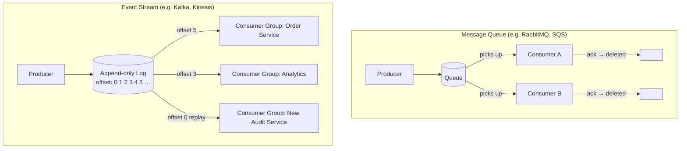

# [BEE-220] Message Queues vs Event Streams

:::info
Fundamental differences in semantics, delivery, and use cases between message queues (RabbitMQ, SQS) and event streams (Kafka, Kinesis).
:::

## Context

Distributed systems rely on asynchronous messaging to decouple producers from consumers. Two distinct models exist: the **message queue** and the **event stream**. On the surface they look similar — both move data from one process to another — but they differ fundamentally in semantics, retention, and how consumers interact with the data.

Choosing the wrong model leads to architectural pain: you cannot replay a queue after a bug is fixed, and running a simple work queue on Kafka adds complexity that brings no benefit. The choice should be deliberate.

**References:**
- [When to use RabbitMQ or Apache Kafka — CloudAMQP](https://www.cloudamqp.com/blog/when-to-use-rabbitmq-or-apache-kafka.html)
- [Martin Kleppmann — Turning the database inside-out with Apache Samza](https://martin.kleppmann.com/2015/03/04/turning-the-database-inside-out.html)
- [Kafka Consumer Design: Consumers, Consumer Groups, and Offsets — Confluent](https://docs.confluent.io/kafka/design/consumer-design.html)

## Principle

**Choose a message queue when the goal is task distribution. Choose an event stream when the goal is a durable, replayable record of what happened.**

## Core Semantics

### Message Queue

A message queue is a point-to-point, consume-and-delete channel.

- A producer writes a message to the queue.
- One consumer picks it up (competing consumers share the load).
- The broker removes the message after the consumer acknowledges it.
- There is no concept of position or offset — a message exists until processed, then it is gone.

**Primary guarantee:** Every message is processed exactly once by exactly one consumer (when acknowledgment is used correctly).

### Event Stream

An event stream is an append-only, ordered log.

- A producer appends an event to the log (a partition in Kafka terminology).
- Each consumer group maintains its own **offset** — the position up to which it has read.
- Multiple consumer groups read the same log independently.
- Messages are **retained** for a configurable period regardless of consumption.
- A consumer can **replay** the log from any past offset.

**Primary guarantee:** Every consumer group sees every event in order (within a partition), and any consumer group can re-read history at will.

## Side-by-Side Diagram



In the queue model, once a consumer acknowledges a message it is gone — no other consumer can read it and it cannot be replayed. In the stream model, the log is shared; each consumer group advances its own cursor independently, and the data remains available for new groups or replays.

## Order Processing Example

### As a Message Queue

```
[Order Service] ──publish──> [queue: orders]
                                   │
                  ┌────────────────┴────────────────┐
                  │                                 │
          [Worker 1]                         [Worker 2]
      picks up order #42                 picks up order #43
      processes payment                  processes payment
      sends ack ─────────────────────────────────────>
      message deleted                    message deleted
```

Order #42 is processed by Worker 1. After the ack, it no longer exists in the broker. If the payment service has a bug and you need to reprocess, **you cannot** — the message is gone.

### As an Event Stream

```
[Order Service] ──append──> [topic: orders  | offset: 0  1  2  3  4  5 ]
                                                         │  │  │  │  │  │
                             Order Service reads at ─────────────────5
                             Analytics reads at ──────────────3
                             Audit Service reads at ──0  (replay from start)
```

The same event at offset 4 is independently consumed by three groups. Each group tracks its own position. When you deploy a fix to the analytics pipeline, you reset its offset to 0 and replay the full history without touching the order service.

**Why the stream allows replay:** The log is immutable and retention-based (e.g., 7 days or unlimited). No consumer action deletes data. A queue is consumption-based: consumption *is* deletion.

## When to Use Each

| Criterion | Message Queue | Event Stream |
|---|---|---|
| Primary use case | Task distribution, work queues, command processing | Event sourcing, EDA, audit trail, analytics pipelines |
| Message lifetime | Until consumed (and acked) | Configurable retention (time or size) |
| Multiple consumers | Compete for the same messages (load sharing) | Each consumer group reads independently |
| Replay | Not supported | Supported — reset offset to any past position |
| Ordering | Per-queue FIFO | Per-partition ordering; no guarantee across partitions |
| Consumer complexity | Simple (broker handles routing) | Higher (consumer must track offsets) |
| Backpressure handling | Natural — queue depth grows | Consumer lag metric; must be monitored |
| Typical systems | RabbitMQ, Amazon SQS, ActiveMQ | Apache Kafka, Amazon Kinesis, Redpanda |

### Use a Queue When

- You need each task processed by exactly one worker.
- Tasks are independent commands: send email, resize image, charge credit card.
- Replay is not a requirement; you care about throughput and simplicity.
- Your consumer pool needs to scale horizontally to drain a backlog.

### Use a Stream When

- Multiple independent systems must react to the same event.
- You need audit logs, event sourcing, or the ability to rebuild state from history.
- You want to onboard new consumers that need to read historical data.
- You are building analytics or data pipelines that run at their own pace.
- You may need to replay events after a bug fix or a new feature rollout.

## Retention and Ordering

### Retention

A message queue retains a message until a consumer fetches and acknowledges it. The queue is the buffer, not the record.

An event stream retains messages according to a configured policy:
- Time-based: keep events for 7 days.
- Size-based: keep the last 100 GB per partition.
- Compact: keep only the latest value per key (log compaction).

This retention model is what makes streams suitable as a system of record, not just a transport layer.

### Ordering

Both models offer ordering, but with different scopes.

**Queue:** Messages are delivered in FIFO order from the queue. With competing consumers, order between workers is not guaranteed because two workers may process adjacent messages concurrently.

**Stream:** Within a single partition, order is strictly preserved. Across partitions, there is no global ordering guarantee. If ordering for a logical group of events is required (e.g., all events for a given order ID), they must be routed to the same partition via a consistent partition key.

## Consumer Groups and Partitions

Kafka's consumer group model is worth understanding in detail because it is commonly misunderstood.

A **consumer group** is a logical subscriber. All consumers in the same group share the work: each partition is assigned to exactly one consumer in the group at a time. Two groups reading the same topic do not interfere; each has its own independent offset.

```
Topic: orders (3 partitions)

Consumer Group: payment-service
  Consumer 1 → Partition 0
  Consumer 2 → Partition 1
  Consumer 3 → Partition 2

Consumer Group: analytics-service
  Consumer A → Partition 0, 1, 2   (single consumer reads all)
```

The practical implication: scaling within a group is limited by the number of partitions. You cannot have more active consumers than partitions in a group. Plan partition counts with future throughput in mind.

## Common Mistakes

### 1. Using a Queue When You Need Replay

If downstream services may need to reprocess events — for backfills, bug fixes, new feature catch-up — a queue will not work. Once consumed and acknowledged, the message is gone. You will need to either re-emit events from the source or maintain a separate database of events.

### 2. Using a Stream for Simple Task Distribution

Kafka adds operational overhead: partition planning, offset management, consumer lag monitoring, and broker cluster management. For a simple background job queue (send emails, process uploads), a purpose-built queue is simpler, cheaper, and easier to operate. Do not use Kafka because it sounds impressive.

### 3. Assuming Global Ordering Across Partitions

Events in different partitions arrive in the order they were appended *within* that partition. There is no ordering guarantee across partitions. If your logic depends on a strict global sequence (e.g., "all events in order for every user"), you must use a single partition (which limits throughput) or design your consumer to tolerate out-of-order delivery across partitions.

### 4. Not Monitoring Consumer Lag

In a stream, a slow consumer does not block producers or other consumers. Instead, the consumer's offset falls behind and **consumer lag** grows. Unmonitored consumer lag means your downstream service is silently processing stale data. Track lag as a first-class metric; alert when it exceeds a threshold.

### 5. Treating Messages as Guaranteed Without Acknowledgment

Both queues and streams support delivery guarantees, but they require explicit acknowledgment behavior:
- In a queue, if a consumer crashes before acking, the broker redelivers the message.
- In a stream, the consumer is responsible for committing its offset. If offset commit happens before processing completes and the consumer crashes, the event is skipped on restart.

Configure acknowledgment and offset commit policies deliberately. At-least-once delivery (reprocess on failure) is usually simpler to implement safely than exactly-once.

## Related BEPs

- **BEE-221** — Pub/Sub patterns and fan-out
- **BEE-222** — Delivery guarantees: at-most-once, at-least-once, exactly-once
- **BEE-223** — Event sourcing: rebuilding state from an event log
- **BEE-143** — Serialization formats for messages (Avro, Protobuf, JSON)
