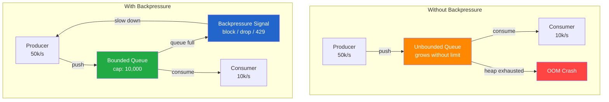

# [BEE-225] Backpressure and Flow Control

:::info
Preventing fast producers from overwhelming slow consumers through explicit demand signaling and bounded buffers.
:::

## Context

In any system where data flows from a producer to a consumer, the two sides rarely operate at exactly the same speed. A producer may burst at 50,000 events per second while a consumer can sustain only 10,000. Without a mechanism to reconcile this mismatch, one of several failure modes occurs: memory exhausts itself filling an unbounded buffer, latency spikes as queued work ages, or cascading failures propagate upstream as each service collapses under load.

Backpressure is the class of techniques by which a slower downstream component signals an upstream producer to slow, pause, or shed load. The term originates from fluid dynamics — a pipe exerts physical resistance back toward the source when flow exceeds capacity. In software, the signal is explicit rather than physical, but the goal is identical: maintain a stable, sustainable flow rate.

References:
- [Backpressure in Distributed Systems (DZone)](https://dzone.com/articles/backpressure-in-distributed-systems)
- [Reactive Streams Specification (reactive-streams.org)](https://www.reactive-streams.org/)
- [TCP Flow Control (brianstorti.com)](https://www.brianstorti.com/tcp-flow-control/)

## Principle

**A system must propagate demand signals from consumers back to producers. Producers must respect those signals. Buffers between them must be bounded.**

Backpressure is not optional in a production system — it is the mechanism that converts a theoretically unbounded buffer problem into a bounded resource consumption problem. Any component that accepts data without signaling capacity limits is implicitly choosing unbounded buffering, which is equivalent to choosing eventual OOM.

## Core Concepts

### What Backpressure Is

Backpressure is a feedback signal flowing upstream. The consumer tells the producer: "I can accept N more items right now." The producer must honor that signal by slowing, pausing, buffering at its own boundary, or dropping according to the agreed policy.

The signal can be:
- **Implicit**: TCP's receive window shrinks to zero, halting the sender
- **Explicit**: An HTTP 429 response tells the caller to back off
- **Demand-based**: A Reactive Streams subscriber calls `Subscription.request(n)` to pull exactly N items
- **Threshold-based**: A queue depth metric crosses a threshold, triggering a producer rate limit

### Why Unbounded Queues Fail

An unbounded in-memory queue appears to solve the speed mismatch problem — the producer keeps writing, the consumer keeps reading, and the queue absorbs the difference. This works until the backlog exceeds available heap. The result is an OOM crash that is harder to debug than a slow or back-pressured system because the failure appears sudden and is caused by accumulated invisible state.

Bounded queues force the problem into the open. When the queue fills, the producer must decide: block, drop, or escalate. Each of those decisions is visible and can be monitored.

### Backpressure Strategies

| Strategy | Behavior | When to Use |
|---|---|---|
| **Block (bounded buffer)** | Producer blocks when queue is full | Processing pipelines where data loss is unacceptable |
| **Drop oldest** | Evict oldest items to make room | Telemetry, metrics — freshness matters more than completeness |
| **Drop newest** | Reject incoming when full | Audit logs — preserve history, signal caller to retry |
| **Load shedding** | Reject entire request categories | API tiers, non-critical workloads during overload |
| **Signal to slow** | Return 429, pause subscription | External APIs, Reactive Streams, message broker consumers |
| **Pull-based** | Consumer drives demand, never gets more than requested | Batch processing, stream processing frameworks |

No single strategy is universally correct. The right choice depends on whether data loss is acceptable, whether retry is possible, and where in the call graph the pressure originates.

### TCP Flow Control as Natural Backpressure

TCP's flow control mechanism is the canonical example of hardware-enforced backpressure. The receiver maintains a receive buffer and advertises its remaining capacity as the **receive window** (rwnd) in every ACK packet. When the buffer fills, rwnd drops to zero. The sender must stop transmitting until the receiver signals available space again.

This is demand-based pull at the transport layer: the receiver decides how much data it can accept, and the sender is structurally prevented from exceeding that limit. Application-level backpressure systems should be designed with the same principles — the consumer controls the flow rate, and the producer cannot unilaterally override that control.

### Reactive Streams Demand Model

The [Reactive Streams specification](https://www.reactive-streams.org/) formalizes backpressure for asynchronous JVM streams (Java 9 `Flow`, Project Reactor, RxJava, Akka Streams). Its core rule:

> A Subscriber MUST signal demand via `Subscription.request(long n)` to receive `onNext` signals.

The subscriber decides when to request more items and how many. The publisher cannot push data the subscriber has not requested. This is a pure pull model that makes queue bounds implicit — the publisher's in-flight item count is bounded by the outstanding demand.

Key property: backpressure is mandatory in Reactive Streams. Implementations cannot circumvent it. Contrast this with callback-based or event-emitter systems where the publisher pushes freely and backpressure requires an explicit opt-in.

### Queue Depth as a Backpressure Signal

Queue depth is the leading indicator of backpressure pressure. A queue that is consistently at 0–10% capacity is healthy. A queue trending toward 80–90% capacity is a system approaching its backpressure boundary. A queue that is consistently at 100% is a system that is either shedding load, blocking producers, or about to fail.

Monitor queue depth as a primary operational signal. Alert before saturation, not after.

### Pull vs Push Models

| Model | Description | Backpressure |
|---|---|---|
| **Push** | Producer sends data when available | Must be bolted on explicitly (429, circuit breaker, rx demand) |
| **Pull** | Consumer requests data when ready | Backpressure is structural — consumer never receives more than it asked for |

Push models are common (webhooks, Kafka, SSE) because they are simpler to implement. Pull models (database cursors, paginated APIs, Reactive Streams) are structurally safer but require the consumer to drive the interaction.

Hybrid approaches are common in practice: Kafka consumers pull from brokers (pull model toward the broker), but the broker accepts pushes from producers (push model). Kafka's design shifts backpressure responsibility to partition lag monitoring and consumer group scaling rather than real-time demand signaling.

## The Backpressure Gap Problem

Backpressure protection applied at one hop in a call chain does not protect other hops. A common failure pattern:

```
API Gateway  →  Service A  →  Service B  →  Database
    [rate limited]         [no backpressure]
```

Service A is rate-limited from the gateway but continues to push at full speed to Service B. Service B is unprotected. Under load, Service B exhausts its connection pool and begins timing out. Service A's retry logic amplifies the load. The gateway rate limit bought time but did not solve the problem.

Backpressure must be designed end-to-end. Every hop in the chain needs a policy.

## Worked Example: API Event Producer and Analytics Consumer

Consider an API service that publishes events to a queue, consumed by an analytics service.

### Scenario 1: Unbounded Queue (Dangerous)

```
API Service  →  unbounded in-memory queue  →  Analytics Service
  50k/s                  ???                       10k/s
```

The queue grows at 40,000 items per second. At typical event sizes (1 KB), the queue consumes ~40 MB/s of heap. Within seconds, JVM heap is exhausted. The process crashes, and all queued events are lost.

### Scenario 2: Bounded Queue with Blocking Producer

```
API Service  →  bounded queue (cap: 10,000)  →  Analytics Service
  50k/s            blocks at capacity              10k/s
```

When the queue reaches 10,000 items, the producer's `put()` call blocks. The API service slows to the analytics service's 10k/s rate. Request latency on the API increases, which is observable. The system remains stable and no data is lost, but the producer is now slow.

Appropriate when: data loss is not acceptable and caller retry is viable.

### Scenario 3: Pull-Based Consumer Requesting Batches

```
API Service  →  bounded queue (cap: 10,000)  →  Analytics Service
  50k/s                                         pulls 500 items/batch
```

The analytics service calls `queue.poll(500)` every 50 ms, processing each batch before requesting the next. Maximum in-flight items: 500. Queue depth stays low. The producer drops or blocks when the queue reaches capacity, which happens predictably and is immediately visible in metrics.

Appropriate when: bounded latency per batch matters more than throughput.



## Common Mistakes

### 1. Unbounded In-Memory Queues

The most common mistake. An `ArrayDeque`, `LinkedList`, or `ConcurrentLinkedQueue` with no capacity limit will grow until OOM. Use `ArrayBlockingQueue(capacity)` or equivalent bounded structures. Never use an unbounded queue in a production data path.

### 2. Dropping Messages Silently Without Metrics

Load shedding is sometimes the correct strategy. Dropping messages silently is never correct. Every drop must increment a counter that feeds an alert. Silent drops cause data quality issues that are discovered weeks later during audits.

```java
// Wrong
if (queue.size() >= MAX) {
    return; // silent drop
}

// Right
if (queue.size() >= MAX) {
    metrics.increment("queue.drops");
    log.warn("Queue full, dropping event type={}", event.type());
    return;
}
```

### 3. Backpressure Propagation Gap

Protecting one hop does not protect the whole chain. Audit each service boundary in a call graph and define a backpressure policy for each one. Document which hops have no backpressure and why that is acceptable.

### 4. Using Timeouts as Backpressure

Timeouts detect that a downstream system is slow. They do not prevent the downstream system from being overwhelmed. A timeout on a database query that returns after 30 seconds does not stop the caller from sending 1,000 concurrent queries to that database. Backpressure is about rate control upstream of the bottleneck, not about detecting failures downstream.

### 5. No Monitoring on Queue Depth

Backpressure problems are predictable if queue depth is tracked. A queue trending toward saturation over hours gives operators time to scale the consumer or reduce producer load. An unmonitored queue gives no warning before the OOM crash. Instrument every bounded queue with depth and drop-rate metrics.

## Backpressure in Microservices

### HTTP 429 Too Many Requests

The standard mechanism for API-level backpressure. Include a `Retry-After` header to tell callers when to retry. Callers must implement exponential backoff with jitter; a 429 that triggers immediate retry amplifies rather than reduces load.

### Circuit Breaker

A circuit breaker (see BEE-260) opens when downstream error rates or latency cross a threshold, stopping requests to a degraded service. This is backpressure at the service invocation level. It protects the caller from wasting resources on a slow downstream, but does not reduce load on the downstream — it redirects it. Pair circuit breakers with fallbacks, not just with errors.

### Queue Depth Monitoring

For message-queue-based architectures, consumer lag (the difference between the latest produced offset and the latest consumed offset) is the primary backpressure signal. Alert when lag exceeds a threshold. Scale consumers when lag trends upward. Consider producing to a dead-letter queue when lag exceeds a critical threshold rather than letting the primary queue fill indefinitely.

### Rate Limiting vs Backpressure

Rate limiting (see BEE-266) constrains the rate of requests from a single client. Backpressure constrains the rate of data flow based on downstream capacity. They solve different problems:

- Rate limiting: "This client is sending too fast relative to fair-use policy"
- Backpressure: "The downstream system cannot sustain the current load regardless of source"

Rate limiting is a crude form of backpressure when it is set to match downstream capacity, but it lacks the dynamic feedback loop that true backpressure provides. A fixed rate limit set at system design time will be wrong the moment system capacity changes.

## Related BEPs

- **BEE-220** — Messaging fundamentals: broker patterns that backpressure integrates with
- **BEE-260** — Circuit Breaker: service-level protection that complements backpressure
- **BEE-266** — Rate Limiting: request-rate control, a static form of backpressure
- **BEE-305** — Async Processing: patterns where backpressure is structurally required
