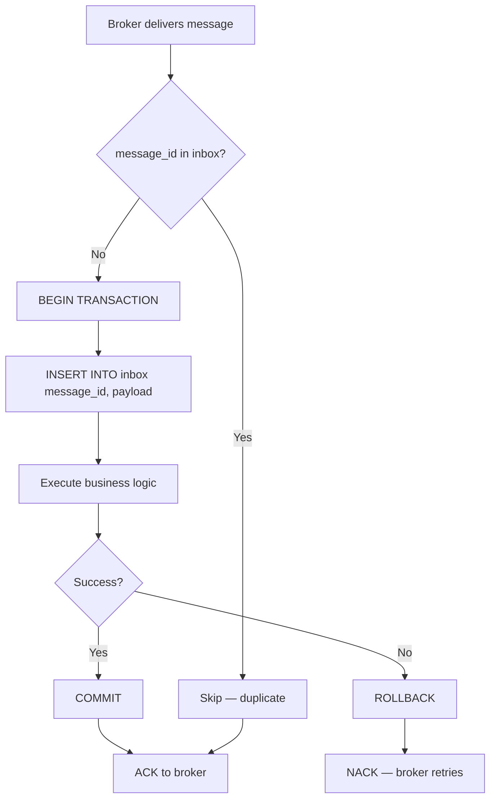

# [BEE-226] Idempotent Message Processing

:::info
Designing consumers that tolerate duplicate delivery.
:::

## Context

Every message broker that provides at-least-once delivery guarantees will, under normal operating conditions, deliver the same message more than once. Network partitions, consumer crashes mid-processing, rebalances, and broker-side retries all produce duplicates. A consumer that assumes exactly-once delivery is not a resilient consumer — it is a consumer that works until it doesn't.

This BEE describes how to design message consumers so that receiving the same message twice produces the same observable outcome as receiving it once.

**Related BEPs:**
- [BEE-72](72.md) — API idempotency (same principle applied at the HTTP layer)
- [BEE-164](164.md) — Exactly-once semantics
- [BEE-222](222.md) — Delivery guarantees
- [BEE-224](224.md) — Dead letter queues

**References:**
- [EIP: Idempotent Consumer — microservices.io](https://microservices.io/patterns/communication-style/idempotent-consumer.html)
- [Outbox, Inbox patterns and delivery guarantees explained — event-driven.io](https://event-driven.io/en/outbox_inbox_patterns_and_delivery_guarantees_explained/)
- [Implementing the Inbox Pattern for Reliable Message Consumption — milanjovanovic.tech](https://www.milanjovanovic.tech/blog/implementing-the-inbox-pattern-for-reliable-message-consumption)

## Principle

**A message consumer must produce the same result regardless of how many times it processes a given message.**

This is not optional when the broker guarantees at-least-once delivery. It is a contract between the consumer and the distributed system it participates in.

## Why Duplicates Are Inevitable

Consider the standard consumer lifecycle:

1. Broker delivers message to consumer.
2. Consumer processes message.
3. Consumer acknowledges (ACK) back to broker.

If the consumer crashes between steps 2 and 3, the broker re-delivers. The business logic ran, but the broker has no knowledge of that — from its perspective the message was never acknowledged. The consumer will process it again.

This is not a bug. At-least-once delivery is a deliberate trade-off that prioritizes data durability over duplicate elimination. Exactly-once delivery is either a myth or a very expensive guarantee that shifts the deduplication complexity elsewhere (see [BEE-16](16.md)4).

The consumer owns the responsibility of handling duplicates safely.

## Idempotent Consumer Pattern

The [Idempotent Consumer pattern (EIP)](https://www.enterpriseintegrationpatterns.com/) describes making a receiver safe to invoke multiple times with the same message. There are two broad approaches:

### 1. Natural Idempotency

Some operations are inherently idempotent. Prefer these when the domain allows:

| Operation | Idempotent? | Notes |
|---|---|---|
| `SET stock_level = 42` | Yes | Applying it twice produces the same result |
| `stock_level += 5` | No | Each application adds 5 more |
| `INSERT ... ON CONFLICT DO NOTHING` | Yes | Second insert is silently ignored |
| `INSERT ...` (no conflict handling) | No | Second insert fails or creates duplicate |
| `UPDATE ... WHERE id = ?` | Yes | Same update applied twice is still the same state |
| `DELETE ... WHERE id = ?` | Yes | Deleting an already-deleted row is a no-op |

Design messages to carry **final state**, not **deltas**. Instead of "add 5 to the cart", prefer "set cart item X quantity to 8". Instead of "charge $10", prefer "record payment P-123 for $10 for order O-456".

### 2. Deduplication Table

When natural idempotency is not achievable, track processed message IDs explicitly.

```sql
CREATE TABLE processed_messages (
    message_id   TEXT        NOT NULL,
    processed_at TIMESTAMPTZ NOT NULL DEFAULT now(),
    result       JSONB,
    PRIMARY KEY (message_id)
);

-- Optional TTL cleanup (run periodically or via pg_cron)
DELETE FROM processed_messages
WHERE processed_at < now() - INTERVAL '7 days';
```

On each message arrival:

```sql
-- Attempt to record this message as processed
INSERT INTO processed_messages (message_id, result)
VALUES ($1, $2)
ON CONFLICT (message_id) DO NOTHING;

-- Check if the insert was a no-op (duplicate)
-- If affected rows = 0, this is a duplicate — skip business logic
```

This approach is straightforward but has a race condition: two concurrent deliveries of the same message can both pass the `INSERT` check before either commits. Database constraints are the correct guard — use a `PRIMARY KEY` or `UNIQUE` constraint on `message_id`, not an application-level check-then-act.

## Inbox Pattern

The inbox pattern extends deduplication to provide transactional safety: the message is stored in a local inbox table **in the same database transaction** as the business logic. This eliminates the window where a message is "processed but not yet ACKed" — if the transaction rolls back, the inbox record also rolls back, and the broker re-delivers to a clean state.



### Inbox Table Schema

```sql
CREATE TABLE inbox_messages (
    message_id    TEXT        NOT NULL PRIMARY KEY,
    message_type  TEXT        NOT NULL,
    payload       JSONB       NOT NULL,
    received_at   TIMESTAMPTZ NOT NULL DEFAULT now(),
    processed_at  TIMESTAMPTZ,
    error         TEXT
);
```

### Processing Flow (SQL)

```sql
BEGIN;

-- Step 1: Attempt to insert into inbox (unique constraint guards against races)
INSERT INTO inbox_messages (message_id, message_type, payload)
VALUES ($message_id, $type, $payload)
ON CONFLICT (message_id) DO NOTHING;

-- Step 2: Check if this is a new message
-- (affected_rows = 0 means it was already in the inbox)
-- If duplicate: ROLLBACK or just proceed to COMMIT without business logic

-- Step 3: Execute business logic inside the same transaction
UPDATE inventory
SET reserved = reserved + $quantity
WHERE product_id = $product_id
  AND order_id IS NULL;  -- Simplified; real check would be more nuanced

-- Step 4: Mark as processed
UPDATE inbox_messages
SET processed_at = now()
WHERE message_id = $message_id;

COMMIT;
-- ACK the broker only after successful commit
```

The critical property: the inbox insert and the business logic commit atomically. Either both happen or neither does.

## Practical Example: Inventory Reservation

**Message:** "Reserve 5 units of product X for order Y" — delivered with `message_id: msg-abc-123`.

**First delivery:**

```sql
BEGIN;
INSERT INTO inbox_messages (message_id, message_type, payload)
VALUES ('msg-abc-123', 'inventory.reserve', '{"product_id":"X","qty":5,"order_id":"Y"}');
-- 1 row inserted

INSERT INTO inventory_reservations (order_id, product_id, quantity)
VALUES ('Y', 'X', 5);
-- Reservation created

UPDATE inbox_messages SET processed_at = now() WHERE message_id = 'msg-abc-123';
COMMIT;
-- ACK
```

**Second delivery (duplicate):**

```sql
BEGIN;
INSERT INTO inbox_messages (message_id, message_type, payload)
VALUES ('msg-abc-123', 'inventory.reserve', '{"product_id":"X","qty":5,"order_id":"Y"}');
-- 0 rows inserted (ON CONFLICT DO NOTHING)

-- Detect 0 rows → skip business logic
ROLLBACK; -- or COMMIT with no changes
-- ACK (safe — the operation was already completed)
```

The second delivery acknowledges cleanly without re-executing the reservation.

## Choosing a Dedup Key

The dedup key is what makes a message uniquely identifiable. Two options:

**Message ID (broker-assigned):** Each message delivery has a broker-level ID (e.g., Kafka offset + partition, SQS message ID, RabbitMQ delivery tag). Use this when the same logical event should never be processed twice regardless of source.

**Business key:** A domain-level identifier such as `order_id + event_type`. Use this when you care about idempotency at the domain level — for example, "only one reservation per order" regardless of how many different messages triggered it.

In most cases, prefer the message ID for the inbox/dedup table, and enforce business-level constraints separately (e.g., `UNIQUE(order_id)` on the reservations table).

## TTL for Deduplication Records

Dedup records do not need to be kept forever. The appropriate TTL depends on:

- **Maximum re-delivery window:** How long can a broker hold an unacked message before re-delivering? Add a safety margin (e.g., 2x).
- **Visibility timeout / ack deadline:** Typically minutes to hours.
- **Operational tolerance:** Longer TTL = more storage, fewer false negatives.

A 7-day TTL is a reasonable default for most systems. Enforce it with a scheduled cleanup job or database-native TTL (e.g., Redis `EXPIRE`, DynamoDB TTL, or a `pg_cron` job).

```sql
-- Cleanup job (run daily via pg_cron or external scheduler)
DELETE FROM inbox_messages
WHERE processed_at IS NOT NULL
  AND processed_at < now() - INTERVAL '7 days';
```

Do not skip TTL. An inbox table without cleanup grows unboundedly and will eventually degrade query performance or exhaust storage.

## Concurrent Duplicate Handling

Application-level "check then act" is not safe under concurrent delivery:

```
Thread A: SELECT count(*) FROM inbox WHERE message_id = 'X' → 0 (not found)
Thread B: SELECT count(*) FROM inbox WHERE message_id = 'X' → 0 (not found)
Thread A: INSERT INTO inbox ...  ← succeeds
Thread B: INSERT INTO inbox ...  ← also succeeds (race condition!)
```

**Use database constraints as the concurrency guard.** A `PRIMARY KEY` or `UNIQUE` constraint on `message_id` means only one insert can win — the other will receive a constraint violation. Handle that exception as a duplicate, not an error.

```python
try:
    cursor.execute(
        "INSERT INTO inbox_messages (message_id, ...) VALUES (%s, ...)",
        (message_id, ...)
    )
    # proceed with business logic
except UniqueViolation:
    # this is a duplicate — skip and ACK
    pass
```

## Common Mistakes

**1. Assuming messages arrive exactly once.**
No standard message broker guarantees this without significant trade-offs. Design consumers to expect duplicates from day one.

**2. Check-then-act without atomicity.**
Reading "does this message exist?" and then acting on the answer in two separate steps is a race condition. The inbox insert and business logic must be in the same transaction, or the dedup insert must use a constraint that fails on conflict.

**3. Using delta operations without an idempotency key.**
`UPDATE accounts SET balance = balance + 100` applied twice credits $200. Always pair delta operations with an idempotency check, or redesign them as set operations tied to a unique event ID.

**4. Dedup table without TTL.**
A table that only grows will eventually become a performance problem. Always implement a cleanup strategy from the start.

**5. Idempotency only at the API layer.**
Consumers in an event-driven architecture are not protected by API-layer idempotency keys (see [BEE-7](7.md)2). Each consumer must implement its own deduplication independently. An idempotent HTTP handler does not make a downstream Kafka consumer idempotent.
