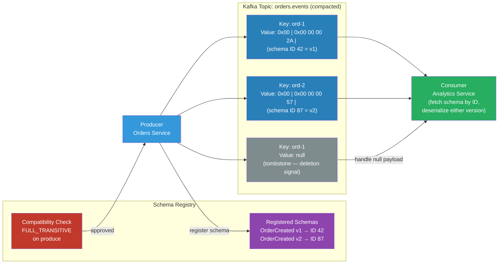

# [BEE-480] Event Schema Design and Versioning

:::info
Event schemas are contracts between producers and consumers in event-driven systems — design them for evolution from day one, because every schema change is a distributed deployment that cannot be coordinated atomically across all services.
:::

## Context

In synchronous APIs, a breaking change in a request or response shape can be deployed with a version bump. All callers are known, and rollout can be coordinated. In event-driven systems, the producer and consumer are decoupled by time: events written today may be read by a consumer deployed six months from now, or replayed from a compacted Kafka topic after a consumer outage. The producer cannot know who is reading, when they are reading, or which schema version they expect.

This asymmetry makes schema design for events fundamentally different from schema design for REST APIs. An event schema is an append-only contract. Breaking changes — renaming a field, changing its type, removing it — are effectively impossible without a coordinated migration strategy that is rarely achievable in practice.

The tooling that formalized this discipline is the **schema registry** — popularized by Confluent Schema Registry (2015) alongside Apache Kafka. A schema registry stores schemas centrally, assigns each version a numeric ID, and enforces compatibility rules at produce time. The serialization wire format encodes the schema ID (1 magic byte `0x00` + 4-byte schema ID + payload) so consumers can always look up the exact schema used to write each message, regardless of when it was produced.

The CNCF **CloudEvents** specification (graduated January 2024) standardized the event envelope — the metadata wrapper around the business payload — providing a vendor-neutral format adopted by AWS EventBridge, Azure Event Grid, Google Cloud Eventarc, and over 40 other platforms.

## Design Thinking

### Schema Compatibility Modes

Compatibility rules define what changes are allowed between schema versions:

| Mode | Who benefits | Allowed changes |
|---|---|---|
| **BACKWARD** | Consumer using new schema reads old data | Add optional fields with defaults; remove required fields |
| **FORWARD** | Consumer using old schema reads new data | Add fields (old reader ignores them); remove optional fields |
| **FULL** | Both directions work | Only add or remove optional fields with defaults |
| **NONE** | No enforcement | Any change (dangerous for production) |

**BACKWARD_TRANSITIVE** and **FORWARD_TRANSITIVE** extend these checks to all previous versions, not just the immediately preceding one — required for Kafka compacted topics where consumers may replay from the beginning.

The practical default for most event systems is **FULL** or **BACKWARD**: both guarantee that new consumers can read old events (compacted topic replay) and that old consumers can read events produced during a rolling deployment.

### Event Envelope Pattern

Separate metadata from business payload. The envelope carries fields that every consumer needs regardless of event type; the payload is the business fact.

Minimum envelope fields (aligned with CloudEvents v1.0):
- `id` — UUID, unique per event (idempotency key for consumers)
- `source` — URI identifying the producer service (`/orders-service`)
- `type` — namespaced event type string (`com.example.order.created`)
- `specversion` — CloudEvents version (`"1.0"`)
- `time` — RFC 3339 timestamp of when the event occurred
- `datacontenttype` — media type of the payload (`application/json`, `application/avro`)

Business-domain additions worth standardizing:
- `correlationid` — trace ID for distributed tracing correlation
- `tenantid` — for multi-tenant systems

### Versioning Strategies

Three approaches, not mutually exclusive:

**Schema Registry ID in wire format**: The Confluent wire format encodes `0x00 + uint32 schema_id` before the payload. Consumers fetch the schema by ID at deserialization time. No version field in the event itself — the registry is the source of truth. Works only when all producers and consumers use compatible registry clients.

**Type-based versioning**: Encode the version in the event type string: `com.example.order.created.v2`. Old consumers subscribed to `v1` topics ignore `v2` events. Simple but leads to topic proliferation and requires explicit consumer migration.

**Schema version field in envelope**: A `schema_version` field in the envelope metadata. Consumers switch deserialization logic based on the field. Flexible but puts versioning logic in every consumer.

For Kafka-based systems with Avro or Protobuf, the schema registry approach is standard and requires the least consumer-side logic. For HTTP-delivered webhooks and CloudEvents, the type field or a custom extension attribute carries the version.

## Best Practices

**MUST design every event field as optional with a default from the first version.** Required fields without defaults cannot be removed without a breaking change. In Avro, use union types (`["null", "string"]` with `"default": null`) for all fields. In Protobuf, all fields are optional by default in proto3; use the presence detection pattern (`optional` keyword or `oneof`) only when distinguishing absent from zero is semantically significant.

**MUST register schemas in a schema registry before producing events in production.** Publishing unregistered schemas breaks the enforcement contract. Configure the schema registry client to `FAIL` (not `SKIP`) on compatibility violations.

**MUST use `reserved` in Protobuf for deleted field numbers and names.** Reusing a field number causes wire-format ambiguity: an old consumer reading a new field as an old field will silently produce corrupted data. `reserved 3, 7; reserved "old_field_name";` prevents accidental reuse in code review.

**MUST NOT rename fields in Avro or change field types.** In Avro, field identity is by name. Renaming a field is a deletion and an addition — a breaking change in both directions. In Protobuf, field identity is by number, so renaming is safe at the wire level but breaks generated code APIs. Use the `aliases` feature in Avro (`"aliases": ["old_name"]`) to support reading records written with the old field name.

**SHOULD configure BACKWARD_TRANSITIVE or FULL_TRANSITIVE compatibility in schema registries for compacted topics.** Standard BACKWARD checks only against the previous version. Compacted topics can retain events from any past version; transitive checks ensure compatibility against all historical versions.

**SHOULD use a two-phase deprecation for removing event fields.** Phase 1: add a `DEPRECATED` annotation and stop populating the field (produce null/default); deploy consumers that treat the field as absent. Phase 2: after all consumers are confirmed to ignore the field (monitor consumer lag, not just deployment), remove the field from the schema and publish a new schema version.

**SHOULD include a correlation ID in the event envelope.** Consumers that produce downstream events should propagate the correlation ID, enabling end-to-end trace reconstruction across event chains without requiring a distributed tracing sidecar.

**MAY use tombstone events in Kafka compacted topics to signal entity deletion.** A tombstone is a message with a non-null key and a null value. Log compaction eventually removes all messages for that key, including the tombstone itself (after `delete.retention.ms`). Consumers must handle null payloads without crashing.

## Visual



## Example

**Avro schema evolution — adding an optional field (BACKWARD compatible):**

```json
// v1: order_created_v1.avsc
{
  "type": "record",
  "name": "OrderCreated",
  "namespace": "com.example.orders",
  "fields": [
    {"name": "order_id",    "type": "string"},
    {"name": "customer_id", "type": "string"},
    {"name": "amount_cents","type": "long"}
  ]
}

// v2: order_created_v2.avsc — add optional field with default
// BACKWARD compatible: new reader can read v1 data (amount_currency defaults to "USD")
// FORWARD compatible: old reader can read v2 data (ignores amount_currency)
{
  "type": "record",
  "name": "OrderCreated",
  "namespace": "com.example.orders",
  "fields": [
    {"name": "order_id",        "type": "string"},
    {"name": "customer_id",     "type": "string"},
    {"name": "amount_cents",    "type": "long"},
    {"name": "amount_currency", "type": ["null", "string"], "default": null}
  ]
}
```

**Protobuf field reservation on deletion:**

```protobuf
// Before: OrderCreated had a `promo_code` field (number 4)
// We are removing it. Reserve the number AND name to prevent reuse.

syntax = "proto3";
package com.example.orders;

message OrderCreated {
  string order_id     = 1;
  string customer_id  = 2;
  int64  amount_cents = 3;
  // promo_code string = 4;  ← REMOVED

  reserved 4;            // number 4 must never be reused
  reserved "promo_code"; // name must never be reused
}
```

**CloudEvents envelope — JSON over HTTP:**

```json
{
  "specversion": "1.0",
  "id": "f47ac10b-58cc-4372-a567-0e02b2c3d479",
  "source": "/orders-service",
  "type": "com.example.order.created",
  "time": "2026-04-14T22:00:00Z",
  "datacontenttype": "application/json",
  "correlationid": "3f7e9a12-bc45-4de3-a891-f0123456789a",
  "data": {
    "order_id": "ord-9012",
    "customer_id": "cust-42",
    "amount_cents": 4999,
    "amount_currency": "USD"
  }
}
```

**Schema registry producer setup — Python:**

```python
# producer.py — Confluent Avro producer with schema registry
from confluent_kafka import Producer
from confluent_kafka.schema_registry import SchemaRegistryClient
from confluent_kafka.schema_registry.avro import AvroSerializer
from confluent_kafka.serialization import SerializationContext, MessageField

# Schema registry enforces FULL_TRANSITIVE compatibility at registration time
schema_registry_client = SchemaRegistryClient({"url": "http://schema-registry:8081"})

avro_serializer = AvroSerializer(
    schema_registry_client,
    schema_str=open("order_created_v2.avsc").read(),
    # conf={"auto.register.schemas": False}  # safer in production: pre-register schemas in CI
)

producer = Producer({"bootstrap.servers": "kafka:9092"})

def publish_order_created(order: dict) -> None:
    producer.produce(
        topic="orders.events",
        key=order["order_id"],
        value=avro_serializer(
            order,
            SerializationContext("orders.events", MessageField.VALUE),
        ),
    )
    producer.flush()

# The serialized message wire format:
# [0x00][schema_id: 4 bytes big-endian][avro binary payload]
# Consumer fetches schema by ID at deserialization — no schema bundled per message
```

**Consumer handling both schema versions and tombstones:**

```python
# consumer.py — handles schema evolution and null tombstone values
from confluent_kafka import Consumer, KafkaError
from confluent_kafka.schema_registry.avro import AvroDeserializer

avro_deserializer = AvroDeserializer(schema_registry_client)

consumer = Consumer({
    "bootstrap.servers": "kafka:9092",
    "group.id": "analytics-service",
    "auto.offset.reset": "earliest",
})
consumer.subscribe(["orders.events"])

while True:
    msg = consumer.poll(1.0)
    if msg is None or msg.error():
        continue

    # Tombstone: null value signals entity deletion
    if msg.value() is None:
        handle_order_deleted(msg.key().decode())
        continue

    # Deserializer fetches the correct schema version by ID from registry
    # Both v1 and v2 events deserialize correctly — missing fields get defaults
    order = avro_deserializer(msg.value(), SerializationContext("orders.events", MessageField.VALUE))
    handle_order_created(order)
```

## Implementation Notes

**Schema registry alternatives**: Confluent Schema Registry is the most widely deployed, but Apicurio Registry (Red Hat, Apache-licensed) and AWS Glue Schema Registry are common alternatives. All three support Avro, Protobuf, and JSON Schema, and implement similar compatibility modes. The Confluent wire format is a de facto standard; Apicurio and Glue support it for interoperability.

**JSON Schema compatibility**: JSON Schema compatibility enforcement is weaker than Avro or Protobuf because JSON has no native union types or default values — compatibility rules are approximations. For events that require strict schema enforcement across many consumers, prefer Avro or Protobuf.

**Kafka headers vs wire format**: The Confluent schema ID in the wire format is embedded in the value payload. Some architectures instead put the schema ID in a Kafka message header (`Content-Type: application/avro; schema-id=87`), keeping the value as pure Avro bytes. Both approaches work; the header approach avoids the magic-byte dependency but requires all consumers to understand the header convention.

**Consumer-driven contract testing (Pact)**: For event-driven systems, Pact supports message contracts that verify the producer publishes events matching the consumer's expectations. Run Pact in CI alongside schema registry compatibility checks for a defense-in-depth approach to schema safety.

## Related BEEs

- [BEE-143](../Data Modeling/143.md) -- Encoding and Serialization Formats: covers Avro, Protobuf, and JSON at the format level; this article covers schema evolution strategy on top of those formats
- [BEE-220](../Messaging/220.md) -- Message Queues vs Event Streams: event streams (Kafka) have different schema requirements than message queues because events are retained and replayed
- [BEE-222](../Messaging/222.md) -- Delivery Guarantees: exactly-once semantics interact with schema versioning — a consumer retrying a message must handle the schema version at the time of original production
- [BEE-472](../Distributed Systems/472.md) -- The Outbox Pattern and Transactional Messaging: outbox events are a primary source of schema evolution pressure; the outbox table schema and the event schema must evolve together

## References

- [Schema Evolution and Compatibility — Confluent Documentation](https://docs.confluent.io/platform/current/schema-registry/fundamentals/schema-evolution.html)
- [CloudEvents Specification v1.0 — CNCF](https://github.com/cloudevents/spec/blob/main/cloudevents/spec.md)
- [Protocol Buffers Language Guide (proto3) — Google](https://protobuf.dev/programming-guides/proto3/)
- [Log Compaction — Confluent Kafka Documentation](https://docs.confluent.io/kafka/design/log_compaction.html)
- [Consumer-Driven Contracts — Martin Fowler (2006)](https://martinfowler.com/articles/consumerDrivenContracts.html)
- [Pact Contract Testing Documentation](https://docs.pact.io/)
