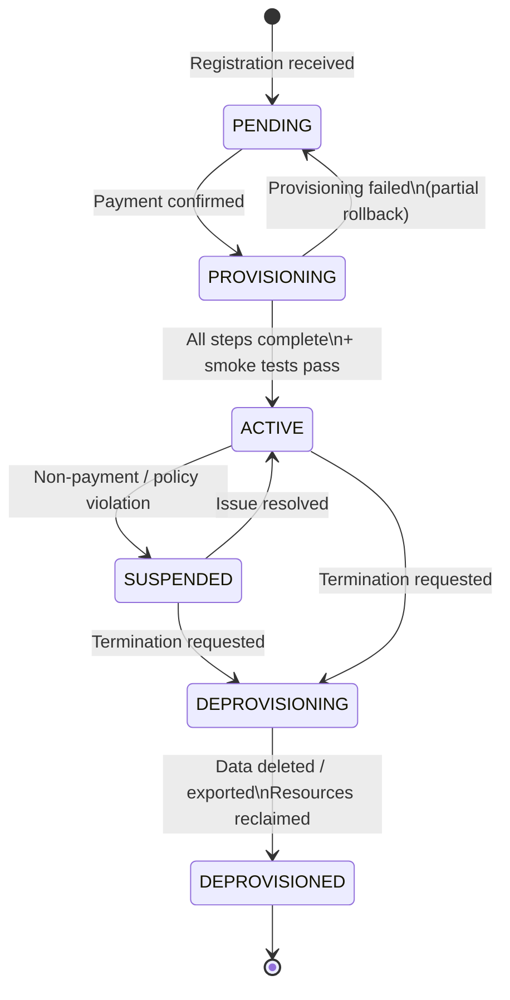

# [BEE-403] Tenant Onboarding and Provisioning Pipelines

:::info
Tenant onboarding is the operational pipeline that transforms a new customer into an active tenant — provisioning identity, infrastructure, isolation policies, and billing in a repeatable, automated, and fully observable sequence.
:::

## Context

In the early stages of a SaaS product, tenant onboarding is often manual: a developer runs a script, creates a database schema, adds a record to the tenants table, and emails the customer their credentials. This works for the first ten tenants. By the hundredth tenant, the manual steps have accumulated into a multi-hour process prone to configuration drift, missed steps, and inconsistent environments. By the thousandth tenant, it becomes a blocking bottleneck on growth.

The AWS Well-Architected SaaS Lens identifies fully automated, predictable tenant onboarding as a requirement for operational maturity. Their guidance describes an **onboarding service** — a dedicated component in the control plane that owns the end-to-end provisioning workflow. This service orchestrates every step: creating the tenant record, provisioning infrastructure (if tier-appropriate), setting up isolation policies, provisioning the initial admin identity, integrating with the billing system, running smoke tests to verify the tenant environment, and emitting completion events that downstream systems can react to.

The critical distinction is between the **control plane** and the **data plane**. The control plane manages tenants: it knows who tenants are, what tier they are on, what resources they own, and what state they are in. The data plane is the product itself — the actual service tenants use. The onboarding service lives in the control plane, and its job is to bring a new tenant from zero to a known-good data-plane state. This separation is what makes independent deployability possible: control plane changes (onboarding logic, billing integration, admin tooling) can be deployed without affecting live tenant workloads.

**Tenant lifecycle** is best modeled as a finite state machine. A tenant moves through well-defined states with transitions that have explicit triggers and outcomes:

- `PENDING`: Registration received, payment not yet confirmed.
- `PROVISIONING`: Onboarding pipeline in progress.
- `ACTIVE`: Provisioning complete, tenant can use the product.
- `SUSPENDED`: Access disabled due to non-payment or policy violation; data retained.
- `DEPROVISIONING`: Tenant has requested termination; data deletion or export in progress.
- `DEPROVISIONED`: All resources reclaimed; tenant record archived.

Every step in the pipeline must update the tenant's state so that the current position in the workflow is always observable. A tenant stuck in `PROVISIONING` for more than the expected duration triggers an alert.

## Design Thinking

**The pipeline must be idempotent.** Provisioning steps fail: a network timeout creating a database schema, a billing API returning 503, a Kubernetes namespace creation that times out. The pipeline must be able to be retried from any step without creating duplicate resources or inconsistent state. Design each step to check for existence before creating: "create schema `tenant_acme` if it does not already exist." An idempotent pipeline can be retried safely and can recover from partial failures without human intervention.

**Tier determines the pipeline shape, not just the result.** A new Standard-tier tenant in a pool model requires only a tenant record insertion and an identity provisioning call — seconds of work. A new Enterprise-tier tenant in a silo model requires database provisioning, network configuration, DNS updates, TLS certificate issuance, and deployment of tenant-specific service instances — minutes or hours of work. The same onboarding service must handle both paths, branching on tenant tier. Encoding tier-specific provisioning steps in the pipeline rather than in ad-hoc scripts ensures consistency and auditability.

**Billing integration requires special resilience.** Billing systems are external dependencies that are more likely to fail than internal services. A billing failure during onboarding should not roll back the entire provisioning — the tenant has typically already paid or agreed to pay. The correct pattern is to record billing integration as a separate step with its own retry queue, allow the tenant to proceed to `ACTIVE` state once core provisioning completes, and reconcile billing asynchronously. Document this as an explicit decision: failing fast on billing failure during onboarding is a valid choice for some products, but it should be deliberate.

**Deprovisioning is provisioning in reverse, with retention requirements.** When a tenant terminates, the pipeline must: revoke all access immediately (identity suspension), export any data the customer is entitled to retain, schedule deletion after the contractually required retention period, release infrastructure resources, and archive the tenant record. Data deletion is often the hardest step to make correct and auditable because regulatory requirements (GDPR Article 17 right to erasure) place obligations on what is deleted, when, and with what proof.

## Best Practices

Engineers MUST automate tenant onboarding end-to-end from the first tenant, not after reaching some arbitrary scale threshold. Manual provisioning accumulates technical debt proportional to tenant count; retrofitting automation into an established product is far more expensive than building it correctly from the start.

Engineers MUST make every provisioning step idempotent. A provisioning pipeline that cannot be safely retried after a partial failure requires human intervention for every infrastructure outage, which is operationally unacceptable at scale.

Engineers MUST update the tenant's lifecycle state at the start and end of each provisioning step, not only at the beginning and end of the whole pipeline. Granular state allows observability dashboards to show exactly which step a stuck tenant is on, and allows retry logic to resume from the failed step rather than from the beginning.

Engineers SHOULD use an orchestration mechanism (a step function, a saga, a workflow engine) for provisioning pipelines with more than three steps. Sequential API calls in application code have no visibility, no retry semantics, and no ability to pause and resume. An orchestration layer provides execution history, step-level retries, and timeout handling.

Engineers MUST smoke-test the newly provisioned tenant environment before marking it `ACTIVE`. At minimum: verify the tenant record exists, verify the tenant can authenticate, and verify a representative data operation succeeds. A tenant whose provisioning succeeded structurally but whose application layer is misconfigured will generate a support ticket within minutes of first use.

Engineers SHOULD emit a domain event (e.g., `TenantProvisioned`) from the onboarding service upon successful completion. Downstream systems (email delivery, analytics pipelines, support tooling, billing sync) subscribe to this event rather than polling or coupling directly to the onboarding service. This decouples the onboarding pipeline from its consumers and makes the pipeline testable in isolation.

Engineers MUST design deprovisioning to be auditable. For every tenant termination, record what was deleted, when it was deleted, and by which process. For regulated industries, maintain a deletion log that satisfies right-to-erasure audit requirements without retaining the deleted data itself.

Engineers MUST NOT share provisioning credentials or service accounts between tenants. Each automated provisioning step should use the minimum privilege needed for that step. Credentials used to create a tenant's resources should not be usable to read or modify another tenant's resources.

## Visual



## Example

**Idempotent provisioning step (pseudocode):**

```
// Each step checks for existence before creating.
// Safe to retry after any failure — network timeout, service error, pod restart.

function provision_tenant_schema(tenant_id):
    schema_name = "tenant_" + tenant_id.replace("-", "_")

    // Check if schema already exists (idempotency check)
    exists = db.query_one(
        "SELECT 1 FROM information_schema.schemata WHERE schema_name = $1",
        schema_name
    )
    if exists:
        log.info("Schema already exists, skipping creation", schema=schema_name)
        return OK

    db.exec("CREATE SCHEMA " + schema_name)
    db.exec("SET search_path TO " + schema_name)
    run_migrations(schema_name)   // apply baseline schema

    log.info("Schema created", tenant=tenant_id, schema=schema_name)
    return OK
```

**Provisioning pipeline with state tracking:**

```
// Orchestrator calls each step in sequence, updating state between steps.
// Any step failure triggers retry with exponential backoff before escalating.

function onboard_tenant(tenant):
    update_tenant_state(tenant.id, "PROVISIONING", step="started")

    steps = [
        ("create_tenant_record",     create_tenant_record),
        ("provision_infrastructure", provision_by_tier(tenant.tier)),
        ("setup_isolation_policies", setup_rls_or_schema),
        ("provision_admin_identity", create_admin_user),
        ("integrate_billing",        integrate_billing_with_retry),
        ("run_smoke_tests",          smoke_test_tenant_env),
    ]

    for step_name, step_fn in steps:
        update_tenant_state(tenant.id, "PROVISIONING", step=step_name)
        result = step_fn(tenant)
        if result != OK:
            alert_oncall(tenant.id, step_name, result)
            return FAILED

    update_tenant_state(tenant.id, "ACTIVE")
    emit_event("TenantProvisioned", tenant_id=tenant.id, tier=tenant.tier)
    return OK
```

## Related BEEs

- [BEE-400](400.md) -- Multi-Tenancy Models: silo vs. pool determines the provisioning pipeline shape
- [BEE-401](401.md) -- Tenant Isolation Strategies: the isolation policies configured during onboarding (RLS, schemas, namespaces)
- [BEE-163](163.md) -- Saga Pattern: multi-step provisioning with compensating transactions on failure
- [BEE-164](164.md) -- Idempotency and Exactly-Once Semantics: idempotent provisioning steps enable safe retries

## References

- [How are new tenants onboarded to your system? -- AWS Well-Architected SaaS Lens](https://wa.aws.amazon.com/saas.question.OPS_3.en.html)
- [Tenant onboarding in SaaS architecture for the silo model -- AWS Prescriptive Guidance](https://docs.aws.amazon.com/prescriptive-guidance/latest/patterns/tenant-onboarding-in-saas-architecture-for-the-silo-model-using-c-and-aws-cdk.html)
- [Architectural approaches for deployment of multitenant SaaS -- Azure Architecture Center](https://learn.microsoft.com/en-us/azure/architecture/guide/multitenant/approaches/deployment-configuration)
- [Building Multi-Tenant SaaS Architectures, Chapter 4: Onboarding and Identity -- O'Reilly](https://www.oreilly.com/library/view/building-multi-tenant-saas/9781098140632/ch04.html)
- [Simplify SaaS Tenant Deployments With Infrastructure As Code -- The Scale Factory](https://scalefactory.com/blog/2022/01/20/simplify-saas-tenant-deployments-with-infrastructure-as-code/)
