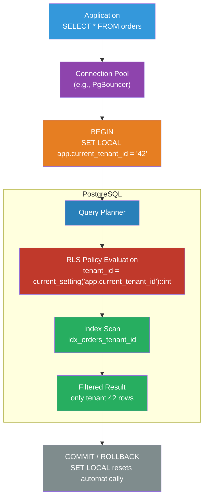

# [BEE-476] Database Row-Level Security

:::info
Row-Level Security (RLS) enforces data isolation at the database layer by attaching predicate conditions to every query against a table — ensuring that even if application code contains a tenant-ID bug, the database itself prevents cross-tenant data leakage.
:::

## Context

Multi-tenant applications that share a database table across tenants (the shared-schema isolation model, BEE-401) face a persistent risk: application code that forgets to include a `WHERE tenant_id = ?` clause will silently return or overwrite another tenant's data. This class of bug is particularly dangerous because it passes unit tests (which typically run with a single tenant), is invisible in logs, and can cause regulatory compliance failures.

The traditional defense is code review and query-level testing, but neither is fully reliable at scale. PostgreSQL addressed this at the database level with Row-Level Security, introduced in version 9.5 (2016). RLS attaches policy expressions to a table; the database evaluates these expressions as additional `WHERE` conditions on every query — reads, writes, updates, and deletes — regardless of whether the application included them. A `SELECT * FROM orders` by an application that forgot the tenant filter will return only the rows the current tenant is permitted to see.

The design is similar in concept to view-based access control (restricting what data a role sees), but more composable: policies can be scoped per operation (`SELECT`, `INSERT`, `UPDATE`, `DELETE`), combined (permissive policies add to the result; restrictive policies subtract), and expressed using any SQL predicate including subqueries and function calls.

RLS is not a replacement for application-layer filtering — query planning benefits when the application also includes the tenant condition, because the optimizer can use the index before RLS adds its predicate. RLS is a **safety net**: defense-in-depth that enforces isolation even when application code is wrong.

## Design Thinking

### Passing Tenant Context to Policies

RLS policies are evaluated per query. To isolate by tenant, the policy must know the current tenant's identity. Three approaches:

**Separate database role per tenant**: each tenant connects with a role named `tenant_<id>`. The policy compares `current_user` to the allowed role. Operationally impractical at scale — thousands of roles, connection pool complications.

**JWT / session attribute via `current_setting()`** (recommended): the application sets a session-local variable at the start of each transaction:
```sql
SET LOCAL app.current_tenant_id = '42';
```
The policy reads it:
```sql
USING (tenant_id = current_setting('app.current_tenant_id')::bigint)
```
The `LOCAL` scope ensures the variable resets at transaction end — critical for connection pooling.

**Row-level attribute**: policies can also use any column in the row (e.g., `USING (owner_id = current_user_id_from_jwt())`). This works but requires the function to securely retrieve the user identity from an application-level source.

### Permissive vs Restrictive Policies

PostgreSQL supports two policy types:

- **PERMISSIVE** (default): policies are ORed together. If any permissive policy passes, the row is visible. A table with no policies and RLS enabled returns no rows.
- **RESTRICTIVE**: policies are ANDed together. All restrictive policies must pass. Useful for adding mandatory audit or compliance filters on top of existing permissive tenant isolation.

A common pattern: one permissive policy for tenant isolation, one restrictive policy that hides soft-deleted rows (`USING (deleted_at IS NULL)`).

### Service Role vs Application Role

For operations that must bypass tenant filtering (admin queries, background jobs, data migrations), use a dedicated database role with `BYPASSRLS`:

```sql
CREATE ROLE app_service BYPASSRLS;  -- for admin operations
CREATE ROLE app_user;               -- for tenant-scoped application queries
-- app_user always sees RLS; app_service bypasses it
```

This separation is more secure than temporarily disabling RLS: `BYPASSRLS` is a role attribute, not a query-time flag, so it cannot be accidentally left on.

## Best Practices

**MUST enable RLS on every table that stores tenant-scoped data.** Enabling RLS on a table with no policies configured returns zero rows for non-superusers — a visible failure, unlike the silent cross-tenant leak that RLS is meant to prevent. Enable RLS and add the first policy in the same migration.

**MUST use `FORCE ROW LEVEL SECURITY` on tables owned by the application role.** By default, table owners bypass RLS. If your application connects as the same role that owns the tables (a common setup in smaller systems), RLS does nothing without `FORCE ROW LEVEL SECURITY`.

**MUST use `SET LOCAL` (not `SET`) when setting the tenant context variable within a transaction.** `SET LOCAL` reverts at transaction end. `SET` persists for the session. In a connection pool, a session is reused across many requests; a `SET` from request A would leak into request B if the pool does not reset it.

**MUST create an index on the tenant isolation column.** RLS adds the policy predicate as an additional `WHERE` condition. Without an index on `tenant_id`, every query becomes a sequential scan. `CREATE INDEX ON orders (tenant_id)` lets the planner use an index scan before RLS filters rows.

**SHOULD use `WITH CHECK` for INSERT and UPDATE policies to prevent tenants from writing data with another tenant's ID.** `USING` controls which rows are visible (read filter). `WITH CHECK` controls which rows can be written (write filter). Without `WITH CHECK`, a policy that uses `USING` for read isolation does not prevent an INSERT with a spoofed `tenant_id`.

**SHOULD separate read and write policies using `FOR SELECT`, `FOR INSERT`, `FOR UPDATE`, `FOR DELETE`.** A single `CREATE POLICY ... USING (...)` applies to all operations. Explicit per-operation policies give finer control and make the intent clearer during code review.

**SHOULD test RLS policies explicitly by connecting as the application role (not superuser) and verifying that cross-tenant access is blocked.** Superusers and `BYPASSRLS` roles always bypass RLS. A test that runs as a superuser will not catch policy gaps. Use `SET ROLE app_user; SET LOCAL app.current_tenant_id = '1'; SELECT ...` in tests.

**MAY use restrictive policies to enforce cross-cutting invariants** such as hiding soft-deleted rows, enforcing audit requirements, or restricting access by time window — without modifying individual permissive tenant policies.

## Visual



## Example

**Schema setup — enabling RLS with tenant isolation and soft-delete policies:**

```sql
-- Application connects as app_user (not superuser); owns no tables
CREATE ROLE app_user;
CREATE ROLE app_service BYPASSRLS;  -- for admin/background jobs

-- Orders table: owned by a separate owner role, accessed by app_user
ALTER TABLE orders ENABLE ROW LEVEL SECURITY;
ALTER TABLE orders FORCE ROW LEVEL SECURITY;  -- enforce even for table owner

-- Index required: RLS adds tenant_id predicate to every query
CREATE INDEX ON orders (tenant_id);

-- Permissive policy: tenants see only their own rows (SELECT, UPDATE, DELETE)
CREATE POLICY tenant_isolation ON orders
    AS PERMISSIVE
    FOR ALL
    TO app_user
    USING (tenant_id = current_setting('app.current_tenant_id')::bigint);

-- WITH CHECK: prevent INSERT/UPDATE with a spoofed tenant_id
CREATE POLICY tenant_write_check ON orders
    AS PERMISSIVE
    FOR INSERT
    TO app_user
    WITH CHECK (tenant_id = current_setting('app.current_tenant_id')::bigint);

-- Restrictive policy: never show soft-deleted rows (applies on top of tenant isolation)
CREATE POLICY hide_deleted ON orders
    AS RESTRICTIVE
    FOR SELECT
    TO app_user
    USING (deleted_at IS NULL);
```

**Application code — setting context within each transaction:**

```python
# db.py — connection pool wrapper that sets tenant context per transaction
from contextlib import contextmanager
import psycopg

@contextmanager
def tenant_transaction(pool, tenant_id: int):
    """Opens a transaction with the tenant context set via SET LOCAL."""
    with pool.connection() as conn:
        with conn.transaction():
            # SET LOCAL: automatically reverts when transaction ends
            # Safe for connection pooling — no state leaks between requests
            conn.execute(
                "SET LOCAL app.current_tenant_id = %s",
                (str(tenant_id),),
            )
            yield conn

# Usage: application code never mentions tenant_id in queries
def get_orders(pool, tenant_id: int) -> list[dict]:
    with tenant_transaction(pool, tenant_id) as conn:
        # RLS silently adds: WHERE orders.tenant_id = 42
        rows = conn.execute("SELECT id, amount, status FROM orders").fetchall()
        return [dict(r) for r in rows]

def create_order(pool, tenant_id: int, amount: int) -> int:
    with tenant_transaction(pool, tenant_id) as conn:
        # WITH CHECK policy prevents inserting with a wrong tenant_id
        row = conn.execute(
            "INSERT INTO orders (tenant_id, amount) VALUES (%s, %s) RETURNING id",
            (tenant_id, amount),
        ).fetchone()
        return row["id"]
```

**Testing RLS policies — verify cross-tenant access is blocked:**

```sql
-- Test as app_user with tenant 1 context
SET ROLE app_user;
BEGIN;
SET LOCAL app.current_tenant_id = '1';

-- Should return only tenant 1 rows
SELECT count(*) FROM orders;

-- Attempt cross-tenant INSERT: should fail WITH CHECK
INSERT INTO orders (tenant_id, amount) VALUES (2, 100);
-- ERROR: new row violates row-level security policy for table "orders"

ROLLBACK;
RESET ROLE;

-- Admin query via app_service bypasses RLS
SET ROLE app_service;
SELECT count(*) FROM orders;  -- returns all tenants
RESET ROLE;
```

**PgBouncer configuration — enforce connection pool settings safe for RLS:**

```ini
[pgbouncer]
; Transaction pooling: each transaction gets a connection, released on COMMIT/ROLLBACK
; SET LOCAL resets automatically; no risk of tenant context leaking between requests
pool_mode = transaction

; Prevent clients from changing pool-level settings that persist across transactions
server_reset_query = DISCARD ALL
ignore_startup_parameters = extra_float_digits
```

## Implementation Notes

**Connection pooling**: PgBouncer in `transaction` pooling mode is fully compatible with `SET LOCAL` — the variable resets at transaction boundary, and connections are released after each transaction. In `session` pooling mode, `SET LOCAL` also works, but any bare `SET` (without `LOCAL`) persists for the session and will leak to the next tenant. Configure `server_reset_query = DISCARD ALL` as a safety net.

**ORMs**: SQLAlchemy supports `SET LOCAL` via `conn.execute(text("SET LOCAL app.current_tenant_id = :tid"), {"tid": str(tenant_id)})` at the start of each session. Django does not have a first-class RLS integration; use a custom database backend or `connection.execute()` in middleware. Prisma (Node.js) supports RLS via `$executeRaw` and custom session variables.

**`current_setting()` with `missing_ok`**: If `app.current_tenant_id` is not set (e.g., during migration or a direct `psql` session), `current_setting('app.current_tenant_id')` raises an error. Use `current_setting('app.current_tenant_id', true)` (the `missing_ok` parameter) to return NULL instead, then handle NULL explicitly in the policy: `USING (tenant_id = current_setting('app.current_tenant_id', true)::bigint)`.

**Performance**: An `EXPLAIN (ANALYZE, BUFFERS)` will show the RLS predicate as a filter applied after the index scan. If the index is on `tenant_id`, the planner will push the RLS predicate into the index condition when possible. Profile with `pg_stat_statements` if you suspect RLS overhead; in practice, with a proper index, the overhead is negligible.

**Supabase**: Supabase uses RLS as the primary access control mechanism for its auto-generated APIs. Its `auth.uid()` function returns the current authenticated user's UUID, enabling per-user access policies without a separate context-setting step. The Supabase model is an instructive reference for how RLS can replace entire authorization layers.

## Related BEEs

- [BEE-401](401.md) -- Tenant Isolation Strategies: covers the decision between separate-database, separate-schema, and shared-schema isolation; RLS is the enforcement mechanism for the shared-schema model
- [BEE-404](404.md) -- Schema Migrations in Multi-Tenant Systems: RLS policies are schema objects that must be created, altered, and dropped as part of migrations; test policy changes against the application role, not superuser
- [BEE-160](../Transactions and Consistency/160.md) -- ACID Properties: SET LOCAL scopes context to the transaction; the ACID transaction boundary is what makes the per-tenant context isolation safe in connection pools

## References

- [Row Security Policies — PostgreSQL Documentation](https://www.postgresql.org/docs/current/ddl-rowsecurity.html)
- [Row Level Security — Supabase Documentation](https://supabase.com/docs/guides/auth/row-level-security)
- [Citus: Row-Level Security in Multi-Tenant Applications](https://www.citusdata.com/blog/2016/08/10/sharding-for-a-multi-tenant-app-with-postgres/)
