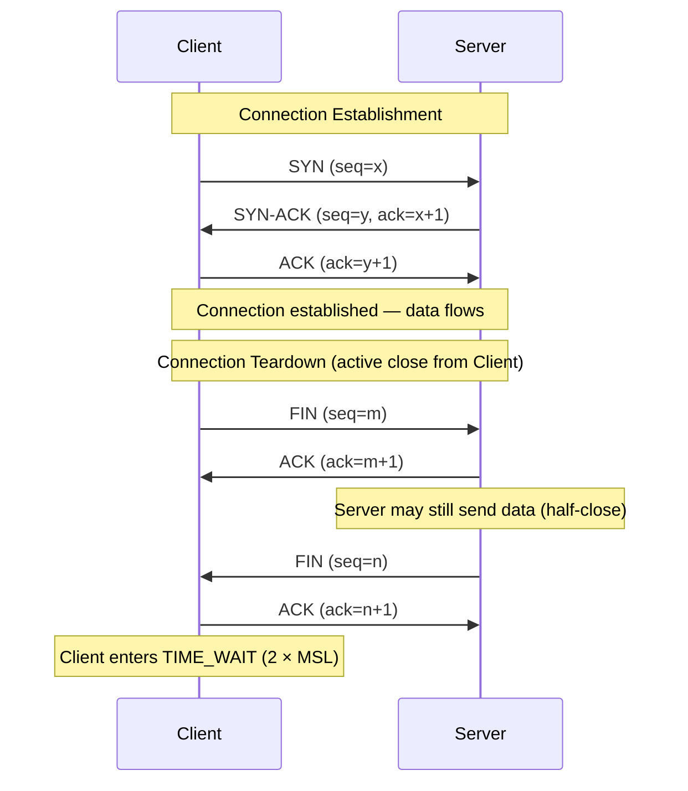

# [BEE-50] TCP/IP and the Network Stack

## Context

Backend engineers do not need to memorize every OSI layer, but they do need a working mental model of what happens between two processes on a network. Misunderstanding the network stack leads to bugs that are hard to reproduce, timeouts that are impossible to explain, and performance regressions that only manifest at scale.

This article focuses on the layers and mechanisms that backend code actually touches: IP addressing, TCP reliability guarantees, UDP trade-offs, sockets, ports, and the connection lifecycle. It covers the edge cases—TIME_WAIT, Nagle's algorithm, keepalive—that routinely cause production incidents.

**References:**
- [RFC 791 — Internet Protocol (IPv4)](https://www.rfc-editor.org/rfc/rfc791)
- [RFC 9293 — Transmission Control Protocol (TCP)](https://datatracker.ietf.org/doc/html/rfc9293) (obsoletes RFC 793)
- [Julia Evans — "Networking! ACK!" zine](https://wizardzines.com/zines/networking/)
- [Marc Brooker — "It's always TCP_NODELAY. Every damn time."](https://brooker.co.za/blog/2024/05/09/nagle.html)

---

## Principle

**Understand the contract that TCP makes and the costs it charges. Design socket usage around those costs.**

TCP gives you a reliable, ordered, byte-stream connection between two endpoints. It delivers every byte in order, or it tells you the connection is broken. That guarantee has real overhead: handshakes, acknowledgements, retransmissions, and state machines on both ends. UDP gives you none of those guarantees and none of that overhead. Neither protocol is universally better; the right choice depends on what your application needs.

---

## The Layers That Matter

### IP: Packets, Addressing, and Best-Effort Delivery

IP (Internet Protocol, specified in [RFC 791](https://www.rfc-editor.org/rfc/rfc791)) is a connectionless, best-effort protocol. It takes a chunk of data, wraps it in a header, and routes it toward a destination address. It makes no promise that the packet will arrive, arrive once, or arrive in order.

Key facts:

- An IPv4 address is 32 bits. An IPv6 address is 128 bits.
- The IP header contains source and destination addresses, a TTL (time-to-live) field that decrements at each hop, and a protocol field that says what is carried (TCP = 6, UDP = 17, ICMP = 1).
- **MTU (Maximum Transmission Unit)**: Ethernet has a default MTU of 1500 bytes. Packets larger than the MTU of a network segment are fragmented. Fragmentation is expensive and can cause subtle problems; most production systems use path MTU discovery to avoid it.
- Routing is handled by routers inspecting the destination IP and forwarding toward the next hop. Backend engineers rarely configure routing directly, but they need to understand that a packet may traverse many hops, and each hop adds latency.

### TCP: Reliable, Ordered, Byte-Stream Delivery

TCP ([RFC 9293](https://datatracker.ietf.org/doc/html/rfc9293)) sits on top of IP and provides:

- **Reliable delivery** — Lost packets are retransmitted.
- **Ordered delivery** — Bytes arrive in the order they were sent.
- **Flow control** — The receiver advertises a receive window; the sender does not overwhelm the receiver.
- **Congestion control** — TCP detects network congestion (via dropped packets or ECN) and backs off. Algorithms like CUBIC and BBR determine how aggressively to probe bandwidth.
- **Full-duplex** — Both sides can send simultaneously.

TCP is a **byte stream**, not a message protocol. If you send 100 bytes and then 200 bytes, the receiver may get 300 bytes in one `recv()` call, or 50 bytes in six calls. Applications that need message framing must implement it themselves (e.g., a 4-byte length prefix before each message).

### UDP: Fire and Forget

UDP provides source/destination ports and a checksum—nothing else. It is the right choice when:

- Low latency matters more than reliability (real-time audio/video, gaming).
- The application implements its own reliability at a higher level (QUIC, DNS retries).
- You are sending one-shot queries where a retry is cheaper than a connection (DNS).
- You need multicast or broadcast.

HTTP/3 runs over QUIC, which runs over UDP—demonstrating that reliability can be reimplemented at the application layer more efficiently than TCP allows.

### Ports and Sockets

A **socket** is the OS abstraction for one end of a network connection. It is identified by a 5-tuple: `(protocol, local IP, local port, remote IP, remote port)`.

- **Well-known ports** (0–1023): Reserved. HTTP = 80, HTTPS = 443, SSH = 22.
- **Registered ports** (1024–49151): Assigned by IANA to applications.
- **Ephemeral ports** (49152–65535 on Linux, though the kernel default range is configurable): Allocated by the OS for outbound connections.

When a backend service connects to a database, the OS picks an ephemeral source port. Each concurrent outbound connection consumes one ephemeral port until the connection is closed and the port is released (subject to TIME_WAIT, described below).

---

## The Connection Lifecycle

### Three-Way Handshake and Teardown



**Handshake cost**: One round-trip before any data is sent. For a service that opens a new connection per request (instead of pooling), this is pure latency overhead on every request. Use connection pools.

**Teardown**: Either side can initiate a close with FIN. The protocol allows half-close: one side can stop sending while still receiving. Full closure requires four packets (FIN, ACK, FIN, ACK). `RST` (reset) is an abrupt close—the OS sends it when a connection arrives at a closed port, or when a process crashes with open sockets.

### What "Connection Refused" vs "Connection Timed Out" Means

| Error | Cause |
|---|---|
| `Connection refused (ECONNREFUSED)` | The remote host sent a TCP RST. Something is listening on that IP but not on that port, or the remote firewall actively rejects the packet. |
| `Connection timed out (ETIMEDOUT)` | No response at all within the timeout. The packet may be dropped by a firewall (stateful firewalls silently drop), the host may be unreachable, or the route may be black-holed. |
| `No route to host (EHOSTUNREACH)` | The local routing table has no path to the destination, or an ICMP "unreachable" was returned. |

These distinctions matter for debugging. A refused connection points to a port/process problem. A timeout points to a network or firewall problem.

---

## Full Request Lifecycle Example

What actually happens when backend service A opens a connection to backend service B (`10.0.1.5:5432`)?

```
Timeline:

0 ms    Service A calls connect("10.0.1.5", 5432)
        OS kernel: allocate ephemeral port (e.g. 54321)
        Kernel: DNS lookup not needed (IP address given directly)

        SYN sent: 10.0.0.1:54321 → 10.0.1.5:5432

1 ms    SYN-ACK received from 10.0.1.5:5432

1 ms    ACK sent — TCP handshake complete
        connect() returns to application code

1 ms    Application writes query bytes
        TCP sends data segment(s)

2 ms    Server processes query, writes response
        TCP sends response segment(s)

3 ms    Application reads response from socket

        Application calls close() (or returns connection to pool)
        FIN sent → ACK received → FIN received → ACK sent
        Socket enters TIME_WAIT on service A's side
```

If service B's DNS name were used instead of its IP, a DNS lookup (see [BEE-51](./51.md)) would precede the SYN. That adds another round-trip unless the result is cached.

---

## Reading Connection State with `ss` / `netstat`

The `ss` tool (successor to `netstat`) shows the current state of all sockets on a host.

```bash
# Show all TCP connections with process info
ss -tnp

# Show listening sockets only
ss -tlnp

# Show TIME_WAIT sockets (often noisy — filter by port)
ss -tn state time-wait | grep :5432

# Count sockets per state
ss -tn | awk 'NR>1 {print $1}' | sort | uniq -c | sort -rn
```

Example output:

```
State   Recv-Q  Send-Q  Local Address:Port   Peer Address:Port  Process
ESTAB   0       0       10.0.0.1:54321       10.0.1.5:5432      users:(("myservice",pid=1234,fd=7))
TIME-WAIT 0     0       10.0.0.1:54322       10.0.1.5:5432
LISTEN  0       128     0.0.0.0:8080         0.0.0.0:*          users:(("myservice",pid=1234,fd=4))
```

Key columns:
- **Recv-Q**: Bytes received by the kernel but not yet read by the application. A persistently non-zero value means your application is not reading fast enough.
- **Send-Q**: Bytes written by the application but not yet acknowledged by the remote. A persistently non-zero value means the network or remote is slow.
- **State**: The TCP state machine state.

---

## TIME_WAIT: What It Is and Why It Matters

After the active closer sends the final ACK, the socket does not immediately disappear. It enters **TIME_WAIT** for `2 × MSL` (Maximum Segment Lifetime). Linux default MSL is 60 seconds, so TIME_WAIT lasts up to 120 seconds.

**Why TIME_WAIT exists**: To ensure that any delayed packets from the now-closed connection are absorbed before the same 5-tuple is reused. Without it, a delayed packet from a dead connection could corrupt a new connection on the same port pair.

**Why it causes problems at scale**: If a service opens and closes many short-lived outbound connections (e.g., no connection pool, high request rate), TIME_WAIT sockets can consume the entire ephemeral port range (roughly 28,000 ports by default on Linux). New outbound connections fail with `EADDRINUSE` or the kernel silently waits.

**Mitigations**:

1. **Use connection pools** — The single most effective fix. Persistent connections never enter TIME_WAIT.
2. Enable `net.ipv4.tcp_tw_reuse = 1` — Allows the kernel to reuse TIME_WAIT sockets for new outbound connections (safe when timestamps are enabled, which they are by default).
3. Widen the ephemeral port range: `net.ipv4.ip_local_port_range = 1024 65535`.
4. Do not enable `tcp_tw_recycle` — It was removed in Linux 4.12 because it broke connections through NAT.

---

## TCP Keepalive

A TCP connection that has been idle for a long time may be silently dropped by a stateful firewall or load balancer sitting between the two endpoints. Both sides still believe the connection is open. The next write attempt will fail—but only after a timeout that may be minutes or hours.

**TCP keepalive** solves this by having the kernel send empty probe packets on idle connections. If probes go unacknowledged, the connection is declared dead.

Kernel-level keepalive parameters (tunable per socket or globally):

| Parameter | Default (Linux) | Meaning |
|---|---|---|
| `tcp_keepalive_time` | 7200 s (2 h) | Idle time before first probe |
| `tcp_keepalive_intvl` | 75 s | Interval between probes |
| `tcp_keepalive_probes` | 9 | Number of unacknowledged probes before giving up |

The kernel defaults are too conservative for most backend services. A backend connecting to a database through a firewall with a 5-minute idle timeout will have its connections silently dropped before the kernel ever sends a probe.

Set keepalive at the socket level in your application (or configure it via your database driver / HTTP client library):

```python
import socket

sock = socket.socket(socket.AF_INET, socket.SOCK_STREAM)
sock.setsockopt(socket.SOL_SOCKET, socket.SO_KEEPALIVE, 1)
sock.setsockopt(socket.IPPROTO_TCP, socket.TCP_KEEPIDLE, 60)   # first probe after 60s idle
sock.setsockopt(socket.IPPROTO_TCP, socket.TCP_KEEPINTVL, 10)  # probe every 10s
sock.setsockopt(socket.IPPROTO_TCP, socket.TCP_KEEPCNT, 5)     # give up after 5 failures
```

Application-level heartbeats (ping/pong messages) are an alternative that also works across load balancers that do not forward TCP options.

---

## Nagle's Algorithm

Nagle's algorithm, enabled by default on TCP sockets, buffers small outgoing writes and coalesces them into a single packet. The rule: if there is unacknowledged data in flight, hold new small writes until either enough data accumulates or the ACK arrives.

This is beneficial for throughput when sending many small writes (e.g., terminal keypresses over SSH), but it is harmful for latency-sensitive request/response protocols. The interaction with **delayed ACK** (the receiver waits up to 40 ms before acknowledging) can create a 40 ms stall on every request where the final write is smaller than the MSS.

**Disable Nagle's algorithm for latency-sensitive services:**

```python
sock.setsockopt(socket.IPPROTO_TCP, socket.TCP_NODELAY, 1)
```

Most database drivers and HTTP client libraries that care about latency enable `TCP_NODELAY` by default. Check yours. As Marc Brooker documents in ["It's always TCP_NODELAY. Every damn time."](https://brooker.co.za/blog/2024/05/09/nagle.html), this is one of the most common sources of unexplained latency in distributed systems.

---

## Common Mistakes

### 1. Not Understanding TIME_WAIT (Running Out of Ephemeral Ports)

A backend that opens a new TCP connection for every database query at 5,000 QPS will exhaust the ~28,000 default ephemeral ports in under 10 seconds if each connection lingers in TIME_WAIT for 60 seconds. Symptoms: `connect: cannot assign requested address` or a sudden drop to zero connections being established.

Fix: use persistent connection pools. One connection per thread (or a pool of N connections) eliminates this entirely.

### 2. Ignoring TCP Keepalive (Dead Connections Consuming Resources)

A connection pool that holds 10 connections to a database, with a firewall in between that closes idle connections after 5 minutes, will silently accumulate dead connections. The application's health check may return green (it did not try to use those connections) while the first real query fails. Connection pools must either enable TCP keepalive or periodically send test queries.

### 3. Setting Socket Timeouts Too High or Not at All

Many standard library defaults set connect and read timeouts to "infinity" or to values like 30 minutes. A backend that calls a slow service without an appropriate timeout will hold a thread (or goroutine, or connection) for the full duration. Under load, this cascades into resource exhaustion. Set explicit connect timeouts (typically 1–5 s) and read timeouts (application-specific, but finite). See [BEE-262](262.md) for timeout guidance.

### 4. Not Considering MTU/Fragmentation for Large Payloads

If a backend sends a large response (e.g., a bulk export of 10 MB) and the network path has a non-standard MTU (common in tunnels and VPNs, where overhead reduces the effective MTU), IP fragmentation occurs. Fragmented packets must all arrive and be reassembled; if any fragment is dropped the entire original packet is lost and TCP must retransmit. Performance degrades sharply. Use path MTU discovery and set `IP_DONTFRAG` or `IPV6_DONTFRAG` socket options where appropriate, or ensure your application-level chunking respects typical MTU limits.

### 5. Assuming TCP Guarantees Message Boundaries

TCP is a byte stream. A single `send()` of 200 bytes does not guarantee the receiver gets 200 bytes in a single `recv()`. It may get 200 bytes, or 50+150, or 200 in 200 separate calls. Application protocols must define their own framing: a fixed-size header with a length field, a delimiter, or a predefined record size. This mistake causes subtle intermittent bugs that only surface under load when the kernel decides to coalesce or split segments differently.

---

## Related BEPs

- [BEE-51 — DNS Resolution](./51.md): What happens before the TCP handshake when you connect by hostname.
- [BEE-52 — HTTP/1.1, HTTP/2, HTTP/3](./52.md): Application protocols built on top of TCP (and UDP via QUIC).
- [BEE-53 — TLS/SSL Handshake](./53.md): The TLS layer that sits on top of TCP, adding another round-trip before data flows.
- [BEE-54 — Load Balancers](./54.md): How load balancers interact with TCP connections (L4 vs L7, keepalive implications).
- [BEE-262 — Timeouts](262.md): Setting timeouts correctly at every layer of a distributed system.
