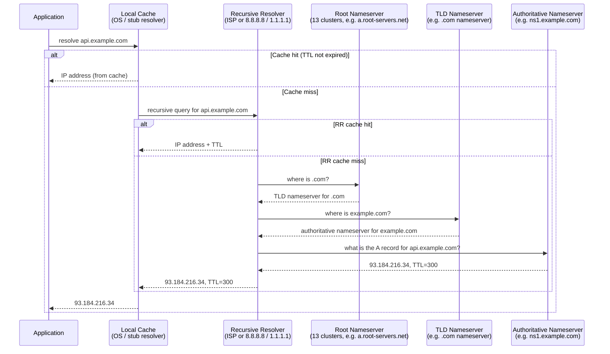

# [BEE-51] DNS Resolution

## Context

Before a backend service can open a TCP connection to another service, it must translate a hostname into an IP address. That translation is DNS (Domain Name System), and it affects every outbound connection your service makes. DNS is not a solved problem that you configure once and forget: it has failure modes, caching behaviors, propagation delays, and latency characteristics that routinely cause production incidents.

This article covers how DNS resolution works end-to-end, the record types backend engineers encounter, how DNS is used for load balancing and failover, and the failure modes you need to design around.

**References:**
- [RFC 1035 — Domain Names: Implementation and Specification](https://www.rfc-editor.org/rfc/rfc1035)
- [Cloudflare Learning Center — What is DNS?](https://www.cloudflare.com/learning/dns/what-is-dns/)
- [Cloudflare Learning Center — DNS record types](https://developers.cloudflare.com/dns/manage-dns-records/reference/dns-record-types/)
- [Cloudflare Learning Center — DNS over TLS vs DNS over HTTPS](https://www.cloudflare.com/learning/dns/dns-over-tls/)
- [Julia Evans — DNS category (jvns.ca)](https://jvns.ca/categories/dns/)
- [Julia Evans — "DNS propagation is actually caches expiring"](https://jvns.ca/blog/2021/12/06/dns-doesn-t-propagate/)
- [Cloudflare — What is DNS-based load balancing?](https://www.cloudflare.com/learning/performance/what-is-dns-load-balancing/)

---

## Principle

**Never hardcode IP addresses. Always use DNS, and always respect TTLs.**

DNS is the phonebook of the internet. Every time you use a hostname instead of an IP address, you gain the ability to change the destination without modifying your clients. That flexibility is the basis of service discovery, blue/green deployments, and DNS-based failover. The cost is a layer of indirection with its own latency, caching, and failure modes. Understanding those costs lets you design around them rather than being surprised by them.

---

## How DNS Resolution Works

When your application calls `getaddrinfo("api.example.com")` or makes an HTTP request to `https://api.example.com`, a chain of lookups unfolds.



### The Four Actors

**Stub resolver (local cache):** A small resolver built into the OS (or a local daemon like `systemd-resolved` or `dnsmasq`). It holds a cache keyed on `(name, type)`. It checks `/etc/hosts` first, then queries the recursive resolver configured in `/etc/resolv.conf`.

**Recursive resolver:** The workhorse. It accepts a full query from the stub resolver and handles all the iterative lookups on the client's behalf, caching every response. Examples: your ISP's resolver, Google Public DNS (`8.8.8.8`), Cloudflare DNS (`1.1.1.1`).

**Root nameservers:** There are 13 logical root nameserver identities (a–m.root-servers.net), served by hundreds of physical machines worldwide using anycast routing. They do not know the answer for any individual hostname; they only know which nameservers are authoritative for each top-level domain.

**Authoritative nameserver:** The server that holds the actual DNS zone file for a domain. It gives the definitive answer. When you configure records in your domain registrar or DNS provider (Route 53, Cloudflare, Google Cloud DNS), you are editing the zone served by your authoritative nameservers.

---

## DNS Record Types

| Type | Description |
|------|-------------|
| **A** | Maps a hostname to an IPv4 address. Most common record type. |
| **AAAA** | Maps a hostname to an IPv6 address. |
| **CNAME** | Alias from one name to another (canonical name). Cannot coexist with other records at the same name. Cannot be used at the zone apex (naked domain). |
| **MX** | Mail exchange record. Points to the mail server responsible for receiving email for a domain. Contains a priority value. |
| **TXT** | Arbitrary text. Used for domain ownership verification (Let's Encrypt, Google Search Console), SPF, DKIM, and DMARC email authentication records. |
| **SRV** | Service record. Encodes `priority`, `weight`, `port`, and `target hostname` for a service. Used by protocols like SIP, XMPP, and Kubernetes etcd peer discovery. Format: `_service._proto.name TTL class SRV priority weight port target`. |
| **NS** | Specifies the authoritative nameservers for a domain. The top-level nameservers you register with your domain registrar are NS records. |
| **SOA** | Start of Authority. One per zone. Contains the primary nameserver, responsible party email, serial number (for zone transfer synchronization), and refresh/retry/expire intervals. |

---

## TTL and Caching

**Time-To-Live (TTL)** is defined in RFC 1035 as "a 32-bit signed integer that specifies the time interval (in seconds) that the resource record may be cached before the source of the information should be consulted again."

A TTL of `300` means resolvers and OS caches may serve the record for up to 5 minutes without revalidating. After expiry, they must re-query.

**Practical TTL values:**

| Scenario | Suggested TTL |
|----------|--------------|
| Stable production service | 300–3600 s |
| Service about to be migrated | 60–300 s (lower before the change) |
| Active failover / dynamic routing | 30–60 s |
| Never (records that should not be cached) | 0 (use sparingly; high load on nameservers) |

**DNS propagation is a misnomer.** There is no push mechanism that broadcasts record changes to all resolvers. What actually happens is that cached records expire according to their TTL, and resolvers re-query at that point. If your TTL is 3600, some clients will use the old record for up to an hour after you update it. Lower the TTL well before a planned change; raise it again afterward.

---

## Key System Files

### `/etc/hosts`

Consulted before DNS by most OSes. Lets you override DNS locally. Useful in development and in containers to inject service addresses without a running DNS server.

```
127.0.0.1   localhost
::1         localhost
192.168.1.50 db.internal
```

The lookup order is controlled by `/etc/nsswitch.conf` (`hosts: files dns` means check `/etc/hosts` first, then DNS).

### `/etc/resolv.conf`

Configures the stub resolver: which recursive resolver to use, and search domain suffixes.

```
nameserver 10.96.0.10          # DNS server IP (e.g. kube-dns in Kubernetes)
search default.svc.cluster.local svc.cluster.local cluster.local
options ndots:5                 # Try adding search domains if name has < 5 dots
```

The `search` and `ndots` settings matter in Kubernetes. A lookup for `redis` becomes up to 6 queries (`redis.default.svc.cluster.local`, `redis.svc.cluster.local`, etc.) before falling through to a plain lookup. This adds latency on every connection when the search domain does not match. Use fully-qualified domain names (trailing dot, e.g. `redis.default.svc.cluster.local.`) to skip the search list.

---

## Inspecting DNS with `dig`

`dig` (part of the `bind-utils` / `dnsutils` package) is the standard tool for querying DNS.

```bash
$ dig api.example.com A

; <<>> DiG 9.18.0 <<>> api.example.com A
;; ->>HEADER<<- opcode: QUERY, status: NOERROR, id: 12345
;; flags: qr rd ra; QUERY: 1, ANSWER: 1, AUTHORITY: 0, ADDITIONAL: 1

;; QUESTION SECTION:
;api.example.com.               IN      A

;; ANSWER SECTION:
api.example.com.        300     IN      A       93.184.216.34

;; Query time: 12 msec
;; SERVER: 1.1.1.1#53(1.1.1.1)
;; WHEN: Mon Apr 07 10:00:00 UTC 2026
;; MSG SIZE  rcvd: 56
```

Key fields to read:

- **status**: `NOERROR` (found), `NXDOMAIN` (name does not exist), `SERVFAIL` (resolver failed), `REFUSED` (resolver declined).
- **flags**: `qr` = this is a response; `rd` = recursion desired (client asked resolver to recurse); `ra` = recursion available (the server supports it); `aa` = authoritative answer (came directly from the authoritative server).
- **ANSWER SECTION**: The TTL column (300) is the remaining time in seconds. The rightmost column is the IP address.
- **Query time**: How long the query took. Cached responses are typically <1 ms; uncached recursive lookups can be 50–300 ms.

```bash
# Follow CNAME chains
dig www.example.com CNAME

# Show full resolution path (iterative from root)
dig +trace api.example.com

# Query a specific nameserver directly
dig @ns1.example.com api.example.com A

# Short output (just the answer)
dig +short api.example.com A

# Check DNS over HTTPS (requires curl)
curl -H 'accept: application/dns-json' \
  'https://cloudflare-dns.com/dns-query?name=api.example.com&type=A'
```

---

## DNS-Based Load Balancing

DNS can distribute traffic across multiple backends without a hardware load balancer, by returning multiple addresses for the same name.

### Round-Robin DNS

Return multiple A records for the same hostname. Resolvers and clients typically rotate through them.

```
api.example.com.  60  IN  A  10.0.1.10
api.example.com.  60  IN  A  10.0.1.11
api.example.com.  60  IN  A  10.0.1.12
```

**Limitations:** Clients cache the first address they receive for the TTL duration. Rotation is not guaranteed. No health checking—if one IP goes down, clients continue hitting it until the TTL expires and they receive an updated record set. Standard round-robin DNS does not know which backends are healthy.

### Weighted DNS

DNS providers such as AWS Route 53 and Google Cloud DNS support weighted routing: assign a weight to each record, and the resolver returns each in proportion to its weight. Useful for canary deployments (send 5% of traffic to the new version).

### Geolocation / Latency-Based Routing

Route traffic to the nearest or lowest-latency region based on the client resolver's IP. The authoritative nameserver returns a different IP depending on where the query comes from. Used by global CDNs and multi-region deployments.

### DNS-Based Failover Scenario

This is one of the most important patterns to understand for backend reliability.

**Scenario:** `api.example.com` resolves to a primary server at `10.0.1.10`. The primary goes down.

1. A **health check agent** (Route 53 health check, Cloudflare Health Checks, or your own monitor) detects that `10.0.1.10:443` is unresponsive.
2. The agent updates the DNS record: removes `10.0.1.10`, adds `10.0.1.20` (secondary). TTL on the record is 30 seconds.
3. New DNS queries return `10.0.1.20`.
4. Clients with cached records pointing to `10.0.1.10` will continue failing until their cache entry expires (up to the TTL, 30 s).
5. After cache expiry, those clients resolve to `10.0.1.20` and recover.

**Key insight:** The recovery window is bounded by the TTL, not by how fast you update the record. If your failover TTL is 300 s, clients can be broken for up to 5 minutes. Keep TTLs low on records you intend to fail over.

Additionally, **application-level DNS caching can override the TTL.** Many HTTP clients, JVM-based services, and connection pools cache DNS results indefinitely or for a fixed duration unrelated to the DNS TTL. Those clients will not see the updated record until their internal cache expires—even if the OS cache has already refreshed. This is addressed in the Common Mistakes section.

---

## DNS Failure Modes

| Response | Meaning | Common Cause |
|----------|---------|--------------|
| `NOERROR` with 0 answers | Name exists but no record of requested type | Missing record in zone |
| `NXDOMAIN` | Name does not exist | Typo in hostname, expired domain, missing record, zone delegation problem |
| `SERVFAIL` | Resolver could not get an answer | Authoritative server unreachable, DNSSEC validation failure, upstream timeout |
| `REFUSED` | Resolver declined to answer | Querying an authoritative server that only accepts recursive queries from specific IPs |
| Timeout | No response within client timeout | Network partition, UDP packet drop, resolver overload, large response requiring TCP fallback |

```bash
# Simulate and observe each failure mode
dig @8.8.8.8 nonexistent.example.com A      # NXDOMAIN
dig @8.8.8.8 _dmarc.broken-dnssec.com TXT   # SERVFAIL (DNSSEC failure)
dig +time=1 +retry=0 @192.0.2.1 example.com # Timeout (black-hole IP)
```

**DNS timeouts deserve special attention.** DNS queries use UDP by default. If a UDP response is lost, the client retries after a short interval (typically 1–5 s per attempt, 2–3 retries). DNS responses larger than 512 bytes (EDNS0 raised this to 4096 bytes) may force a fallback to TCP, adding a full TCP handshake before the DNS response arrives. In environments with firewalls that block DNS over TCP (port 53/TCP), large responses cause silent failures.

---

## DNS Propagation

Updating a DNS record does not instantly reach all clients. The apparent "propagation delay" is actually each resolver's cached TTL expiring independently. There is no global broadcast.

**Timeline for a TTL=300 (5-minute) record change:**

```
T+0s    You update the record at your authoritative nameserver.
T+0s    Clients whose resolver has no cache miss: they get the new record immediately.
T+0s–300s  Clients whose resolver has a cached entry: they continue getting the old record.
T+300s  All resolver caches for this record have expired. New queries return the new value.
```

**To minimize propagation delay before a planned change:**

1. Lower the TTL to 60 s (or lower) 24–48 hours before the change (long enough for all old cached entries at the previous TTL to expire).
2. Make the change.
3. Wait one new-TTL interval (60 s) for the change to fully propagate.
4. Raise the TTL back to its normal value.

---

## DNS over HTTPS (DoH) and DNS over TLS (DoT)

Traditional DNS queries are sent in plaintext over UDP/TCP port 53. Anyone on the network path can see which hostnames you are resolving—a significant privacy and security concern.

**DNS over TLS (DoT)** — Wraps standard DNS in a TLS session. Uses a dedicated port (TCP 853). The query is encrypted but the fact that port 853 traffic is DNS is visible to network observers.

**DNS over HTTPS (DoH)** — Sends DNS queries as HTTPS requests (port 443). DNS traffic is indistinguishable from regular HTTPS. Defined in [RFC 8484](https://www.rfc-editor.org/rfc/rfc8484). Browsers (Firefox, Chrome) and operating systems increasingly use DoH by default.

| Feature | DoT | DoH |
|---------|-----|-----|
| Port | 853 | 443 |
| Protocol | DNS over TLS | DNS over HTTPS |
| Visibility | DNS traffic identifiable by port | Blends with HTTPS |
| Network control | Easier to allow/block centrally | Harder to intercept or block |
| Adoption | OS/resolver level | Browser, app, OS level |

**Backend relevance:** Your services' outbound DNS queries may bypass corporate or VPC DNS resolvers if the language runtime or container image uses a hardcoded DoH provider. This can break service discovery in environments that rely on internal DNS (e.g., Kubernetes `kube-dns`, AWS VPC DNS at `169.254.169.253`). Verify that DoH is not inadvertently enabled in your container base images or language runtimes.

---

## DNS and Service Discovery

In microservice architectures, DNS is a common service discovery mechanism:

- **Kubernetes:** Each Service gets a DNS name (`<service>.<namespace>.svc.cluster.local`). The cluster DNS server (`kube-dns` or `CoreDNS`) returns the ClusterIP, and kube-proxy routes traffic to healthy pods.
- **AWS ECS/EKS:** AWS Cloud Map provides service registry with DNS-based discovery.
- **Consul:** HashiCorp Consul exposes service health and addresses via a DNS interface on port 8600.
- **Docker Compose:** Services are reachable by service name within the Compose network via Docker's embedded DNS.

When a service crashes and restarts with a new IP, DNS-based discovery updates the record automatically. Clients that cache the old DNS result will fail until their cache expires—this is why short TTLs (10–60 s) are used for service discovery records, and why connection pools must be designed to detect dead connections (TCP keepalive, health probes) rather than relying solely on DNS freshness.

---

## Common Mistakes

### 1. Caching DNS Results Longer Than the TTL (Stale Records After Failover)

The Java Virtual Machine historically cached DNS results forever (or for a JVM-wide timeout set by `networkaddress.cache.ttl`). Many HTTP client libraries implement their own DNS cache that ignores the TTL returned by the resolver. When a failover occurs and the DNS record points to a new IP, clients with application-level caches continue hitting the dead server.

**Fix:** Configure your HTTP client to respect DNS TTLs. In Java, set `networkaddress.cache.ttl=30` in the JVM security policy or configure it per-client. In Go, the `net` package respects TTLs by default. Verify the behavior of any connection pool or HTTP client library you use.

### 2. Not Respecting TTL in Application-Level HTTP Clients

Related to the above: connection pools that hold persistent TCP connections do not re-resolve DNS until the connection is closed. A connection opened 10 minutes ago may still be pointing to an IP that the DNS record no longer advertises. The connection works until the server at that IP goes away—at which point the pool has a dead connection and must establish a new one, paying the DNS lookup cost at the worst possible time.

**Fix:** Either set a maximum connection age in your pool (so connections are periodically recycled and DNS is re-resolved), or implement a separate DNS resolution loop that checks for record changes and closes connections pointing to stale IPs.

### 3. Hardcoding IP Addresses Instead of Using DNS

If you hardcode `10.0.1.50` in your service configuration because "that is the database IP and it never changes," you give up the ability to migrate the database without a code deploy, you lose the ability to do DNS-based failover, and you introduce a single point of coupling. IPs do change—cloud instances are replaced, load balancers get new VIPs, IP addresses are reassigned after cluster rebuilds.

**Fix:** Always use DNS names. The overhead of a DNS lookup is at most one extra round-trip on the first connection to a given name, and it is cached afterward.

### 4. Single Point of Failure in DNS (No Secondary Nameservers)

If your domain is served by a single authoritative nameserver and that server goes down, DNS queries for your domain return SERVFAIL. Your service becomes unreachable even if all your application servers are healthy. DNS providers (Route 53, Cloudflare, Google Cloud DNS) maintain globally-distributed nameserver clusters with high availability. Self-managed nameservers must have primary + secondary redundancy at a minimum.

**Fix:** Use a managed DNS provider with multiple anycast nameservers. Verify by checking that your domain's NS records point to at least two nameserver addresses in different IP ranges.

### 5. Ignoring DNS Resolution Time in Latency Budgets

Backend engineers measure database query time, HTTP request time, and service processing time—but DNS lookup time is often invisible. A cold DNS lookup (no cached entry) can take 50–300 ms depending on resolver location, TTL configuration, and network conditions. For a service that opens a new connection to a dependency on every request, that latency is paid repeatedly.

**Fix:** Add DNS resolution time to your observability. Measure time-to-first-byte including the DNS phase. Use connection pooling to amortize DNS cost over many requests. In high-throughput systems, consider a local DNS caching daemon (e.g., `nscd`, `dnsmasq`, `systemd-resolved`) to keep the resolver latency at sub-millisecond levels for hot entries.

---

## Related BEPs

- [BEE-50 — TCP/IP and the Network Stack](./50.md): What happens after DNS resolves—the TCP connection lifecycle.
- [BEE-53 — TLS/SSL Handshake](./53.md): TLS adds another round-trip on top of TCP; DNS + TCP + TLS means three round-trips before the first HTTP byte.
- [BEE-51 — Load Balancers](./51.md): L7 load balancers as an alternative to DNS-based load balancing, with health checking.
- [BEE-261 — Timeouts](../Performance/261.md): DNS resolution is part of the total request latency; set DNS timeout budgets explicitly.
