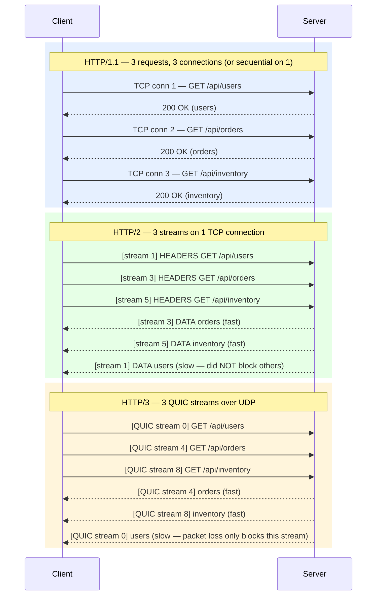

# [BEE-52] HTTP/1.1, HTTP/2, HTTP/3

:::info
Protocol evolution, multiplexing, head-of-line blocking, and QUIC — what changed between each version and why it matters for backend services.
:::

## Context

HTTP is the application-layer protocol that drives virtually all web and API traffic. Over three major versions its transport model has changed fundamentally: from synchronous text-based requests (HTTP/1.1), to binary-framed multiplexed streams over TCP (HTTP/2), to multiplexed streams over the UDP-based QUIC transport (HTTP/3). Each step was motivated by a concrete bottleneck in the previous version.

Understanding the differences lets you make informed decisions about where to terminate protocol versions, how to configure internal services, and what operational constraints to expect.

**Normative references:**
- [RFC 9110 — HTTP Semantics](https://datatracker.ietf.org/doc/html/rfc9110) (shared across all versions)
- [RFC 9113 — HTTP/2](https://datatracker.ietf.org/doc/html/rfc9113)
- [RFC 9114 — HTTP/3](https://datatracker.ietf.org/doc/html/rfc9114)
- [High Performance Browser Networking — HTTP/2](https://hpbn.co/http2/) (Ilya Grigorik)

## Principle

**Match the HTTP version to the latency and reliability characteristics of the path. Do not assume the CDN edge handles everything — enable HTTP/2 on every internal hop where persistent connections are reused.**

---

## HTTP/1.1

Published in RFC 2068 (1997) and revised as RFC 7230–7235 (2014), now consolidated into RFC 9110–9112. Despite its age, HTTP/1.1 is still widely used on internal service-to-service traffic.

### Persistent Connections

HTTP/1.0 opened a new TCP connection for every request. HTTP/1.1 added `Connection: keep-alive` as the default — one TCP connection is reused across multiple sequential requests. This eliminates repeated TCP handshakes and slow-start penalties for bursty traffic to the same host.

### Pipelining and Its Limitations

HTTP/1.1 defines pipelining: a client may send multiple requests without waiting for responses, as long as they are idempotent (`GET`, `HEAD`, etc.). In practice, pipelining is almost universally disabled because:

- Servers must respond **in order**. A slow first response blocks all later responses regardless of their own readiness — this is **head-of-line (HOL) blocking** at the HTTP layer.
- Proxies often cannot handle pipelined connections correctly.
- Error recovery is complex.

### The "Six Connections" Workaround

Browsers work around HOL blocking by opening up to **six parallel TCP connections per origin**. This parallelises requests but multiplies handshake cost, memory use, and server file-descriptor consumption. It is a client-side hack, not a protocol solution.

### Domain Sharding

Splitting resources across subdomains (e.g. `static1.example.com`, `static2.example.com`) lets browsers open more than six parallel connections per page. This was a valid HTTP/1.1 optimisation. **It becomes counterproductive under HTTP/2** — see Common Mistakes below.

---

## HTTP/2

Standardised as RFC 7540 (2015), revised as RFC 9113 (2022). HTTP/2 keeps HTTP semantics (methods, status codes, headers) identical to HTTP/1.1 but replaces the wire format entirely.

### Binary Framing Layer

HTTP/2 replaces HTTP/1.1's newline-delimited text format with a **binary framing layer**. Every message is split into typed frames (DATA, HEADERS, SETTINGS, PUSH_PROMISE, etc.), each carrying a 9-byte header with: frame length, frame type, flags, and a 31-bit **stream identifier**.

Benefits:
- No ambiguity in parsing (no chunked-encoding corner cases).
- Frames from different logical requests can be interleaved on the wire.
- A single TCP connection carries all traffic for one origin.

### Multiplexing

Multiple independent **streams** share one connection. Each stream has a numeric ID. Frames from different streams are multiplexed on the wire and reassembled independently at the receiver.

This eliminates HTTP-layer HOL blocking: a slow response on stream 3 does not delay the delivery of frames on stream 5.

:::warning TCP HOL Blocking Remains
HTTP/2 multiplexing is over a single TCP connection. If a TCP segment is lost, **all streams** on that connection are stalled until the retransmit arrives — this is TCP-level head-of-line blocking. HTTP/3 solves this.
:::

### HPACK Header Compression

HTTP/1.1 sends headers as plain ASCII text on every request, including large and repetitive fields (`User-Agent`, `Cookie`, `Accept-*`). HTTP/2 compresses headers using **HPACK** (RFC 7541):

- **Static table**: 61 predefined entries for the most common header name–value pairs (e.g. `:method: GET`, `:scheme: https`).
- **Dynamic table**: a FIFO table maintained per-connection of recently sent headers.
- **Huffman encoding**: variable-length binary codes for string literals.

HPACK achieves ~30% average reduction in header size. Critically, it avoids the compression-oracle attacks (CRIME, BREACH) that plagued SPDY's zlib-based approach.

### Server Push

The server may proactively push resources on a `PUSH_PROMISE` frame before the client requests them. A pushed resource:
- Can be cached and reused across pages.
- Can be declined by the client (`RST_STREAM`).

In practice, server push has proven difficult to use correctly — it frequently sends resources the client already has cached, wasting bandwidth. Most major browsers have removed or deprecated support. **Do not design services around server push.**

### Stream Prioritisation

Clients may assign each stream a weight (1–256) and declare dependency relationships between streams, forming a priority tree. This lets the server prefer high-priority responses (e.g. critical API calls) over lower-priority ones. In practice, priority support in server implementations is inconsistent.

### ALPN Negotiation

HTTP/2 is negotiated during the TLS handshake via the **Application-Layer Protocol Negotiation (ALPN)** extension. The client offers `h2` (and optionally `http/1.1`) in the ALPN list; the server selects `h2` if it supports it. No additional round trips are required. This is why HTTP/2 effectively requires TLS in practice, even though the spec allows cleartext `h2c`.

---

## HTTP/3

Standardised as RFC 9114 (2022). HTTP/3 maps HTTP semantics onto **QUIC** (RFC 9000) — a new transport protocol built on UDP.

### QUIC Transport

QUIC was designed at Google (initially as SPDY-over-UDP) and standardised by the IETF. Key properties:

| Property | Detail |
|---|---|
| Transport | UDP |
| Encryption | TLS 1.3 mandatory, built into the protocol |
| Stream model | Independent byte streams — loss on one stream does not block others |
| Connection ID | Connections identified by ID, not 4-tuple — survives IP changes (mobile handoff) |
| 1-RTT setup | Combined crypto + transport handshake in one round trip |
| 0-RTT setup | Resumed connections can send data with zero additional round trips |

### No TCP HOL Blocking

Because QUIC streams are independent at the transport layer, a lost UDP datagram only stalls the one stream it belongs to. All other streams continue uninterrupted. This is the core advantage over HTTP/2 on TCP.

### 0-RTT Connection Resumption

A client that has connected to a server before can store session tickets and resume a QUIC connection in **0-RTT mode**, sending HTTP requests with the very first packet. This removes the handshake latency penalty for returning clients entirely.

:::warning 0-RTT Replay Risk
0-RTT data is not protected against replay attacks. Only idempotent requests (e.g. `GET`) should be sent in 0-RTT mode. Mutation requests (`POST`, `PATCH`, `DELETE`) must wait for the 1-RTT handshake to complete.
:::

### ALPN for HTTP/3

HTTP/3 uses the ALPN token `h3`. Servers advertise HTTP/3 support via the `Alt-Svc` HTTP response header or the `HTTPS` DNS record, directing clients to attempt a QUIC connection on UDP/443 in parallel (the "Happy Eyeballs" approach for QUIC vs TCP).

### Firewall and Middlebox Issues

QUIC runs on UDP. Many corporate firewalls and middleboxes block or rate-limit UDP on port 443. When QUIC is blocked, clients fall back to HTTP/2 over TCP. This fallback is correct and expected — but it means HTTP/3 cannot be relied upon end-to-end in enterprise or restricted network environments. Always ensure HTTP/2 is available as a fallback.

---

## Side-by-Side Comparison

**HOL blocking example:** Suppose `/api/users` takes 500 ms and the others take 20 ms.

- **HTTP/1.1** (single connection): orders and inventory wait behind users — total ~540 ms.
- **HTTP/1.1** (3 parallel connections): all start simultaneously — total ~500 ms, but 3× connection overhead.
- **HTTP/2**: all three start on the same connection; orders and inventory complete at ~20 ms; users completes at ~500 ms. No HOL delay between them.
- **HTTP/3**: same as HTTP/2, but a lost packet during the users response does not delay orders or inventory at all.

---

## Protocol Comparison Table

| Feature | HTTP/1.1 | HTTP/2 | HTTP/3 |
|---|---|---|---|
| Wire format | Text | Binary frames | Binary frames (QUIC) |
| Transport | TCP | TCP | UDP (QUIC) |
| Connections per origin | 1–6 (browser) | 1 | 1 |
| Multiplexing | No (pipelining broken) | Yes (streams) | Yes (QUIC streams) |
| HTTP HOL blocking | Yes | No | No |
| TCP HOL blocking | Yes | Yes | No (no TCP) |
| Header compression | None | HPACK | QPACK |
| TLS required | No (but recommended) | Effectively yes (ALPN) | Yes (built-in) |
| 0-RTT | No | No | Yes |
| Server push | No | Yes (deprecated in practice) | Limited |
| Connection migration | No | No | Yes (QUIC Connection ID) |
| ALPN token | `http/1.1` | `h2` | `h3` |

---

## When Each Version Matters for Backend Services

### HTTP/1.1 Still Applies When

- Communicating with legacy internal services that do not support HTTP/2.
- Using simple scripting or tooling where HTTP/2 support adds complexity without measurable benefit.
- Behind an HTTP/2 proxy that translates inbound h2 to HTTP/1.1 upstream (common with older application servers).

### HTTP/2 Should Be the Default for Internal Services

The single biggest missed opportunity in most stacks: **HTTP/2 is only enabled at the edge (CDN, load balancer) but not between internal services**. When your API gateway or service mesh translates inbound HTTP/2 to HTTP/1.1 for upstream calls, you lose multiplexing and connection reuse — especially expensive for services making many small parallel requests.

Enable HTTP/2 on:
- Service-to-service gRPC (which mandates HTTP/2 / h2c).
- Internal REST services with high request concurrency.
- Any proxy-to-backend link that handles > 1 concurrent request per connection.

### HTTP/3 / QUIC Applies When

- You control the edge and have clients on mobile or lossy networks (QUIC's connection migration and no-TCP-HOL benefits are most pronounced here).
- Reducing connection setup latency for first-time visitors matters (0-RTT).
- You are deploying a public API and your CDN/load balancer already supports it (Cloudflare, AWS CloudFront, Google Cloud).

Do not enable HTTP/3 on purely internal service-to-service traffic unless all firewalls allow UDP/443 — the fallback penalty is unnecessary friction inside a data centre.

### Connection Coalescing

HTTP/2 and HTTP/3 support **connection coalescing**: if two origins resolve to the same IP and share a TLS certificate (e.g. a wildcard cert), the client may reuse an existing connection rather than opening a new one. This is transparent but important for CDN architectures — it reduces the connection count further than simple per-hostname pooling.

---

## Common Mistakes

### 1. Opening Too Many HTTP/1.1 Connections

Spawning a large connection pool (e.g. 100 connections) to a single upstream creates equivalent server-side overhead: file descriptors, memory, TLS sessions. Under HTTP/2 you typically need **one** persistent connection per backend instance, or a small pool if you need to exceed per-connection stream limits (`SETTINGS_MAX_CONCURRENT_STREAMS`, default 100 in most implementations).

### 2. Relying on HTTP/2 Server Push

Server push was theoretically useful for proactively sending CSS/JS alongside HTML. In practice it suffers from cache-blindness (the server cannot know what the client has cached), and major browsers have deprecated or removed support. Do not design new services around it. Use `103 Early Hints` instead for preloading.

### 3. Not Enabling HTTP/2 on Internal Services

The most common deployment gap. Enabling HTTP/2 only at the CDN edge means every internal hop still pays HTTP/1.1 costs. Enable `h2c` (HTTP/2 cleartext) or TLS + `h2` on all internal listeners where persistent connection reuse matters.

### 4. Ignoring QUIC / UDP Firewall Issues

UDP port 443 is frequently blocked or rate-limited by enterprise firewalls, security appliances, and cloud security groups. Before relying on HTTP/3 for external traffic, verify that your network path permits UDP/443 and that client fallback to HTTP/2 is instrumented and monitored.

### 5. Domain Sharding with HTTP/2

Domain sharding (splitting assets across multiple subdomains) was a valid HTTP/1.1 workaround. Under HTTP/2 it is **actively harmful**: it forces multiple connections where one would suffice, defeats connection coalescing, and increases TLS handshake cost. Remove domain sharding when upgrading to HTTP/2.

---

## Related BEPs

- [BEE-50 — TCP/IP and the Network Stack](./50.md): TCP handshake, slow start, and why QUIC replaces TCP for HTTP/3.
- [BEE-53 — TLS/SSL Handshake](./53.md): ALPN extension, TLS 1.3 integration with QUIC, certificate negotiation.
- [BEE-54 — Load Balancers](./54.md): Layer 7 termination of HTTP/2 and HTTP/3, protocol translation to upstreams.
- [BEE-70 — REST API Design](../API%20Design/70.md): How protocol version affects API latency and client connection strategy.
- [BEE-205 — HTTP Caching](../Caching/205.md): Cache-Control semantics are defined in RFC 9110 and apply identically across all HTTP versions.
