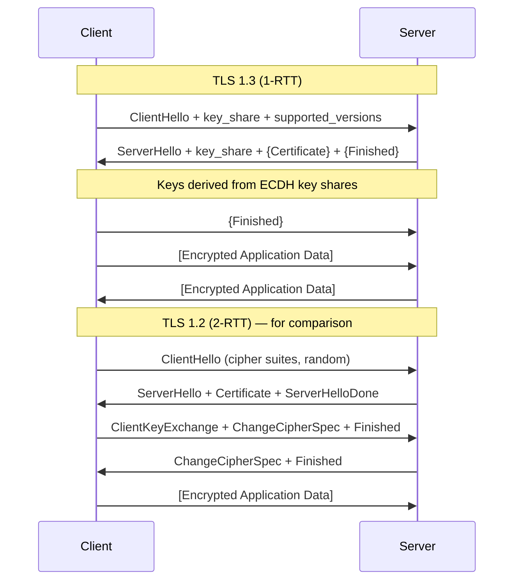
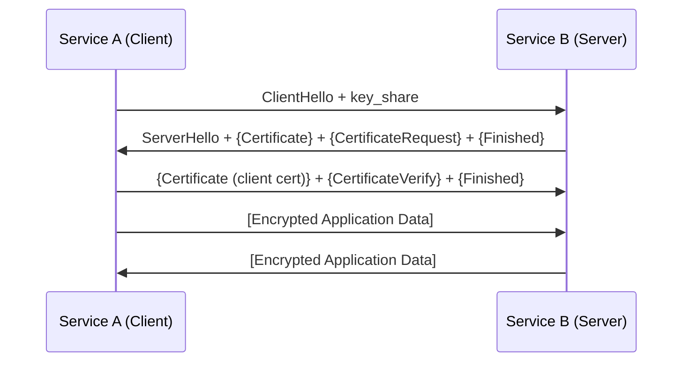

# [BEP-53] TLS/SSL Handshake

:::info
How encrypted connections are established, certificate chains, and mTLS.
:::

## Context

Every HTTP request you make to a production service travels over TLS. The browser address bar shows a padlock, the load balancer terminates HTTPS, and internal services call each other with mutual TLS. But what actually happens during that handshake? Why does TLS 1.3 matter, and why do certificate chains break at 2 AM in production?

**References:**
- RFC 8446 — The TLS 1.3 specification: <https://www.rfc-editor.org/rfc/rfc8446>
- OWASP Transport Layer Security Cheat Sheet: <https://cheatsheetseries.owasp.org/cheatsheets/Transport_Layer_Security_Cheat_Sheet.html>
- Cloudflare: TLS Protocol Overview: <https://developers.cloudflare.com/ssl/reference/protocols/>

## Principle

**Understand the full TLS stack — from handshake mechanics to certificate chains to termination topology — so you can configure, debug, and secure encrypted connections correctly.**

TLS is not magic. It is a precisely defined protocol with negotiated parameters, certificate hierarchies, and key derivation functions. Engineers who treat it as a black box misconfigure cipher suites, miss certificate expiries, and inadvertently expose internal traffic after terminating TLS at the load balancer.

---

## What TLS Provides

TLS (Transport Layer Security) provides three security properties (RFC 8446, Section 1):

| Property | Meaning |
|---|---|
| **Confidentiality** | Data is encrypted; only endpoints can read it |
| **Integrity** | Data cannot be modified in transit without detection (AEAD) |
| **Authentication** | Server identity is verified via certificates; client identity optionally verified (mTLS) |

SSL (Secure Sockets Layer) is the predecessor to TLS. The name "SSL" is still used colloquially, but SSLv2 and SSLv3 are broken and must not be used. The current standards are TLS 1.2 and TLS 1.3.

---

## TLS 1.2 vs TLS 1.3 Handshake

### TLS 1.2 — 2-RTT Handshake

TLS 1.2 requires two full round trips before application data can flow:

1. **RTT 1**: ClientHello → ServerHello + Certificate + ServerHelloDone
2. **RTT 2**: ClientKeyExchange + ChangeCipherSpec + Finished → ServerChangeCipherSpec + Finished
3. Application data begins

This means a minimum of 2 round trips of latency before the first byte of application data.

### TLS 1.3 — 1-RTT Handshake

TLS 1.3 (RFC 8446) cuts this to one round trip by including the client's key share in the very first message:

```
Client                                           Server
------                                           ------
ClientHello
  + key_share (ECDH public key)
  + supported_versions
  + cipher_suites
                          ------->

                                          ServerHello
                                            + key_share
                                          {EncryptedExtensions}
                                          {Certificate}
                                          {CertificateVerify}
                                          {Finished}
                          <-------

{Finished}                ------->

[Application Data]        <------>   [Application Data]
```

The `{}` notation indicates messages encrypted with the handshake key derived immediately from the key shares. Application data begins after one RTT.

TLS 1.3 also supports **0-RTT resumption** using a Pre-Shared Key (PSK) from a prior session, allowing data to be sent with the first flight — but at the cost of replay protection (not safe for non-idempotent requests).

### Mermaid Diagram: TLS 1.3 1-RTT vs TLS 1.2 2-RTT



### Key Differences Summary

| Feature | TLS 1.2 | TLS 1.3 |
|---|---|---|
| Round trips to first data | 2 | 1 |
| Static RSA key exchange | Allowed | Removed |
| Forward secrecy | Optional | Mandatory (ephemeral (EC)DHE) |
| Handshake encryption | Partial (after CCS) | Full (after ServerHello) |
| Cipher suite negotiation | Combined (key + auth + AEAD) | Separated (AEAD + KDF hash) |
| 0-RTT resumption | No | Yes (PSK, with caveats) |

---

## Cipher Suites

A cipher suite specifies the algorithms used in a TLS session. In TLS 1.2, a full suite looks like:

```
TLS_ECDHE_RSA_WITH_AES_128_GCM_SHA256
  |     |   |        |          |
  |     |   |        |          +--- PRF hash
  |     |   |        +-------------- Symmetric cipher + mode
  |     |   +----------------------- Authentication algorithm
  |     +--------------------------- Key exchange algorithm
  +--------------------------------- Protocol
```

TLS 1.3 simplified this by separating concerns. Cipher suites in TLS 1.3 only describe the AEAD algorithm and the HKDF hash — the key exchange is specified separately via the `supported_groups` and `key_share` extensions:

```
TLS_AES_128_GCM_SHA256
TLS_AES_256_GCM_SHA384
TLS_CHACHA20_POLY1305_SHA256
```

**OWASP recommendation**: Disable null ciphers, anonymous ciphers, EXPORT ciphers, and RC4. Prefer GCM-based suites.

---

## Certificate Chains

### Structure: Leaf → Intermediate → Root CA

Browsers and TLS clients do not trust individual certificates directly (except in some enterprise setups). They trust **Certificate Authorities (CAs)**, and trust propagates through a chain:

```
Root CA (self-signed, in OS/browser trust store)
  └── Intermediate CA (signed by Root CA)
        └── Leaf Certificate (signed by Intermediate CA, issued to your domain)
```

The server presents the leaf certificate and any intermediate certificates during the TLS handshake. The client verifies the chain up to a trusted root.

### openssl s_client Example

```bash
openssl s_client -connect example.com:443 -showcerts
```

Sample output (annotated):

```
CONNECTED(00000005)
depth=2 C=US, O=DigiCert Inc, CN=DigiCert Global Root CA         # Root CA
verify return:1
depth=1 C=US, O=DigiCert Inc, CN=DigiCert TLS RSA SHA256 2020 CA1  # Intermediate CA
verify return:1
depth=0 CN=example.com                                             # Leaf certificate
verify return:1
---
Certificate chain
 0 s:CN=example.com
   i:C=US, O=DigiCert Inc, CN=DigiCert TLS RSA SHA256 2020 CA1
 1 s:C=US, O=DigiCert Inc, CN=DigiCert TLS RSA SHA256 2020 CA1
   i:C=US, O=DigiCert Inc, CN=DigiCert Global Root CA
---
SSL-Session:
    Protocol  : TLSv1.3
    Cipher    : TLS_AES_128_GCM_SHA256
    ...
```

Key fields to check:
- `depth=0` is your leaf cert — verify the CN/SAN matches your domain
- `depth=1` is the intermediate — must be present in the server's handshake
- `Protocol` — should be `TLSv1.3` or at minimum `TLSv1.2`
- `Cipher` — confirm no weak ciphers (e.g., RC4, DES, EXPORT suites)

### Certificate Validation Steps

When a TLS client validates a certificate, it checks:
1. **Chain of trust** — each certificate is signed by the one above it, terminating at a trusted root
2. **Validity period** — `notBefore` and `notAfter` fields
3. **Domain matching** — Subject Alternative Name (SAN) must match the hostname (CommonName is deprecated for this purpose in modern clients)
4. **Revocation** — via OCSP (Online Certificate Status Protocol) or CRL (Certificate Revocation List)
5. **Key usage extensions** — certificate must be authorized for the purpose it is being used

---

## ALPN (Application-Layer Protocol Negotiation)

ALPN is a TLS extension (RFC 7301) that allows the client and server to negotiate which application protocol to use over the TLS connection — during the handshake itself, before any application data flows.

```
ClientHello:
  extensions:
    application_layer_protocol_negotiation: ["h2", "http/1.1"]

ServerHello (EncryptedExtensions in TLS 1.3):
  application_layer_protocol_negotiation: "h2"
```

This is how HTTP/2 is negotiated over TLS (see BEP-52). Without ALPN, an extra round trip would be needed to switch protocols after the connection is established.

---

## Mutual TLS (mTLS)

Standard TLS authenticates only the **server**. Mutual TLS (mTLS) requires **both** client and server to present certificates, providing bidirectional authentication.

### Use Cases

- Service-to-service communication inside a microservices mesh (e.g., Istio, Linkerd)
- API clients with strong identity requirements
- Zero-trust internal networks where IP-based trust is insufficient

### mTLS Handshake Addition

In the TLS handshake, the server sends a `CertificateRequest` message after its own certificate. The client responds with its own certificate and a `CertificateVerify` message.



### mTLS Operational Considerations

- Each service needs its own certificate issued by a shared internal CA (e.g., Vault PKI, cert-manager with an internal issuer)
- Certificate rotation must be automated — manual rotation across hundreds of services is not viable
- Sidecar proxies (Envoy in a service mesh) can handle mTLS transparently without application code changes

---

## Let's Encrypt and the ACME Protocol

**Let's Encrypt** is a free, automated CA operated by the Internet Security Research Group (ISRG). It issues Domain Validation (DV) certificates trusted by all major browsers.

**ACME** (Automatic Certificate Management Environment, RFC 8555) is the protocol Let's Encrypt uses. It allows automated:
1. **Domain validation** — prove you control the domain (HTTP-01 or DNS-01 challenge)
2. **Certificate issuance** — receive a signed certificate
3. **Renewal** — typically automated by tools like Certbot, cert-manager, or Caddy

The ACME DNS-01 challenge is the only option for wildcard certificates and for domains not reachable from the public internet (useful for internal services with public DNS).

---

## Certificate Rotation

Certificates have a finite validity period (Let's Encrypt: 90 days; commercial CAs: typically 1 year). Rotation must be automated or you will face production outages.

### Rotation Checklist

| Step | Details |
|---|---|
| Monitor expiry | Alert at 30 days, page at 7 days |
| Automate renewal | cert-manager, Certbot, or ACME client in CD pipeline |
| Hot reload | Nginx: `nginx -s reload`; Envoy: xDS API push; avoid full restart if possible |
| Validate after rotation | `openssl s_client -connect host:443` in post-deploy check |
| Key rotation | Rotate the private key itself periodically, not just the certificate |

**Zero-downtime rotation**: Deploy new certificate and key first, keep old one valid until all in-flight connections drain, then remove old.

---

## TLS Termination

Where TLS is terminated in your stack has significant security implications.

### Termination at Load Balancer (Edge Termination)

```
Internet --[TLS]--> Load Balancer --[HTTP]--> Backend Services
```

- Simplest to manage (certs only on LB)
- Backend receives plaintext — if the internal network is untrusted or shared, this is a security gap
- No end-to-end encryption; an attacker with access to the internal network can read traffic

### Re-Encryption (TLS Pass-Through or Re-Terminate)

```
Internet --[TLS]--> Load Balancer --[TLS]--> Backend Services
```

- LB terminates TLS, inspects/routes, then re-encrypts to the backend
- Backend certs can use internal CAs
- Provides defense in depth — internal traffic is encrypted even if perimeter is breached

### TLS Pass-Through

```
Internet --[TLS]--> Load Balancer --[TLS (unchanged)]--> Backend
```

- LB forwards TLS without decrypting (SNI-based routing only)
- End-to-end encryption preserved; LB cannot inspect L7 content
- Less flexible for routing rules

**Recommendation**: For any service handling sensitive data or operating in a zero-trust environment, use re-encryption or pass-through. Do not rely on the internal network being trusted.

---

## Common Mistakes

### 1. Still Allowing TLS 1.0 and TLS 1.1

TLS 1.0 and 1.1 are deprecated by RFC 8996 and disabled by all major browsers since 2020. Vulnerabilities include BEAST, POODLE, and CRIME. Audit your nginx/haproxy/ALB configs:

```nginx
# Wrong — allows deprecated protocols
ssl_protocols TLSv1 TLSv1.1 TLSv1.2 TLSv1.3;

# Correct
ssl_protocols TLSv1.2 TLSv1.3;
ssl_ciphers 'ECDHE-ECDSA-AES128-GCM-SHA256:ECDHE-RSA-AES128-GCM-SHA256:...';
ssl_prefer_server_ciphers on;
```

### 2. Not Validating Certificate Chains in Service-to-Service Calls

Internal services frequently skip certificate validation for "convenience" or because they use self-signed certs:

```python
# Wrong — disables all TLS verification
requests.get("https://internal-service", verify=False)

# Correct — provide the internal CA bundle
requests.get("https://internal-service", verify="/etc/ssl/certs/internal-ca.pem")
```

Disabling verification defeats the authentication property of TLS entirely. A compromised service can now intercept all traffic.

### 3. Self-Signed Certificates in Production Without Trust Management

Self-signed certs are fine for development. In production, they require every client to be explicitly configured to trust them — and this trust management is almost never done correctly at scale. Use an internal CA (HashiCorp Vault PKI, Step CA, or cert-manager with an internal issuer) instead.

### 4. Not Rotating Certificates Before Expiry

Certificate expiry causes hard outages. A 90-day Let's Encrypt cert that is not auto-renewed will cause a production outage at midnight. Automate with cert-manager or Certbot, and add monitoring:

```bash
# Check expiry date
openssl x509 -enddate -noout -in /etc/ssl/certs/service.pem

# notAfter=Dec 31 23:59:59 2025 GMT
```

### 5. TLS Termination at LB with Unencrypted Internal Traffic

Terminating TLS at the load balancer and sending plaintext to backends is common but dangerous in shared or cloud environments. If you terminate at the edge, at minimum use private networking and firewall rules to limit blast radius — but prefer re-encryption for sensitive services.

---

## Related BEPs

- **BEP-34** — Cryptography basics: symmetric encryption, hashing, digital signatures (the building blocks used in TLS)
- **BEP-50** — TCP/IP: TLS runs over TCP; understanding the TCP handshake clarifies total connection latency (TCP SYN + TLS = 2-3 RTT before data)
- **BEP-52** — HTTP/2 and HTTP/3: ALPN negotiates HTTP/2 over TLS; HTTP/3 uses QUIC which has TLS 1.3 built-in
- **BEP-54** — Load Balancers: TLS termination strategies, SNI-based routing, and certificate management at scale
