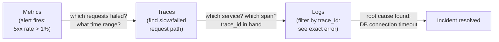

# [BEE-320] The Three Pillars: Logs, Metrics, Traces

:::info
What logs, metrics, and traces each provide, why all three are necessary, and how to correlate them during an incident.
:::

## Context

In 2017, Peter Bourgon published a foundational essay defining the three distinct signals of observability: metrics, tracing, and logging. Each has genuinely different properties in terms of cardinality, volume, and the type of question it answers. Vendors enthusiastically adopted the framework, and it has since become the standard mental model for instrumentation.

OpenTelemetry (OTel), now backed by the CNCF and supported by more than 90 vendors, codifies this model into a single vendor-neutral SDK and wire format (OTLP). Instrumenting with OpenTelemetry means you capture all three signals in one pass, using a shared data model, and can route to any backend without re-instrumenting.

**References:**
- [Peter Bourgon — Metrics, tracing, and logging (2017)](https://peter.bourgon.org/blog/2017/02/21/metrics-tracing-and-logging.html)
- [OpenTelemetry — Signals overview](https://opentelemetry.io/docs/)
- [OpenTelemetry Signals: Logs vs Metrics vs Traces — Dash0](https://www.dash0.com/knowledge/logs-metrics-and-traces-observability)

## Principle

**Use metrics to know something is wrong, traces to find where it is wrong, and logs to understand exactly what happened. Correlate all three with a shared trace ID.**

## The Three Pillars

### Logs

A log is a discrete, timestamped record of an event that occurred inside a running process.

**Characteristics:**
- Highest volume of the three signals — can easily exceed production traffic itself in byte count.
- Can be unstructured (plain text lines) or structured (JSON objects with key-value fields).
- Captures rich context that metrics cannot: error messages, user IDs, query parameters, stack traces.
- Not aggregatable in their raw form; querying requires a search index.

**Unstructured log (avoid in production):**
```
2025-04-07 14:32:01 ERROR failed to connect to database after 3 retries
```

**Structured log (preferred):**
```json
{
  "timestamp": "2025-04-07T14:32:01Z",
  "level": "error",
  "message": "database connection failed",
  "service": "order-service",
  "db_host": "db-primary.internal",
  "retries": 3,
  "trace_id": "4bf92f3577b34da6a3ce929d0e0e4736",
  "span_id": "00f067aa0ba902b7"
}
```

Structured logs answer: **What exactly happened, in what context, for which request?**

### Metrics

A metric is a numeric measurement of a system property sampled or accumulated over time.

**Characteristics:**
- Lowest volume of the three signals; time-series data compresses well.
- Aggregatable across dimensions (by service, host, region, status code).
- Efficient to store and query; purpose-built for dashboards and alerting.
- Loses per-request detail by design — that is the trade-off for scale.

**Common metric types:**
| Type | Definition | Example |
|---|---|---|
| Counter | Monotonically increasing value | `http_requests_total{status="500"}` |
| Gauge | Current point-in-time value | `db_connection_pool_active` |
| Histogram | Distribution of observed values | `http_request_duration_seconds` |

Metrics answer: **Is the system healthy? How is it trending? When did it break?**

### Traces

A trace is the recorded journey of a single request as it flows through one or more services.

**Characteristics:**
- Volume sits between metrics and logs — one trace per request, sampled in high-traffic systems.
- Composed of **spans**: individual units of work (a service call, a database query, an external HTTP request).
- Each span carries a start time, duration, status, and key-value attributes.
- Context propagation carries the `trace_id` and `span_id` across service boundaries via HTTP headers (W3C Trace Context standard) or message metadata.

```
Trace: 4bf92f3577b34da6a3ce929d0e0e4736
│
├── [api-gateway]          0ms → 342ms   (root span)
│   ├── [auth-service]     5ms → 23ms
│   ├── [order-service]   25ms → 340ms   ← slow
│   │   ├── [db query]    26ms → 318ms   ← very slow
│   │   └── [cache get]  319ms → 322ms
│   └── [notify-service] 341ms → 342ms
```

Traces answer: **Where in the call path did latency or errors originate?**

## How They Complement Each Other

No single pillar gives the full picture.

- **Metrics alone**: you know error rate spiked, but not which requests failed or why.
- **Logs alone**: you can see individual error messages, but not the frequency or which service is the root cause.
- **Traces alone**: you can follow one request's path, but without metrics you have no baseline to know whether that trace is typical or anomalous.

The pillars are most powerful when **correlated**:

- Embed `trace_id` in every structured log line. When a trace surfaces a slow span, you can filter logs by that ID to see every event in that request's lifecycle across all services.
- Use **metric exemplars** (a feature in Prometheus and OpenTelemetry) to attach a sampled `trace_id` to a histogram bucket. When a latency alert fires, click the exemplar to jump directly to a representative trace.

## Investigation Flow Diagram



## Production Incident Example

**Alert:** PagerDuty fires — `http_5xx_rate` on `order-service` exceeds 1% for 3 minutes.

**Step 1 — Metrics (scope the problem)**

Open the dashboard. The metric `http_requests_total{service="order-service", status="500"}` shows the spike started at 14:30 UTC. `http_request_duration_p99` also jumped from 120ms to 4.2s at the same moment.

You now know: order-service, starting at 14:30, high latency and errors. You do not yet know why.

**Step 2 — Traces (find where)**

Filter traces for `order-service` between 14:30 and 14:35 with `status=error`. In the trace waterfall, you see a pattern: every failed request has a `db_query` span taking 3–4 seconds before timing out. The slow span is in `order-service → db_query`, not in any upstream or downstream service.

You now have a `trace_id`: `4bf92f3577b34da6a3ce929d0e0e4736`.

**Step 3 — Logs (understand what)**

Search logs for `trace_id="4bf92f3577b34da6a3ce929d0e0e4736"`. Across the three service instances, you find this entry repeated:

```json
{
  "level": "error",
  "message": "database connection failed",
  "db_host": "db-primary.internal",
  "error": "connection pool exhausted: max_connections=20, active=20",
  "trace_id": "4bf92f3577b34da6a3ce929d0e0e4736"
}
```

Root cause: a deployment 10 minutes earlier increased connection pool usage and exhausted the database's connection limit.

**Without all three pillars:** metrics tell you there is a problem; without traces you spend 20 minutes grepping logs across services; without logs you know the trace is slow but not the underlying error message.

## Observability vs Monitoring

These terms are often used interchangeably but describe different practices.

**Monitoring** is checking known conditions: dashboards that display predefined metrics, alerts that fire when values cross predefined thresholds. Monitoring answers questions you anticipated before the incident. It is reactive to a known failure mode catalog.

**Observability** is the property of a system that lets you ask new questions without deploying new instrumentation. When a novel failure mode appears — one you did not predict — observability lets you explore: filter by any dimension, pivot from a metric to a trace to a log, query raw structured data. Observability is the infrastructure for debugging the unknown.

Monitoring is a subset of what observability enables. You need both: dashboards and alerts for the expected, exploration capability for everything else.

## Common Mistakes

### 1. Logs without structure

Unstructured log lines cannot be searched by field or aggregated. When an incident occurs, you cannot filter `level=error AND service=order-service AND trace_id=X`. You are reduced to grepping free text at 2 AM. Always log in JSON or a structured format. See [BEE-321](321.md).

### 2. Metrics without context

High-cardinality labels in metrics (user IDs, request IDs, email addresses) cause cardinality explosion: the number of unique time series grows unboundedly and overwhelms the metrics store. The rule: metrics labels must be low-cardinality enumerations (status codes, service names, regions). High-cardinality context belongs in logs and traces, not metric labels.

### 3. No trace context propagation

A trace that stops at the first service boundary is useless for distributed debugging. Every service must extract the incoming `traceparent` header (W3C Trace Context), create a child span, and forward the header in all outgoing requests — including async messages via message queue metadata. Without propagation, you see isolated spans instead of an end-to-end trace.

### 4. Treating observability as just monitoring

Dashboards with fixed panels are monitoring. Observability requires the ability to query interactively: slice by any dimension, jump from a metric spike to the traces that caused it, search logs by any structured field. If your tooling only supports predefined dashboards, you are doing monitoring — useful, but insufficient for novel failures.

### 5. Missing correlation between pillars

Logs without `trace_id` cannot be linked to the trace that caused them. Metrics without exemplars cannot be linked to a representative trace. Set up correlation at instrumentation time, not as a retrofit. The OpenTelemetry SDK propagates trace context automatically when configured; the main discipline is ensuring every log write includes the active span's context.

## Related BEPs

- [BEE-321](321.md) — Structured logging: schema, log levels, and what not to log
- [BEE-322](322.md) — Distributed tracing: spans, sampling strategies, and context propagation
- [BEE-323](323.md) — Alerting philosophy: what to alert on and how to write good runbooks
- [BEE-324](324.md) — SLOs and error budgets: using metrics to define and track reliability targets
