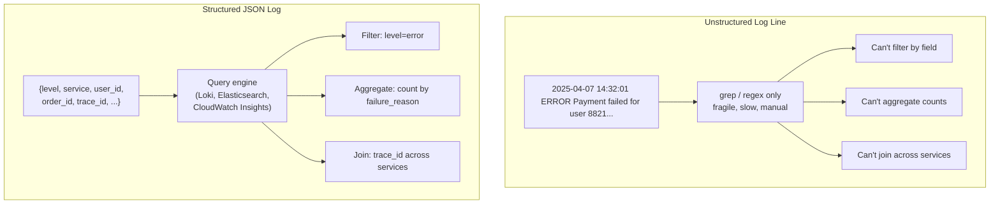

# [BEP-321] Structured Logging

:::info
Why unstructured logs fail at scale, log levels, correlation IDs, and what never to log.
:::

## Context

Logs are the oldest form of operational visibility. For decades, applications printed free-text lines to stdout or a file, and engineers used `grep` and `awk` to find what they needed. That approach works when you run one service on one server and the log volume fits in a terminal window.

It breaks completely at scale.

A modern backend serving thousands of requests per second can produce millions of log lines per hour across dozens of services. When something goes wrong, you need to answer: *which specific requests failed, on which service instances, and what was the exact error context?* Grepping free text across distributed systems is not a workflow — it is a crisis response that fails exactly when the stakes are highest.

Structured logging — emitting log entries as machine-readable key-value pairs, typically JSON — is the practice that makes logs queryable, aggregatable, and useful as an operational tool rather than an archaeological artifact.

**References:**
- [Structured Logging: Best Practices & JSON Examples — Uptrace](https://uptrace.dev/glossary/structured-logging)
- [Logging Levels: What They Are & How to Choose Them — Sematext](https://sematext.com/blog/logging-levels/)
- [9 Logging Best Practices You Should Know — Dash0](https://www.dash0.com/guides/logging-best-practices)
- [Log Debug vs. Info vs. Warn vs. Error — EdgeDelta](https://edgedelta.com/company/blog/log-debug-vs-info-vs-warn-vs-error-and-fatal)
- [Structured Logging — A Developer's Guide — SigNoz](https://signoz.io/blog/structured-logs/)

## Principle

**Emit every log line as a structured JSON object. Include a consistent set of standard fields on every entry. Propagate a correlation ID through every service so any request's complete lifecycle can be reconstructed from logs alone.**

## Unstructured vs. Structured Logs

The same payment failure event, logged two ways:

**Unstructured (avoid):**
```
2025-04-07 14:32:01 ERROR Payment failed for user 8821 order ORD-4492 amount 149.99 reason gateway timeout after 3s
```

**Structured (preferred):**
```json
{
  "timestamp": "2025-04-07T14:32:01.412Z",
  "level": "error",
  "service": "payment-service",
  "message": "payment failed",
  "user_id": "8821",
  "order_id": "ORD-4492",
  "amount_usd": 149.99,
  "failure_reason": "gateway_timeout",
  "duration_ms": 3012,
  "trace_id": "4bf92f3577b34da6a3ce929d0e0e4736",
  "request_id": "req-7a91c2d4"
}
```

The unstructured line requires a regex to extract `user_id` or `order_id` for analysis. The structured entry allows a log aggregation system to run a query like:

```
level=error AND service=payment-service AND failure_reason=gateway_timeout
```

without any preprocessing. Every field is independently filterable, sortable, and aggregatable.



## Log Levels

Every log entry must carry a level that communicates the severity and operational significance of the event. Using levels consistently is what makes alerting and noise reduction possible.

| Level | When to use |
|-------|-------------|
| **DEBUG** | Detailed internal state useful during development or troubleshooting: variable values, branch decisions, cache hits/misses. Disabled in production by default. Never in the hot path without sampling. |
| **INFO** | Normal, expected events that confirm the system is behaving correctly: service started, request completed successfully, job finished, configuration loaded. The baseline narrative of what the system did. |
| **WARN** | Something unexpected happened but the request succeeded or the system recovered: a retry that succeeded, a deprecated API was called, a slow query exceeded a threshold but didn't fail. Warrants monitoring; does not require immediate action. |
| **ERROR** | An operation failed and the system could not recover from it automatically: a database write failed, an external call exhausted retries, a required config value is missing. Requires investigation. |
| **FATAL** | The process cannot continue and is about to exit: unrecoverable state corruption, cannot bind to a required port. Use sparingly — most failures are errors, not fatals. |

### The most common log level mistake

Logging everything at INFO creates a flood where genuine problems are indistinguishable from routine events. Each level should carry a clear contract:

- A monitoring system should be able to alert on `level=error` without triggering for every cache miss.
- A developer investigating an incident should find INFO logs that tell the story at a useful level of detail — not a 40,000-line trace of every conditional branch.

## Correlation IDs

A single user action in a microservices system touches multiple services. Without a shared identifier, the logs of each service are isolated islands. A `trace_id` or `request_id` that threads through every log entry across every service is what makes distributed debugging possible.

### How it works

1. The API gateway (or the first service to receive the request) generates a unique `trace_id` for each inbound request.
2. Every outgoing call to another service includes this ID in a request header (conventionally `X-Request-ID`, `X-Trace-ID`, or the W3C `traceparent` header).
3. Each downstream service extracts the ID from the header and includes it in all its own log entries.
4. Every log aggregation query for that incident can be scoped to a single `trace_id`, returning the complete request lifecycle across all services.

### Finding a request across three services

```json
// API Gateway
{
  "timestamp": "2025-04-07T14:32:00.001Z",
  "level": "info",
  "service": "api-gateway",
  "message": "request received",
  "method": "POST",
  "path": "/orders",
  "trace_id": "4bf92f3577b34da6a3ce929d0e0e4736",
  "request_id": "req-7a91c2d4"
}

// Order Service
{
  "timestamp": "2025-04-07T14:32:00.045Z",
  "level": "info",
  "service": "order-service",
  "message": "order created",
  "order_id": "ORD-4492",
  "trace_id": "4bf92f3577b34da6a3ce929d0e0e4736",
  "request_id": "req-7a91c2d4"
}

// Payment Service
{
  "timestamp": "2025-04-07T14:32:01.412Z",
  "level": "error",
  "service": "payment-service",
  "message": "payment failed",
  "order_id": "ORD-4492",
  "failure_reason": "gateway_timeout",
  "trace_id": "4bf92f3577b34da6a3ce929d0e0e4736",
  "request_id": "req-7a91c2d4"
}
```

A single query — `trace_id="4bf92f3577b34da6a3ce929d0e0e4736"` — retrieves the complete story across all three services, in chronological order, with full context at each step.

## Standard Log Schema

Every log entry should include this minimum set of fields:

| Field | Type | Description |
|-------|------|-------------|
| `timestamp` | ISO 8601 UTC | When the event occurred (`2025-04-07T14:32:01.412Z`) |
| `level` | string | `debug`, `info`, `warn`, `error`, or `fatal` |
| `service` | string | The service name (`order-service`) |
| `message` | string | Human-readable description of the event |
| `trace_id` | string | Correlation ID for the originating request |
| `request_id` | string | ID of the immediate HTTP request or job |
| `environment` | string | `production`, `staging`, `development` |
| `version` | string | Service version or Git SHA |

Additional fields are appended per-event as needed: `user_id`, `order_id`, `duration_ms`, `http_status`, `error_code`, `stack_trace`, and so on.

## What to Log

### Log these

- **Request metadata**: method, path, status code, response time, upstream service called.
- **State transitions**: order placed, payment captured, job started/completed, cache invalidated.
- **Errors and exceptions**: full error message, error code, stack trace (in structured fields, not concatenated into the message string).
- **Significant decisions**: feature flag evaluated, A/B variant assigned, circuit breaker opened.
- **External call outcomes**: third-party API called, result code, latency.

### Do not log these

- **Passwords and secrets**: never log credentials, API keys, tokens, or private keys — even masked. The risk of incomplete masking is too high.
- **PII**: names, email addresses, phone numbers, IP addresses, physical addresses, national ID numbers. Logging PII creates GDPR, HIPAA, and PCI DSS compliance exposure. Use a pseudonymous ID (e.g., `user_id`) instead of raw user data.
- **Full request/response bodies**: these frequently contain both secrets and PII. Log metadata, not payloads.
- **High-frequency noise at INFO**: health check polling, heartbeats, and routine cache reads logged at INFO level flood the system and bury real signals. Use DEBUG or skip them.

## Contextual Logging

The most useful logs carry context that was established earlier in the request lifecycle, not just the data available at the moment of the log call. This is called contextual or enriched logging.

Instead of:
```json
{ "level": "error", "message": "query failed", "query": "SELECT ..." }
```

Emit:
```json
{
  "level": "error",
  "message": "query failed",
  "query": "SELECT ...",
  "service": "order-service",
  "trace_id": "4bf92f3577b34da6a3ce929d0e0e4736",
  "user_id": "8821",
  "request_path": "/orders",
  "duration_ms": 4812
}
```

The second entry answers not just *what* failed, but *which request triggered it*, *who was affected*, and *how long it was running*. Most logging libraries support a context object or MDC (Mapped Diagnostic Context) that automatically attaches these fields to every log call made within a request handler, without requiring each log statement to repeat them manually.

## Log Sampling at High Volume

At extreme throughput (tens of thousands of requests per second), logging every successful request may produce more volume than is operationally useful or economically viable to store. Sampling strategies address this:

- **Head sampling**: log a fixed percentage of all requests (e.g., 10%). Simple but loses visibility of rare events.
- **Tail sampling**: buffer the full log for a request and decide whether to keep it after the request completes. Keep 100% of errors and slow requests; sample down successful fast requests to 1–5%. This preserves the events that matter while reducing overall volume.
- **Always log errors**: regardless of sampling strategy, every ERROR and FATAL log entry must be emitted. Sampling must never discard error signals.

Sampling is applied at the log aggregation agent (Fluentd, Fluent Bit, the OpenTelemetry Collector), not in the application itself, so application code remains simple.

## Log Aggregation

Structured logs in JSON format are designed to be ingested by a log aggregation platform:

- **Self-hosted**: Elasticsearch + Kibana (the ELK stack), Loki + Grafana.
- **Managed**: AWS CloudWatch Logs Insights, Google Cloud Logging, Datadog Logs, Grafana Cloud.

These systems index every JSON field, enabling sub-second full-text and field-level queries across billions of log entries. The value of structured logging is only fully realized when connected to an aggregation backend — structured logs written to a file and never shipped are only marginally better than unstructured ones.

## Common Mistakes

### 1. Logging PII and secrets

This is a compliance violation (GDPR, HIPAA, PCI DSS) and a security risk. Log aggregation systems are broadly accessible within an organization and are often retained for months. A password or API key logged once is potentially exposed to every engineer with log access for the entire retention window. Use `user_id`, not `email`. Mask payment data. Redact tokens at the source.

### 2. Everything at INFO level

If every event is INFO, no events are INFO in the useful sense. Alerts on `level=error` catch nothing if errors are logged at INFO. Dashboards showing INFO rate are meaningless if it includes both "request completed" and "database connection pool exhausted." Audit your log levels: INFO should be the system's narrative, ERROR should fire alerts.

### 3. No correlation ID

Without a shared identifier, the logs from each service in a request chain are unconnected. Reconstructing what happened to a specific user request requires cross-referencing timestamps and guessing which entries belong together. This is the difference between a 2-minute investigation and a 2-hour one. Propagate `trace_id` from the first service to the last.

### 4. Logging objects by reference

In some languages (particularly JavaScript), logging an object without serializing it produces `[object Object]` in the log output — all context is lost. Always serialize objects explicitly, or use a logging library that handles this automatically. Similarly, avoid string concatenation for log messages; pass structured key-value fields instead.

### 5. No retention or rotation policy

Logs written to disk without rotation fill the disk. Logs shipped to a managed service without a retention policy accumulate cost indefinitely. Define a retention policy appropriate to your compliance requirements (90 days is a common starting point for production logs) and configure rotation or TTL at the storage layer, not as an afterthought.

## Related BEPs

- **BEP-320** — The three pillars: how logs, metrics, and traces complement each other
- **BEP-321** — Distributed tracing: `trace_id` and `span_id` in the context of distributed systems
- **BEP-75** — Error handling: including correlation IDs in error responses so clients can report them
