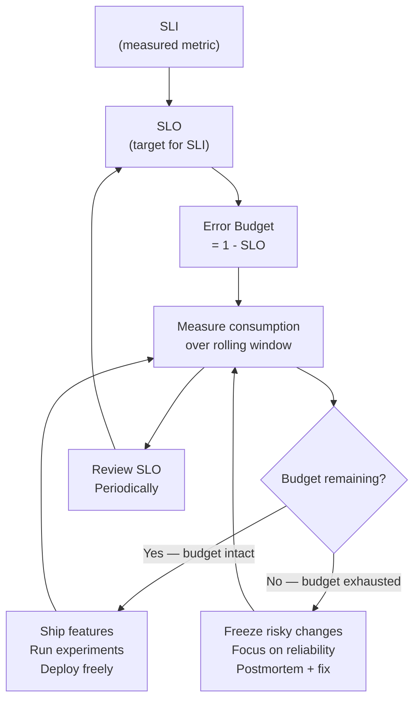

# [BEP-324] SLOs and Error Budgets

:::info
Define reliability targets with SLOs. Use error budgets to decide when to ship features and when to focus on reliability.
:::

## Context

Reliability is a feature. But how reliable is "reliable enough"? Without a quantified target, engineers argue about whether an outage was acceptable, PMs push for deployments while the on-call team is firefighting, and leadership makes capacity decisions on gut feel.

Service Level Objectives (SLOs) give the team a shared, data-driven answer to that question. Combined with error budgets, they turn reliability from a vague aspiration into a concrete decision-making tool.

The canonical reference is the [Google SRE Book, Chapter 4: Service Level Objectives](https://sre.google/sre-book/service-level-objectives/). Alex Hidalgo's [Implementing Service Level Objectives](https://www.oreilly.com/library/view/implementing-service-level/9781492076803/) provides the practitioner-level detail. Google's [SRE Workbook chapter on alerting on SLOs](https://sre.google/workbook/alerting-on-slos/) covers burn-rate alerting.

## Principle

**Define a measurable SLI, set an SLO target below 100%, derive an error budget from the gap, and use that budget to drive every deployment and reliability decision.**

## Core Concepts

### SLI — Service Level Indicator

An SLI is a quantitative measurement of a service behavior that correlates with the user experience. It is a ratio or value computed from raw telemetry.

Common SLIs:

| Dimension   | Definition                                                 | Example                                      |
|-------------|-----------------------------------------------------------|----------------------------------------------|
| Availability | `good_requests / total_requests`                          | HTTP 2xx / all HTTP responses                |
| Latency     | Fraction of requests served within a threshold            | Requests completing under 300 ms             |
| Throughput  | Requests successfully processed per unit time             | Successful writes per second                 |
| Correctness | Fraction of responses with correct data                   | Records with consistent checksums            |

**Choose SLIs that reflect user experience, not infrastructure health.** CPU usage is not an SLI. "The user's request succeeded in reasonable time" is.

### SLO — Service Level Objective

An SLO is a target value for an SLI, measured over a rolling time window:

```
SLO: availability SLI >= 99.9% over a rolling 30-day window
```

The SLO is internal. It belongs to the engineering team. It is a commitment to yourself about the level of reliability you will maintain.

Key properties of a good SLO:

- Directly tied to a user-visible SLI
- Has a defined measurement window (28 days and 30 days are both common)
- Set below the level your users actually need — leave headroom
- Reviewed periodically as usage patterns change

### SLA — Service Level Agreement

An SLA is a contract between you and your users (or customers). It includes consequences — financial penalties, service credits, escalation procedures — if you fail to meet it.

```
SLA: 99.5% monthly availability; breach triggers 10% service credit
```

The SLO must be stricter than the SLA. Your SLO is your internal warning line; the SLA is the line you must never cross. If your SLO is 99.9%, your SLA might be 99.5% — giving you margin to detect and correct problems before they become contractual breaches.

### Error Budget

The error budget is the allowed unreliability implied by your SLO:

```
Error budget = 1 - SLO target
```

For a 99.9% SLO over 30 days (43,200 minutes):

```
Error budget = 0.1% of 43,200 minutes = 43.2 minutes
```

This is how much downtime (or how many failed requests) the service is allowed to accumulate before it violates its SLO. It is not a punishment budget — it is a spending budget. The team is free to spend it on risk: deployments, experiments, infrastructure changes. When the budget runs out, spending must stop.

## Decision Flow



The feedback loop is the key insight: error budgets make reliability self-regulating. A team that ships fast consumes budget. When the budget is gone, the team cannot ship until reliability work refills it. This aligns incentives without requiring management escalation.

## Worked Example

**Service:** REST API

**SLI:** `successful_requests / total_requests` (HTTP 2xx and 3xx / all responses, excluding 4xx client errors)

**SLO:** 99.9% availability over a rolling 30-day window

**Error budget calculation:**

```
Window:           30 days = 43,200 minutes
SLO target:       99.9%
Error budget:     0.1% × 43,200 = 43.2 minutes of equivalent downtime
```

For a service receiving 1,000,000 requests per month:

```
Allowed failures: 0.1% × 1,000,000 = 1,000 failed requests
```

**Current state at day 20 of the window:**

```
Budget consumed:  ~465 failed requests  (~46.5% of budget)
Budget remaining: ~535 failed requests  (~53.5% of budget, ≈ 23 minutes equivalent)
```

**Decision:** The team has consumed less than half the budget with two-thirds of the window elapsed. The burn rate is healthy. It is safe to proceed with the planned database migration (estimated risk: ~200 failed requests during the cutover window).

If instead the team had consumed 950 out of 1,000 allowed failures by day 20, the correct action is to halt non-critical deployments and investigate the reliability regressions before proceeding.

## Error Budget Policy

An error budget without a policy is just a number. The policy defines what the team does when the budget is in different states:

| Budget state        | Action                                                            |
|---------------------|-------------------------------------------------------------------|
| > 50% remaining     | Normal operations; feature work proceeds                          |
| 10–50% remaining    | Elevated caution; require reliability review before risky deploys |
| < 10% remaining     | Freeze risky changes; SRE/platform team engaged                   |
| Exhausted (0%)      | Only P0 bug fixes and security patches; all other releases halted |
| Consistently unused | SLO may be too loose; consider tightening the target              |

The policy must be agreed upon by product, engineering, and SRE before it matters. Getting buy-in before a crisis is the entire point.

## SLO-Based Alerting (Burn Rate)

Traditional threshold alerts fire when a metric crosses a line. They are noisy and slow. Burn-rate alerting answers a more useful question: **"Are we consuming our error budget so fast that we will exhaust it before the window closes?"**

**Burn rate** is the ratio of the current error rate to the error rate that would exactly exhaust the budget:

```
burn_rate = current_error_rate / (1 - SLO_target)
```

A burn rate of 1.0 means you are consuming the budget at exactly the sustainable rate. A burn rate of 10.0 means you will exhaust a 30-day budget in 3 days.

**Google's recommended multi-window, multi-burn-rate approach** (from the [SRE Workbook](https://sre.google/workbook/alerting-on-slos/)):

| Alert severity | Burn rate | Short window | Long window | Budget consumed |
|---------------|-----------|-------------|------------|-----------------|
| Page (critical) | 14x       | 5 min       | 1 hour     | 2% in 1 hour    |
| Page (critical) | 6x        | 30 min      | 6 hours    | 5% in 6 hours   |
| Ticket (warning) | 3x       | 6 hours     | 1 day      | 10% in 1 day    |
| Ticket (warning) | 1x        | 3 days      | 3 days     | 100% in 30 days |

Using two windows prevents both false positives (short spike) and missed incidents (gradual degradation). See BEP-323 for implementation details.

## Common Mistakes

**1. Setting the SLO at 100%**

A 100% SLO means a zero error budget. Every single failure is a violation. No deployments are safe. Postmortems become blame sessions. No system that serves real traffic achieves 100% availability; pretending otherwise just means the SLO is ignored.

**2. SLO without an error budget policy**

An SLO with no defined consequences is a dashboard metric, not a decision tool. If the team does not know what to do when the budget is exhausted, the SLO changes nothing.

**3. Too many SLOs**

If a service has fifteen SLOs, the team cannot prioritize. Pick two or three SLOs that cover the most important user journeys. Add more only when there is evidence that the existing ones miss real user pain.

**4. SLOs based on infrastructure metrics instead of user experience**

"Database CPU < 70%" is not an SLO. It measures a system component, not a user outcome. Users do not experience CPU utilization — they experience request failures and slow responses. Map SLIs to user journeys.

**5. Not reviewing SLOs periodically**

A 99.9% SLO set when your service handled 10,000 requests/day may be wrong at 10,000,000 requests/day. Usage patterns change. User expectations change. Review SLOs at minimum annually, and after any major architecture change.

## Choosing the Right SLO Target

A useful heuristic: set the SLO slightly tighter than what your users would notice. If users start filing complaints or churning at 99.5% availability, set the SLO at 99.9% — not 99.99%, which would cost significant reliability work for no measurable user benefit.

The SLO should also reflect what you can actually achieve. If historical data shows 99.6% availability, setting a 99.9% SLO immediately exhausts the budget and freezes all deployments. Start with a target that reflects reality, then tighten over time as reliability work pays off.

## Related BEPs

- **BEP-265** — Chaos Engineering: SLOs define the steady-state hypothesis for chaos experiments. Do not run a chaos experiment if the error budget is already exhausted.
- **BEP-320** — Metrics Instrumentation: the raw counters and histograms that SLIs are computed from.
- **BEP-323** — Alerting: burn-rate alert implementation with Prometheus and Alertmanager.

## References

- [Google SRE Book — Service Level Objectives](https://sre.google/sre-book/service-level-objectives/)
- [Google SRE Workbook — Implementing SLOs](https://sre.google/workbook/implementing-slos/)
- [Google SRE Workbook — Alerting on SLOs](https://sre.google/workbook/alerting-on-slos/)
- [Google SRE Workbook — Error Budget Policy](https://sre.google/workbook/error-budget-policy/)
- Alex Hidalgo, [Implementing Service Level Objectives](https://www.oreilly.com/library/view/implementing-service-level/9781492076803/) (O'Reilly, 2020)
