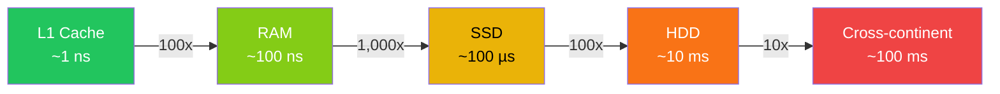

# [BEE-300] Back-of-Envelope Estimation

:::info
Latency numbers every engineer should know and capacity math.
:::

## Context

Before writing a single line of code or choosing a database, an engineer should be able to answer: "How big is this problem?" Back-of-envelope estimation is the practice of making quick, approximate calculations to validate that a proposed design can handle the expected load — using only a whiteboard and well-known constants.

The technique was popularized by Jeff Dean (Google Fellow) through his "Numbers Every Programmer Should Know" talk, and is a standard expectation in system design interviews and real architectural reviews. Alex Xu's *System Design Interview* dedicates an entire chapter to this skill because without it, engineers make decisions based on intuition rather than magnitude.

The goal is never false precision. A rough answer — "this needs roughly 10 TB/year of storage" — is far more valuable than no answer, and far more honest than a false-precision answer like "9,847,296 GB."

## Principle

**Estimate first, design second.** Use order-of-magnitude approximations to identify which dimensions (throughput, storage, bandwidth, memory) are large enough to constrain your design decisions. Explicitly state every assumption. Revisit estimates when assumptions change.

## Latency Numbers You Must Internalize

These numbers come from Jeff Dean's original presentation and have been the canonical reference since around 2010. The exact values shift with hardware generations, but the *orders of magnitude* are stable and are what matter.

| Operation | Latency | Notes |
|---|---|---|
| L1 cache reference | ~1 ns | On-chip, fastest |
| Branch misprediction penalty | ~5 ns | CPU pipeline flush |
| L2 cache reference | ~4 ns | Still on-chip |
| Mutex lock/unlock | ~17 ns | |
| Main memory (RAM) reference | ~100 ns | 100x slower than L1 |
| Compress 1 KB with Snappy | ~3 µs | |
| Read 1 MB sequentially from memory | ~3 µs | |
| SSD random read (4 KB) | ~100 µs | 1,000x slower than RAM |
| Read 1 MB sequentially from SSD | ~1 ms | |
| Round-trip within same datacenter | ~0.5 ms | |
| HDD disk seek | ~10 ms | 10,000x slower than RAM |
| Read 1 MB sequentially from HDD | ~20 ms | |
| Send packet CA → Netherlands → CA | ~150 ms | Cross-continental RTT |

**Reference:** [Latency Numbers Every Programmer Should Know (gist.github.com/jboner/2841832)](https://gist.github.com/jboner/2841832), [Jeff Dean's original numbers (brenocon.com)](https://brenocon.com/dean_perf.html)

### Latency Scale Visualization



The practical lesson: memory access is so cheap it is almost free. Disk I/O and network I/O are so expensive that they dominate all other costs in most backend systems. Design decisions must minimize them.

## Powers of Two for Capacity Estimation

When estimating storage and memory, work in powers of two. Memorize these:

| Unit | Power of 2 | Approximate value | Common context |
|---|---|---|---|
| 1 Byte | 2^0 | 1 B | A single character |
| 1 Kilobyte (KB) | 2^10 | 1,024 B ≈ 10^3 | A short email |
| 1 Megabyte (MB) | 2^20 | ~1 million B ≈ 10^6 | A photo (compressed) |
| 1 Gigabyte (GB) | 2^30 | ~1 billion B ≈ 10^9 | A movie (compressed) |
| 1 Terabyte (TB) | 2^40 | ~1 trillion B ≈ 10^12 | A large database |
| 1 Petabyte (PB) | 2^50 | ~10^15 | Google-scale storage |

**Reference:** [Memory Estimation Cheatsheet (medium.com/@bindubc)](https://medium.com/@bindubc/to-convert-between-bytes-b-megabytes-mb-gigabytes-gb-and-terabytes-tb-you-can-use-the-18555f7066d2)

For estimation purposes, treating 1 KB as exactly 1,000 bytes introduces only 2.4% error. Use it freely.

## QPS Conversion: From DAU to Requests Per Second

The most common starting point is Daily Active Users (DAU). The key constant: **1 day ≈ 86,400 seconds**.

For estimation, round this to **10^5 seconds/day** (86,400 ≈ 100,000). This gives:

```
Average QPS = (DAU × requests_per_user_per_day) / 86,400
Peak QPS    = Average QPS × peak_factor  (typically 2–10×)
```

Quick reference multipliers:

| DAU | Avg QPS (1 req/user/day) | Avg QPS (10 req/user/day) |
|---|---|---|
| 1 million | ~12 | ~120 |
| 10 million | ~120 | ~1,200 |
| 100 million | ~1,200 | ~12,000 |
| 1 billion | ~12,000 | ~120,000 |

**The 80/20 rule for traffic:** In practice, 80% of daily traffic arrives in 20% of the day (roughly 4–5 hours). This means your peak QPS can be 4–5× your average, not just 2×. Always design for peak, never average.

## Estimation Framework

Follow this order to avoid circular reasoning:

1. **State assumptions explicitly** — Write them down. "Assume 100M DAU, 10:1 read:write ratio, average URL = 100 bytes." Unstated assumptions cannot be validated or challenged.
2. **Estimate request volume** — Convert DAU to average QPS, then apply peak multiplier.
3. **Estimate storage** — (writes/day) × (bytes/write) × (retention years).
4. **Estimate bandwidth** — (QPS) × (bytes/request).
5. **Estimate memory** — If caching, apply 20/80 rule: cache 20% of daily data to handle 80% of reads.
6. **Verify against known constraints** — Does your storage estimate fit on one machine? One rack? Does bandwidth exceed your network tier?

## Worked Example: URL Shortener for 100M DAU

### Assumptions

- 100 million Daily Active Users
- Read:write ratio = 100:1 (reads dominate — people click links far more than they create them)
- Average original URL length: 100 bytes
- Average short URL length: 7 bytes
- Retention: 5 years
- Each user creates ~0.1 short URLs per day, clicks ~10 per day

### Step 1: QPS

```
Write QPS = 100M × 0.1 / 86,400
          ≈ 10M / 86,400
          ≈ ~116 writes/sec
          → round to ~100 write QPS

Read QPS  = 100 × write QPS
          = ~10,000 read QPS

Peak read QPS = 10,000 × 5 (peak factor)
              = ~50,000 read QPS
```

### Step 2: Storage

```
Writes per day     = 100M × 0.1 = 10M URLs/day
Bytes per URL      = 100 bytes (original) + 7 bytes (short) + metadata ≈ 500 bytes total
Storage per day    = 10M × 500 B = 5 GB/day
Storage over 5 yr  = 5 GB × 365 × 5 ≈ 9 TB

→ Round to ~10 TB total storage
```

### Step 3: Bandwidth

```
Write bandwidth = 100 write QPS × 500 B = 50 KB/s   (negligible)
Read bandwidth  = 10,000 read QPS × 500 B = 5 MB/s  (easy)
Peak bandwidth  = 50,000 × 500 B = 25 MB/s
```

### Step 4: Memory (cache)

```
Daily read requests = 10,000 QPS × 86,400 = ~864M reads/day
Cache 20% of URLs   = 864M × 0.2 × 500 B ≈ 86 GB

→ A single large memory node or distributed cache can handle this
```

### Conclusion

This is a read-heavy, low-write-volume service. 10 TB of storage over 5 years fits on a handful of commodity servers. Read QPS of ~10K (peak 50K) is manageable with a modest cache layer in front of the database. **The estimates tell you this does not need a distributed database on day one** — a replicated relational database with a CDN cache is sufficient. This is exactly the kind of decision back-of-envelope estimation enables.

## Common Mistakes

### 1. False Precision
Saying "our system will handle 1,234,567 QPS" is not useful and not honest. You have not measured this; you estimated it. Write "~1.2M QPS." False precision erodes trust and wastes discussion time.

### 2. Forgetting Peak vs Average
Average QPS is a misleading baseline. Traffic is never flat. Use peak = 2–10× average as a design target. The exact factor depends on your traffic pattern; for social networks and e-commerce, 5× is a reasonable default.

### 3. Ignoring Data Growth Over Time
A design that works for 10 TB today may need to handle 100 TB in three years. Include a time horizon in your storage estimates. "10 TB now, 100 TB in 5 years" changes the architecture.

### 4. Treating All Storage as Equal
RAM, SSD, and HDD have radically different cost, latency, and throughput profiles. An estimate that says "we need 10 TB of storage" is incomplete without specifying which tier. 10 TB of RAM costs roughly $50,000; 10 TB of HDD costs roughly $200. The latency table above should inform which tier each access pattern belongs in.

### 5. Estimating Without Stating Assumptions
If your estimate says "100M DAU" but you never wrote that down, reviewers cannot challenge it, and you cannot update it when requirements change. Every estimate is only as good as its assumptions. Make them visible.

## Summary

| Concept | Quick rule |
|---|---|
| Seconds per day | ~10^5 (86,400) |
| Peak QPS | 2–10× average |
| L1 vs RAM | 100× difference |
| RAM vs SSD | 1,000× difference |
| SSD vs HDD | 100× difference |
| 1 KB, MB, GB, TB | 10^3, 10^6, 10^9, 10^12 bytes |
| Cache target | Cache 20% of data to serve 80% of reads |

## Related BEPs

- [BEE-301](301.md) — Scaling decisions: how estimates inform horizontal vs vertical scaling choices
- [BEE-123](123.md) — Sharding: the threshold at which data volume exceeds a single node's capacity
