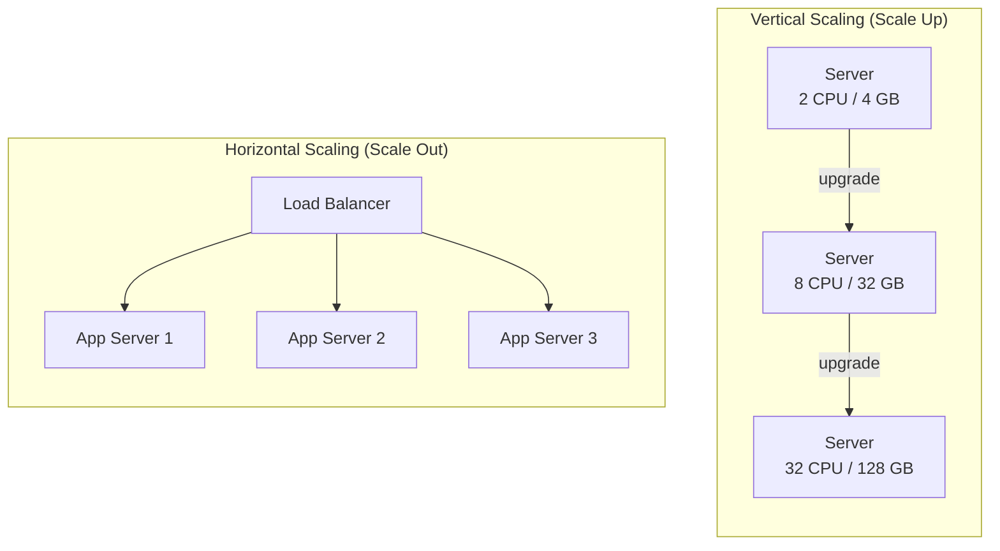

# [BEE-301] Horizontal vs Vertical Scaling

:::info
Vertical scaling is simpler — reach for it first. Horizontal scaling is more powerful — but it requires stateless design to work correctly.
:::

## Context

Every system eventually faces the question: it is under load, and you need more capacity. Two levers exist. You can make a single machine bigger (vertical scaling, "scale up"), or you can add more machines and distribute the load across them (horizontal scaling, "scale out"). The choice affects cost, operational complexity, failure modes, and whether your software architecture needs to change at all.

Alex Xu's *System Design Interview* (Chapter 1, "Scale from Zero to Millions of Users") documents the canonical journey: start single-server, exhaust vertical headroom, go horizontal. Real systems follow a similar path.

**References consulted:**
- [Horizontal vs Vertical Scaling: Design Strategies](https://blogs.realworldbooks.academy/horizontal-vs-vertical-scaling/)
- [Shared-Nothing Architecture — Wikipedia](https://en.wikipedia.org/wiki/Shared-nothing_architecture)
- [System Design Interview Ch.1 — trunin.com](https://trunin.com/en/2022/11/system-design-interview-01-scale-from-zero-to-millions-of-users/)

## Principle

**Start vertical. Go horizontal only when you need to — but design your application to be stateless from the beginning so horizontal scaling remains an option.**

---

## Vertical Scaling

Vertical scaling means adding more CPU, RAM, or faster disks to an existing machine. Your software does not change. The deployment does not change. You just get a bigger box.

**Advantages:**

- Zero application changes required.
- No distributed systems complexity (no load balancer, no shared session concerns).
- Easier to reason about: one process, one memory space.
- Operationally cheaper to start — one server to monitor, patch, and back up.

**Limits:**

- Hard hardware ceiling: even the largest cloud instance has finite CPU and RAM.
- Single point of failure: one machine down means total outage.
- Cost becomes non-linear at the top end — the largest instances carry a significant premium.
- Downtime during resize (depending on provider and OS).

Vertical scaling is not a dead end. For many production workloads — internal tools, moderate-traffic APIs, batch jobs — a well-sized single server is the correct long-term answer. Do not escape to horizontal complexity before you have exhausted the simpler path.

## Horizontal Scaling

Horizontal scaling means adding more instances of your application behind a load balancer. Each instance handles a subset of requests.

**Advantages:**

- Near-infinite capacity: add commodity nodes instead of paying the premium for exotic hardware.
- Fault tolerance: one node failing does not take the system down.
- Rolling deploys and zero-downtime upgrades become natural.
- Auto-scaling becomes possible: provision capacity on demand, release it when idle.

**Cost model:** individual nodes are cheap. At scale, horizontal is more economical than vertical. But horizontal introduces operational overhead (service discovery, health checks, distributed tracing) and, critically, requires stateless application design.

## Visualizing the Difference



## Stateless Design: The Prerequisite for Horizontal Scaling

If two requests from the same user can land on different servers, those servers must produce equivalent results. That is only possible if no relevant state lives on the server itself.

**What "stateless" means in practice:**

- No in-process session objects keyed to a user.
- No local files written by one request and expected by the next.
- No in-memory counters or caches that must be consistent across instances.

**Where state goes instead:**

| State type | Externalize to |
|---|---|
| Session / auth tokens | Redis or Memcached (shared cache cluster) |
| User uploads / generated files | Object storage (S3, GCS) |
| Application data | Database |
| Distributed locks / coordination | Redis, ZooKeeper, or etcd |

With state externalized, every application server becomes identical and interchangeable. A load balancer can route any request to any instance. A failed instance is silently replaced. This is the shared-nothing architecture: each node shares only a network path to the external data stores; there is no shared memory, no shared disk between application nodes.

**If you skip this step**, horizontal scaling breaks: sticky sessions mask the problem but create routing dependencies that degrade fault tolerance, prevent clean auto-scaling, and make deploys harder.

## Database Scaling: The Other Half

Scaling the application tier without addressing the database just moves the bottleneck. Database scaling follows its own horizontal/vertical axis:

| Technique | Direction | What it solves |
|---|---|---|
| Bigger DB instance | Vertical | All load, up to hardware limit |
| Read replicas | Horizontal (reads) | High read volume — replicas serve SELECT queries |
| Sharding | Horizontal (writes) | Write throughput and total data size beyond one machine |
| Connection pooling (PgBouncer, ProxySQL) | Operational | Reduces connection overhead, not a scaling strategy |

Read replicas address the common pattern where reads outnumber writes by 10:1 or more. Each replica is a full copy; queries are distributed across them. Write operations still go to the primary — see [BEE-121](/en/Data%20Management/121) for replication details.

Sharding partitions data across multiple independent database nodes. Each shard owns a subset of rows (by user ID range, hash, or geography). Writes scale because they are distributed. Reads require routing to the correct shard. See [BEE-123](/en/Data%20Management/123) for sharding mechanics.

## The Scaling Journey: A Web Application Example

This is the canonical path for a web application growing from prototype to high scale:

```
Stage 1: Single server (vertical)
  - One machine: web app + database on the same host
  - Works fine up to moderate traffic
  - Trigger to move: CPU or RAM hits sustained high utilization

Stage 2: Separate app server and database (vertical, separation of concerns)
  - App server and DB on separate machines, each sized independently
  - Trigger to move: read queries dominate; DB CPU spikes on SELECT load

Stage 3: Add read replicas (horizontal reads)
  - Primary DB handles writes; N replicas handle reads
  - App connects to read replica pool for SELECT queries
  - Trigger to move: app server CPU becomes the bottleneck

Stage 4: Multiple app servers behind load balancer (horizontal compute)
  - Requires stateless app design (sessions in Redis, files in object storage)
  - Auto-scaling group spins up/down based on CPU or request rate
  - Trigger to move: write throughput or total data size saturates primary DB

Stage 5: Shard the database (horizontal writes)
  - Data partitioned across multiple DB primaries
  - Each shard is independently replicated
  - Operationally complex — postpone until data evidence demands it
```

At each stage, the trigger is measured, not anticipated. Do not move to Stage 4 because it seems more professional; move when Stage 3 is measurably insufficient.

## Auto-Scaling

Horizontal scaling enables auto-scaling: automatically adding instances under high load and removing them when load drops.

Auto-scaling works correctly only if:

1. **Stateless application** — new instances are immediately useful without warm-up state.
2. **Fast startup time** — an instance that takes 90 seconds to start provides no relief for a spike.
3. **Correct scale-out metric** — CPU is common but can be wrong. A request-queue-depth or response-latency-based trigger is often more accurate. See [BEE-300](/en/Performance%20and%20Scalability/300) for capacity estimation and load testing.
4. **Load tested scale triggers** — a threshold set without empirical data will either scale too early (wasting money) or too late (users already experiencing degraded service).

## Cost Comparison

| Dimension | Vertical | Horizontal |
|---|---|---|
| Unit cost | High at top end; large instances carry premium | Commodity; many small instances are cheaper per unit of compute |
| Failure cost | Total outage on failure | Partial degradation; load balancer routes around failed nodes |
| Operational cost | Low (one server) | Higher (fleet management, load balancer, distributed tracing) |
| Scaling speed | Minutes (resize + reboot) | Seconds (launch new instance behind LB) |
| Suitable scale | Small to medium workloads | Medium to very large workloads |

## Common Mistakes

**1. Horizontal scaling with stateful servers.**
Sessions stored in application memory break when a second instance appears. Users get logged out randomly. The fix is not sticky sessions — it is externalizing session state before you scale out.

**2. Premature horizontal scaling.**
Adding a load balancer and two application servers when one well-sized server would do introduces unnecessary complexity — two servers to monitor, a load balancer to maintain, distributed tracing to set up. Measure first.

**3. Scaling app tier without addressing database.**
Application servers scale to ten instances; the single database becomes the new bottleneck. Plan app and data scaling together.

**4. Auto-scaling without load testing.**
Setting a CPU threshold of 70% without ever knowing what 70% CPU corresponds to in user-facing latency is a guess. Load test to find where latency degrades, then set thresholds accordingly.

**5. Shared mutable state across horizontal instances.**
In-process caches, local rate-limit counters, and in-memory queues must all become external or redesigned when instances multiply. Each instance having its own counter means aggregate behavior is incorrect.

## Summary

| Decision | Guidance |
|---|---|
| Starting out | Vertical first — simpler, sufficient, no architectural change |
| Application design | Stateless from the beginning — enables horizontal later |
| Session storage | External cache (Redis/Memcached), never in-process |
| Database reads | Read replicas before adding more app servers |
| Database writes | Sharding only when primary write throughput is the measured bottleneck |
| Auto-scaling | Only after load testing; only with stateless application tier |

## Related BEPs

- [BEE-51 — Load Balancers](/en/Infrastructure/51): routing traffic across horizontal instances
- [BEE-121 — Replication](/en/Data%20Management/121): horizontal read scaling at the data layer
- [BEE-123 — Sharding](/en/Data%20Management/123): horizontal write scaling at the data layer
- [BEE-300 — Back-of-Envelope Estimation](/en/Performance%20and%20Scalability/300): knowing when to scale
