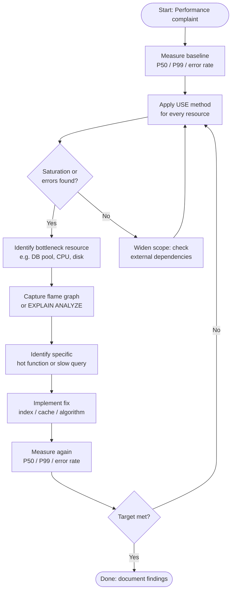

# [BEE-303] Profiling and Bottleneck Identification

:::info
Measure first. Profile the right thing. Fix the actual bottleneck.
:::

## Context

Performance problems are rarely where you expect them. Developers frequently spend time optimizing code paths that contribute less than 1% of total latency, while the real bottleneck—a saturated database connection pool, a missing index, a blocking lock—goes untouched.

The discipline of profiling and bottleneck identification exists to replace guessing with measurement. It provides a systematic process: establish a baseline, locate the constraint, confirm it with a profiler, fix it, and verify the improvement.

## Principle

**Measure before you optimize. Identify the bottleneck precisely before writing a single line of fix.**

Optimization effort that is not directed at the actual bottleneck produces no observable improvement—this is the core implication of Amdahl's Law.

## Key Concepts

### CPU-bound vs. I/O-bound

The first classification to make when a service is slow:

| Characteristic | CPU-bound | I/O-bound |
|---|---|---|
| CPU utilization | High (near 100%) | Low to moderate |
| Threads state | Runnable / running | Waiting (blocked on I/O) |
| Typical causes | Computation, serialization, regex, crypto | Disk reads, network calls, DB queries |
| Fix direction | Algorithm improvement, parallelism | Caching, async I/O, connection pooling, indexing |

A service can be both: the hot path may be CPU-bound while background jobs are I/O-bound. Profile each independently.

### The USE Method

Brendan Gregg's **USE method** ([brendangregg.com/usemethod](https://www.brendangregg.com/usemethod.html)) provides a systematic checklist for identifying bottlenecks at the infrastructure level.

For **every resource** (CPU, memory, disk, network, DB connection pool, thread pool):

- **Utilization** — What percentage of time is the resource busy servicing work?
  - Example: DB connection pool is 95% utilized (19 of 20 connections in use)
  - High utilization alone is not a problem, but it signals risk
- **Saturation** — Is work queuing up because the resource cannot keep up?
  - Example: New DB requests are queuing; average wait time in pool is 400 ms
  - Any non-zero saturation is a problem
- **Errors** — Are error events occurring?
  - Example: Connection pool is throwing `timeout acquiring connection` exceptions
  - Errors often signal silent saturation before metrics catch it

Work through the USE checklist top-down (CPU → memory → storage I/O → network → application resources) to find the first resource with a non-trivial saturation or error reading. That resource is the bottleneck.

### Flame Graphs

A flame graph ([brendangregg.com/flamegraphs](https://www.brendangregg.com/flamegraphs.html)) is a visualization of stack trace samples. The profiler interrupts the process thousands of times per second, captures the call stack, and aggregates the results.

**How to read a flame graph:**

- The **x-axis** represents the aggregated sample count (width ∝ time spent). It is NOT time-ordered left to right.
- The **y-axis** represents call stack depth. The bottom frame is the entry point; frames above are callees.
- **Wide bars** are the hotspots. A wide bar at the top of a tower means that function was executing (on-CPU) for a large fraction of the profiling window. A wide bar in the middle means descendant calls aggregate to that width.
- To investigate: find the widest top-level bar, zoom in, read the call chain downward to understand why that code is hot.

The ACM Queue article by Gregg describes the technique in detail: [queue.acm.org/detail.cfm?id=2927301](https://queue.acm.org/detail.cfm?id=2927301).

### Profiling Types

| Type | What it measures | Tools |
|---|---|---|
| CPU profiling | Time spent executing code (on-CPU) | async-profiler (JVM), pprof (Go), py-spy (Python), perf (Linux) |
| Memory / heap profiling | Allocation rate, live object size, GC pressure | async-profiler heap mode, Valgrind, Go pprof heap |
| I/O profiling | Disk read/write latency and throughput | iostat, eBPF, strace |
| Lock contention profiling | Time threads spend waiting for locks/mutexes | async-profiler lock mode, jstack, thread dump analysis |
| Off-CPU profiling | Time spent blocked (not executing) | eBPF off-CPU analysis, async-profiler wall-clock mode |

### Sampling vs. Instrumentation Profiling

**Sampling profilers** interrupt the program at a fixed interval (e.g., 99 Hz), capture the stack, and aggregate. They have low overhead (typically < 2%) and are safe in production. The tradeoff is statistical: they may miss very short-lived functions.

**Instrumentation profilers** insert hooks at every function entry and exit. They capture exact call counts and durations but add significant overhead (sometimes 10×). Use them in staging, not production.

Rule of thumb: start with sampling in production to find the general area, then switch to instrumentation in staging to get exact counts.

### Slow Query Analysis

For I/O-bound services backed by a relational database, slow queries are the most common bottleneck. The investigation workflow:

1. **Find slow queries** — Enable slow query log (MySQL: `slow_query_log`, PostgreSQL: `log_min_duration_statement`). Alternatively, query `pg_stat_statements` or the Performance Schema.
2. **Explain the plan** — Run `EXPLAIN ANALYZE <query>` to see the actual execution plan with row estimates vs. actuals and time per node.
3. **Look for sequential scans** — `Seq Scan` on a large table where an index scan is expected indicates a missing or unused index.
4. **Check for N+1 patterns** — A single API call that triggers hundreds of queries is a structural problem, not an index problem.
5. **Add or fix the index** — See [BEE-121](../Data Management/121.md) for indexing principles.

### Percentile-based Analysis: P50 vs. P99

Always analyze latency by percentile distribution, not averages.

| Metric | Meaning | Who it affects |
|---|---|---|
| P50 (median) | Half of requests complete faster than this | The "typical" user |
| P95 | 95% of requests complete faster than this | Power users, batch jobs |
| P99 | 99% of requests complete faster than this | Your worst-affected 1% |
| P99.9 | The "tail" — 0.1% of requests | Often correlates with retries cascading into outages |

**Optimizing P50 while ignoring P99 is a common and dangerous mistake.** A P50 of 50 ms with a P99 of 5 seconds means 1% of your users—potentially thousands per hour—are experiencing a broken service.

See [BEE-321](../Reliability and Observability/321.md) for SLO definitions based on percentile targets.

### Amdahl's Law

Amdahl's Law states that the speedup from optimizing a portion of a system is limited by the fraction of time that portion is actually used.

> If a component accounts for 5% of total request time, even making it infinitely fast produces at most a 5.3% overall improvement.

Practical implication: always profile to find the component with the highest contribution to total latency (P99), then optimize that component. Optimizing anything else is largely wasted effort.

## Bottleneck Identification Workflow



## Worked Example: P99 Regression Investigation

**Symptom:** API endpoint `/api/orders` P99 rises from 80 ms to 2000 ms after a deployment. P50 is unchanged at 45 ms.

**Step 1 — Apply USE method**

| Resource | Utilization | Saturation | Errors |
|---|---|---|---|
| CPU | 30% | None | None |
| DB connection pool | 95% | Queue depth: 12 | Occasional timeout |
| Memory | 55% | None | None |
| Network | 15% | None | None |

Finding: DB connection pool is saturated. The bottleneck is database, not CPU.

**Step 2 — Find the slow query**

Query `pg_stat_statements` ordered by `mean_exec_time DESC`. The query `SELECT * FROM order_items WHERE customer_id = $1 AND status = 'pending'` appears with a mean exec time of 1800 ms and 0 index scans.

**Step 3 — Explain the plan**

```sql
EXPLAIN ANALYZE
SELECT * FROM order_items
WHERE customer_id = 42 AND status = 'pending';
```

Output shows `Seq Scan on order_items (cost=0.00..98000 rows=850000)`. The `order_items` table has 850,000 rows and no index on `(customer_id, status)`.

**Step 4 — Add the index**

```sql
CREATE INDEX CONCURRENTLY idx_order_items_customer_status
ON order_items (customer_id, status);
```

**Step 5 — Measure again**

| Metric | Before | After |
|---|---|---|
| P50 | 45 ms | 40 ms |
| P99 | 2000 ms | 95 ms |
| DB pool utilization | 95% | 35% |

The missing composite index was the bottleneck. CPU optimization would have had no measurable effect.

## Common Mistakes

1. **Optimizing without measuring** — Developers guess the bottleneck based on intuition and optimize the wrong thing. Always measure first; the bottleneck is rarely obvious.

2. **Optimizing P50 instead of P99** — Improving the median while ignoring tail latency creates the illusion of improvement. SLOs and user experience are determined by the tail.

3. **Profiling in development, not production** — Development workloads (small datasets, single user, no concurrency) have fundamentally different bottlenecks than production. Profile with production-representative traffic.

4. **Ignoring Amdahl's Law** — Spending two weeks making a component 10× faster when it accounts for 3% of total latency yields a 3% improvement at best. Always optimize the biggest contributor.

5. **One-time profiling instead of continuous monitoring** — A bottleneck fixed today can reappear as data grows or traffic patterns change. Continuous profiling (e.g., Pyroscope, Elastic APM, Datadog Continuous Profiler) provides ongoing visibility.

## Related BEPs

- [BEE-121](../Data Management/121.md) — Indexing strategy for query optimization
- [BEE-125](../Data Management/125.md) — Query optimization principles
- [BEE-320](../Reliability and Observability/320.md) — Observability metrics design
- [BEE-321](../Reliability and Observability/321.md) — SLO definition and percentile targets

## References

- Brendan Gregg, [Flame Graphs](https://www.brendangregg.com/flamegraphs.html)
- Brendan Gregg, [The USE Method](https://www.brendangregg.com/usemethod.html)
- Brendan Gregg, [The Flame Graph — ACM Queue](https://queue.acm.org/detail.cfm?id=2927301)
- Apica, [Profiling vs Tracing in OpenTelemetry](https://www.apica.io/blog/profiling-vs-tracing-in-opentelemetry/)
- Grafana, [How profiling and tracing work together](https://grafana.com/docs/grafana/latest/datasources/pyroscope/profiling-and-tracing/)
