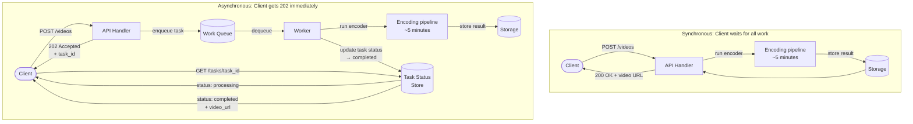

# [BEP-305] Asynchronous Processing and Work Queues

:::info
Move expensive operations off the request path. Return immediately, process in the background, let clients observe progress.
:::

## Context

Every HTTP request occupies a thread (or a goroutine, or a connection slot) from the moment it arrives until the moment the response is sent. For requests that complete in under 100 ms, this is fine — the thread is released quickly and is available for the next request. For requests that trigger long-running work — encoding a video, generating a PDF, sending 50,000 emails, running a machine-learning inference job — keeping the client waiting creates serious problems.

A user who uploads a video should not sit in front of a spinner for five minutes waiting for the encoding pipeline to finish. A server processing a batch import should not hold an HTTP connection open for ten minutes. An email sending API should not block the calling service while it dials 50 SMTP servers one by one.

Asynchronous processing solves this by decoupling the moment work is _accepted_ from the moment it is _performed_. The server acknowledges the request immediately, places work on a queue, and releases the connection. One or more background workers dequeue and execute the work independently of the HTTP request lifecycle.

This article covers when to choose async over sync, the core work-queue pattern, task types, status tracking, prioritization, delayed execution, retries, idempotency, the fan-out pattern, and the request-reply polling pattern.

## Principle

**Offload work that does not need to be finished before the response is sent. Accept work synchronously; execute it asynchronously; give clients a way to observe the result.**

## Key Concepts

### Synchronous vs. Asynchronous Request Processing

In synchronous processing, the server does all the work inline with the HTTP request. The client waits throughout.

In asynchronous processing, the server validates the request, persists the task descriptor to a queue, and returns immediately — typically with an HTTP `202 Accepted` and a `task_id`. The client can check status by polling a task endpoint or by receiving a webhook callback when the work is done.

| Dimension | Synchronous | Asynchronous |
|---|---|---|
| Response time | Long (blocks on all work) | Short (returns on acceptance) |
| Thread utilization | Thread held for full job duration | Thread released immediately |
| UX during long jobs | Spinner, timeout risk | Progress polling or notification |
| Error visibility | Error surfaces in HTTP response | Error surfaces in task status |
| Idempotency requirement | Depends on operation | Mandatory (retries happen) |

Use synchronous processing for fast operations where the result is needed immediately (user authentication, product lookup, adding an item to a cart). Use asynchronous processing for slow, resource-intensive, or externally-dependent operations where holding the connection open is unreasonable.

### The Work Queue Pattern

The fundamental building block is the **producer–queue–consumer** model:

1. **Producer** (the API handler) validates the incoming request and enqueues a task descriptor: a small, serializable record containing everything the worker needs (job type, arguments, metadata, a unique idempotency key).
2. **Queue** (a durable message broker: Redis, RabbitMQ, SQS, or a database-backed queue table) stores tasks and ensures at-least-once delivery to exactly one consumer.
3. **Consumer / Worker** (a separate process or thread pool) dequeues tasks, executes them, and records the outcome.

Producers and consumers are decoupled. Producers do not know which worker will execute the task or when. Workers do not know which producer enqueued a task. This decoupling allows independent scaling of producers and consumers.

### Task Types

| Type | Description | Example |
|---|---|---|
| **Fire-and-forget** | Caller does not need to know the outcome | Sending a welcome email |
| **With polling** | Caller can query status via a task endpoint | Video encoding job |
| **With callback** | Server pushes result to a webhook when done | Stripe payment webhooks |
| **Scheduled / delayed** | Task executes at a future time or on a recurring schedule | Sending a reminder 24 hours after signup |

Most work-queue systems support all four types. Polling is the most universally applicable because it does not require the client to expose a callback endpoint.

### Task Status Tracking

For any task type other than pure fire-and-forget, the system must record and expose task state. Clients need to distinguish between "pending", "in progress", "completed", and "failed".

Minimal task record schema:

| Field | Type | Purpose |
|---|---|---|
| `task_id` | UUID | Unique identifier returned to caller |
| `type` | string | Job type (e.g., `video.encode`) |
| `status` | enum | `pending`, `processing`, `completed`, `failed` |
| `created_at` | timestamp | When the task was accepted |
| `updated_at` | timestamp | Last state transition |
| `result` | JSON | Output data on success |
| `error` | string | Error message on failure |
| `attempts` | integer | Number of execution attempts |

Clients poll `GET /tasks/{task_id}` until `status` reaches a terminal state (`completed` or `failed`). Use exponential backoff on poll interval to avoid hammering the status endpoint.

### Task Prioritization

Not all tasks are equally urgent. A queue that treats all work uniformly will allow low-priority batch jobs to crowd out time-sensitive operations. Task prioritization is achieved by maintaining separate queues per priority tier and routing workers preferentially to higher-priority queues.

Common tiers:

- **Critical**: Real-time operations. Password reset emails, 2FA codes. Target latency: seconds.
- **High**: User-initiated interactive work. Report generation, document export. Target latency: tens of seconds.
- **Normal**: Background processing. Image resizing, data enrichment. Target latency: minutes.
- **Low**: Bulk or batch work. Analytics aggregation, bulk export. Target latency: hours acceptable.

Workers poll queues in priority order: check the critical queue first; if empty, check high; and so on. This ensures that a flood of low-priority tasks does not delay critical ones.

### Delayed and Scheduled Tasks

Some work should not execute immediately but at a specified future time. Examples: send a follow-up email 3 days after signup; retry a failed API call in 30 minutes; run a daily cleanup job at 02:00 UTC.

Two common implementations:

1. **Delayed visibility**: The task is enqueued with a `not_before` timestamp. The broker holds it invisible until that time, then makes it available to workers. SQS message delay and Celery `eta` parameter work this way.
2. **Scheduler process**: A separate scheduler process (cron-like) emits tasks to the queue at configured times. The queue workers execute them immediately upon dequeue. This is easier to reason about for recurring jobs.

### Retries and Idempotency

Workers fail. Network calls time out. Downstream services return 503. A robust task queue must support automatic retries with backoff.

**Retry strategy:**

- On failure, mark the task as retryable and re-enqueue it with an exponentially increasing delay: 30 s, 2 min, 8 min, 30 min, 2 h.
- Set a maximum retry count (e.g., 5 attempts). Tasks that exhaust retries are moved to the **dead-letter queue (DLQ)**.
- Add random jitter to retry intervals to prevent retry storms when many tasks fail simultaneously.

**Idempotency is mandatory for retried tasks.** If a worker executes a task, successfully completes the work, but crashes before acknowledging the queue — the queue will redeliver the task. The worker must handle re-execution without creating duplicates.

Design idempotent tasks by:

- Using a unique `idempotency_key` (derived from the original request) to detect and skip duplicate executions.
- Structuring side effects as upserts rather than inserts.
- Checking preconditions before mutating state (e.g., "if not already encoded").

### Dead-Letter Queue

The DLQ is a separate queue where tasks land after exhausting all retry attempts. It serves several purposes:

- Prevents permanently failing tasks from blocking queue capacity.
- Provides a durable record of all failures for audit and incident investigation.
- Enables manual inspection, replay, or discard of failed tasks after fixing the underlying bug.

Monitor DLQ depth as an alert signal. A growing DLQ indicates a systematic bug or an unavailable downstream dependency.

### Fan-Out: One Task Triggers Many

Some operations require parallel processing across many units of work. A single "send newsletter" request should not process 100,000 subscribers in a single task. Instead, a **fan-out** pattern is used:

1. A coordinator task is enqueued for the high-level operation (e.g., `newsletter.dispatch`, batch_id: 42).
2. The coordinator dequeues, reads the list of targets, and enqueues one child task per target (or per small batch).
3. Individual workers process child tasks in parallel.
4. An optional aggregator task collects results and marks the parent as complete.

Fan-out provides natural parallelism, isolates per-item failures (one subscriber's email can fail and be retried without affecting others), and distributes load across all available workers.

### Backpressure and Queue Bounds

If producers enqueue tasks faster than workers can process them, the queue grows without bound. In memory-backed queues (e.g., in-process job queues, or naively unbounded Redis lists), this leads to out-of-memory crashes or cascading failures.

Apply backpressure by:

- Setting a maximum queue depth. When the queue is full, return `HTTP 503 Service Unavailable` to the producer with a `Retry-After` header rather than accepting work you cannot process.
- Monitoring queue depth and worker utilization. Provision additional workers (auto-scaling) when depth exceeds a threshold.
- Using a durable, external broker (Redis, SQS, RabbitMQ) rather than in-process queues so that a process restart does not lose all queued work.

See [BEP-225](../Resilience and Reliability/225.md) for backpressure patterns.

## Sync vs. Async Processing Flow



## Worked Example: Video Upload API

**Scenario:** A user uploads a video. Encoding takes 2–8 minutes depending on length and resolution. The API must remain responsive.

### Synchronous (do not do this)

```
POST /videos
→ [user waits 5 minutes]
→ 200 OK { "url": "https://cdn.example.com/v/abc123.mp4" }
```

Problems: HTTP timeout at 60 s (nginx default). Connection slot held for 5 minutes. No progress visibility. If the worker crashes mid-encoding, the client gets a 500 with no recovery path.

### Asynchronous (correct approach)

**Step 1 — Submit**

```
POST /videos
Content-Type: multipart/form-data
[video file bytes]

→ 202 Accepted
{
  "task_id": "t_7kXm2p9q",
  "status": "pending",
  "poll_url": "/tasks/t_7kXm2p9q"
}
```

The API handler validates the upload, stores the raw file, and enqueues a `video.encode` task. It returns in under 200 ms.

**Step 2 — Poll (immediately after)**

```
GET /tasks/t_7kXm2p9q

→ 200 OK
{
  "task_id": "t_7kXm2p9q",
  "status": "processing",
  "progress": 34,
  "created_at": "2026-04-07T10:00:00Z",
  "updated_at": "2026-04-07T10:02:14Z"
}
```

**Step 3 — Poll (after a few minutes)**

```
GET /tasks/t_7kXm2p9q

→ 200 OK
{
  "task_id": "t_7kXm2p9q",
  "status": "completed",
  "result": {
    "url": "https://cdn.example.com/v/abc123.mp4",
    "duration_s": 182,
    "resolution": "1920x1080"
  },
  "created_at": "2026-04-07T10:00:00Z",
  "updated_at": "2026-04-07T10:05:47Z"
}
```

**Step 4 — Failure case**

```
GET /tasks/t_7kXm2p9q

→ 200 OK
{
  "task_id": "t_7kXm2p9q",
  "status": "failed",
  "error": "Unsupported codec: av1 with HDR requires ffmpeg >= 6.0",
  "attempts": 3,
  "created_at": "2026-04-07T10:00:00Z",
  "updated_at": "2026-04-07T10:08:01Z"
}
```

The client can surface a meaningful error to the user and offer a retry.

### Worker Implementation (pseudocode)

```python
def process_video_encode_task(task):
    # Idempotency check
    if video_already_encoded(task.idempotency_key):
        mark_task_completed(task.id, existing_result)
        return

    # Update status to processing
    update_task_status(task.id, "processing")

    try:
        # Execute work
        output_url = encode_video(task.args.raw_file_path)
        store_output(task.args.video_id, output_url)

        # Mark complete
        mark_task_completed(task.id, {"url": output_url})

    except RetryableError as e:
        # Re-enqueue with backoff; do not mark failed yet
        schedule_retry(task, delay=backoff(task.attempts))

    except PermanentError as e:
        # Exhausted retries or unrecoverable — mark failed
        mark_task_failed(task.id, str(e))
        send_to_dlq(task)
```

## Common Mistakes

1. **Making everything async** — Async adds latency to the happy path (polling roundtrips), increases system complexity, and makes debugging harder. Fast operations (< 500 ms) that return results the client needs immediately should stay synchronous. Reserve async for work that is genuinely slow, resource-intensive, or externally dependent.

2. **No task status visibility** — Returning a `202 Accepted` without providing a way to check the outcome leaves clients unable to detect failures or act on results. Every async operation that the client cares about must have a queryable status endpoint. Fire-and-forget is only appropriate for truly one-way notifications (e.g., analytics events, audit logs).

3. **Task queue without dead-letter handling** — Without a DLQ, tasks that fail all retries silently disappear. There is no audit trail, no alert, and no way to replay them after a bug fix. Always route exhausted tasks to a DLQ and alert on DLQ depth.

4. **Tasks that are not idempotent** — At-least-once delivery is the norm for work queues: a task may be delivered more than once if a worker crashes after processing but before acknowledging. If your task is not idempotent (e.g., it unconditionally inserts a row or charges a credit card), each duplicate delivery creates duplicate side effects. Design tasks to be safe to execute multiple times with the same inputs.

5. **Unbounded queue depth** — If the worker pool cannot keep up with the producer, the queue grows indefinitely. In-memory queues fill up and crash the process. External queues accumulate gigabytes of backlog. Monitor queue depth. Apply backpressure (reject or slow producers) when depth exceeds acceptable thresholds. Scale out workers when sustained throughput is needed.

## Related BEPs

- [BEP-220](../Messaging and Event-Driven/220.md) — Messaging and event-driven architecture
- [BEP-221](../Messaging and Event-Driven/221.md) — Dead-letter queues
- [BEP-225](../Resilience and Reliability/225.md) — Backpressure patterns
- [BEP-241](../Concurrency and Async/241.md) — Worker pools

## References

- Microsoft Azure, [Best Practices for Background Jobs](https://learn.microsoft.com/en-us/azure/architecture/best-practices/background-jobs)
- Microsoft Azure Well-Architected Framework, [Recommendations for developing background jobs](https://learn.microsoft.com/en-us/azure/well-architected/design-guides/background-jobs)
- Full Stack Python, [Task Queues](https://www.fullstackpython.com/task-queues.html)
- Celery Project, [Tasks — Celery documentation](https://docs.celeryq.dev/en/stable/userguide/tasks.html)
- LittleHorse, [Integration Patterns IV: Retries and Dead-Letter Queues](https://littlehorse.io/blog/retries-and-dlq)
- DEV Community, [Queue-Based Exponential Backoff: A Resilient Retry Pattern for Distributed Systems](https://dev.to/andreparis/queue-based-exponential-backoff-a-resilient-retry-pattern-for-distributed-systems-37f3)
- DEV Community, [Designing a Job Queue System: Sidekiq and Background Processing](https://dev.to/sgchris/designing-a-job-queue-system-sidekiq-and-background-processing-2oln)
