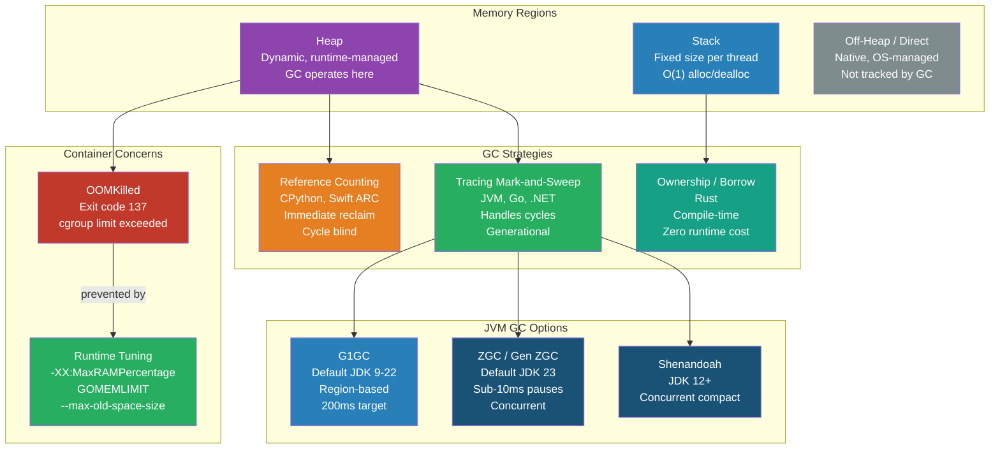

# [BEE-495] Memory Management and Garbage Collection

:::info
Every backend runtime reclaims memory through one of three strategies — reference counting, tracing collection, or compile-time ownership — and each imposes distinct throughput, latency, and operability trade-offs that matter as much as algorithm choice.
:::

## Context

Memory management is invisible until it is not. A Java service that pauses for 400 ms during a full GC, a Go binary that doubles its heap after a traffic spike and never returns it, a Python process that leaks through reference cycles — these are not theoretical concerns. They are the leading cause of unexpected latency spikes and OOMKilled pods in production Kubernetes environments.

The problem was present from the earliest high-level languages. John McCarthy's 1960 Lisp paper described the first mark-and-sweep collector. Reference counting appeared in early ALGOL descendants. Over the following six decades, the field produced a body of theory that is now codified in Richard Jones, Antony Hosking, and Eliot Moss's *The Garbage Collection Handbook* (2011, 2023 second edition), the authoritative reference for practitioners.

Modern backend engineers typically work in three runtimes with fundamentally different approaches: the JVM (tracing, generational, with a history of production-impacting GC pauses), Go (tricolor concurrent mark-and-sweep, sub-millisecond stop-the-world targets), and CPython (reference counting with a supplemental cyclic collector). Rust eliminates GC entirely via compile-time ownership. Each choice has implications not just for peak throughput but for tail latency, container sizing, and production observability.

OOMKilled (Linux out-of-memory killer, exit code 137) is the most common production failure related to memory. It occurs when a container exceeds its cgroup memory limit. Understanding the allocation and reclamation lifecycle of the runtime you are operating is prerequisite to preventing it.

## Memory Regions

Every process operates with two primary memory regions:

**Stack**: fixed-size (typically 1–8 MB per thread/goroutine), LIFO-managed by the CPU, holds stack frames, local variables, and return addresses. Allocation and deallocation are O(1) pointer arithmetic. Stack overflows (unbounded recursion) crash processes immediately.

**Heap**: dynamically sized, managed by the runtime or allocator, holds objects whose lifetimes extend beyond a single function call. Heap allocation is slower and requires the runtime to track liveness. All GC strategies operate on the heap.

Go goroutines start with 2–8 KB stacks that grow and shrink dynamically — a key reason Go can support millions of concurrent goroutines where threads cannot.

## GC Strategy Families

### Reference Counting

Every object carries a counter of references pointing to it. When the counter reaches zero, the object is freed immediately.

**Used by**: CPython, Swift (ARC), PHP, Perl

**Advantages**: predictable, incremental reclamation; low pause times; immediate object finalization.

**Fundamental limitation**: cannot collect cycles. If A references B and B references A, both counters remain non-zero forever even when neither is reachable from the program root. CPython adds a supplemental cyclic GC (generational, three generations) to handle this. The cyclic collector runs when the number of allocations minus deallocations exceeds a threshold (configurable via `gc.set_threshold`).

CPython 3.12 introduces four generations for the cyclic collector and a new "immortal" object category for frequently-used constants, reducing unnecessary reference count churn in multi-threaded programs. CPython 3.13 adds an experimental free-threaded mode that removes the GIL, which requires a different reference counting strategy.

```python
import gc

# Inspect CPython GC thresholds (new object count deltas triggering each generation)
print(gc.get_threshold())  # default: (700, 10, 10)

# Force a full cyclic GC collection
gc.collect()

# Diagnose a leak: objects in generation 2 that survived many collections
print(len(gc.get_objects(generation=2)))
```

### Tracing (Mark-and-Sweep)

The collector periodically traverses the object graph from a set of roots (stack variables, globals, registers), marks all reachable objects, then sweeps unreachable ones. Cycles are handled naturally because reachability, not reference count, determines liveness.

**Used by**: JVM, Go, .NET CLR, V8 (Node.js), Ruby (YJIT era)

**Generational hypothesis**: most objects die young. Splitting the heap into a young generation (short-lived objects, collected frequently) and one or more old generations (long-lived objects, collected rarely) dramatically reduces collection overhead. The JVM generational design (Eden → Survivor → Old) embodies this.

#### JVM GC Evolution

| Collector | Default Since | Pause Model | Target Use Case |
|---|---|---|---|
| Serial GC | JDK 1 | Stop-the-world | Single-core, embedded |
| CMS | JDK 6 | Mostly concurrent | Low-latency (deprecated JDK 9, removed JDK 14) |
| G1GC | JDK 9 | Region-based, bounded pauses | General purpose (default JDK 9–22) |
| ZGC | JDK 21 (stable) | Sub-10 ms target; Generational ZGC | Low-latency, large heaps |
| Shenandoah | JDK 12 | Sub-10 ms, concurrent compaction | Red Hat's alternative to ZGC |

**G1GC** divides the heap into equal-sized regions (1–32 MB each). It collects regions with the most garbage first ("Garbage First"), bounding pause time via the `-XX:MaxGCPauseMillis` target (default 200 ms). It is the practical default for most services today.

**Generational ZGC** (default in JDK 23) achieves sub-10 ms pauses by performing nearly all collection work concurrently with application threads. Load barriers intercept pointer reads to ensure the mutator always sees a consistent heap. The GC Guide from ACM (Dann Fröberg and Mikael Vidstedt, 2022) shows ZGC reducing p99 pause times by 75% vs. G1GC on large heap workloads.

```bash
# G1GC tuning (reasonable starting point)
-XX:+UseG1GC
-XX:MaxGCPauseMillis=100
-XX:G1HeapRegionSize=16m
-Xms4g -Xmx4g          # equal min/max avoids resize pauses
-XX:MaxRAMPercentage=75.0   # container-aware: use 75% of cgroup limit

# Enable GC logging for production observability
-Xlog:gc*:file=/var/log/app/gc.log:time,uptime:filecount=5,filesize=20m
```

LinkedIn Engineering (Cuong Chi and Mingfeng Zhou, 2013) documented reducing p99.9 latency from 100 ms to 60 ms on their serving tier by migrating from CMS to G1GC with explicit region size tuning for their object size distribution.

#### Go GC

Go uses a tricolor concurrent mark-and-sweep collector. The tricolor invariant (white = unknown, grey = discovered but children not yet scanned, black = fully scanned) allows the collector to run concurrently with the mutator without a full stop-the-world pause. Stop-the-world phases exist but are bounded to microseconds for stack scanning.

**`GOGC`** (default 100) controls the GC trigger: the next GC fires when live heap grows by `GOGC%` from the previous collection. `GOGC=50` halves the trigger threshold (more frequent GC, lower peak memory); `GOGC=200` doubles it (less frequent GC, higher peak memory, more throughput).

**`GOMEMLIMIT`** (Go 1.19+, critical for containers) sets a soft memory ceiling. The GC will run more aggressively to stay under the limit before the OOM killer intervenes. Set to ~90% of the container memory limit:

```bash
# Dockerfile / Kubernetes env
GOMEMLIMIT=1800MiB   # for a 2 GiB container limit
GOGC=100             # keep default trigger
```

Go's escape analysis determines at compile time whether a variable can live on the stack or must be heap-allocated. Variables that escape (referenced after the function returns, captured by closures, stored in interfaces) go to the heap. Use `go build -gcflags="-m"` to inspect escape decisions and minimize unnecessary heap pressure.

```bash
# Diagnose Go heap usage
go tool pprof http://localhost:6060/debug/pprof/heap

# View allocation hot paths
go tool pprof -alloc_space http://localhost:6060/debug/pprof/alloc
```

### Compile-Time Ownership (Rust)

Rust enforces memory safety at compile time through an ownership and borrow checker system — no GC, no reference counting (unless explicitly opted into via `Rc<T>` / `Arc<T>`), no runtime overhead.

Every value has exactly one owner. When the owner goes out of scope, the value is dropped (freed). Borrows (references) have lifetimes the compiler verifies statically. The compiler rejects programs with use-after-free, double-free, or data race patterns.

The result is deterministic, zero-overhead memory management — at the cost of a steeper learning curve and a strict compilation gate. Rust is appropriate for latency-sensitive services where GC pause predictability is non-negotiable.

## Off-Heap and Direct Memory

Some workloads allocate memory outside the GC-managed heap:

- **Java `ByteBuffer.allocateDirect()`**: allocates native memory, not tracked by the heap. Used by Netty's `PooledByteBufAllocator` for I/O buffers. Not collected by the GC; freed when the associated `Cleaner` runs (requires `sun.misc.Cleaner` or `java.lang.ref.Cleaner` finalization). Direct memory leaks do not show up in heap metrics — only in native memory tooling (`NativeMemoryTracking`, `jcmd`).
- **Go `cgo` allocations**: memory allocated via C libraries is not tracked by the Go GC.
- **mmap**: file-backed memory maps are managed by the OS page cache, not the language runtime.

Off-heap allocation bypasses GC overhead but requires manual lifecycle management. A direct memory leak can OOMKill a container while heap usage appears healthy.

## Container Sizing and OOMKilled

`OOMKilled` (exit code 137) occurs when the Linux OOM killer terminates a process that exceeds its cgroup memory limit. It is the most common production memory failure in Kubernetes environments.

**MUST set memory limits on all containers.** Without a limit, a memory-leaking or under-tuned service can consume all node memory, causing cascading evictions.

**MUST configure the runtime to be container-aware:**

| Runtime | Configuration | Recommendation |
|---|---|---|
| JVM | `-XX:MaxRAMPercentage=75.0` | Use 75% of cgroup limit for heap; rest for metaspace, off-heap, OS |
| Go | `GOMEMLIMIT=<90% of limit>` | Soft ceiling; Go GC will run aggressively before OOM |
| Node.js | `--max-old-space-size=<MB>` | Set to ~75% of container limit |
| Python | No runtime flag; use memory profiling | `tracemalloc`, `memory_profiler` |

**MUST NOT rely on JVM default heap sizing in containers.** Before Java 8u191/Java 10, the JVM read total host memory (`/proc/meminfo`), not cgroup limits, and could allocate a heap larger than the container limit — OOMKilling the container immediately on startup or first GC cycle.

## Visual



## Common Mistakes

**Running JVM services in containers without `-XX:MaxRAMPercentage`**. The JVM defaults to sizing the heap based on host memory. In a container with a 2 GiB limit on a 128 GiB host, the JVM may try to allocate a 32 GiB heap, triggering an immediate OOMKill. Always set `-XX:MaxRAMPercentage=75.0` or an explicit `-Xmx`.

**Setting equal `-Xms` and `-Xmx` without understanding the implication**. Equal min/max avoids heap resize pauses (a valid production optimization) but means the JVM claims all that memory from the OS immediately on startup, even if the workload is idle. For memory-constrained environments, a lower `-Xms` may be appropriate at the cost of potential resize pauses during startup.

**Ignoring `GOMEMLIMIT` in Go services**. Go's default behavior without a memory limit is to let the heap grow unboundedly until the OS runs out. In a container, this means the OOM killer fires before the GC has a chance to collect. `GOMEMLIMIT` is a safety net — set it to 90% of the container limit for all Go services deployed in containers.

**Assuming heap memory metrics are the whole picture**. Direct memory (Java NIO, Netty), mapped files, thread stacks, and native library allocations all consume RSS without appearing in heap metrics. A container can OOMKill while heap usage looks healthy. Monitor RSS, not just heap, in production.

**Tuning GC parameters without profiling first**. Changing `-XX:MaxGCPauseMillis`, `GOGC`, or GC generation sizes before establishing a baseline from GC logs and profiling data is speculation. Measure GC pause times and allocation rates; then tune with a specific objective.

**Creating excessive goroutine or thread count**. Goroutines are cheap (2 KB initial stack), but creating millions of long-lived goroutines with captured closures creates heap pressure from the stack payloads and closure objects. Use worker pools (BEE-244) to bound concurrency.

## Related BEEs

- [BEE-240](../Concurrency/240.md) -- Threads vs Processes vs Coroutines: goroutine and thread memory cost; OS thread stacks vs. goroutine stacks
- [BEE-244](../Concurrency/244.md) -- Producer-Consumer and Worker Pool Patterns: bounding goroutine/thread count to control memory pressure
- [BEE-303](303.md) -- Profiling and Bottleneck Identification: pprof, async-profiler, py-spy for heap and allocation profiling
- [BEE-364](../CI,CD and DevOps/364.md) -- Container Fundamentals: cgroup memory limits, OOMKilled, container resource model

## References

- [Dann Fröberg and Mikael Vidstedt. ZGC: The Next Generation Low-Latency Garbage Collector — ACM SIGPLAN (2022)](https://dl.acm.org/doi/10.1145/3538532)
- [Cuong Chi and Mingfeng Zhou. Garbage Collection Optimization for High-Throughput and Low-Latency Java Applications — LinkedIn Engineering (2013)](https://engineering.linkedin.com/garbage-collection/garbage-collection-optimization-high-throughput-and-low-latency-java-applications)
- [A Guide to the Go Garbage Collector — Go Team](https://tip.golang.org/doc/gc-guide)
- [Richard Jones, Antony Hosking, Eliot Moss. The Garbage Collection Handbook — Chapman & Hall/CRC (2011)](https://www.gchandbook.org)
- [The Rust Programming Language: Understanding Ownership — rust-lang.org](https://doc.rust-lang.org/book/ch04-01-what-is-ownership.html)
- [OOMKilled in Kubernetes: The Hidden Memory Leaks You're Missing — UnixArena (2025)](https://unixarena.com/2025/04/oomkilled-in-kubernetes-the-hidden-memory-leaks-youre-missing.html)
