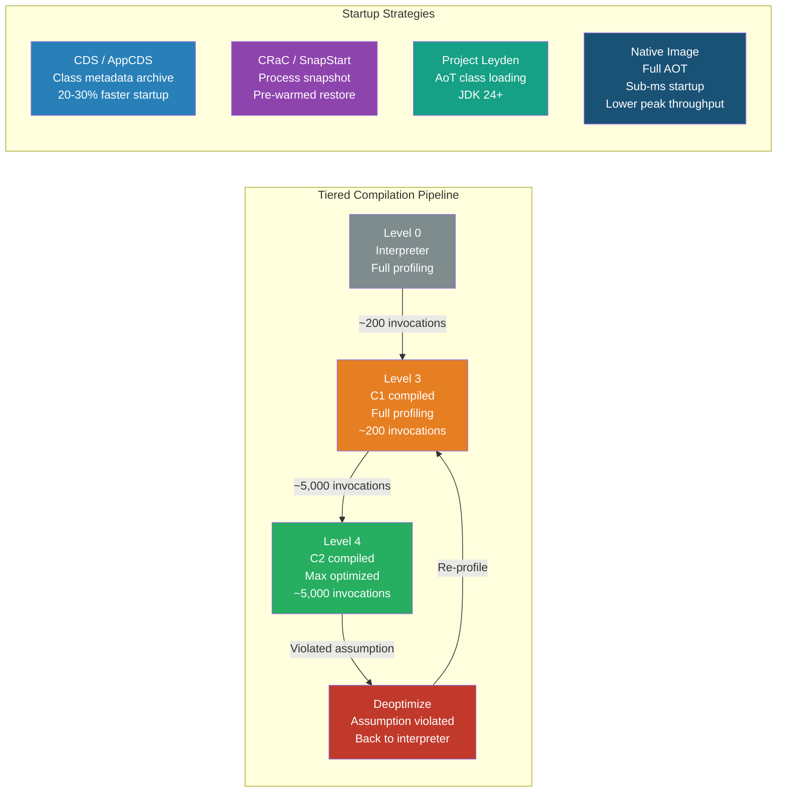

# [BEE-496] JVM JIT Compilation and Application Warm-Up

:::info
The JVM's Just-In-Time compiler starts slow and gets faster as it observes actual runtime behavior — understanding this pipeline explains why Java services suffer cold-start latency spikes and what to do about them.
:::

## Context

Java's performance reputation has a paradox: the JVM routinely matches or beats native C++ programs at steady-state throughput, yet freshly started Java services frequently show 10–100x worse latency than they will after a few minutes of traffic. That gap is explained by the JIT compiler's adaptive compilation model and is the source of cold-start problems that have grown more acute as container-based deployments and auto-scaling became mainstream.

The two-compiler architecture at the heart of HotSpot — C1 (the "client" compiler) for fast, moderately-optimized code and C2 (the "server" compiler) for aggressively optimized code — was introduced in Java 7 and became the default "tiered compilation" mode in Java 8. Tiered compilation was designed to provide acceptable startup performance without sacrificing the throughput that requires profiling-guided optimization. The Microsoft for Java Developers engineering team documented the five levels of this pipeline in detail; Aleksey Shipilev (Red Hat, OpenJDK committer) has published the most precise treatment of how speculative optimizations and deoptimization interact in his JVM Anatomy Quark series.

The limitations of the adaptive JIT in serverless and Kubernetes environments motivated two parallel industry responses: GraalVM Native Image (ahead-of-time compilation, eliminating the JVM entirely) and Project Leyden / CRaC (reducing warm-up time while preserving the JVM's adaptive throughput advantage). Both are now production-ready and represent different trade-offs rather than a single solution.

## How Tiered Compilation Works

HotSpot compiles methods through five levels. Every method starts at Level 0 (interpreted) and may be promoted to Level 4 (C2-optimized) based on execution frequency.

| Level | Compiler | Description |
|---|---|---|
| 0 | Interpreter | Full instrumentation; invocation and backedge counters tracked |
| 1 | C1 | Simple compilation, no profiling (trivial methods only) |
| 2 | C1 | Limited profiling at a subset of call sites |
| 3 | C1 | Full profiling: type profiles, branch frequencies, receiver types |
| 4 | C2 | Maximum optimization using all Level 3 profile data |

**Promotion thresholds** (JDK default values):
- Level 3 triggers at ~200 invocations (`Tier3InvocationThreshold`)
- Level 4 triggers at ~5,000 invocations (`Tier4InvocationThreshold`) or 15,000 combined invocations + loop iterations (`Tier4CompileThreshold`)

These thresholds are not fixed — the JVM scales them dynamically based on the compilation queue depth and available compiler threads to prevent saturation.

### C2 Optimization Techniques

**Method inlining** is the foundational optimization. C2 copies the callee body into the caller, eliminating call overhead and — crucially — enabling escape analysis and dead code elimination across the inlined boundary. Default thresholds: methods under 35 bytecodes are inlined at call sites exceeding `MinInliningThreshold`; methods under 6 bytecodes are always inlined.

**Escape analysis** determines whether an allocated object is visible outside the compiled method. Objects classified as `NoEscape` are scalar-replaced: their fields become local variables (stored in registers or on the stack), eliminating the heap allocation. Objects classified as `ArgEscape` have their `synchronized` blocks eliminated (lock elision). This is why short-lived objects in tight loops often generate zero GC pressure in a warmed JVM — they never reach the heap at all.

**Speculative optimization** uses the type profile data collected at Level 3. If a virtual call site has seen only type `A` for thousands of invocations, C2 compiles assuming it will always be type `A`, replacing the virtual dispatch with a direct call (or inlined body) guarded by a type check. Cold branches that have never been taken are replaced by **uncommon traps** — deoptimization stubs that fire if the assumption is violated.

**On-Stack Replacement (OSR)** solves a specific problem: a long-running loop that began in the interpreter. Rather than wait for the next method invocation, the JVM replaces the executing stack frame mid-loop with a compiled version. OSR-compiled methods appear with a `%` marker in `-XX:+PrintCompilation` output.

### Deoptimization

When a speculative assumption is violated — an unexpected subtype appears at a monomorphic call site, a null is encountered where none was observed, a new class is loaded that invalidates an inlined virtual call (Class Hierarchy Analysis) — the JVM **deoptimizes**:

1. Reconstructs the interpreter state from the compiled frame
2. Marks the compiled method "not entrant" (no new callers)
3. Resumes interpretation and collects fresh profiling data
4. Eventually recompiles with updated, less aggressive assumptions

Deoptimization itself takes microseconds. The cost is the re-interpretation period and the latency spike during re-warm-up. This is why warm-up traffic must match production traffic: warm-up with only happy-path requests builds type profiles that deoptimize when error paths or different types appear in production.

## Diagnosing JIT Compilation

```bash
# Print every compilation event (method name, level, compile time)
-XX:+PrintCompilation

# Extended log with inlining decisions to hotspot.log
-XX:+LogCompilation -XX:+UnlockDiagnosticVMOptions -XX:+PrintInlining

# Observe code cache usage
jstat -compiler <pid>
jstat -printcompilation <pid> 1000

# Check code cache pressure (potential compilation stalls)
jcmd <pid> VM.native_memory summary
```

If the code cache fills up (`-XX:ReservedCodeCacheSize`, default 240 MB with tiered compilation), the JVM stops compiling new methods, causing all new code to run in the interpreter at full execution cost. On heap-intensive services, the symptom is gradual performance degradation as more methods become "aged" zombies but new hot paths cannot be compiled.

## Warm-Up Strategies

**SHOULD replay production traffic before accepting live load.** Load balancer-level warm-up (remove the instance from rotation, send synthetic or replay traffic, add it back after metrics stabilize) is the most reliable strategy. Tools: Apache JMeter, k6, Gatling, AWS Lambda's provisioned concurrency warm-up.

**SHOULD use JVM flags to make compilation aggressive during warm-up:**

```bash
# Shorten thresholds during controlled warm-up phase
-XX:CompileThreshold=1000      # C2 trigger (non-tiered; lower = faster initial compile)
-XX:Tier4InvocationThreshold=2000   # Lower Level 4 trigger in tiered mode
```

**MUST NOT use `-Xcomp` (compile on first invocation) in production.** It compiles without profile data, producing suboptimal C2 code and potentially causing more deoptimizations than a proper warm-up period. It also delays startup significantly.

**SHOULD ensure warm-up traffic exercises the same code paths as production traffic**, including error paths, authentication flows, and query patterns. Profiling mismatches cause deoptimizations that manifest as latency spikes when real traffic arrives.

## Class Data Sharing (CDS and AppCDS)

Class Data Sharing pre-processes class metadata into a memory-mapped archive that is shared across JVM processes. It reduces startup time (20–30% for large applications) and reduces per-process memory by sharing read-only archive pages across all JVM instances on the host.

JDK 12+ ships with a default CDS archive covering ~1,400 core JDK classes. AppCDS (JEP 310, Java 10) extends this to application classes.

```bash
# Static AppCDS workflow (Java 10+)
# Step 1: Record all loaded classes
java -Xshare:off \
     -XX:DumpLoadedClassList=app.classlist \
     -cp app.jar com.example.Main

# Step 2: Create shared archive
java -Xshare:dump \
     -XX:SharedClassListFile=app.classlist \
     -XX:SharedArchiveFile=app.jsa \
     -cp app.jar

# Step 3: Run with archive (startup improvement visible here)
java -Xshare:on \
     -XX:SharedArchiveFile=app.jsa \
     -cp app.jar com.example.Main

# Dynamic CDS (Java 13+, simpler): archive at exit, use immediately
java -XX:ArchiveClassesAtExit=dynamic-cds.jsa -cp app.jar com.example.Main
java -XX:SharedArchiveFile=dynamic-cds.jsa -cp app.jar com.example.Main
```

CDS archives are platform- and JDK-version-specific. The classpath at runtime must match the classpath at archive creation.

## GraalVM Native Image

Native Image performs static ahead-of-time (AOT) compilation: it traverses all reachable code from the entry point via points-to analysis and produces a self-contained native binary with its own GC and thread scheduling.

**The trade-off is startup time vs. peak throughput:**

| Metric | JVM (JIT) | GraalVM Native Image |
|---|---|---|
| Startup time | Seconds (cold) | Milliseconds |
| Time to peak throughput | Minutes | Immediate |
| Steady-state throughput | Higher | Lower |
| Memory footprint | Higher | Lower |

The throughput gap exists because JIT applies adaptive optimizations based on observed runtime profiles; Native Image cannot do this — its optimizations are based on static analysis at build time.

**Closed-world constraint.** Native Image requires that all code reachable at runtime is visible at build time. Features that dynamically discover classes at runtime (reflection, dynamic proxies, JNI) must be declared explicitly in configuration files (`reflect-config.json`, `proxy-config.json`). The `native-image-agent` can generate these by observing a JVM test run:

```bash
# Generate Native Image configuration by observing a JVM run
java -agentlib:native-image-agent=config-output-dir=META-INF/native-image \
     -cp app.jar com.example.Main

# Build native image using generated config
native-image -cp app.jar com.example.Main
```

**When to use Native Image:**
- Serverless functions, CLI tools, and sidecar agents where startup latency matters more than steady-state throughput
- Memory-constrained environments (Native Image RSS is typically 50–75% lower)
- Avoid for CPU-bound long-running services where JIT's adaptive throughput advantage is significant

## Project Leyden and CRaC

These two OpenJDK projects address warm-up time without the closed-world constraint of Native Image.

**Project CRaC (Coordinated Restore at Checkpoint)**: snapshots a fully warmed JVM process at the OS level (using CRIU on Linux), then restores from that checkpoint. The restored JVM has all compiled C2 code and loaded classes already in memory.

AWS Lambda SnapStart (Java 11+) is built on CRaC: it freezes the initialized Lambda execution environment and restores it on invocation, achieving a 94% reduction in P99 cold-start latency (from seconds to ~100–200 ms). Applications must handle state invalidation at restore time (connections, timestamps, random seeds).

**Project Leyden (JEP 483, Java 24; JEPs 514–515, Java 25)**: stores ahead-of-time class loading and linking metadata in a training run, then uses it to accelerate startup and early JIT in subsequent runs — without requiring a complete process snapshot or the closed-world constraint. This is the OpenJDK mainstream answer to the startup problem for the JDK 24–26 timeframe.

## Visual



## Common Mistakes

**Treating a load test on a cold JVM as a performance baseline.** Cold JVM throughput is not the performance of the application — it is the performance of the interpreter and early C1 code. Benchmark only after the JVM has reached steady state (typically 30–60 seconds of sustained load, or until `jstat -compiler` shows compilation rates stabilizing).

**Warming up with only happy-path traffic.** If warm-up exercises only successful requests, the profiler builds type profiles that don't represent error paths, retry loops, or edge-case type polymorphism. When production traffic hits these paths, deoptimizations trigger latency spikes that look like bugs.

**Filling the code cache.** The default `ReservedCodeCacheSize` is 240 MB with tiered compilation. On large applications with many classes, this fills up. Symptoms: Java compiler thread warnings in logs, gradual latency creep as methods fall back to interpretation. Increase to 512 MB or 1 GB and monitor via `jstat -compiler`.

**Applying Native Image to workloads that benefit from JIT throughput.** Native Image is the right choice for CLI tools, serverless functions, and sidecars. For CPU-bound, long-running application servers that handle thousands of requests per second, the JIT's adaptive optimization will outperform Native Image's static analysis at steady state. Benchmark before committing.

**Misconfiguring AppCDS classpath.** The runtime classpath must exactly match the classpath used to create the archive. Classpath mismatches cause silent archive rejection (`-Xshare:on` falls back to unshared mode without error by default). Use `-Xlog:class+path=info` to confirm archive usage.

## Related BEEs

- [BEE-303](303.md) -- Profiling and Bottleneck Identification: async-profiler and flame graphs for JVM CPU profiling at the method level
- [BEE-364](../CI,CD and DevOps/364.md) -- Container Fundamentals: cold-start impact on Kubernetes autoscaling; liveness vs. readiness probe timing during warm-up
- [BEE-495](495.md) -- Memory Management and Garbage Collection: JVM heap configuration, G1GC and ZGC, escape analysis interaction with GC

## References

- [How Tiered Compilation Works in OpenJDK — Microsoft for Java Developers](https://devblogs.microsoft.com/java/how-tiered-compilation-works-in-openjdk/)
- [How the JIT Compiler Boosts Java Performance in OpenJDK — Roland Westrelin, Red Hat Developer (2021)](https://developers.redhat.com/articles/2021/06/23/how-jit-compiler-boosts-java-performance-openjdk)
- [JVM Anatomy Quark #29: Uncommon Traps — Aleksey Shipilev, Red Hat](https://shipilev.net/jvm/anatomy-quarks/29-uncommon-traps/)
- [JEP 310: Application Class-Data Sharing — OpenJDK](https://openjdk.org/jeps/310)
- [JEP 483: Ahead-of-Time Class Loading and Linking (Project Leyden) — OpenJDK](https://openjdk.org/jeps/483)
- [Project CRaC — OpenJDK](https://openjdk.org/projects/crac/)
- [Reducing Java Cold Starts on AWS Lambda with SnapStart — AWS Compute Blog](https://aws.amazon.com/blogs/compute/reducing-java-cold-starts-on-aws-lambda-functions-with-snapstart/)
- [Runtime Profiling in OpenJDK's HotSpot JVM — Roland Westrelin, Red Hat Developer (2021)](https://developers.redhat.com/articles/2021/11/18/runtime-profiling-openjdks-hotspot-jvm)
