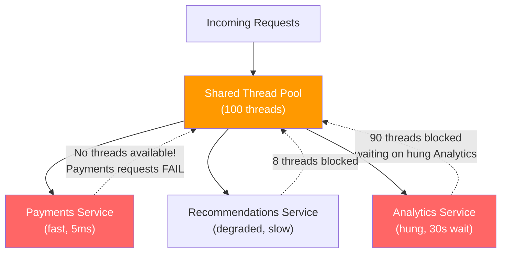
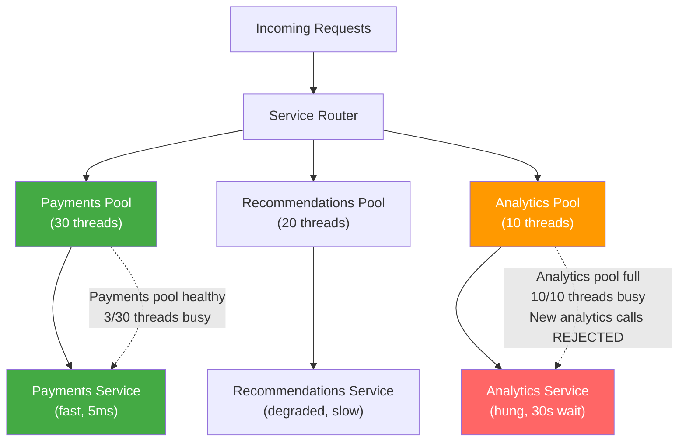

# [BEE-263] Bulkhead Pattern

:::info
Partition resources by dependency so that a failure or slowdown in one partition cannot exhaust resources needed by others.
:::

## Context

Most service calls share a single, bounded resource: a thread pool, a connection pool, or a semaphore. When a dependency becomes slow — not broken, just slow — threads pile up waiting for responses. If every request to your service touches that slow dependency, the shared pool drains. New requests queue. The queue grows. Eventually every inbound request is stuck waiting — including requests that have nothing to do with the slow dependency.

This is **resource exhaustion cascading failure**. It is subtle and common. A circuit breaker (BEE-260) trips when a dependency *fails*; it does not protect you from a dependency that is merely *slow*. Timeouts (BEE-261) bound how long a single call waits, but if 500 threads are all waiting up to 5 seconds simultaneously, you still exhaust the pool before any timeout fires.

The Bulkhead pattern, described by Michael Nygard in *Release It!* (Pragmatic Programmers, 2018) and documented in the Microsoft Azure Architecture Center ([learn.microsoft.com/en-us/azure/architecture/patterns/bulkhead](https://learn.microsoft.com/en-us/azure/architecture/patterns/bulkhead)), addresses this by allocating separate resource partitions — bulkheads — to different dependencies or caller classes. A failure in one bulkhead cannot consume resources in another.

The name comes from ship design. A ship's hull is divided into watertight compartments by internal walls called bulkheads. If the hull is breached, only the flooded compartment fills with water. The ship remains afloat. Without bulkheads, any breach sinks the entire vessel.

## Principle

**Assign dedicated, bounded resource partitions to each downstream dependency. Size partitions according to expected load and criticality. A slow or failing dependency can exhaust only its own partition; all other partitions remain available.**

## Isolation Mechanisms

There are four primary ways to implement bulkhead isolation, ranging from coarse to fine.

### Thread Pool Isolation

Each dependency gets its own fixed-size thread pool. Calls to Dependency A run on Pool A; calls to Dependency B run on Pool B. Pool A exhaustion does not affect Pool B.

This is the most powerful isolation mechanism. Even if Dependency A is completely hung and all threads in Pool A are blocked, Pool B is unaffected. The main service thread returns quickly because it delegates work to the dependency-specific pool and either awaits the future with a short timeout or uses reactive patterns.

**Trade-off:** Each thread pool has overhead (memory per thread, context switch cost). Fine-grained partitioning across dozens of dependencies becomes expensive.

**Use when:** The dependency is slow or blocking (database, external HTTP API, legacy service). This is the default recommendation for I/O-bound calls.

### Semaphore Isolation

A semaphore limits the number of concurrent calls to a dependency. Callers run on their own threads but must acquire a permit before calling the dependency. When all permits are held, new callers are rejected immediately (or after a brief wait).

Semaphore isolation is lightweight — no thread pool management — but it does not protect against the calling thread blocking. If the dependency is slow and the caller thread blocks waiting for a response, the caller's thread is still consumed. Semaphore isolation prevents unbounded concurrency; it does not prevent thread exhaustion on the caller's side.

**Use when:** The call is fast (sub-millisecond cache lookups, in-process calls) or when using a fully non-blocking async model where threads are not consumed while waiting.

### Connection Pool Isolation

Each dependency gets its own connection pool. The database for critical user authentication gets 20 connections; the analytics write path gets 5. When analytics is slow, it can hold at most 5 connections and no more.

This is often already provided by most connection pool libraries and should be configured deliberately per dependency rather than sharing a single pool.

### Process-Level Isolation

In a microservices architecture, separating non-critical workloads into distinct services (separate processes, containers, or VMs) provides the strongest isolation boundary. A crashed recommendation service cannot affect a payment service because they share no in-process resources at all.

This is appropriate for workloads with substantially different scaling, availability, or failure-tolerance requirements — but it is a coarser and more expensive mechanism than in-process bulkheads.

## The Problem Without Bulkheads



Analytics hangs. Threads accumulate waiting for it. The shared pool drains. Payments requests — which would complete in 5ms — find no threads available and fail. A non-critical workload has killed a critical one.

## The Solution With Bulkheads



Analytics still hangs, but it can only exhaust its own 10-thread pool. New analytics calls are rejected with an immediate error — they do not wait. The payments pool is unaffected; payments requests succeed normally.

## Worked Example

**Scenario:** An API gateway calls three backend services per request.

| Service | Criticality | Expected behavior |
|---|---|---|
| Payments | Critical | Must succeed for the primary user action |
| Recommendations | Non-critical | Enhances the response; degradable |
| Analytics | Fire-and-forget | Logging only; safe to drop |

**Without bulkheads:** Analytics starts hanging — perhaps a downstream data warehouse is slow. Within seconds, analytics calls consume the shared 100-thread pool. Recommendations and payments calls find no threads. Payments — the most important call — returns 503 to users even though the payments backend is perfectly healthy.

**With bulkheads:**

| Pool | Size | Behavior under analytics failure |
|---|---|---|
| Payments pool | 30 threads | 3 threads busy. Unaffected. Payments succeed. |
| Recommendations pool | 20 threads | 5 threads busy. Unaffected. Recommendations succeed. |
| Analytics pool | 10 threads | 10/10 threads exhausted. New analytics calls rejected immediately with a non-blocking error. |

Payments and recommendations continue serving users. Analytics calls are dropped (acceptable for fire-and-forget). An alert fires on analytics pool exhaustion, prompting investigation of the data warehouse.

## Bulkhead + Circuit Breaker

Bulkhead and circuit breaker are **complementary, not alternatives**.

| Pattern | Protects against | Mechanism |
|---|---|---|
| Bulkhead | Resource exhaustion from slow dependencies | Limits concurrent calls per dependency |
| Circuit Breaker | Cascading failures from failing dependencies | Stops calling a failing dependency |

Without a circuit breaker, a slow dependency still consumes its entire bulkhead partition one slot at a time. Calls drip in, each blocking for the timeout duration. The partition stays at or near capacity, increasing latency for queued callers.

With a circuit breaker added: once the failure rate threshold is reached, the breaker opens and new calls are rejected immediately without entering the bulkhead partition at all. The partition drains and returns to idle.

**Recommended layering (inner to outer):**

1. **Timeout** (BEE-261) — Bound how long any single call can block.
2. **Bulkhead** — Bound how many concurrent calls can be in-flight to each dependency.
3. **Circuit Breaker** (BEE-260) — Stop calling dependencies that are failing or saturated.

## Sizing Bulkhead Partitions

Partition sizing is the most important operational decision. There is no universal formula, but here is a practical starting approach.

**For thread pool bulkheads:**

```
pool_size = (throughput_rps × p99_latency_seconds) × safety_factor
```

- `throughput_rps`: expected requests per second routed to this dependency
- `p99_latency_seconds`: 99th-percentile response time of the dependency under normal conditions
- `safety_factor`: multiply by 1.5–2.0 to absorb bursts

**Example:** 100 RPS to payments, p99 latency 50ms (0.05s), safety factor 2.0:
`100 × 0.05 × 2.0 = 10 threads`

**For semaphore bulkheads:**

Start with the same formula. Semaphore permits can be smaller than thread pool sizes since permit acquisition is non-blocking when the call itself is asynchronous.

**Guidance:**

| Dependency | Suggested starting point |
|---|---|
| Critical, low-latency (payments, auth) | Larger partition — prioritize availability |
| High-volume, medium-latency (product catalog) | Medium partition sized to peak load |
| Non-critical, variable latency (recommendations) | Smaller partition; degraded service acceptable |
| Fire-and-forget (analytics, audit logging) | Smallest partition; drops acceptable |

Revisit partition sizes regularly using observed p99 latency and actual concurrency metrics.

## Monitoring Partition Utilization

A bulkhead that is silently saturated provides no protection — calls queue, latency spikes, and the partition eventually behaves like no bulkhead at all.

**Metrics to expose per partition:**

| Metric | Description | Alert threshold |
|---|---|---|
| `bulkhead.active` | Current in-flight calls | — |
| `bulkhead.queue_depth` | Calls waiting for a permit/thread | Alert if sustained > 0 |
| `bulkhead.rejected_total` | Calls rejected due to full partition | Alert on any increase |
| `bulkhead.utilization` | `active / max_concurrent` as a percentage | Alert if > 70% sustained |
| `bulkhead.latency` | End-to-end call latency through the partition | Baseline + alert on spikes |

A sustained `bulkhead.utilization` above 70% is an early warning that the partition needs resizing or that the downstream dependency is degrading. Rejection events (`rejected_total` increasing) mean the partition is already full — upstream callers are receiving errors right now.

## Resilience4j Reference

Resilience4j ([resilience4j.readme.io/docs/bulkhead](https://resilience4j.readme.io/docs/bulkhead)) provides two bulkhead implementations for JVM services.

**SemaphoreBulkhead:**

```java
BulkheadConfig config = BulkheadConfig.custom()
    .maxConcurrentCalls(25)       // max concurrent permits
    .maxWaitDuration(Duration.ofMillis(50))  // max time to wait for a permit
    .build();

Bulkhead bulkhead = Bulkhead.of("payments", config);

// Wrap the call
CheckedFunction0<String> decorated = Bulkhead
    .decorateCheckedSupplier(bulkhead, () -> paymentsClient.charge(amount));
```

**ThreadPoolBulkhead:**

```java
ThreadPoolBulkheadConfig config = ThreadPoolBulkheadConfig.custom()
    .coreThreadPoolSize(5)
    .maxThreadPoolSize(10)
    .queueCapacity(20)
    .keepAliveDuration(Duration.ofMillis(20))
    .build();

ThreadPoolBulkhead bulkhead = ThreadPoolBulkhead.of("analytics", config);

// Wrap the async call
Supplier<CompletionStage<String>> decorated = ThreadPoolBulkhead
    .decorateSupplier(bulkhead, () -> analyticsClient.record(event));
```

Choose `SemaphoreBulkhead` for reactive/non-blocking code. Choose `ThreadPoolBulkhead` for blocking I/O calls where you need true thread pool isolation.

For .NET, the [Polly](https://github.com/App-vNext/Polly) library provides `BulkheadPolicy` with equivalent semantics.

## Common Mistakes

### 1. Single shared thread pool for all dependencies

This is the default configuration in many frameworks. Without explicit per-dependency pools, all outbound calls compete for the same threads. Configuring bulkheads requires deliberate effort; the default is no isolation.

### 2. Bulkhead partitions sized too large

A partition sized to 90% of the total thread pool provides almost no isolation. If Analytics gets 80 of 100 threads, it can still starve every other dependency. Size partitions conservatively; accept that non-critical dependencies will drop calls under load rather than borrow capacity from critical ones.

### 3. Not monitoring partition exhaustion

A full partition is a silent incident. Without alerting on `rejected_total` or `utilization`, engineers learn about partition exhaustion only when users complain. Wire all bulkhead metrics to your observability stack before deploying to production.

### 4. Bulkhead without timeouts or circuit breaker

A bulkhead limits how many calls can be in-flight simultaneously, but does nothing about how long they wait. Slow calls still hold partition slots until they complete or time out. Without timeouts, partition slots drain slowly and stay occupied. Without a circuit breaker, a failing dependency keeps receiving calls one slot at a time until the partition saturates. Always combine the three patterns.

### 5. Over-partitioning

Creating a separate thread pool for every individual endpoint or operation wastes resources and increases complexity. At the extreme, 50 pools of 2 threads each is less effective than 10 pools of 10 threads. Group dependencies by failure domain and criticality class, not by individual endpoint.

## Related BEPs

- [BEE-241](241.md) (Worker Pools) — foundational concepts for sizing and managing thread pools
- [BEE-260](260.md) (Circuit Breaker Pattern) — stop calling failed dependencies; combine with bulkheads for full protection
- [BEE-261](261.md) (Timeouts and Deadlines) — bound call duration so partition slots are not held indefinitely
- [BEE-261](261.md) (Graceful Degradation) — define fallback behavior when a bulkhead partition is full

## References

- Michael Nygard, *Release It! Design and Deploy Production-Ready Software*, 2nd ed., Pragmatic Programmers (2018) — Chapter 4: Stability Patterns
- Microsoft Azure Architecture Center, *Bulkhead Pattern*, learn.microsoft.com/en-us/azure/architecture/patterns/bulkhead
- Resilience4j documentation, *Bulkhead*, resilience4j.readme.io/docs/bulkhead
- Netflix Hystrix, *How It Works — Thread Isolation*, github.com/Netflix/Hystrix/wiki/How-it-Works
