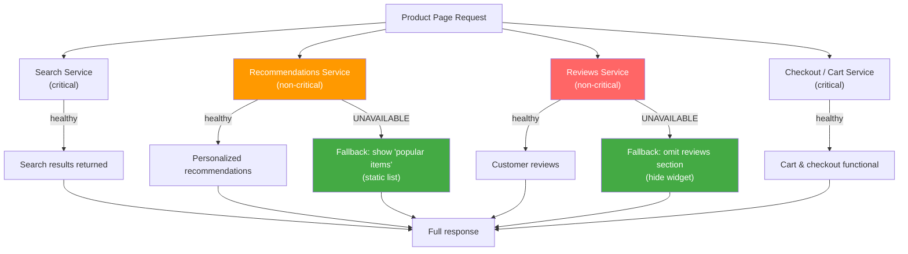

# [BEE-264] Graceful Degradation

:::info
Serve reduced but useful functionality when components fail. Identify critical versus non-critical features, define fallbacks for each, and fail gracefully rather than all-or-nothing.
:::

## Context

A production system is never either fully healthy or fully broken. Real failure modes are partial: one dependency is slow, one external API is returning errors, one database replica is lagging. How the system responds to these partial failures determines whether users experience a minor inconvenience or a complete outage.

The naive approach is all-or-nothing: if any dependency the page needs is unavailable, return a 503. This is simple to implement and simple to understand, but it makes every page as fragile as its least-reliable dependency. In a system where recommendations, reviews, inventory counts, and checkout are all dependencies of a product page, a transient failure in the reviews service causes every product page to fail — even for users who do not scroll to the reviews section.

Graceful degradation is the principle that a system should **continue serving reduced but useful functionality when components fail**, rather than failing completely. This requires deliberate design: knowing which features are critical (without them, the page cannot serve its purpose), which features are non-critical (they add value but users can proceed without them), and what fallback each non-critical feature has.

The pattern is described in the Microsoft Azure Well-Architected Framework under [Architecture strategies for self-healing and self-preservation](https://learn.microsoft.com/en-us/azure/well-architected/reliability/self-preservation), and documented in detail by RisingStack Engineering at [blog.risingstack.com/designing-microservices-architecture-for-failure](https://blog.risingstack.com/designing-microservices-architecture-for-failure/). Netflix has applied graceful degradation at scale for years: when their personalization service is unavailable, they fall back to showing globally popular titles rather than returning an error — a pattern described by their engineering team at [netflixtechblog.com/a-microscope-on-microservices-923b906103f4](https://netflixtechblog.com/a-microscope-on-microservices-923b906103f4).

## Principle

**Classify every feature a service exposes as critical or non-critical. For every non-critical feature, define a concrete fallback. When a dependency fails, serve the fallback rather than failing the entire response. Make degradation visible to callers and operators.**

## Degradation Hierarchy

The first step in designing graceful degradation is building a degradation hierarchy for your service: a ranked list of features ordered by criticality.

| Tier | Description | Failure behavior |
|---|---|---|
| Critical | The response cannot serve its purpose without this. | Failure returns an error to the caller. |
| Important | Strongly enhances the response; users notice its absence. | Serve stale cached data or a reduced-quality version. |
| Non-critical | Adds value; most users can proceed without it. | Serve a static default or omit entirely. |
| Best-effort | Nice to have; no user impact if absent. | Drop silently under any pressure. |

The degradation hierarchy is a product and engineering decision, not a purely technical one. For an e-commerce product page: product title, price, and the ability to add to cart are **critical**. Inventory count is **important** (users want to know if something is in stock, but a cached or approximate count is better than no count). Customer reviews are **non-critical** (users can purchase without reading reviews). Personalized recommendations are **best-effort** (they are merchandising, not functionality).

Document this hierarchy explicitly. It guides circuit breaker fallbacks (BEE-260), bulkhead partition sizing (BEE-263), and on-call triage decisions.

## Degradation Strategies

### Serve Stale or Cached Data

When the live data source is unavailable, return the last-known-good value from cache with a TTL-based expiry. This is the highest-quality fallback: it is real data, just potentially stale.

Include a header or response field indicating staleness so callers can decide how to present it. A product page serving a 4-hour-old inventory count should ideally render "In stock (as of a few hours ago)" rather than "In stock" with false precision.

### Static Fallback

Return a safe, hardcoded default. A recommendations widget falls back to "Top 10 most popular items" computed once per day and stored statically. A user profile summary falls back to a generic "Welcome back" message. The fallback is less personalized but correct.

### Feature Disabling

If a non-critical feature has no reasonable fallback, omit it from the response entirely. A reviews section that cannot load should be absent from the page HTML — not replaced by a spinner or error message that blocks layout. The API response for a product can simply omit the `reviews` field when the reviews service is down; API consumers should be written to handle absent optional fields gracefully.

### Reduced Quality

Return a lower-fidelity version. An image service that cannot generate personalized thumbnails returns a standard-resolution default image. A search service under heavy load returns the top 20 results instead of 100. A real-time pricing service falls back to last-computed prices without live currency conversion.

### Partial Responses

Return what you can and annotate what is missing. An aggregating API that calls four services can return a partial response if one service is unavailable, rather than failing the entire call.

```json
{
  "product": { ... },
  "inventory": { "count": 12, "stale": true, "stale_age_seconds": 3600 },
  "reviews": null,
  "recommendations": { "items": [...], "source": "popular_fallback" },
  "_degraded": ["reviews"],
  "_degraded_reason": { "reviews": "reviews_service_unavailable" }
}
```

Partial responses require consumers to handle the degraded shape. Define partial response contracts in your API specification; do not surprise consumers at runtime.

## The Degradation Flow



When the recommendations service is degraded, users see popular items instead of personalized picks — a quality reduction, not an error. When the reviews service is fully unavailable, the reviews widget is hidden. Search and checkout, being critical, remain unaffected by either failure.

## Feature Flags as Runtime Kill Switches

Feature flags (see BEE-363) are the operational lever for graceful degradation. Rather than requiring a deploy to disable a non-critical feature under load, a kill-switch flag lets operators disable the feature in seconds.

```
feature.recommendations.enabled = false
feature.reviews.enabled = false
feature.live_inventory.enabled = false   # fall back to cached count
```

A kill switch is not the same as an A/B flag. Its purpose is not experimentation but controlled emergency degradation. Design kill switches for every non-critical feature in your service before those features go to production.

Netflix's dynamic configuration system uses exactly this approach — properties are polled at runtime from a distributed config store, and callbacks fire when properties change, enabling near-instant degradation without restarts.

## Load Shedding as Proactive Degradation

Under sustained overload, passive degradation (fallbacks when dependencies fail) is insufficient. **Load shedding** is active degradation: deliberately rejecting or de-prioritizing low-priority work to protect high-priority work.

Classify inbound requests by priority:

| Priority | Example | Behavior under load |
|---|---|---|
| Critical | Checkout, authentication | Never shed; return 429 if necessary |
| Important | Search, catalog browsing | Shed only under extreme load |
| Non-critical | Recommendation refresh, analytics writes | Shed first |
| Background | Report generation, reindex jobs | Shed immediately; retry later |

When a service detects that its request queue depth or error rate is rising above threshold, it begins rejecting non-critical requests with HTTP 429 or a suitable application error code, returning a `Retry-After` header where possible. Critical requests continue to be served.

Google's SRE book describes load shedding at the infrastructure level; for application-level load shedding in microservices, see [umatechnology.org/load-shedding-rules-for-stateless-microservices-recommended-by-google-sre](https://umatechnology.org/load-shedding-rules-for-stateless-microservices-recommended-by-google-sre/).

## Worked Example

**Scenario:** E-commerce product page service. It aggregates data from four downstream services per request.

| Feature | Service | Criticality | Fallback |
|---|---|---|---|
| Product info (name, price, images) | Product catalog | Critical | None — fail the page |
| Inventory count | Inventory service | Important | Last cached count (TTL: 1 hour) |
| Customer reviews | Reviews service | Non-critical | Omit reviews section |
| Personalized recommendations | Recs service | Best-effort | Static "top 10 popular items" |

**Under normal operation:** all four services respond; full page renders.

**Reviews service goes down:**

- Product info: returned normally.
- Inventory count: returned normally.
- Reviews: circuit breaker (BEE-260) opens; fallback triggers; reviews section omitted from response. `_degraded: ["reviews"]` added to response metadata.
- Recommendations: returned normally.
- Result: users see product info, inventory, and recommendations. No reviews section. No error. Page is fully functional for the primary user action (purchasing).

**Under heavy load (CPU and queue depth rising):**

- Kill switch `feature.recommendations.enabled = false` activated by operator.
- Live inventory calls replaced by cached counts; kill switch `feature.live_inventory.enabled = false` activated.
- Reviews already down; no change.
- Result: two fewer outbound calls per request. Service stabilizes. Users see product info and cached inventory. Recommendations and reviews absent.

## Graceful Degradation vs. Graceful Shutdown

These are different concepts with similar names.

| Concept | When it applies | What happens |
|---|---|---|
| Graceful degradation | Component partially fails at runtime | Service continues with reduced functionality |
| Graceful shutdown | Service process is being stopped | Service drains in-flight requests before exiting |

Graceful shutdown (BEE-278) ensures requests in-flight during a deployment or restart are completed or handed off cleanly. Graceful degradation ensures a running service handles partial dependency failures without cascading. Both are required; neither substitutes for the other.

## Common Mistakes

### 1. All-or-nothing failure

Returning 503 whenever any dependency fails. This treats every feature as critical, eliminating the benefit of non-critical feature isolation. The result: a reviews outage brings down product pages.

### 2. No degradation hierarchy

If the team has not decided which features are critical and which are non-critical, every engineer makes a different call during an incident. One engineer's "skip the recommendation call and continue" is another's "throw an exception and fail the request." Document the hierarchy before incidents occur.

### 3. Degradation not tested

Fallback code paths are rarely exercised in normal operation. Bugs in fallback logic are discovered only during real incidents — precisely when the system is already under stress. Test every fallback path in integration tests and in chaos engineering exercises (BEE-265). Simulate the reviews service being down; confirm the reviews section is absent, not broken.

### 4. Stale data served silently

Serving a cached inventory count without indicating its age misleads users. A user who sees "23 in stock" based on data from six hours ago may have a different purchasing decision than one who sees "23 in stock (cached)". Annotate degraded data in the response. How the UI presents this annotation is a product decision; withholding it from the API consumer is not.

### 5. Fallback has its own dependency

A fallback that calls another service introduces a second failure point. A recommendations fallback that queries a "popular items" database service is only as available as that database. Design fallbacks to be dependency-free where possible: in-memory static data, local files, or values embedded in configuration.

## Related BEPs

- **BEE-260** (Circuit Breaker Pattern) — circuit breakers trigger degradation when a dependency fails; BEE-264 defines what the fallback looks like
- **BEE-263** (Bulkhead Pattern) — bulkheads isolate resources by dependency; when a partition is full, graceful degradation determines what is returned
- **BEE-266** (Rate Limiting and Throttling) — rate limiting as a form of load shedding for inbound traffic
- **BEE-363** (Feature Flags) — runtime kill switches for disabling non-critical features during degradation

## References

- Microsoft Azure Well-Architected Framework, *Architecture strategies for self-healing and self-preservation*, learn.microsoft.com/en-us/azure/well-architected/reliability/self-preservation
- RisingStack Engineering, *Designing a Microservices Architecture for Failure*, blog.risingstack.com/designing-microservices-architecture-for-failure/
- Netflix Technology Blog, *A Microscope on Microservices*, netflixtechblog.com/a-microscope-on-microservices-923b906103f4
- Michael Nygard, *Release It! Design and Deploy Production-Ready Software*, 2nd ed., Pragmatic Programmers (2018) — Chapter 4: Stability Patterns
- Google SRE Book, *Handling Overload*, sre.google/sre-book/handling-overload/
