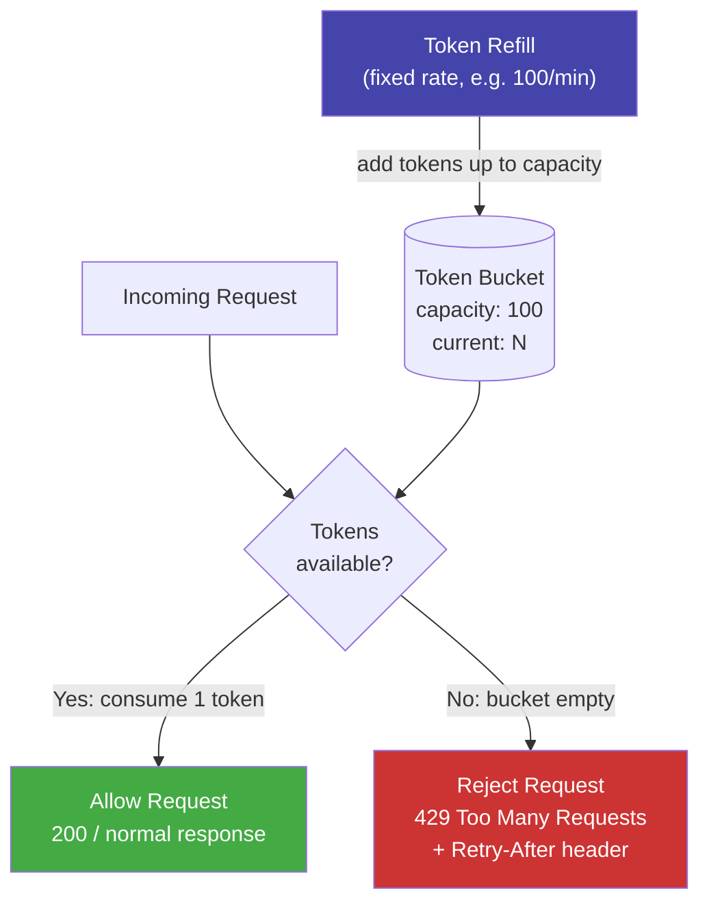

# [BEP-266] Rate Limiting and Throttling

:::info
Protect services from abuse, ensure fairness, and prevent overload by controlling how many requests a client can make over time. Choose the right algorithm for your traffic pattern and communicate limits clearly to clients.
:::

## Context

A publicly accessible API endpoint is a shared resource. Without constraints, any single client — whether a misbehaving integration, a misconfigured retry loop, or a deliberate attack — can consume a disproportionate share of server capacity, degrading or denying service for all other clients.

Rate limiting is the mechanism that enforces a ceiling on request volume. It is not a sign that your API is fragile; it is a contract that tells clients how fast they may call you and gives them the information they need to stay within that contract.

The need for rate limiting is well-established across the industry. Stripe has long published their approach to it (stripe.com/blog/rate-limiters), noting that rate limiters and load shedders are essential tools that protect their payment infrastructure from traffic spikes and abusive clients. Cloudflare describes their WAF rate limiting architecture as operating at the edge, before traffic reaches origin servers, enabling them to absorb large-scale abuse without affecting legitimate traffic (developers.cloudflare.com/waf/rate-limiting-rules). The IETF httpapi working group has been developing a standard for communicating rate limit status to clients via response headers (datatracker.ietf.org/doc/html/draft-ietf-httpapi-ratelimit-headers), reflecting the industry-wide recognition that rate limiting needs a consistent interface.

Rate limiting addresses three concerns simultaneously:

- **Abuse prevention** — stops individual clients from monopolizing shared capacity
- **Fairness** — ensures all clients receive proportionate access regardless of their aggressiveness
- **Overload prevention** — acts as a load shedding valve at the API layer (see BEP-264), preventing traffic spikes from propagating to databases and downstream services

## Principle

**Apply rate limits at every public interface. Choose a rate limiting algorithm appropriate for your traffic pattern. Communicate limits and their current state in every response. Return HTTP 429 with a `Retry-After` header when a limit is exceeded. Apply limits at multiple dimensions. Implement distributed rate limiting when running multiple instances.**

## The Four Core Algorithms

### Token Bucket

A token bucket holds up to `capacity` tokens. Tokens are added at a fixed `refill_rate` (e.g., 100 tokens per minute). Each incoming request consumes one token. If a token is available, the request is allowed. If the bucket is empty, the request is rejected with 429.

Token bucket is the most widely deployed algorithm for public APIs. It allows short bursts up to `capacity` while enforcing a long-term average rate of `refill_rate`. A client that has been idle accumulates tokens and can make a burst of calls — which reflects real usage patterns (a mobile app launching and fetching initial data).

### Leaky Bucket

A leaky bucket accepts requests into a fixed-size queue and processes them at a constant drain rate. If the queue is full, incoming requests are rejected.

Where token bucket allows bursts, leaky bucket enforces strict constant throughput. It is better suited to rate-shaping (smoothing bursty clients) than to rate-limiting (rejecting violators). Use it at network ingress or when downstream consumers cannot handle bursts.

### Fixed Window Counter

Divide time into fixed windows (e.g., minute 0–59, minute 60–119). Count requests per client in the current window. If the count exceeds the limit, reject.

Fixed window is simple and memory-efficient. Its known weakness is the **boundary burst problem**: a client can make `limit` requests just before the window ends and `limit` more requests just after it resets, sending `2 * limit` requests in a two-second span without triggering the limiter. For low-precision use cases (internal service quotas, dashboard APIs) this is acceptable. For APIs exposed to adversarial clients, prefer sliding window.

### Sliding Window (Log and Counter)

**Sliding window log:** Store a timestamp for every request in a sorted set. On each new request, remove timestamps older than the window, count the remainder, and accept or reject. Accurate but memory-intensive at scale.

**Sliding window counter:** A practical approximation. Keep counts for the current window and the previous window. Estimate the request count as:

```
estimated_count = prev_count * (1 - elapsed_fraction) + curr_count
```

This approximation is accurate to within a few percent and requires only two counters per client. It eliminates the boundary burst problem without the memory cost of the full log. Redis's official rate limiting tutorial (redis.io/tutorials/howtos/ratelimiting) recommends this approach as the best default for distributed rate limiting.

### Algorithm Comparison

| Algorithm | Allows bursts | Boundary burst | Memory cost | Complexity |
|---|---|---|---|---|
| Token bucket | Yes (up to capacity) | No | Low | Low |
| Leaky bucket | No (strict drain rate) | No | Low | Low |
| Fixed window | Yes | Yes | Very low | Very low |
| Sliding window log | Yes | No | High | Medium |
| Sliding window counter | Yes (approximate) | No | Low | Low |

## Token Bucket Flow



## Rate Limiting Dimensions

Rate limits are applied along one or more **dimensions** — identifiers that distinguish one client from another.

| Dimension | Identifier | Use case |
|---|---|---|
| Per API key | `X-API-Key` header value | Tenant quotas in multi-tenant APIs |
| Per user | Authenticated user ID | Per-user fairness in authenticated APIs |
| Per IP address | Client IP (with CIDR grouping) | Unauthenticated endpoints, login protection |
| Per endpoint | `(api_key, route)` composite | Different limits for expensive vs. cheap operations |
| Global | Aggregate across all clients | Absolute capacity ceiling for the service |

Apply multiple dimensions simultaneously. A request can pass per-user limits and still be rejected by the global limit if the service is saturated.

**Tiered limits by plan:** Differentiate rate limits by subscription tier. A free-tier API key might be allowed 60 requests per minute; a paid key gets 1,000; an enterprise key gets 10,000. Encode tier in the API key or look it up from the authentication store. Applying the same limit to all clients regardless of plan is both unfair and a revenue design mistake.

## HTTP Response Protocol

### HTTP 429 Too Many Requests

When a request is rejected, return `429 Too Many Requests`. Always include a `Retry-After` header. Without it, the client has no basis for deciding when to retry and will likely retry immediately, creating a thundering herd.

```
HTTP/1.1 429 Too Many Requests
Retry-After: 30
Content-Type: application/json

{
  "error": "rate_limit_exceeded",
  "message": "API rate limit exceeded. Try again in 30 seconds.",
  "retry_after": 30
}
```

### RateLimit Headers (IETF Draft)

The IETF draft `draft-ietf-httpapi-ratelimit-headers` defines standard headers for communicating quota state on every response — not just on 429 responses. Include these on all responses so clients can proactively slow down before hitting limits.

```
RateLimit-Limit: 100
RateLimit-Remaining: 23
RateLimit-Reset: 1712530860
Retry-After: 30
```

| Header | Meaning |
|---|---|
| `RateLimit-Limit` | Maximum requests allowed in the current window |
| `RateLimit-Remaining` | Requests remaining in the current window |
| `RateLimit-Reset` | Unix timestamp when the current window resets |
| `Retry-After` | Seconds to wait before retrying (only on 429) |

A well-behaved client reads `RateLimit-Remaining` and slows its request rate as it approaches zero, avoiding 429 responses entirely.

## Distributed Rate Limiting with Redis

A single in-process counter breaks as soon as you run more than one instance. With three instances each allowing 100 requests per minute, the effective limit becomes 300. Shared state is required.

**Redis MULTI/EXEC with token bucket:**

```
# Token bucket with Redis: check and consume atomically
# Key: rate_limit:{api_key}
# Fields: tokens (float), last_refill (unix timestamp)

MULTI
  GET rate_limit:{api_key}           # read current state
  TIME                               # server-side timestamp (avoids clock skew)
EXEC

# In application logic after reading state:
elapsed = now - last_refill
new_tokens = min(capacity, tokens + elapsed * refill_rate)
if new_tokens >= 1:
    new_tokens -= 1
    allowed = true
else:
    allowed = false

# Write back atomically with Lua script to avoid TOCTOU race
EVAL """
local key = KEYS[1]
local capacity = tonumber(ARGV[1])
local refill_rate = tonumber(ARGV[2])
local now = tonumber(ARGV[3])

local state = redis.call('HMGET', key, 'tokens', 'last_refill')
local tokens = tonumber(state[1]) or capacity
local last_refill = tonumber(state[2]) or now

local elapsed = now - last_refill
tokens = math.min(capacity, tokens + elapsed * refill_rate)

if tokens >= 1 then
    tokens = tokens - 1
    redis.call('HMSET', key, 'tokens', tokens, 'last_refill', now)
    redis.call('EXPIRE', key, 3600)
    return {1, math.floor(tokens)}   -- allowed, remaining
else
    redis.call('HMSET', key, 'tokens', tokens, 'last_refill', now)
    return {0, 0}                    -- rejected, remaining
end
""" 1 rate_limit:{api_key} {capacity} {refill_rate} {now}
```

Using a Lua script is critical. Redis executes Lua scripts atomically — no other command runs between the read and write — eliminating the time-of-check/time-of-use race condition that `MULTI/EXEC` with application logic between commands would introduce.

GitHub's engineering blog describes how they scaled their API rate limiter using a sharded, replicated Redis topology to handle millions of API calls per minute while maintaining consistency (github.blog/engineering/infrastructure/how-we-scaled-github-api-sharded-replicated-rate-limiter-redis/).

**Full example — 100 req/min per API key:**

```
# Request arrives with header: X-API-Key: ak_live_abc123
# Capacity: 100, refill rate: 100/60 tokens per second (~1.67/s)

# Redis key: rate_limit:ak_live_abc123
# Lua script returns: {1, 42} => allowed, 42 tokens remaining

# Response headers:
RateLimit-Limit: 100
RateLimit-Remaining: 42
RateLimit-Reset: 1712530860

# After 100 requests within 60 seconds, bucket is empty.
# Next request returns: {0, 0} => rejected

HTTP/1.1 429 Too Many Requests
RateLimit-Limit: 100
RateLimit-Remaining: 0
RateLimit-Reset: 1712530860
Retry-After: 17
```

## Rate Limiting at Different Layers

Apply rate limiting at multiple layers. Each layer has a different scope and enforcement point.

| Layer | What it protects | Granularity | Who owns it |
|---|---|---|---|
| Edge / CDN | Origin servers from internet traffic | By IP, geography | Infrastructure / platform team |
| API Gateway | All services behind the gateway | By API key, route, tenant | Platform team |
| Application | Individual service endpoints | By user, resource, operation | Service team |
| Database | Connection pool and query rate | Per-service global | Service team |

Relying solely on edge rate limiting is insufficient. Internal services calling each other bypass the edge entirely. An internal service with no application-level rate limiting can be saturated by other internal callers during a traffic spike.

## Throttling vs. Rate Limiting

These terms are related but distinct.

**Rate limiting** is binary enforcement: request count crosses a threshold, requests are rejected with 429 until the window resets. The client is responsible for backing off.

**Throttling** is graduated control: the server slows processing of a client's requests (or the client self-limits its outbound rate) to stay within capacity, rather than rejecting requests outright. A throttled client might see increased latency instead of 429 errors.

In practice, "rate limiting" and "throttling" are used interchangeably in most API documentation. The operational distinction matters at the implementation layer: a rate limiter rejects; a throttler delays or reduces throughput. Many systems implement both — reject at the rate limit, delay at a softer threshold below it.

## Handling Rate-Limited Requests Gracefully

From the client side (and for services calling other services), receiving a 429 is not an error in the traditional sense — it is a signal to back off. See BEP-261 for full retry-with-backoff guidance. Key points:

- Read `Retry-After`. Do not retry before that time.
- Apply jitter to retry timing to avoid synchronizing multiple clients.
- Implement a per-client request queue with depth limits rather than firing retries immediately.
- Log 429 responses as a distinct metric. A sustained 429 rate is a sign your rate limit is too low, your client is too aggressive, or there is a bug.
- Never discard the request silently. If the operation matters, queue it for retry; if it cannot be retried, surface the error to the user.

## Common Mistakes

### 1. Rate limiting only at the edge

Internal services call each other directly, bypassing the API gateway. A burst of internal traffic from a misconfigured service can overload a downstream service just as effectively as external traffic. Every service that accepts requests from other services should enforce its own rate limits.

### 2. Fixed window boundary burst

A fixed window counter allows a client to make `limit` requests in the last second of one window and `limit` requests in the first second of the next, sending `2 * limit` requests in two seconds without triggering the limiter. Use sliding window counter if this burst pattern is harmful to your service.

### 3. No `Retry-After` header on 429

Without `Retry-After`, a rate-limited client has no signal for when to retry. It will typically retry immediately or after a short fixed delay, generating a thundering herd that keeps the service under load. Always include `Retry-After`.

### 4. Limits too strict for legitimate users

A rate limit that frequently triggers for normal usage patterns damages developer experience and creates support load. Set limits based on observed usage plus a headroom multiplier, not on an arbitrary round number. Monitor 429 rates by tier and adjust when legitimate clients are being throttled.

### 5. No per-tier differentiation

Applying the same rate limit to all API keys regardless of subscription plan is both unfair and lost revenue. Free-tier keys should have lower limits than paid keys. Enterprise customers with high expected volume need dedicated limit negotiation.

## Related BEPs

- **BEP-15** (API Keys) — API keys are the primary identifier for per-client rate limiting; key rotation and scoping affect limit enforcement
- **BEP-75** (Error Handling) — 429 is an application-level error and must be handled explicitly, not treated as an unexpected exception
- **BEP-261** (Retry Strategies and Exponential Backoff) — retry behavior after receiving 429; always includes jitter and respects `Retry-After`
- **BEP-264** (Graceful Degradation and Load Shedding) — rate limiting as one layer of load shedding; BEP-264 covers application-level shedding strategies

## References

- Stripe Engineering Blog, *Scaling your API with rate limiters*, stripe.com/blog/rate-limiters
- Cloudflare, *Rate limiting rules*, developers.cloudflare.com/waf/rate-limiting-rules
- IETF, *RateLimit header fields for HTTP*, datatracker.ietf.org/doc/html/draft-ietf-httpapi-ratelimit-headers
- GitHub Engineering Blog, *How we scaled the GitHub API with a sharded, replicated rate limiter in Redis*, github.blog/engineering/infrastructure/how-we-scaled-github-api-sharded-replicated-rate-limiter-redis/
- Redis, *Build 5 Rate Limiters with Redis*, redis.io/tutorials/howtos/ratelimiting/
- Alex Xu, *System Design Interview*, Vol. 1, ch. 4 — Design a Rate Limiter
